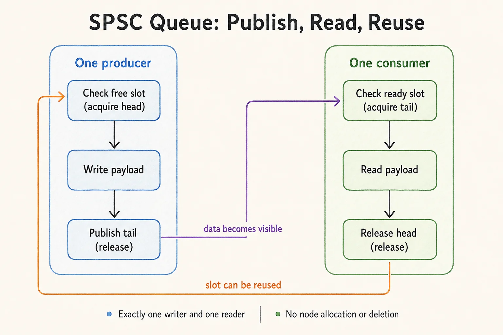

线程安全、无锁（lock-free）和无等待（wait-free）描述的是不同性质。选择队列前，先确定生产者和消费者数量、是否允许阻塞，以及队列满时如何处理。

## 1. 先明确并发契约

| 方案 | 并发契约 | 适合的用途 |
| --- | --- | --- |
| Python `queue.Queue` | 多生产者、多消费者，内部使用锁 | 任务分发、背压、线程间通信 |
| 有界 SPSC 环形队列 | 恰好一个生产者和一个消费者 | 采集线程向处理线程传递固定大小数据 |
| 无锁 MPMC 队列 | 多生产者、多消费者 | 需要经过验证的算法和内存回收机制 |

无锁保证系统整体持续取得进展，不保证每个线程都能在固定时间内完成操作，也不保证比互斥锁更快。CAS 只是原子操作；把头尾指针改成原子变量，仍不能解决节点生命周期问题。



## 2. Python：使用标准库线程安全队列

`queue.Queue` 内部使用锁，不能称为无锁队列。也不要先调用 `empty()` 再 `get()`：两次调用之间，队列状态可能被另一个线程改变。需要非阻塞取值时，直接调用 `get_nowait()` 并捕获 `queue.Empty`。[Python 官方文档](https://docs.python.org/3/library/queue.html)

下面用有界队列和结束标记实现完整的生产者—消费者生命周期：

```python
from queue import Queue
from threading import Thread

tasks = Queue(maxsize=8)
STOP = object()


def producer():
    for value in range(10):
        tasks.put(value)
    tasks.put(STOP)


def consumer():
    while True:
        value = tasks.get()
        try:
            if value is STOP:
                return
            print(f"Consumed: {value}")
        finally:
            tasks.task_done()


if __name__ == "__main__":
    writer = Thread(target=producer)
    reader = Thread(target=consumer)
    reader.start()
    writer.start()
    writer.join()
    tasks.join()
    reader.join()
```

预期按顺序输出 `0` 到 `9`，随后两个线程正常退出。`maxsize` 限制积压任务数；队列满时，生产者阻塞形成背压。多个消费者通常需要分别接收到结束标记。

## 3. C++17：有界 SPSC 环形队列

下面的实现限定为一个生产者、一个消费者，预分配所有槽位，不涉及链表节点回收。`Slots` 个槽位保留一个空位，用于区分满与空，因此有效容量为 `Slots - 1`。

```cpp
#include <array>
#include <atomic>
#include <cassert>
#include <cstddef>
#include <iostream>
#include <thread>
#include <type_traits>

template <typename T, std::size_t Slots>
class SpscQueue {
    static_assert(Slots >= 2);
    static_assert(std::is_trivially_copyable_v<T>);
    static_assert(std::is_nothrow_copy_assignable_v<T>);
    static_assert(std::atomic<std::size_t>::is_always_lock_free,
                  "This example requires lock-free index atomics.");

    std::array<T, Slots> data_{};
    std::atomic<std::size_t> head_{0};  // Only the consumer writes.
    std::atomic<std::size_t> tail_{0};  // Only the producer writes.

public:
    bool try_push(const T& value) noexcept {
        const auto tail = tail_.load(std::memory_order_relaxed);
        const auto next = (tail + 1) % Slots;
        if (next == head_.load(std::memory_order_acquire)) {
            return false;
        }
        data_[tail] = value;
        tail_.store(next, std::memory_order_release);
        return true;
    }

    bool try_pop(T& value) noexcept {
        const auto head = head_.load(std::memory_order_relaxed);
        if (head == tail_.load(std::memory_order_acquire)) {
            return false;
        }
        value = data_[head];
        head_.store((head + 1) % Slots, std::memory_order_release);
        return true;
    }
};

int main() {
    SpscQueue<int, 64> queue;
    constexpr int count = 100000;
    long long sum = 0;

    std::thread writer([&] {
        for (int i = 0; i < count; ++i) {
            while (!queue.try_push(i)) {
                std::this_thread::yield();
            }
        }
    });
    std::thread reader([&] {
        for (int i = 0; i < count; ++i) {
            int value;
            while (!queue.try_pop(value)) {
                std::this_thread::yield();
            }
            assert(value == i);  // Check order and detect missing values.
            sum += value;
        }
    });

    writer.join();
    reader.join();
    assert(sum == 1LL * count * (count - 1) / 2);
    std::cout << "Consumed " << count << " values; sum = " << sum << '\n';
}
```

保存为 `spsc_queue.cpp`：

```bash
g++ -std=c++17 -O2 -Wall -Wextra -pthread spsc_queue.cpp -o spsc_queue
./spsc_queue
```

预期输出 `Consumed 100000 values; sum = 4999950000`。示例用自旋加 `yield` 演示重试；真实应用应根据延迟、CPU 占用和丢帧策略设计等待方式。

## 4. 为什么需要 acquire/release

生产者写入普通数组后，通过 `tail.store(..., release)` 发布；消费者的 `tail.load(acquire)` 观察到该发布后，才能读取相应槽位。反向的 `head` 同步保证生产者不会覆盖消费者尚未读完的数据。各线程读取自己独占写入的索引时使用 `relaxed`，不承担跨线程发布职责。

队列析构之前，两个线程必须已经退出。不要把本例直接扩展成多生产者或多消费者：多个写者竞争同一索引会破坏所有权约定。

## 5. 链表无锁队列的难点

出队成功后立即 `delete old_head` 是不安全的：其他线程可能仍持有该节点地址，即使随后会检查 CAS 是否成功，也可能已经读取了释放的内存。此类算法通常还需要 hazard pointers、epoch reclamation 等回收机制，并处理 ABA 问题。

需要通用 MPMC 队列时，应选择具有明确并发契约和测试的实现。可对照 [Boost.Lockfree 文档](https://www.boost.org/doc/libs/latest/doc/html/lockfree.html)理解进展保证与内存分配限制。


## 阅读自测与验收

- 用很小的环形容量强制频繁绕回，检查满/空状态、顺序和总数；大容量下偶然成功不足以覆盖索引复用。
- 严格保持单生产者、单消费者约束，测试结束时等待线程退出；无锁进展条件不是实时截止时间保证。
