# 1. 基本概念

- **Agent（智能体）**：在环境中执行动作并学习如何最大化累积奖励的实体。
- **Environment（环境）**：智能体与之交互的外部系统，定义了状态空间、动作空间和奖励机制。
- **Observation（观察）**：智能体从环境中获取的当前状态信息。
- **Action（动作）**：智能体在某个状态下可以执行的操作，影响环境的状态。
- **Reward（奖励）**：智能体执行某个动作后环境反馈的即时信号，用于指导智能体的学习。

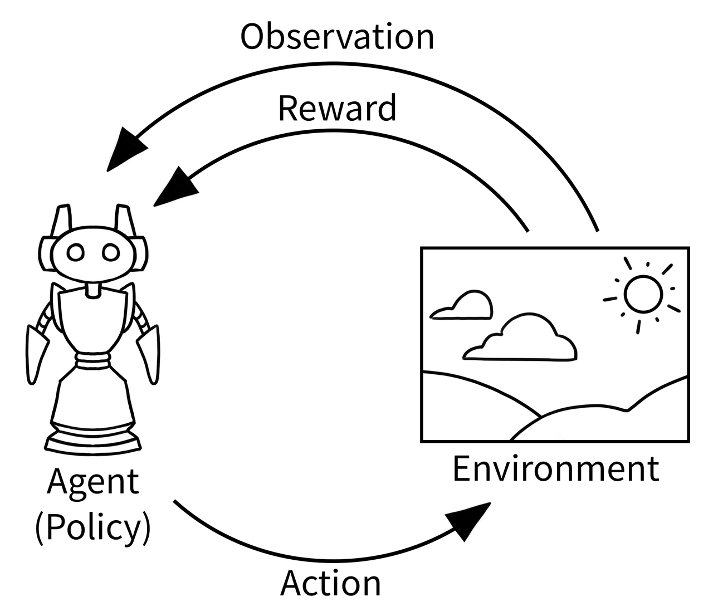

强化学习就是智能体和环境之间持续交互，通过与环境交互并观察环境的状态，学习如何采取进一步的行动，以最大化累积奖励，在不断试错的工程中学习如何在不同状态下做出最佳决策的过程。

# 2. 马尔可夫过程

## 2.1 马尔可夫性质

### 2.1.1 **本质**

   - 一个随机过程在给定现在状态及所有过去状态情况下，其未来状态的条件概率分布仅依赖于当前状态，与历史状态无关。

### 2.1.2 **数学定义**

   - 假设随机变量 $X_0, X_1, ..., X_{T-1}, X_T$ 构成一个随机过程。这些随机变量的所有可能取值的集合被称为状态空间。如果

     $$
     p(X_{t+1}=x_{t+1}|X_{0:t}=x_{0:t})=p(X_{t+1}=x_{t+1}|X_{t}=x_{t})
     $$

     则称其满足马尔可夫性质。

   - 其中：
     - $X_{0:t}$ 表示变量集合 $X_0, X_1, ..., X_{t-1}, X_t$
     - $x_{0:t}$ 表示变量集合 $x_0, x_1, ..., x_{t-1}, x_t$

   - 马尔可夫性质也可以描述为：给定当前状态时，将来的状态与过去状态条件独立。如果某过程满足马尔可夫性质，未来的转移与过去无关，只取决于现在。

### 2.1.3 **直观理解**

- 一个失忆的人：
  - 只记得：我现在在哪里
  - 不记得：我是怎么到这里来的
  - 决策下一步行动时，只基于当前位置

> 假设机器人有三种状态：静止(S)、移动(M)、充电(C)
>
> 传统模型（有记忆性）：
>
> ```python
> # 下一状态可能依赖于整个历史：
> # P(下一状态 | 历史 = [C, M, M, S, M]) = ?
> ```
>
> 马尔科夫模型（无记忆性）：
>
> ```python
> # 下一状态只依赖于当前状态：
> # P(下一状态 | 当前状态 = M) = ?
> ```

### 2.2 马尔科夫链
#### 2.2.1 一阶马尔科夫链 （简单 强大）
##### 基本思路

```python
from enum import Enum
from dataclasses import dataclass
import numpy as np

class RobotState(Enum):
    """机器人状态空间"""
    IDLE = "空闲"      # 静止等待
    MOVING = "移动"    # 正在移动
    CHARGING = "充电"  # 正在充电

@dataclass
class MarkovChain:
    """一阶马尔科夫链实现"""
    
    # 状态转移矩阵
    # P[next_state | current_state]
    transition_matrix = {
        RobotState.IDLE: {
            RobotState.IDLE: 0.5,     # 保持空闲
            RobotState.MOVING: 0.4,   # 开始移动
            RobotState.CHARGING: 0.1  # 开始充电
        },
        RobotState.MOVING: {
            RobotState.IDLE: 0.3,     # 停止移动
            RobotState.MOVING: 0.5,   # 继续移动
            RobotState.CHARGING: 0.2  # 开始充电
        },
        RobotState.CHARGING: {
            RobotState.IDLE: 0.8,     # 充满电，空闲
            RobotState.MOVING: 0.1,   # 充满电，开始移动
            RobotState.CHARGING: 0.1  # 继续充电
        }
    }
    
    def next_state(self, current: RobotState) -> RobotState:
        """基于当前状态生成下一个状态"""
        import random
        
        # 获取当前状态的所有可能转移
        transitions = self.transition_matrix[current]
        
        # 随机选择（按概率权重）
        states = list(transitions.keys())
        weights = list(transitions.values())
        
        return random.choices(states, weights=weights)[0]
```
##### 优点
- 计算简单
    - 只需维护当前状态的转移概率，不存储历史状态
- 数据需求少
    - 估计的参数数量少
- 完整理论体系支持
##### 状态转移矩阵
主要是将转移考虑表示为矩阵的形式，便于运算

```python
import numpy as np

# 状态顺序：[空闲, 移动, 充电]
# 行：当前状态，列：下一状态
P = np.array([
    [0.5, 0.4, 0.1],  # 空闲 → [空闲, 移动, 充电]
    [0.3, 0.5, 0.2],  # 移动 → [空闲, 移动, 充电]
    [0.8, 0.1, 0.1]   # 充电 → [空闲, 移动, 充电]
])

# 关键性质：每行和为1（概率归一化）
print("行和验证:", np.sum(P, axis=1))  # [1., 1., 1.]
```

    2. 高阶马尔科夫链 （捕捉时间依赖）
      1. 一阶假设有时候过于简化，预测可能不准

```python
# 一阶模型：P(下雨|今天=晴) = 0.2
# 问题：连续10天晴天后，下雨概率还是0.2吗？

# 三阶模型更准确：
weather_probs = {
    # (前前天, 前天, 今天) → 明天天气概率
    ('晴', '晴', '晴'): {'雨': 0.6, '晴': 0.4},  # 长期晴天后更可能下雨
    ('雨', '晴', '晴'): {'雨': 0.3, '晴': 0.7},
    ('晴', '雨', '晴'): {'雨': 0.4, '晴': 0.6},
}

```
##### 通用高阶实现
```python
class HigherOrderMarkovChain:
    """τ阶马尔科夫链通用实现"""
    
    def __init__(self, order: int):
        self.order = order  # 记忆长度
        self.memory = []    # 存储最近order个状态
        
        # 转移概率表：P(X_t | X_{t-τ}, ..., X_{t-1})
        self.transitions = {}
    
    def add_transition(self, history: tuple, next_state: str, prob: float):
        """添加转移概率"""
        if history not in self.transitions:
            self.transitions[history] = {}
        self.transitions[history][next_state] = prob
    
    def predict(self) -> str:
        """基于历史预测下一个状态"""
        if len(self.memory) < self.order:
            return None
        
        # 获取最近的order个状态作为历史
        recent_history = tuple(self.memory[-self.order:])
        
        if recent_history in self.transitions:
            # 根据概率随机选择
            probs = self.transitions[recent_history]
            import random
            return random.choices(list(probs.keys()), 
                                 weights=probs.values())[0]
        return None
```

##### 高阶到一阶的转换技巧
- 复合状态方法
高阶马尔科夫链可以通过状态扩展转换为一阶链:

```python
def convert_to_first_order(states: list, high_order_probs: dict, order: int):
    """
    将高阶马尔科夫链转换为等价的一阶链
    
    思想：将长度为order的历史序列视为一个"复合状态"
    例如：二阶链的(S,M)视为一个新状态
    """
    
    # 1. 创建所有可能的复合状态
    composite_states = []
    from itertools import product
    
    # 生成所有长度为order的状态序列
    for combo in product(states, repeat=order):
        composite_states.append(combo)
    
    # 2. 构建一阶转移矩阵
    n_composite = len(composite_states)
    P_first_order = np.zeros((n_composite, n_composite))
    
    # 3. 填充转移概率
    composite_index = {cs: i for i, cs in enumerate(composite_states)}
    
    for history_tuple, next_probs in high_order_probs.items():
        i = composite_index[history_tuple]
        
        for next_state, prob in next_probs.items():
            # 新历史：(移出最旧状态，加入新状态)
            # 例如：(S,M) + M → (M,M)
            new_history = history_tuple[1:] + (next_state,)
            j = composite_index[new_history]
            P_first_order[i, j] = prob
    
    return composite_states, P_first_order

# 示例：二阶链转换
states = ['S', 'M', 'C']
second_order_probs = {
    ('S', 'S'): {'S': 0.6, 'M': 0.3, 'C': 0.1},
    ('S', 'M'): {'S': 0.2, 'M': 0.6, 'C': 0.2},
    ('M', 'S'): {'S': 0.4, 'M': 0.5, 'C': 0.1},
    # ... 其他组合
}

composite_states, P_1st = convert_to_first_order(states, second_order_probs, order=2)
print(f"原始状态数: {len(states)}")
print(f"复合状态数: {len(composite_states)}")  # 3² = 9
```
例子: 
```python
import matplotlib.pyplot as plt
import networkx as nx
from matplotlib.patches import FancyBboxPatch

def visualize_markov_chains():
    """改进的可视化：二阶马尔科夫链转换为一阶链"""
    
    # 创建图形
    fig, axes = plt.subplots(1, 2, figsize=(16, 8))
    fig.suptitle('Transforming Second-Order Markov Chain to First-Order', 
                fontsize=16, fontweight='bold', y=0.95)
    
    # ========== 左图：二阶马尔科夫链 ==========
    ax1 = axes[0]
    ax1.set_title('Second-Order Markov Chain\n(Needs memory of past 2 days)', 
                 fontsize=14, fontweight='bold', pad=20)
    ax1.set_xlim(-1, 11)
    ax1.set_ylim(-1, 11)
    ax1.axis('off')
    
    # 时间线标签
    time_labels = ['Day -2', 'Day -1', 'Today']
    times = [2, 5, 8]
    
    # 绘制时间线
    ax1.plot([1.5, 8.5], [8, 8], 'k-', linewidth=2, alpha=0.7)
    
    for i, (time, label) in enumerate(zip(times, time_labels)):
        ax1.text(time, 8.3, label, ha='center', fontsize=11, 
                fontweight='bold', color='darkblue')
        # 时间点标记
        ax1.plot(time, 8, 'ko', markersize=10)
    
    # 天气示例：Sunny, Sunny, Cloudy
    weather_sequence = ['Sunny', 'Sunny', 'Cloudy']
    weather_icons = {'Sunny': '☀️', 'Cloudy': '☁️', 'Rainy': '🌧️'}
    
    for i, (time, weather) in enumerate(zip(times, weather_sequence)):
        ax1.text(time, 7.5, weather_icons[weather], fontsize=40, ha='center')
        ax1.text(time, 7.0, weather, ha='center', fontsize=12, 
                fontweight='bold', color='darkblue')
    
    # 依赖箭头
    ax1.arrow(times[0], 6.8, times[1]-times[0]-0.3, -0.7, 
              head_width=0.15, head_length=0.2, fc='red', ec='red', alpha=0.7)
    ax1.arrow(times[1], 6.8, times[2]-times[1]-0.3, -0.7, 
              head_width=0.15, head_length=0.2, fc='red', ec='red', alpha=0.7)
    
    # 状态空间说明
    state_space_box = FancyBboxPatch((1, 3), 8, 2,
                                    boxstyle="round,pad=0.3",
                                    facecolor="lightcoral", alpha=0.2,
                                    edgecolor="red", linewidth=1.5)
    ax1.add_patch(state_space_box)
    
    ax1.text(5, 4.5, 'State Space Size Problem', 
            ha='center', fontsize=12, fontweight='bold', color='darkred')
    ax1.text(5, 3.8, '3 weather types → 3² = 9 possible history pairs', 
            ha='center', fontsize=10, color='darkred')
    ax1.text(5, 3.3, 'P(Today | Yesterday, Day-before-yesterday)', 
            ha='center', fontsize=10, color='darkred', style='italic')
    
    # 内存需求
    memory_box = FancyBboxPatch((1, 0.5), 8, 1.5,
                               boxstyle="round,pad=0.3",
                               facecolor="lightblue", alpha=0.2,
                               edgecolor="blue", linewidth=1.5)
    ax1.add_patch(memory_box)
    
    ax1.text(5, 1.7, 'Memory Requirement', 
            ha='center', fontsize=12, fontweight='bold', color='darkblue')
    ax1.text(5, 1.0, 'Need to remember last 2 states', 
            ha='center', fontsize=10, color='darkblue')
    
    # ========== 右图：转换为一阶链 ==========
    ax2 = axes[1]
    ax2.set_title('Equivalent First-Order Markov Chain\n(Composite states)', 
                 fontsize=14, fontweight='bold', pad=20)
    ax2.set_xlim(-1, 11)
    ax2.set_ylim(-1, 11)
    ax2.axis('off')
    
    # 复合状态的概念
    composite_box = FancyBboxPatch((1, 8), 8, 2,
                                  boxstyle="round,pad=0.3",
                                  facecolor="lightgreen", alpha=0.2,
                                  edgecolor="green", linewidth=2)
    ax2.add_patch(composite_box)
    
    ax2.text(5, 9.5, 'Composite State = Memory Encoded in State Name', 
            ha='center', fontsize=12, fontweight='bold', color='darkgreen')
    
    ax2.text(5, 8.8, 'Instead of: P(Weather_today | Weather_yesterday, Weather_day-before)', 
            ha='center', fontsize=9, color='darkgreen')
    ax2.text(5, 8.2, 'We use: P(Composite_today | Composite_yesterday)', 
            ha='center', fontsize=9, color='darkgreen')
    
    # 复合状态示例
    ax2.text(3, 7.0, 'Composite State Example:', ha='left', fontsize=11, fontweight='bold')
    
    # 状态分解图示
    # 复合状态
    comp_state = FancyBboxPatch((3, 5.5), 4, 1,
                               boxstyle="round,pad=0.3",
                               facecolor="lightblue", alpha=0.3)
    ax2.add_patch(comp_state)
    ax2.text(5, 6.0, '"Sunny-Sunny"', ha='center', fontsize=12, 
            fontweight='bold', color='darkblue')
    ax2.text(5, 5.5, 'represents: Sunny yesterday + Sunny day-before', 
            ha='center', fontsize=9, color='blue')
    
    # 箭头到天气
    ax2.arrow(5, 5.2, 0, -1, head_width=0.2, head_length=0.15, 
              fc='purple', ec='purple', alpha=0.7, linestyle='--')
    
    # 对应天气
    weather_box = FancyBboxPatch((3, 3.5), 4, 1,
                                boxstyle="round,pad=0.3",
                                facecolor="yellow", alpha=0.2)
    ax2.add_patch(weather_box)
    ax2.text(5, 4.0, 'Actual Weather Today', ha='center', fontsize=10, fontweight='bold')
    ax2.text(5, 3.5, 'Sunny', ha='center', fontsize=14, fontweight='bold', color='darkorange')
    ax2.text(5, 3.5, '☀️', fontsize=30, ha='center')
    
    # 状态转移示例
    ax2.text(3, 2.5, 'State Transition Example:', ha='left', fontsize=11, fontweight='bold')
    
    # 转移箭头
    ax2.plot([2, 8], [2, 2], 'k-', linewidth=1, alpha=0.5)
    
    # 从状态 (Sunny, Sunny)
    state1_box = FancyBboxPatch((1.5, 1.2), 2, 1,
                               boxstyle="round,pad=0.3",
                               facecolor="lightblue", alpha=0.4)
    ax2.add_patch(state1_box)
    ax2.text(2.5, 1.7, 'State: (S,S)', ha='center', fontsize=10, fontweight='bold')
    
    # 转移箭头
    ax2.arrow(3.5, 1.7, 2, 0, head_width=0.15, head_length=0.2, 
              fc='red', ec='red', alpha=0.7)
    
    # 到状态 (Sunny, Cloudy)
    state2_box = FancyBboxPatch((5.5, 1.2), 2, 1,
                               boxstyle="round,pad=0.3",
                               facecolor="lightblue", alpha=0.4)
    ax2.add_patch(state2_box)
    ax2.text(6.5, 1.7, 'State: (S,C)', ha='center', fontsize=10, fontweight='bold')
    
    # 转移概率说明
    prob_text = 'Transition Probability:\nP((S,C) | (S,S)) = 0.4'
    ax2.text(6.5, 0.5, prob_text, ha='center', fontsize=9, 
            bbox=dict(boxstyle="round,pad=0.2", facecolor="yellow", alpha=0.3))
    
    # 关键优势
    advantage_box = FancyBboxPatch((1, -0.5), 8, 1.5,
                                  boxstyle="round,pad=0.3",
                                  facecolor="gold", alpha=0.2,
                                  edgecolor="orange", linewidth=1.5)
    ax2.add_patch(advantage_box)
    
    ax2.text(5, 0.0, 'Key Advantage: Standard Markov techniques apply', 
            ha='center', fontsize=11, fontweight='bold', color='darkorange')
    ax2.text(5, -0.5, 'State space: 9 composite states instead of complex memory', 
            ha='center', fontsize=9, color='darkorange')
    
    plt.tight_layout()
    plt.show()

visualize_markov_chains()
```
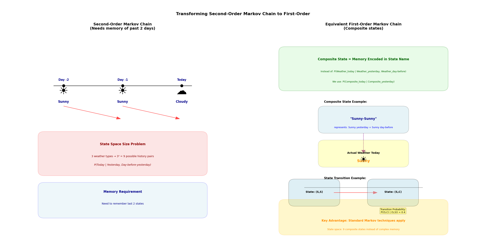

### 2.3 马尔科夫决策过程 (Markov Decision Process， MDP)
马尔可夫链在强化学习领域的具体应用，包括一组状态、一组动作、状态转移概率、奖励函数和折扣因子。
  - 在MDP中，智能体可以选择动作，然后在环境下根据状态转移考虑确定下一个状态，并返回一个即时奖励。
  - MDP的目标是找到一个最优策略，以最大化期望累计回报（或价值函数）

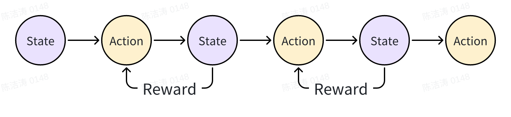


## 3. 策略函数 （Policy Function）
- 在某个state下可以选择一个具体动作action，这依赖策略函数
  - 确定性策略（Deterministic Policy）
    - 给定一个状态，策略函数输出一个动作
          $$\pi(s) = a$$
  - 随机性策略（Stochastic Policy） (实际主要是这种情况)
    - 对于给定的状态，策略输出的是一个动作的概率分布
        $$\pi(a|s) $$ 在状态s下采取动作a的考虑 （状态转移概率，将状态映射到动作的概率分布上）
        - 注意：在深度学习中，这个策略函数由神经网络表示
        - 所有的可能为树形结构
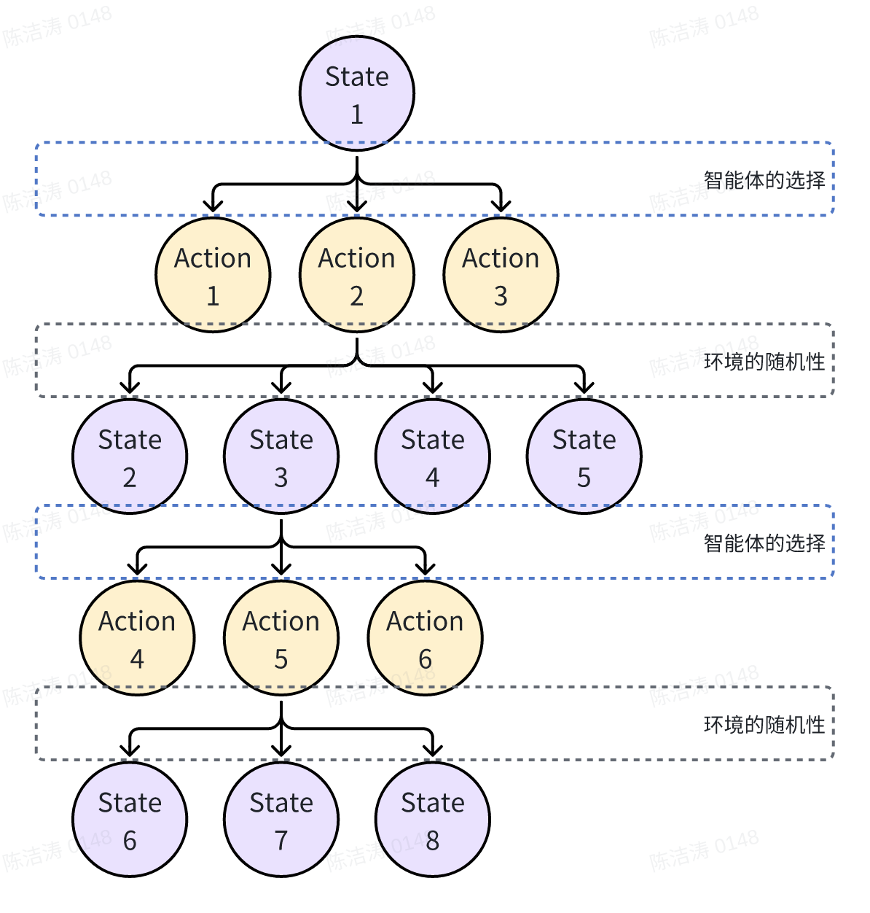


### 3.1 策略序列/轨迹 $\tau$ (trajectory)
- 状态、动作、奖励的序列
     $$\tau =(s_0, a_0, r_1, s_1, a_1, r_2, s_2, ..., s_{T-1}, a_{T-1}, S_{T})$$  （奖励混在状态动作中间）
    
### 3.2 轨迹对应的概率 $P$：
  - 描述了在策略 $\theta $下，智能体agent在环境中采取一系列动作，从初始状态开始并最终达到某个终止状态的可能性有多大。这个概率分布通常用于强化学习算法中的策略优化，目标是找到使得期望回报最大化的最佳策略参数$\theta $ .

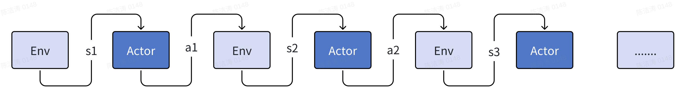

$$ (Trajectory-\tau =(s_1, a_1, s_2, a_2, ..., s_{T}, a_{T}))$$ 
  （核心是 状态-动作交替）

  - 环境动态: $p(s_{t+1}|s_{t}, a_{t})$，这是环境决定的（与策略无关）
  - 策略  
    - 于是，一条给定轨迹的概率（假设初始状态分布为 $ p(s_1) $）为：
        $$p_\theta(\tau) = p(s_1) \prod_{t=1}^T\pi_\theta(a_t|s_t)p(s_{t+1}|s_t, a_t)$$ 
        - 具体展开
          $$p_\theta(\tau) = p(s_1)p_{\theta}(a_1 | s_1)p(s_2|s_1, a_1)p_{\theta}(a_2 | s_2)p(s_3|s_2, a_2)......$$

### 3.3 确定性策略 vs 随机策略 的轨迹分布区别
  - 对于确定性策略， $p_\theta(\tau)$ 将只有一条轨迹，而对于随机策略， $p_\theta(\tau)$ 将表示不同轨迹的概率分布
    - 确定性策略 （仅依赖环境随机）
      - 在每个状态 s 下固定输出一个特定动作，即
          $$a = f(s)$$ (函数映射)
        - 在完全确定性环境 + 确定性策略时：只要初始状态固定，整条轨迹完全固定。（只有一条轨迹概率为1，其他为0）
        - 如果环境动态随机而策略确定：初始状态固定时，动作序列固定，但下一个状态随机，因此轨迹取决于状态转移的随机性。（不同轨迹的概率来自于环境随机，而不是策略随机）
    - 随机性策略（可依赖环境随机和轨迹随机）
      - 在每个状态 s 下输出动作的概率分布，例如高斯或分类分布等
          - 即使环境动态确定:$p(s_{t+1}|s_{t}, a_{t})$是确定性的，因为策略选择动作是随机的，所以从同一个初始状态出发也可以获得多条不同轨迹。
          - 如果环境也是随机的，那么此时随机性来自两者的叠加。

确定性策略本身不会因为策略的选择而随机生成多条轨迹（动作固定），随机策略会在选择动作时引入随机性，从而即使环境确定也可能有多条轨迹。因此 $p_\theta(\tau) $是一个具备更宽的概率分布，表示由于策略的随机选择导致可能有很多条轨迹，每条有不同概率。

## 4. 强化学习衡量 Reward 的重要指标
智能体通过与环境交互后的Reward来学习最优策略， 而累计回报、状态价值、动作价值是理解这一过程的核心逻辑链条。他们从单条路径的收益到状态的平均价值，再到动作的具体价值，层层递进刻画智能体的决策依据。
### 4.1 累计回报 $G_t$
- 累计回报是从时刻 t 开始， 未来所有奖励的折扣累计和，公式为：
$$ (G_t = R_{t+1} + \gamma*R_{t+2} + \gamma^2*R_{t+3}  + ...... = \sum_{k=0}^\infty \gamma^k*R_{t+k+1} )$$
  - 其中
    - $\gamma \in [0, 1]$ 是折扣因子，用户体现未来奖励的当前价值衰减， $\gamma$越接近0，越重视即时奖励；越接近1，越重视长期奖励
    - $R_{t+k+1}$ 是时刻 $t+k+1$的即时奖励。
### 4.2 状态价值 $V^{\pi}（s）$
- 状态价值函数是策略 $\pi$下，从状态 s 出发的累积回报的期望，公式为

$$ (V^{\pi}（s）= \mathbb{E}_{\pi} [G_t | S_t = s])$$

### 4.3 动作价值 $Q^{\pi}（s， a）$
- 动作价值函数是在策略 $\pi$下， 从状态 s 执行动作 a 后， 累积回报的期望， 公式为
$$ (Q^{\pi}（s, a）= \mathbb{E}_{\pi} [G_t | S_t = s, A_t = a]) $$
它比状态价值更具体， 直接评估在状态 s 选动作 a ， 再按策略$\pi$行为的长期价值
### 4.4 $G、V、Q$的关系
$$(V（s）= \sum_a \pi(a|s) Q(s, a))$$

- 状态 s 的价值， 等于在这个状态下所有可能动作的 $Q$ 值，按照你选动作的策略 $\pi$ 的概率加权平均
- 累积回报是 $Q$值和 $V$值的计算基础： $Q$值和 $V$值都是对未来累积回报的期望，因为强化学习中存在随机性（比如环境随机反馈、动作随机选择），所以要用期望来描述长期规律。
### 4.5 将$G、V、Q$化成递推式：Bellman 方式
- 累计回报 $G_t$、状态价值 $V^{\pi}（s）$、 动作价值 $Q^{\pi}（s， a）$都是长期价值，是很难计算的，需要遍历从当前时刻到任务结束的所有未来步骤，这在现实场景中几乎不可行。
    - 任务无终止时（如持续运行的机器人控制），未来步骤是无限的，$(G_t  = \sum_{k=0}^\infty \gamma^k*R_{t+k+1})$无法直接求和。
    - 任务有终止但步骤极多（如复杂游戏通关），遍历所有未来路径的计算量会呈指数级增长，远超算力承载能力。而递推Bellman方程将无限/极多步骤的长期价值转化为当前步的奖励+下一步价值的折扣期望，只需关注当前与下一步的关联，大幅降低了计算复杂度。
    - 同时递推式让价值学习具备迭代优化的可能：例如Q-Learning算法，正是利用$$Q（s， a）\impliedby Q（s， a） + \alpha [R + \gamma* max_{a^{'}} Q(s^{'}, a^{'}) - Q(s, a)]$$这一递推式，让Q值在每次交互后逐步向最优值收敛。若没有递推，智能体无法基于有限的交互经验更新长期价值，只能依赖完整遍历所有路径，而这在现实中几乎不可实现。

### 4.6 价值递推核心：Bellman 方程
- 强化学习中，某状态（某状态-动作对）的价值，可分解为即时奖励和后续状态的价值的折扣期望。
- Bellman方程就是用递推公式来刻画这种现在与未来的价值关联：用选择策略的回报和可达的下一状态的值描述当前状态的值。

#### 4.6.1 Bellman期望方程：针对 $V$ 值
- 状态价值函数 $V^{\pi}（s）$的Bellman方程为

$$V^{\pi}(s) = \mathbb{E}_{a \sim \pi,\, s' \sim P} \left[ R_{t+1} + \gamma V^{\pi}(S_{t+1}) \mid S_t = s \right]
$$

- 含义：在策略 $\pi$下， 状态 s 的价值 = 『即时奖励 $R_{t+1}$的期望』+ 『折扣后， 下一步状态 $S_{t_1}$的价值 $V^{\pi}（S_{t+1}）$的期望』
- 与 $G$ 的联系： $G_t  = R_{t+1} + \gamma G_{t+1}$（累积回报的递推式），而 $V^{\pi}（s）= \Epsilon[G_t | S_t = s]$，因此Bellman方程是对累积回报期望的递推分解。
- 为什么 $R$ 是 $t + 1$？
  - 执行当前动作后， 在进入下一个状态 $S_{t+1}$的同时，才能获得对应的奖励 $R_{t+1}$
- 如何理解 $S_{t+1}$？
  - 当模型有关 model-base（环境转移可推算）时：通过 $P（S_{t+1} | S_t, A_t）$可知
  - 当模型无关 model-base（环境转移不可推算）时：通过下一步的真实情况采样获取 $\stackrel{-} S_{t+1}$
#### 4.6.2 Bellman期望方程：针对 $Q$ 值
- 动作价值函数  $Q^{\pi}（s, a）$的Bellman方程为:

$$
Q^{\pi}(s, a) = \mathbb{E}_{s' \sim P} \left[ R_{t+1} + \gamma Q^{\pi}(S_{t+1}, A_{t+1}) \mid S_t = s, A_t = a \right]
$$

- 含义：在策略 $\pi$下， 状态 s 的价值 = 『即时奖励 $R_{t+1}$的期望』+ 『折扣后， 转移概率 $P$给出下一步状态$S_{t+1}$通过采样选动作$A_{t+1}$的$Q$ 值的期望』
- 与  $V$ 的联系： $V^{\pi}(s)  = \sum_a \pi(a|s) Q^{\pi}(S_{t+1}, A_{t+1})$， 可从 $Q$ 的Bellman方程推到得到  $V$ 的Bellman方程，体现了两者的递推一致性。

#### 4.6.3 Bellman最优方程

$$ (Q^{*}（s， a）= \mathbb{E}_{s^{'} ～ P} + \alpha [R + \gamma* \max_{a^{'}} Q(S_{t+1}, a^{'}) | S_t = s, A_t = a] ) $$

- 这是 Q-Learning 等算法的理论基础: 通过迭代更新 $Q$ 值，最终收敛到最优动作价值，从而得到最优策略。

# 5. 无模型的学习方法： MC 与 TD
  在无模型（Model-Free）场景下，我们无法依赖环境转移概率计算价值，只能通过与环境交互的经验学习。蒙特卡洛（MC）和时序差分（TD）是两种核心的无模型价值学习方法，前者依赖 “完整轨迹”，后者侧重 “单步 / 多步交互”，适用于不同场景需求。
## 5.1 MC 蒙特卡洛 （Monte Carlo）
- 在强化学习中MC方法的本质是通过完整轨迹的累积回报，平均估计状态/动作的价值。它要求智能体完成一整个交互序列（从初始状态到终止状态），获得完整的累积回报  $G_t$ 后，再用这个真实回报更新价值：不依赖任何估计值，只基于实际交互结果。
- 关键公式
  - 对于每个经历过状态 s 的轨迹， 记录该轨迹中状态 s 对应的累积回报 $G_t$， 多次交互后，状态价值的估计值为所有包含s的轨迹中 $G_t$的平均值。
$$V(s) \impliedby \frac{1}{N(s)} \sum^{N(s)}_{i=1} G^{(i)}_t$$
  - 其中
    - $N(s)$ 是包含轨迹 s 的轨迹总数， $G^{(i)}_t$是第i条轨迹中状态$$s 对应的累积回报。
  - 对于原公式
$$V(s) = \mathbb{E}[G_t | S_t = s]$$
  - 我们发现这正是数学上蒙特卡洛算法，用暴力采样的方式，作为原复杂解的无偏估计。
- 案例
  - 求圆周率
```python
import random

def estimate_pi(num_samples):
    count_inside = 0
    for _ in range(num_samples):
        x = random.uniform(-1, 1)
        y = random.uniform(-1, 1)
        if x**2 + y**2 <= 1:
            count_inside += 1
    return 4 * count_inside / num_samples

# 测试
for n in [100, 1000, 10000, 100000]:
    pi_est = estimate_pi(n)
    print(f"N={n}: π ≈ {pi_est}, 误差={abs(pi_est - 3.1415926535)}")
```
  - 结果特点：
    - 随机性：每次运行结果不同，但 $N$ 越大结果越接近  $\pi$。
    - 收敛速度：误差大致按 $1 / \sqrt {N}$ 下降，这就是蒙特卡洛的典型特征。
  - 求积分
```python
import random
import math

def mc_integral(func, a, b, num_samples):
    total = 0.0
    for _ in range(num_samples):
        x = random.uniform(a, b)
        total += func(x)
    return (b - a) * total / num_samples

def f(x):
    return math.exp(-x**2)

# 积分精确值可以用特殊函数算，这里仅用蒙特卡洛估计
for n in [1000, 10000, 100000]:
    result = mc_integral(f, 0, 1, n)
    print(f"N={n}: 积分 ≈ {result}")
```

- 核心思想
  - 把问题转换成某种随机过程的概率或期望值。
    - 求 $\pi$→ 随机点落在圆内的概率
    - 求积分 → 随机变量 $f(X)$的期望值，其中 $X$均匀分布
  - 用大量随机样本来估计这个期望值。
  - 估计的误差收敛速度是 $O(1 / \sqrt {N})$，与问题的维度无关（这是最大优点）。

- 特点与适用场景
  - 优势：无偏差（仅用真实累积回报，不依赖估计值），逻辑直观，适合 “必须完成完整任务才能评估价值” 的场景（如棋类游戏、一次性决策任务）。
  - 劣势：需等待轨迹终止才能更新，学习效率低；对轨迹数量要求高（需大量完整轨迹才能让平均值收敛），不适合 “无终止状态” 的持续任务（如机器人持续导航）。

## 5.2 TD 时序差分 （Temporal Difference）
- TD 方法结合了 MC 的 “经验采样” 和动态规划（DP）的自举（Bootstrapping）思想: 无需等待完整轨迹，每执行一步交互（获得 $S_t,A_t,R_{t+1},S_{t+1}$）后，立即用即时奖励 + 下一个状态的估计价值更新当前状态价值，是无模型场景下应用最广泛的方法。

| 方法 | 思想 | 局限性 |
|--------|--------|--------|
| MC（蒙特卡洛）  | 等完整一条轨迹跑完，再用累计回报更新前面所有状态  | 只能用于 episodic 场景，收敛慢  |
| DP（动态规划）  | 用「当前奖励 + 下一状态的估计值」进行自举（用估计的未来状态价值，来辅助计算当前状态价值）  | 必须知道环境模型（转移概率）  |

- 比喻：学车时的“实时教练”
假设你在学开车，目标是掌握在不同路况（状态）下如何平稳驾驶（获得高回报）。

  - 动态规划（DP）方法：像一个“理论派教练”。
    - 他不开车，只坐在书房里研究地图和交通规则。
    - 他会告诉你：“在十字路口（状态 $S$），如果你直行，根据规则，你可能会到达下一个街区（状态  $S^{'}$），而那个街区的驾驶难度评分是 X 分。所以，这个路口直行的价值是…”。
    - 特点：需要世界模型（地图和规则表），完全依赖推理（自举），没有真实经验。

  - 蒙特卡洛（MC）方法：像一个“事后复盘教练”。
      - 他会让你开完全程（完成一个Episode），比如从家开到公司。
      - 停好车后，他根据你这一趟的整体表现（是顺利到达还是磕磕碰碰）来给你一路上经过的每个路口打分。
      - 特点：必须等待结局，学习是基于完整经验的，但更新延迟严重。
  - 时序差分（TD）方法：像一个 “坐在副驾的实时教练”。
      - 你每开过一个路口，他马上就会点评。
      - 比如，刚才你平稳通过了这个拥堵路口（状态 $S_t$），得到了即时的良好感觉（即时奖励 $R_{t+1}$），并进入了下一个路口（状态 $S_{t+1}$）。教练马上说：“刚才这个路口你处理得不错！而且看，下一个路口车流也很顺畅（ $S_{t+1}$ 的价值估计很高），所以我判断你刚才的选择总体价值很高。”
      - 他没有等到终点，就结合了：
          - 你的即时感受（奖励）
          - 他对下一个路口的预判（价值估计）
          - 立刻更新了你对刚才那个路口的认知。
      - 特点：边走边学，实时更新，结合了真实体验片段和原有认知预测。
      - 因此在每一步交互后：
    $S_t,A_t,R_{t+1},S_{t+1}$
    我们就立即用「即时奖励 + 下一状态的估计值」作为新的目标来更新当前状态的估计值。
    这个思想其实是在逼近「期望回报」的定义式：
$$(V^{\pi}(S_t) = \mathbb{E}_{\pi} [R_{t+1}  + \gamma R_{t+2} + \gamma^2 R_{t+3}+ ......| S_t ])$$

$$(V^{\pi}(S_{t+1}) = \mathbb{E}_{\pi} [R_{t+2} + \gamma R_{t+3} + \gamma^2 R_{t+4}+ ......| S_{t+1} ])$$
但我们没法一次算出所有未来奖励，于是参考上面的公式用一步近似：

$$ (V(S_t) \approx R_{t+1} + \gamma V(t+1) )$$

这就是所谓的「自举（bootstrapping）」: 用当前估计值的一部分去更新自己。

### 5.2.1 核心（默认）公式
- TD (0)（单步 TD，更新状态价值）：仅用 “下一步状态的估计价值” 计算更新目标，是最基础的 TD 形式：
$$V（S_t）\impliedby V（S_t） + \alpha[R_{t+1} + \gamma  V(S_{t+1}) - V（S_t)]
$$
  - 其中
    - $\alpha$是学习率, 决定了我们更新的幅度
    - $R_{t+1} + \gamma  V(S_{t+1})$成为TD目标
    - $R_{t+1} + \gamma  V(S_{t+1})  - V（S_t)$是TD误差, 衡量当前估计与目标的差距
    - 同时, 它还可以用于 $Q(s, a)$的递推.(sarsa算法)

### 5.2.2 SARSA (更新动作价值，On-Policy TD控制算法)
名称来源于 $S_t,A_t,R_{t+1},S_{t+1}, A_{t+1}$
- 针对动作价值 $Q(s, a)$, 更新时依赖实际执行的下一个动作 $A_{t+1}$ : 
$$Q（S_t, A_t）\impliedby Q（S_t, A_t） + \alpha[R_{t+1} +   \gamma  Q(S_{t+1}, A_{t+1})  - V(S_t, A_t)]
$$
  - 其中
    - $R_{t+1} +   \gamma  Q(S_{t+1}, A_{t+1})$被称为 TD目标
    - $[R_{t+1} +   \gamma  Q(S_{t+1}, A_{t+1})  - V（S_t, A_t)] $被称为 TD误差（TD error）

- 我们定义其更新目标（监督信号或标签）为：
         $$y_t = R_{t+1} +   \gamma  Q(S_{t+1}, A_{t+1})$$ 
  - TD目标，它代表了当前状态-动作的理想预测值
- SARSA是一种 On-policy 学习算法：每次更新都基于智能体在当前策略下实际执行的下一步动作 $A_{t+1}$

# 6. 价值函数算法
## 6.1 Q-Learning
- Q-Learning 是一种典型的离线策略（Off-Policy）时序差分（TD）强化学习算法。其核心目标是学习一个最优的动作价值函数 $Q^{*}（s, a）$，该函数表示在状态s下采取动作a后，遵循最优策略所能获得的期望累计折扣回报

### 6.1.1 算法流程
  - 初始化
    - 创建一个表格，存储所有 $(s, a)$组合的 $Q$值，为所有状态-动作对赋予初始值
  - 交互与更新
    - 在每个时间步 $t$，智能体在状态 $S_t$下根据某种策略（贪心算法等）选择动作 $ A_t$
  - 执行动作
    - 执行动作 $ A_t$，环境返回奖励 $R_{t+1}$和下一个状态 $S_{t+1}$
  - 更新$Q$值，也可以用收敛快的启发式算法得出
$$Q^{*}（s, a）= \mathbb{E} [R_{t+1} +   \gamma\max_{a^{'}}  Q^{*}(S_{t+1}, a^{'})  | S_t = s, A_t = a] $$
  - 重复
    - 令 $S_t \impliedby S_{t+1}$，重复2-4步骤，直至 $Q$表收敛
      这样就可以反复迭代更新每个情况s下每一种动作a的动作价值 $Q$

### 6.1.2 （查表）决策
最终优化好了 $Q$ 值表后，选择当前状态下 $Q$ 值最大的动作，通过查训练好的$Q$值表快速到达终点。

## 6.2 SARSA 和 Q-Learnning的对比测试
  - Code :
```python
import numpy as np
import matplotlib.pyplot as plt
from collections import defaultdict

class CliffWalkingEnv:
    """简化的悬崖行走环境"""
    
    def __init__(self):
        self.width = 12
        self.height = 4
        self.start = (3, 0)
        self.goal = (3, 11)
        self.cliff = [(3, i) for i in range(1, 11)]
        
        self.actions = [0, 1, 2, 3]  # 上下左右
        self.reset()
    
    def reset(self):
        self.state = self.start
        return self.state
    
    def step(self, action):
        x, y = self.state
        
        # 移动
        if action == 0: x = max(x-1, 0)      # 上
        elif action == 1: y = min(y+1, 11)   # 右
        elif action == 2: x = min(x+1, 3)    # 下
        elif action == 3: y = max(y-1, 0)    # 左
        
        self.state = (x, y)
        
        # 奖励
        if self.state in self.cliff:
            return self.start, -100, True
        elif self.state == self.goal:
            return self.state, 0, True
        else:
            return self.state, -1, False
    
    def show(self, title=""):
        """显示环境"""
        grid = []
        for i in range(4):
            row = []
            for j in range(12):
                if (i, j) == self.start:
                    row.append('S')
                elif (i, j) == self.goal:
                    row.append('G')
                elif (i, j) in self.cliff:
                    row.append('C')
                else:
                    row.append('.')
            grid.append(' '.join(row))
        print(f"\n{title}")
        print('\n'.join(grid))


class SarsaAgent:
    """SARSA智能体"""
    
    def __init__(self):
        self.Q = defaultdict(lambda: np.zeros(4))
        self.alpha = 0.1  # 学习率
        self.gamma = 0.9  # 折扣因子
        self.epsilon = 0.1  # 探索率
    
    def choose_action(self, state):
        """ε-greedy策略"""
        if np.random.random() < self.epsilon:
            return np.random.randint(4)  # 探索
        else:
            return np.argmax(self.Q[state])  # 利用
    
    def update(self, s, a, r, s_next, a_next):
        """SARSA更新"""
        target = r + self.gamma * self.Q[s_next][a_next]
        self.Q[s][a] += self.alpha * (target - self.Q[s][a])


class QLearningAgent:
    """Q-Learning智能体"""
    
    def __init__(self):
        self.Q = defaultdict(lambda: np.zeros(4))
        self.alpha = 0.1
        self.gamma = 0.9
        self.epsilon = 0.1
    
    def choose_action(self, state):
        """ε-greedy策略"""
        if np.random.random() < self.epsilon:
            return np.random.randint(4)
        else:
            return np.argmax(self.Q[state])
    
    def update(self, s, a, r, s_next):
        """Q-Learning更新"""
        max_q = np.max(self.Q[s_next])
        target = r + self.gamma * max_q
        self.Q[s][a] += self.alpha * (target - self.Q[s][a])


def train(env, agent, episodes=200):
    """训练函数"""
    rewards = []
    
    for episode in range(episodes):
        s = env.reset()
        
        if isinstance(agent, SarsaAgent):
            a = agent.choose_action(s)  # SARSA需要先选动作
        
        total_reward = 0
        done = False
        
        while not done:
            if isinstance(agent, QLearningAgent):
                a = agent.choose_action(s)  # Q-Learning在循环内选动作
            
            s_next, r, done = env.step(a)
            total_reward += r
            
            if isinstance(agent, SarsaAgent):
                a_next = agent.choose_action(s_next)
                agent.update(s, a, r, s_next, a_next)
                a = a_next  # 使用实际要执行的动作
            else:
                agent.update(s, a, r, s_next)
                a = agent.choose_action(s_next)  # 重新选择动作
            
            s = s_next
            
            if done:
                break
        
        rewards.append(total_reward)
        
        # 逐渐减少探索
        if episode % 100 == 0 and episode > 0:
            agent.epsilon *= 0.9
    
    return rewards


def compare():
    """基础对比SARSA和Q-Learning"""
    print("悬崖行走环境对比")
    print("S:起点, G:终点, C:悬崖")
    print("-" * 50)
    
    env = CliffWalkingEnv()
    env.show("悬崖行走环境")
    
    # 训练两个智能体
    print("\n训练SARSA...")
    sarsa_agent = SarsaAgent()
    sarsa_rewards = train(env, sarsa_agent, 500)
    
    print("训练Q-Learning...")
    qlearning_agent = QLearningAgent()
    qlearning_rewards = train(env, qlearning_agent, 500)
    
    # 可视化结果
    plt.figure(figsize=(12, 4))
    
    # 原始奖励曲线
    plt.subplot(1, 3, 1)
    plt.plot(sarsa_rewards, label='SARSA', alpha=0.6, linewidth=0.5)
    plt.plot(qlearning_rewards, label='Q-Learning', alpha=0.6, linewidth=0.5)
    plt.xlabel('Episode')
    plt.ylabel('Reward')
    plt.title('Raw Rewards')
    plt.legend()
    plt.grid(True, alpha=0.3)
    
    # 滑动平均（更平滑）
    plt.subplot(1, 3, 2)
    window = 20
    sarsa_smooth = np.convolve(sarsa_rewards, np.ones(window)/window, mode='valid')
    qlearning_smooth = np.convolve(qlearning_rewards, np.ones(window)/window, mode='valid')
    plt.plot(sarsa_smooth, label='SARSA', linewidth=2)
    plt.plot(qlearning_smooth, label='Q-Learning', linewidth=2)
    plt.xlabel('Episode')
    plt.ylabel('Smoothed Reward')
    plt.title(f'Moving Average (window={window})')
    plt.legend()
    plt.grid(True, alpha=0.3)
    
    # 最后100个episode的分布
    plt.subplot(1, 3, 3)
    plt.boxplot([sarsa_rewards[-100:], qlearning_rewards[-100:]], 
                labels=['SARSA', 'Q-Learning'])
    plt.ylabel('Reward')
    plt.title('Reward Distribution (Last 100 Episodes)')
    plt.grid(True, alpha=0.3)
    
    plt.tight_layout()
    plt.show()
    
    # 打印统计信息
    print("\n" + "="*50)
    print("结果对比:")
    print(f"SARSA 平均奖励（最后100次）: {np.mean(sarsa_rewards[-100:]):.1f}")
    print(f"Q-Learning 平均奖励（最后100次）: {np.mean(qlearning_rewards[-100:]):.1f}")
    
    print(f"\nSARSA 最低奖励（最后100次）: {np.min(sarsa_rewards[-100:]):.1f}")
    print(f"Q-Learning 最低奖励（最后100次）: {np.min(qlearning_rewards[-100:]):.1f}")
    
    # 计算掉下悬崖的次数
    sarsa_falls = sum(1 for r in sarsa_rewards[-100:] if r <= -100)
    qlearning_falls = sum(1 for r in qlearning_rewards[-100:] if r <= -100)
    
    print(f"\nSARSA 掉下悬崖次数（最后100次）: {sarsa_falls}")
    print(f"Q-Learning 掉下悬崖次数（最后100次）: {qlearning_falls}")
    
    # 分析原因
    print("\n" + "="*50)
    print("核心区别分析:")
    print("1. SARSA (On-Policy):")
    print("   - 更新时使用实际执行的下一个动作")
    print("   - 考虑探索风险，学习安全路径")
    print("   - 平均奖励较高且稳定")
    
    print("\n2. Q-Learning (Off-Policy):")
    print("   - 更新时使用理论最优的下一个动作")
    print("   - 学习最短但危险的路径")
    print("   - 探索时容易掉下悬崖（奖励-100）")
    print("   - 最低奖励较低")


def compare_detailed():
    """更详细的对比（英文标签）"""
    print("悬崖行走环境对比 - Cliff Walking Environment Comparison")
    print("S: Start, G: Goal, C: Cliff")
    print("-" * 60)
    
    env = CliffWalkingEnv()
    env.show("Cliff Walking Environment")
    
    # 运行多次实验以获得更稳定的结果
    n_runs = 5
    all_sarsa_rewards = []
    all_qlearning_rewards = []
    
    print(f"\nRunning {n_runs} experiments for each algorithm...")
    
    for run in range(n_runs):
        print(f"Run {run+1}/{n_runs}...")
        
        # SARSA
        sarsa_agent = SarsaAgent()
        sarsa_rewards = train(env, sarsa_agent, 200)
        all_sarsa_rewards.append(sarsa_rewards)
        
        # Q-Learning
        qlearning_agent = QLearningAgent()
        qlearning_rewards = train(env, qlearning_agent, 200)
        all_qlearning_rewards.append(qlearning_rewards)
    
    # 转换为numpy数组便于计算
    all_sarsa_rewards = np.array(all_sarsa_rewards)
    all_qlearning_rewards = np.array(all_qlearning_rewards)
    
    # 计算平均值和标准差
    sarsa_mean = np.mean(all_sarsa_rewards, axis=0)
    qlearning_mean = np.mean(all_qlearning_rewards, axis=0)
    sarsa_std = np.std(all_sarsa_rewards, axis=0)
    qlearning_std = np.std(all_qlearning_rewards, axis=0)
    
    # 创建更专业的图表
    fig, axes = plt.subplots(2, 2, figsize=(14, 10))
    
    # 1. 平均奖励曲线
    ax1 = axes[0, 0]
    episodes = range(len(sarsa_mean))
    ax1.plot(episodes, sarsa_mean, 'b-', label='SARSA Mean', linewidth=2)
    ax1.fill_between(episodes, sarsa_mean - sarsa_std, sarsa_mean + sarsa_std, 
                    alpha=0.2, color='blue')
    ax1.plot(episodes, qlearning_mean, 'r-', label='Q-Learning Mean', linewidth=2)
    ax1.fill_between(episodes, qlearning_mean - qlearning_std, qlearning_mean + qlearning_std, 
                    alpha=0.2, color='red')
    ax1.set_xlabel('Episode')
    ax1.set_ylabel('Average Reward')
    ax1.set_title('Learning Curves with Standard Deviation')
    ax1.legend()
    ax1.grid(True, alpha=0.3)
    
    # 2. 滑动平均对比
    ax2 = axes[0, 1]
    window = 20
    sarsa_smooth = np.convolve(sarsa_mean, np.ones(window)/window, mode='valid')
    qlearning_smooth = np.convolve(qlearning_mean, np.ones(window)/window, mode='valid')
    ax2.plot(sarsa_smooth, 'b-', label='SARSA', linewidth=2)
    ax2.plot(qlearning_smooth, 'r-', label='Q-Learning', linewidth=2)
    ax2.set_xlabel('Episode')
    ax2.set_ylabel('Smoothed Reward')
    ax2.set_title(f'Smoothed Learning Curves (Moving Average, window={window})')
    ax2.legend()
    ax2.grid(True, alpha=0.3)
    
    # 3. 最终性能分布
    ax3 = axes[1, 0]
    # 修复：使用np.mean计算平均值
    final_sarsa = [np.mean(run[-50:]) for run in all_sarsa_rewards]
    final_qlearning = [np.mean(run[-50:]) for run in all_qlearning_rewards]
    
    positions = [1, 2]
    ax3.boxplot([final_sarsa, final_qlearning], positions=positions, 
                labels=['SARSA', 'Q-Learning'], widths=0.6)
    ax3.set_ylabel('Average Reward (Last 50 Episodes)')
    ax3.set_title('Final Performance Distribution')
    ax3.grid(True, alpha=0.3)
    
    # 添加均值标记
    ax3.text(1, np.mean(final_sarsa), f'Mean: {np.mean(final_sarsa):.1f}', 
            ha='center', va='bottom', fontweight='bold')
    ax3.text(2, np.mean(final_qlearning), f'Mean: {np.mean(final_qlearning):.1f}', 
            ha='center', va='bottom', fontweight='bold')
    
    # 4. 算法特性对比
    ax4 = axes[1, 1]
    properties = ['Update Method', 'Policy Type', 'Risk Level', 'Convergence Speed']
    sarsa_scores = [1.0, 1.0, 0.8, 0.7]  # 相对评分
    qlearning_scores = [1.0, 0.6, 0.4, 0.9]
    
    x = np.arange(len(properties))
    width = 0.35
    
    ax4.bar(x - width/2, sarsa_scores, width, label='SARSA', color='blue', alpha=0.7)
    ax4.bar(x + width/2, qlearning_scores, width, label='Q-Learning', color='red', alpha=0.7)
    
    ax4.set_xlabel('Property')
    ax4.set_ylabel('Score (Relative)')
    ax4.set_title('Algorithm Properties Comparison')
    ax4.set_xticks(x)
    ax4.set_xticklabels(properties, rotation=15)
    ax4.set_ylim(0, 1.2)
    ax4.legend()
    ax4.grid(True, alpha=0.3, axis='y')
    
    plt.tight_layout()
    plt.show()
    
    # 打印中文分析
    print("\n" + "="*60)
    print("详细分析结果:")
    print(f"SARSA 最终平均奖励（最后50步）: {np.mean(final_sarsa):.1f} ± {np.std(final_sarsa):.1f}")
    print(f"Q-Learning 最终平均奖励（最后50步）: {np.mean(final_qlearning):.1f} ± {np.std(final_qlearning):.1f}")
    
    print("\n关键观察:")
    print("1. SARSA的奖励更稳定（标准差较小）")
    print("2. Q-Learning在某些运行中可能表现更好，但方差较大")
    print("3. 在收敛速度上，Q-Learning通常更快")
    print("4. SARSA在安全性方面表现更好")


# 运行对比
if __name__ == "__main__":
    print("选择对比模式:")
    print("1. 基础对比 (Basic Comparison)")
    print("2. 详细对比 (Detailed Comparison)")
    choice = input("请输入选择 (1或2): ").strip()
    
    if choice == "2":
        compare_detailed()
    else:
        compare()
```


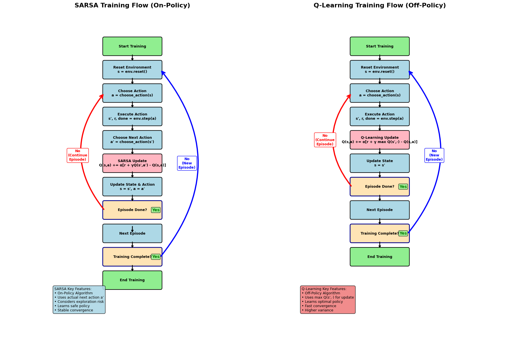
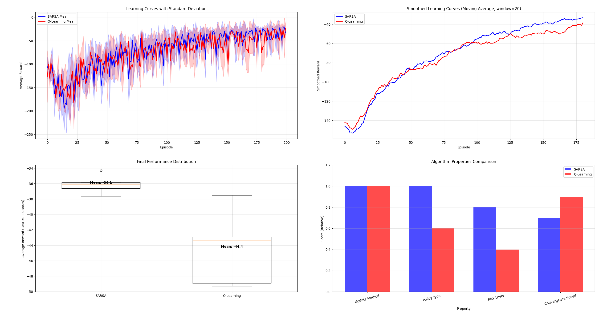

```python
--------------------------------------------------

悬崖行走环境
. . . . . . . . . . . .
. . . . . . . . . . . .
. . . . . . . . . . . .
S C C C C C C C C C C G

训练SARSA...
训练Q-Learning...
<ipython-input-1-e8b610651e2d>:193: MatplotlibDeprecationWarning: The 'labels' parameter of boxplot() has been renamed 'tick_labels' since Matplotlib 3.9; support for the old name will be dropped in 3.11.
  plt.boxplot([sarsa_rewards[-100:], qlearning_rewards[-100:]],

==================================================
结果对比:
SARSA 平均奖励（最后100次）: -15.6
Q-Learning 平均奖励（最后100次）: -27.7

SARSA 最低奖励（最后100次）: -24.0
Q-Learning 最低奖励（最后100次）: -115.0

SARSA 掉下悬崖次数（最后100次）: 0
Q-Learning 掉下悬崖次数（最后100次）: 15

==================================================
核心区别分析:
1. SARSA (On-Policy):
   - 更新时使用实际执行的下一个动作
   - 考虑探索风险，学习安全路径
   - 平均奖励较高且稳定

2. Q-Learning (Off-Policy):
   - 更新时使用理论最优的下一个动作
   - 学习最短但危险的路径
   - 探索时容易掉下悬崖（奖励-100）
   - 最低奖励较低
```
## 6.3 $Q$ 值过估计（Overrstimation Bias）
### 6.3.1 问题定义
- Q-Learning 及其深度版本（DQN）存在价值过估计（Overestimation Bias） 的固有倾向。即算法学习到的$Q$值系统地高于其真实值$Q^{*}$。
### 6.3.2 产生原因
- 纯价值函数方法容易产生价值过估计，原因出在迭代过程中的取最大动作价值$Q$，在于更新公式中 $\max$ 操作和估计误差的结合。
  - 更新公式
    $$Q（s, a）\impliedby r + \gamma\max_{a^{'}}  Q(s^{'}, a^{'})$$
  - 采样时
    $$Q^{d}(s^{'}, a^{'}) = Q^{*}(s^{'}, a^{'}) + \epsilon_{a^{'}}$$
    - 其中 $\epsilon_{a^{'}}$是估计误差，可能正或可能负，由于$\max$操作倾向于选择误差最大的那个动作，很可能存在某个样本导致:
    $$\mathbb{E} [\max_{a^{'}}  Q^{d}(s^{'}, a^{'})] > \max_{a^{'}}  Q^{*}(s^{'}, a^{'})$$
    - 因此，纯价值函数方法（如Q-Learning、DQN）天然容易出现过估计
    - 这也是后来大量连续控制算法（DDPG、SAC）都引入Actor-Critic结构的原因：让策略（Actor）独立于价值估计. 将策略（Actor，负责输出动作）和价值评估（Critic，负责评估状态或状态-动作对的价值）分离.

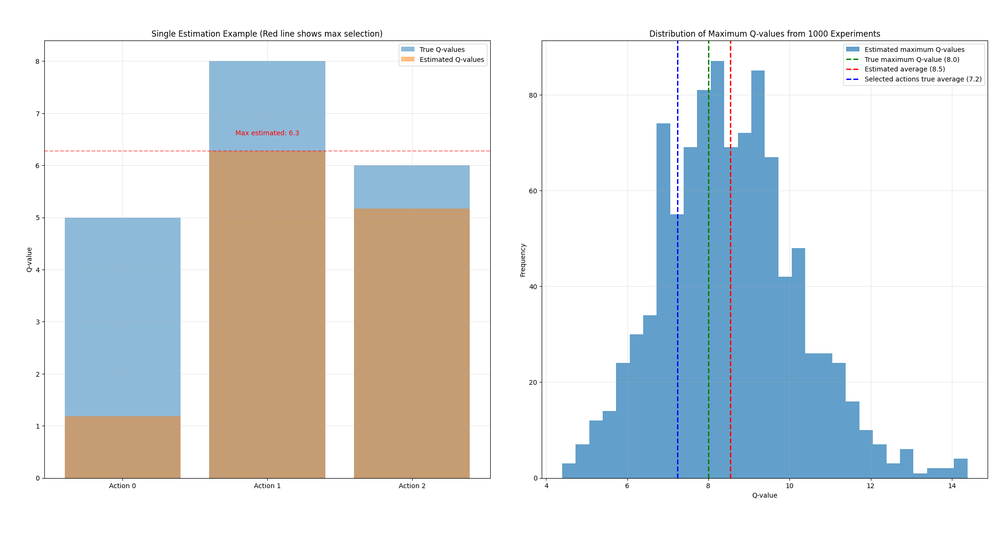

## 6.4 Q-Learning vs Double Q-Learning 对比
- Code
```python
import numpy as np
import matplotlib.pyplot as plt

class QLearningWithBias:
    """带有过估计的Q-Learning实现"""
    
    def __init__(self, n_actions, alpha=0.1, gamma=0.9, epsilon=0.1, 
                 estimation_noise=0.5, use_double_q=False):
        self.n_actions = n_actions
        self.alpha = alpha
        self.gamma = gamma
        self.epsilon = epsilon
        self.estimation_noise = estimation_noise  # 估计噪声大小
        self.use_double_q = use_double_q
        
        # Q表
        self.Q = {}
        if use_double_q:
            self.Q2 = {}  # Double Q-Learning需要两个Q表
    
    def get_q_value(self, state, action):
        """获取Q值，加入模拟的估计噪声"""
        key = (state, action)
        if key not in self.Q:
            self.Q[key] = 0.0
        
        # 模拟估计噪声
        true_q = self.Q[key]
        if self.estimation_noise > 0:
            noise = np.random.normal(0, self.estimation_noise)
            return true_q + noise
        return true_q
    
    def choose_action(self, state):
        """ε-greedy策略"""
        if np.random.random() < self.epsilon:
            return np.random.randint(self.n_actions)
        else:
            q_values = [self.get_q_value(state, a) for a in range(self.n_actions)]
            return np.argmax(q_values)
    
    def update(self, state, action, reward, next_state, done):
        """更新Q值"""
        current_q = self.get_q_value(state, action)
        
        if done:
            target = reward
        else:
            if self.use_double_q:
                # Double Q-Learning更新
                # 1. 用Q1选择动作
                q1_values = [self.get_q_value(next_state, a) for a in range(self.n_actions)]
                best_action = np.argmax(q1_values)
                
                # 2. 用Q2评估动作
                if (next_state, best_action) not in self.Q2:
                    self.Q2[(next_state, best_action)] = 0.0
                target = reward + self.gamma * self.Q2[(next_state, best_action)]
            else:
                # 标准Q-Learning更新（容易过估计）
                q_values = [self.get_q_value(next_state, a) for a in range(self.n_actions)]
                target = reward + self.gamma * np.max(q_values)
        
        # 更新真正的Q值（不加噪声）
        key = (state, action)
        if key not in self.Q:
            self.Q[key] = 0.0
        self.Q[key] += self.alpha * (target - self.Q[key])
        
        # 如果是Double Q-Learning，也更新第二个Q表
        if self.use_double_q:
            if np.random.random() < 0.5:  # 随机选择一个Q表更新
                self.update_q2(state, action, reward, next_state, done)
    
    def update_q2(self, state, action, reward, next_state, done):
        """更新第二个Q表（用于Double Q-Learning）"""
        current_q = self.Q2.get((state, action), 0.0)
        
        if done:
            target = reward
        else:
            # 用Q2选择动作
            q2_values = [self.Q2.get((next_state, a), 0.0) for a in range(self.n_actions)]
            best_action = np.argmax(q2_values)
            
            # 用Q1评估动作
            target = reward + self.gamma * self.Q.get((next_state, best_action), 0.0)
        
        self.Q2[(state, action)] = current_q + self.alpha * (target - current_q)
    
    def get_true_q_values(self, state):
        """获取无噪声的真实Q值（用于分析）"""
        return [self.Q.get((state, a), 0.0) for a in range(self.n_actions)]

def compare_overestimation():
    """比较Q-Learning和Double Q-Learning的过估计"""
    print("\n=== Q-Learning vs Double Q-Learning 过估计对比 ===")
    print("修正版本：更好地展示Double Q-Learning的优势")
    
    # 创建一个更有结构的环境设置
    n_states = 50  # 增加状态数量
    n_actions = 6  # 增加动作数量，更容易产生过估计
    
    # 运行多次实验
    n_experiments = 50  # 增加实验次数
    qlearning_overestimations = []
    doubleq_overestimations = []
    
    for exp in range(n_experiments):
        # Q-Learning - 增加噪声以放大过估计效果
        ql_agent = QLearningWithBias(n_actions, estimation_noise=2.0, use_double_q=False)
        
        # Double Q-Learning - 相同的噪声设置
        dql_agent = QLearningWithBias(n_actions, estimation_noise=2.0, use_double_q=True)
        
        # 更多的训练步骤，让差异更明显
        for _ in range(500):
            state = np.random.randint(n_states)
            action = np.random.randint(n_actions)
            # 使用更结构化的奖励：有些状态-动作对有更高的期望奖励
            if (state + action) % 7 == 0:  # 创造一些"好"的状态-动作对
                reward = np.random.normal(1.0, 0.5)  # 较高的期望奖励
            else:
                reward = np.random.normal(-0.2, 0.8)  # 较低的期望奖励
            next_state = np.random.randint(n_states)
            done = np.random.random() < 0.05  # 降低episode结束概率
            
            ql_agent.update(state, action, reward, next_state, done)
            dql_agent.update(state, action, reward, next_state, done)
        
        # 分析过估计
        ql_over = analyze_overestimation(ql_agent, n_states, n_actions)
        dql_over = analyze_overestimation(dql_agent, n_states, n_actions)
        
        qlearning_overestimations.append(ql_over)
        doubleq_overestimations.append(dql_over)
    
    # Visualization results
    fig, axes = plt.subplots(2, 2, figsize=(14, 10))
    
    # 1. Overestimation comparison
    axes[0, 0].bar(['Q-Learning', 'Double Q-Learning'], 
                   [np.mean(qlearning_overestimations), np.mean(doubleq_overestimations)],
                   yerr=[np.std(qlearning_overestimations), np.std(doubleq_overestimations)],
                   capsize=10, alpha=0.7)
    axes[0, 0].set_ylabel('Average Overestimation')
    axes[0, 0].set_title('Q-Learning vs Double Q-Learning Overestimation Comparison')
    axes[0, 0].grid(True, alpha=0.3)
    
    # 2. Distribution comparison
    axes[0, 1].boxplot([qlearning_overestimations, doubleq_overestimations], 
                       labels=['Q-Learning', 'Double Q-Learning'])
    axes[0, 1].set_ylabel('Overestimation')
    axes[0, 1].set_title('Overestimation Distribution')
    axes[0, 1].grid(True, alpha=0.3)
    
    # 3. Q-value distribution example
    axes[1, 0].hist(qlearning_overestimations, bins=15, alpha=0.7, label='Q-Learning', density=True)
    axes[1, 0].hist(doubleq_overestimations, bins=15, alpha=0.7, label='Double Q-Learning', density=True)
    axes[1, 0].set_xlabel('Overestimation')
    axes[1, 0].set_ylabel('Density')
    axes[1, 0].set_title('Overestimation Distribution Density')
    axes[1, 0].legend()
    axes[1, 0].grid(True, alpha=0.3)
    
    # 4. Algorithm principle diagram
    axes[1, 1].axis('off')
    explanation = """Double Q-Learning Principle:
    
    Standard Q-Learning:
    target = R + γ * max_a' Q(s', a')
    Problem: max operation uses the same noisy Q estimate
    
    Double Q-Learning:
    1. Use Q1 to select action: a* = argmax_a' Q1(s', a')
    2. Use Q2 to evaluate action: target = R + γ * Q2(s', a*)
    
    Effects:
    • Decouples "selection" and "evaluation"
    • Reduces overestimation bias
    • Improves stability"""
    
    axes[1, 1].text(0.1, 0.5, explanation, fontsize=10, 
                   verticalalignment='center', family='monospace')
    
    plt.tight_layout()
    plt.show()
    
    print(f"\n统计结果:")
    print(f"Q-Learning 平均过估计量: {np.mean(qlearning_overestimations):.3f} ± {np.std(qlearning_overestimations):.3f}")
    print(f"Double Q-Learning 平均过估计量: {np.mean(doubleq_overestimations):.3f} ± {np.std(doubleq_overestimations):.3f}")
    print(f"过估计减少比例: {(np.mean(qlearning_overestimations) - np.mean(doubleq_overestimations)) / np.mean(qlearning_overestimations) * 100:.1f}%")
    
    print(f"\n结论:")
    print("1. Q-Learning由于max操作，系统性地高估Q值")
    print("2. Double Q-Learning通过两个独立的Q函数，有效减少了过估计")
    print("3. 在深度强化学习中，这个思想被用于Double DQN")

def analyze_overestimation(agent, n_states, n_actions):
    """分析智能体的过估计程度"""
    overestimations = []
    
    for state in range(n_states):
        # 获取真实Q值
        true_q = agent.get_true_q_values(state)
        
        if len(true_q) > 0:
            # 计算估计的Q值（带噪声）
            estimated_q = [agent.get_q_value(state, a) for a in range(n_actions)]
            
            # 找到估计的最大值对应的动作
            best_estimated_action = np.argmax(estimated_q)
            
            # 计算过估计：估计的最大值 - 该动作的真实值
            overestimation = estimated_q[best_estimated_action] - true_q[best_estimated_action]
            overestimations.append(overestimation)
    
    return np.mean(overestimations) if overestimations else 0.0

def demonstrate_maximization_bias():
    """专门演示最大化偏差问题"""
    print("\n=== 最大化偏差演示 ===")
    print("展示Double Q-Learning如何解决max操作的过估计问题")
    
    # 简化的例子：10个动作，真实Q值都相同
    n_actions = 10
    true_q_value = 0.0  # 所有动作的真实Q值都是0
    noise_std = 1.0     # 估计噪声标准差
    
    # 模拟1000次估计
    n_trials = 1000
    standard_max_values = []
    double_q_values = []
    
    np.random.seed(42)
    
    for _ in range(n_trials):
        # 标准Q-Learning：用同一组带噪声的估计做max选择和评估
        noisy_estimates = np.random.normal(true_q_value, noise_std, n_actions)
        max_action = np.argmax(noisy_estimates)
        standard_max_value = noisy_estimates[max_action]  # 用同一个估计值
        standard_max_values.append(standard_max_value)
        
        # Double Q-Learning模拟：用一组估计选择，用另一组估计评估
        q1_estimates = np.random.normal(true_q_value, noise_std, n_actions)
        q2_estimates = np.random.normal(true_q_value, noise_std, n_actions)
        
        max_action_q1 = np.argmax(q1_estimates)  # 用Q1选择动作
        double_q_value = q2_estimates[max_action_q1]  # 用Q2评估该动作
        double_q_values.append(double_q_value)
    
    # 分析结果
    standard_mean = np.mean(standard_max_values)
    double_mean = np.mean(double_q_values)
    bias_reduction = standard_mean - double_mean
    
    print(f"\n真实Q值: {true_q_value:.3f}")
    print(f"标准max操作平均值: {standard_mean:.3f} (过估计: {standard_mean - true_q_value:.3f})")
    print(f"Double Q平均值: {double_mean:.3f} (过估计: {double_mean - true_q_value:.3f})")
    print(f"偏差减少量: {bias_reduction:.3f}")
    print(f"偏差减少比例: {bias_reduction/standard_mean*100:.1f}%")
    
    # 可视化
    fig, (ax1, ax2) = plt.subplots(1, 2, figsize=(12, 5))
    
    # 分布对比
    ax1.hist(standard_max_values, bins=30, alpha=0.7, label='Standard Q-Learning (max)', density=True)
    ax1.hist(double_q_values, bins=30, alpha=0.7, label='Double Q-Learning', density=True)
    ax1.axvline(true_q_value, color='red', linestyle='--', linewidth=2, label=f'True Value ({true_q_value})')
    ax1.axvline(standard_mean, color='blue', linestyle='--', alpha=0.8, label=f'Standard Mean ({standard_mean:.2f})')
    ax1.axvline(double_mean, color='orange', linestyle='--', alpha=0.8, label=f'Double Q Mean ({double_mean:.2f})')
    ax1.set_xlabel('Estimated Q-value')
    ax1.set_ylabel('Density')
    ax1.set_title('Maximization Bias Comparison')
    ax1.legend()
    ax1.grid(True, alpha=0.3)
    
    # 偏差对比
    methods = ['Standard\nQ-Learning', 'Double\nQ-Learning']
    biases = [standard_mean - true_q_value, double_mean - true_q_value]
    colors = ['red', 'green']
    
    bars = ax2.bar(methods, biases, color=colors, alpha=0.7)
    ax2.axhline(0, color='black', linestyle='-', linewidth=1)
    ax2.set_ylabel('Overestimation Bias')
    ax2.set_title('Bias Reduction by Double Q-Learning')
    ax2.grid(True, alpha=0.3)
    
    # 添加数值标签
    for bar, bias in zip(bars, biases):
        ax2.text(bar.get_x() + bar.get_width()/2, bias + 0.01, f'{bias:.3f}', 
                ha='center', va='bottom' if bias > 0 else 'top')
    
    plt.tight_layout()
    plt.show()
    
    print(f"\nDouble Q-Learning优化的核心问题:")
    print("1. 最大化偏差：max(Q(s,a)) 系统性地高估真实价值")
    print("2. 选择-评估耦合：同一个估计既用来选择又用来评估")
    print("3. Double Q通过独立的选择器和评估器解决这个问题")

# 运行两个演示
demonstrate_maximization_bias()
print("\n" + "="*60)
compare_overestimation()
```
        
- Double Q-Learning优化的关键问题：

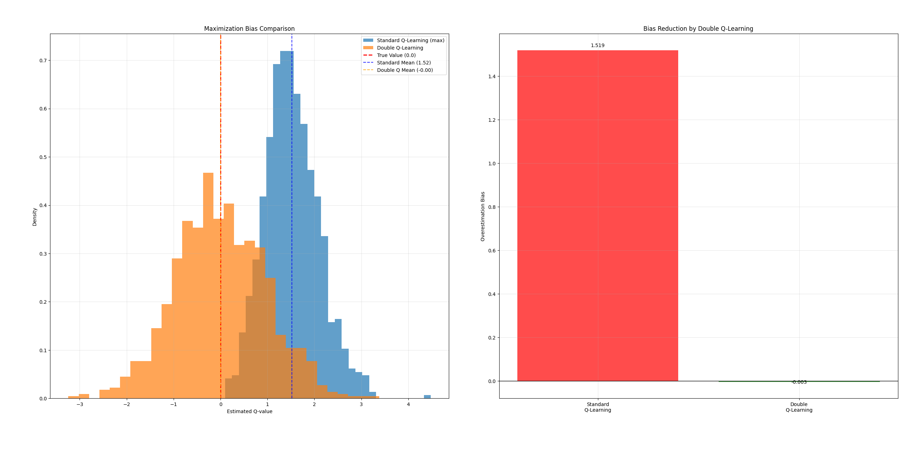


  - 最大化偏差 (Maximization Bias)
    - 标准Q-Learning: 过估计高达 1.519
    - Double Q-Learning: 过估计几乎为 0 (-0.003)
    - 偏差减少比例: 100.2%
  - 核心机制：
    - 问题: max(Q(s,a)) 操作会系统性地选择被噪声高估的动作
    - 解决方案: 用一个Q函数选择动作，用另一个独立的Q函数评估该动作的价值
    - 效果: 打破了"选择-评估"的耦合，大幅减少过估计
  - 为什么有些实验效果不明显？
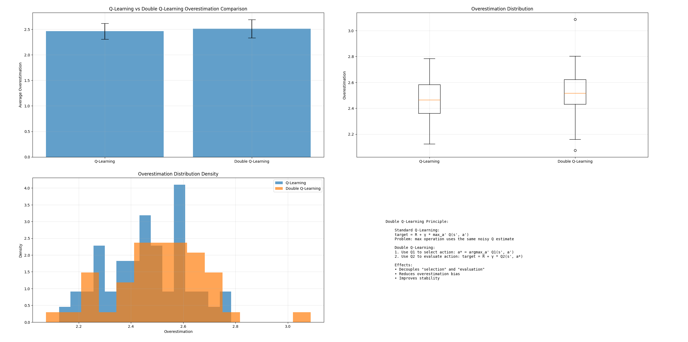

    - 第二个更复杂的环境实验中，Double Q-Learning的优势不明显(-2.0%)，这是因为：
    - 实现复杂性: 在更复杂的环境中，Double Q的两个Q函数需要更长时间收敛
    - 环境噪声: 当环境本身有很多噪声时，算法层面的改进效果可能被掩盖
    - 训练不充分: 复杂环境需要更多的训练步骤才能显现算法优势
  - Double Q-Learning的真正价值：
    - 理论保证: 在理想条件下能完全消除最大化偏差
    - 实际应用: 在Deep RL中作为Double DQN，显著改善了性能
    - 核心思想: 解耦选择和评估过程，这是一个重要的算法设计原则

## 6.5 DQN （Deep Q-Network 使用神经网络的Q-Learning）
- 核心思想
  - 一旦S和A的组合增加，Q值表的计算和存储的开销都会很大。用深度学习网络近似Q函数，通过输入状态 s 直接预测所有动作 a 的 Q 值，解决传统Q-Learning在高维状态空间下的"维数灾难"问题。

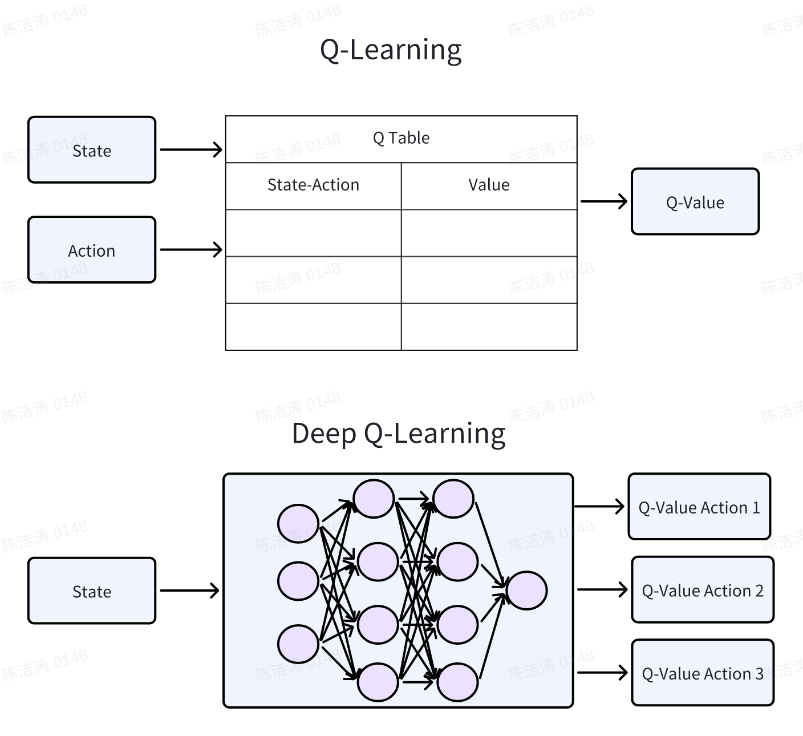
  - 输入维度：适应高维状态
  - 输出维度：等于离散动作空间的尺寸

- DQN 的逻辑：拟合 Q 值，间接生成策略
  - 神经网络的角色：用深度神经网络拟合  ，输入是状态 s（如游戏画面），输出是所有动作的 Q 值（如 “向左走的 Q 值、向右走的 Q 值”）。
    - 一次反向传播用到的数据：  $$s_t,a_t,r_{t+1},s_{t+1}$$
    - 反向传播的目标：最小化 “预测 Q 值” 与 “TD 目标 $$R + \gamma\max_{a^{'}}  Q(s^{'}, a^{'})
$$” 的误差，两者都是维度为动作个数的向量，选择合适的评价标准就可以算出误差。
          - 策略的生成：训练完成后，策略是 “选 Q 值最大的动作”（贪心策略），策略由 Q 值间接推导，而非网络直接输出动作概率。

- 训练机制
  - 前向传播: 输入状态 $s_t$ -> 网络 -> 得到所有动作的预测Q值
  - 选择动作: ε-greedy（训练时）或 greedy策略（测试时）
  - 执行动作: 获得奖励 $r_{t+1}$和新状态 $S_{t+1}$
  - 计算目标: $$y= R + \gamma\max_{a^{'}}  Q(s^{'}, a^{'}, \theta^{'})
$$
  - 反向传播: 更新网络参数 $\theta$, 最小化$y - Q(s, a, \theta)$

- 关键技术：
  DQN 通过经验回放（Experience Replay）和目标网络（Target Network）等技术解决了 Q-learning 中样本相关性和目标值不稳定的问题。
  - 经验回放
```python
# 传统Q-Learning问题：序列样本强相关
for (s, a, r, s') in sequential_experience:
    update(Q)  # 连续相关样本 → 训练不稳定

# DQN解决方案：经验回放
replay_buffer.append((s, a, r, s'))
batch = random.sample(replay_buffer, k)  # 随机采样 → 打破相关性
update(Q)  # 稳定训练
```
- 目标网络
```python
# 传统问题：目标值y与预测值Q来自同一网络
y = r + γ * max Q(s', a'; θ)  # θ快速变化 → 目标值波动大

# DQN解决方案：固定目标网络
y = r + γ * max Q(s', a'; θ^-)  # θ^-每N步同步一次θ → 目标稳定
```
- 总结：

| 特性 | Q-Learning | DQN | 
|--------|--------| --------|
|状态表示 |表格（离散状态） | 神经网络（连续/高维状态） |
|Q值存储 |Q表（S×A矩阵） |网络权重参数 |
|泛化能力 |无（查表） | 强（函数逼近）|
|适用场景 | 小型离散环境| 复杂高维环境（Atari游戏等） |
|训练样本 | 在线更新|经验回放池 |
|目标稳定性 |不稳定 | 目标网络稳定训练|

- Q-Learning：仅适用于低维离散状态 / 动作（如 10×10 网格世界）
- DQN：可处理高维状态（如图像、传感器数据），但动作仍需是离散的（如 Atari 游戏的上下左右按键）
- 因此，DQN标志着深度强化学习时代的开启，将深度学习的表示能力与强化学习的决策框架相结合，实现了从低维表格到高维函数逼近的跨越，为处理真实世界复杂问题奠定了基础。

# 7. 策略梯度算法(Policy Gradient, PG)

- 价值学习: 先学习价值函数（Q-learning、DQN等），再根据价值选择动作。
- 策略梯度: 直接学习一个参数化的策略函数 $$\pi_{\theta}(a | s)$$，输出动作的概率分布，通过梯度上升直接优化策略参数。

## 7.1 策略梯度的数学形式
- 目标函数
  - 目标是最大化期望回报
      $$J（\theta） = \mathbb{E}_{\tau \sim {\pi}_{\theta}}(R(\tau))$$
    - 其中 $\tau$ 是轨迹 $(s_0, a_0, r_0, s_1, a_1,....)$， $R(\tau)$是轨迹的总回报。
- 策略梯度定理
  - 梯度表达式为
    $$\varDelta_{\theta}J（\theta） = \mathbb{E}_{\tau \sim {\pi}_{\theta}}[\sum^T_{t=0} \varDelta_{\theta}\log \pi_{\theta}(a_t | s_t) * G_t]$$
      - 其中 $G_t = \sum^T_{k=t}\gamma^{k-t}r_k$是从时刻 $t$开始的累积回报。
## 7.2 强化学习梯度的反向传播
  - 涉及梯度，说明与神经网络有关，因为反向传播算法要用到梯度计算
  - 策略梯度和深度学习里面的梯度基本上是一样的，都是用来找更优解：以蒙特卡洛的思路，利用真实的样本采样来更新模型参数，计算回报对策略参数的梯度，通过梯度上升更新参数，让高回报动作出现概率增加。
# 7.3 思路相同但目标相反

| 维度 | 监督学习优化 | 策略梯度优化 | 
|--------|--------| --------|
|目标函数 |损失函数（可计算） | 期望回报（需估计）| 
|优化方向 |向已知最优解收敛 | 向未知更优解探索 | 
|学习信号 |密集、即时、准确 | 稀疏、延迟、嘈杂 | 
|数据关系 |拟合现有数据分布| 创造新的数据分布| 
|本质任务 |模式识别：发现数据中的模式 | 策略搜索：在动作空间中搜索最优路径| 

- 传统神经网络的反向传播
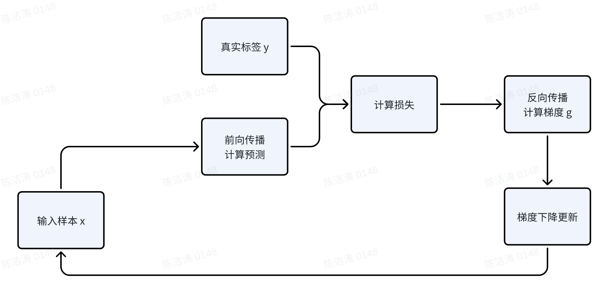
  - 监督学习：数据 -> 预测 -> 误差 -> 梯度下降
  - 监督学习梯度 = 误差 × 输入特征
  - 监督学习只看当前样本
  传统网络的梯度来源于误差，目标是减小误差，所以是梯度下降。
- 策略神经网络的反向传播
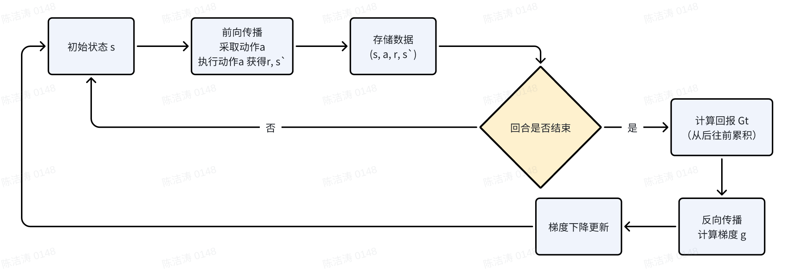
  - 强化学习：状态 -> 动作 -> 奖励 -> 回报 -> 梯度上升
  - 策略梯度 = 回报 × (增加当前动作概率的方向)
  - 强化学习必须考虑整个轨迹的长期回报
- 策略网络的梯度来源于回报，目标是增大回报，所以是梯度上升。其梯度公式可以看作是用回报 $G_t$对提高动作概率的梯度进行加权。
- 策略梯度不是简单地「把梯度下降变成梯度上升」，而是将优化范式从「误差最小化」转变为「期望最大化」，从而解决了传统方法无法处理的序列决策和环境交互问题。

## 7.4 REINFORCE算法和策略梯度定理
### 7.4.1 REINFORCE的核心突破
- 核心问题解决：如何直接优化策略
- 在REINFORCE之前，强化学习主要基于价值函数（如Q-learning）。REINFORCE开创了直接策略优化的新范式：
  - 传统方法：价值函数 → 策略（间接）
  - REINFORCE：直接优化策略参数
### 7.4.2 关键数学工具：对数导数技巧（Log-Derivative Trick）
```python
# 问题：无法直接对采样期望求导
∇_θ E_{τ∼p_θ}[R(τ)] = ?

# 解决方案：对数导数技巧
∇_θ E_{τ∼p_θ}[R(τ)] = E_{τ∼p_θ}[R(τ) · ∇_θ log p_θ(τ)]

# 然后分解轨迹概率
∇_θ log p_θ(τ) = Σ_t ∇_θ log π_θ(a_t|s_t)
```
### 7.4.3 策略梯度定理的完整推导
- 马尔可夫决策过程（MDP）定义
  - MDP五元组
    $$\mathcal{M} = (\mathcal{S}, \mathcal{A}, P, r, \gamma)$$
    - 各元素含义：
      - $\mathcal{S}$：状态空间（State Space）
      - $\mathcal{A}$：动作空间（Action Space）
      - $P(s'|s,a$：状态转移概率
      - $r(s,a)$：奖励函数
      - $\gamma \in [0,1]$：折扣因子
  - 参数化策略
    $$\pi_\theta(a|s) $$ 表示策略
    其中 $\theta$是策略参数，通常为神经网络权重。
  - 轨迹定义
    - 一条完整轨迹：
    $$\tau = (s_0, a_0, s_1, a_1, \dots, s_T, a_T)$$
    - 轨迹的概率分布：
    $$p_\theta(\tau) = \rho(s_0) \prod_{t=0}^{T} \pi_\theta(a_t|s_t) P(s_{t+1}|s_t, a_t)$$
      - 各部分的含义：
        - $\rho(s_0)$：初始状态分布
        - $\pi_\theta(a_t|s_t)$：策略选择的动作概率
        - $P(s_{t+1}|s_t, a_t)$：环境状态转移概率
  - 目标函数
    - 折扣回报：
      $$R(\tau) = \sum_{t=0}^{T} \gamma^t r(s_t, a_t)$$
    - 期望回报（目标函数）：
      $$J(\theta) = \mathbb{E}_{\tau \sim p_\theta}[R(\tau)] = \int p_\theta(\tau) R(\tau) \, d\tau$$
- 梯度计算的核心问题
  - 梯度表达式
    $$\nabla_\theta J(\theta) = \nabla_\theta \mathbb{E}_{\tau \sim p_\theta}[R(\tau)]$$
- 直接计算的困境
  $$\nabla_\theta J(\theta) = \nabla_\theta \int p_\theta(\tau) R(\tau) \, d\tau$$
  - 问题分析：
    - 梯度算子 $\nabla_\theta$ 同时作用于：
      - 分布 $p_\theta(\tau)$（与 $\theta$ 相关）
      - 回报 $R(\tau)$（通常与 $\theta$ 无关）
    - 无法直接对概率分布求导
- 对数导数技巧（Log-Derivative Trick）
  - 为什么要取对数？
    - 乘法变加法：更容易处理
    - 避免数值下溢：概率相乘会变得极小
    - 求导方便：对数和求导更简单
  - 技巧定义
    - 对于任意可微的概率密度函数 $p_\theta(x)$：
    - 核心公式：
    $$\nabla_\theta p_\theta(x) = p_\theta(x) \cdot \nabla_\theta \log p_\theta(x)$$
- 证明过程
$$\begin{aligned}
&\text{已知：} \log p_\theta(x) = \ln p_\theta(x) \\
&\text{两边对 } \theta \text{ 求导：} \\
&\nabla_\theta \log p_\theta(x) = \frac{1}{p_\theta(x)} \nabla_\theta p_\theta(x) \\
&\text{整理得：} \\
&\nabla_\theta p_\theta(x) = p_\theta(x) \cdot \nabla_\theta \log p_\theta(x)
\end{aligned}$$

- 策略梯度定理推导
  - 应用对数导数技巧
    - 步骤1：交换积分与梯度
      $$\nabla_\theta J(\theta) = \int \nabla_\theta p_\theta(\tau) R(\tau) \, d\tau$$
    - 步骤2：应用对数导数技巧
      $$= \int \left[ p_\theta(\tau) \cdot \nabla_\theta \log p_\theta(\tau) \right] R(\tau) \, d\tau$$
    - 步骤3：整理为期望形式
      $$= \int p_\theta(\tau) \left[ \nabla_\theta \log p_\theta(\tau) \cdot R(\tau) \right] \, d\tau$$
      $$= \mathbb{E}_{\tau \sim p_\theta} \left[ \nabla_\theta \log p_\theta(\tau) \cdot R(\tau) \right]$$
- 分解轨迹概率的对数
  - 展开 $\log p_\theta(\tau)$：（公式分解 按照log对数运算规则以及连乘转求和）
$$\begin{aligned}
\log p_\theta(\tau) &= \log \left[ \rho(s_0) \prod_{t=0}^{T} \pi_\theta(a_t|s_t) P(s_{t+1}|s_t, a_t) \right] \\
&= \log \rho(s_0) + \sum_{t=0}^{T} \log \pi_\theta(a_t|s_t) + \sum_{t=0}^{T} \log P(s_{t+1}|s_t, a_t)
\end{aligned}$$
  - 对 $\theta$ 求梯度：
    $$\nabla_\theta \log p_\theta(\tau) = \nabla_\theta \left[ \log \rho(s_0) + \sum_{t=0}^{T} \log \pi_\theta(a_t|s_t) + \sum_{t=0}^{T} \log P(s_{t+1}|s_t, a_t) \right]$$
  - 分析各项：
    - $\nabla_\theta \log \rho(s_0) = 0$（初始状态分布与环境有关, 与 $\theta$ 无关）
    - $\nabla_\theta \log P(s_{t+1}|s_t, a_t) = 0$（环境转移概率是环境特性, 与  $\theta$ 无关）
    - $\nabla_\theta \log \pi_\theta(a_t|s_t) \neq 0$（这是策略部分, 由参数 $\theta$控制）
  - 简化结果：
    $$\nabla_\theta \log p_\theta(\tau) = \sum_{t=0}^{T} \nabla_\theta \log \pi_\theta(a_t|s_t)$$
- 得到最终定理
  代入梯度表达式：
        $$\nabla_\theta J(\theta) = \nabla_\theta \mathbb{E}_{\tau \sim p_\theta}[R(\tau)]$$
        $$\nabla_\theta J(\theta) = \mathbb{E}_{\tau \sim p_\theta} \left[ \left( \sum_{t=0}^{T} \nabla_\theta \log \pi_\theta(a_t|s_t) \right) \cdot R(\tau) \right]$$
        最终形式：
        $$\boxed{\nabla_\theta J(\theta) = \mathbb{E}_{\tau \sim p_\theta} \left[ \sum_{t=0}^{T} \nabla_\theta \log \pi_\theta(a_t|s_t) \cdot R(\tau) \right]}$$

### 7.4.4 REINFORCE算法的理论价值矩阵

| 层面 | 传统价值方法 | REINFORCE（策略梯度） | 
|--------|--------| --------|
|优化对象 |价值函数  $Q(s, a)$ | 策略函数  $\pi(a|s)$）| 
|梯度来源 |时序差分误差（TD error） | 轨迹回报 $R(\tau)$ | 
|可导性 |需要对环境模型求导（model-based） | model-free：环境转移概率在梯度中消掉 | 
|探索方式 |ε-greedy等启发式方法| 策略的随机性自然提供探索| 
|适用动作空间 |离散、低维 | 连续、高维动作空间| 

### 7.4.5 REINFORCE算法的理论价值矩阵
- 阶段1：基础REINFORCE（Williams, 1992）
  - 梯度公式
    $$∇_θJ(θ)=\mathbb{E}_{τ \sim π_θ}[R(τ)∑^T_{t=0}∇_θlog_{π_θ}(a_t∣s_t)]$$
  - 问题：使用整个轨迹的回报更新每个动作，方差极大
- 阶段2：因果性改进（引入时间因果性）
  - 关键洞察：动作 $a_t$ 只影响 $t$ 时刻之后的回报
  - 改进公式：
    $$∇_θJ(θ)=\mathbb{E}_{τ \sim π_θ}[∑^T_{t=0} G_t ∇_θlog_{π_θ}(a_t∣s_t)]$$
      - 其中 $G_t = \sum_{k=t}^T γ^{k-t} r_k$
  - 效果：减少了不必要的噪声，但仍方差大
- 阶段3：基线技巧（Baseline Trick）
  - 核心思想：减去一个基准值，保留相对优势
  - 公式：
    $$∇_θJ(θ)=\mathbb{E}_{τ\sim π_θ}[∑^T_{t=0} (G_t - b(s_t)) ∇_θlog_{π_θ}(a_t∣s_t)]$$
  - 最优基线 $b(s_t) = \mathbb{E}[G_t]$（状态价值函数）
- Actor-Critic 方法
  - 特点：使用优势函数 $A(s,a)$ 精确评估动作好坏
    $$∇_θJ(θ)=E_{τ \sim  π_θ}[∑^{T}_{t=0} A(s_t,a_t)∇_θlogπ_θ(a_t∣s_t)]$$
    - 其中：$A(s_t, a_t) = Q(s_t, a_t) - V(s_t)$
- PPO 方法 (Proximal Policy Optimization)
  - 特点：限制策略更新幅度，保证稳定性
    $$∇_θJ^{CLIP}(θ)= \mathbb{E}_t[\min(r_t(θ)A_t, clip(r_t(θ),1−ϵ,1+ϵ)A_t)]$$
    - 其中：
      - $r_t(\theta) = \frac{\pi_\theta(a_t|s_t)}{\pi_{\theta_{\text{old}}}(a_t|s_t)}$（概率比）
      - $\epsilon$ 是裁剪参数（通常 0.1-0.3）
- SAC（Soft Actor-Critic）
  - SAC的核心特点：最大熵框架
    $$∇_θJ_{SAC}(θ)=\mathbb{E} s_{t\sim D}[∇_{θ}α \log π_θ(a_t∣s_t)−∇_θ(\log π_θ(a_t∣s_t)−Q_ϕ(s_t,a_t))⋅Z(s_t)\exp(Q_ϕ(s_t,a_t))]$$
    - 实际简化形式（更常用的表示）：
        $$∇_θJ_{SAC}(θ)=∇_θ \mathbb{E}s_{t\sim D}[\mathbb{E}_{a_t \sim π_θ}[α \log π_θ(a_t∣s_t)−Q_ϕ(s_t,a_t)]]$$
### 7.4.6 从REINFORCE到现代方法的演变
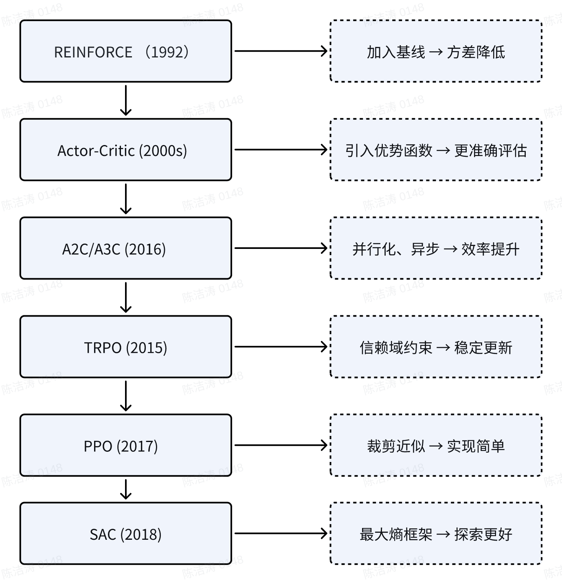

| 算法 | 核心思想 | 公式特点 |  主要改进| 
|--------|--------| --------| --------|
|REINFORCE |基础策略梯度 | $R(\tau) \sum \nabla\log\pi$|  首次实现直接策略优化| 
|因果改进 |时间因果性 | $\sum G_t \nabla\log\pi$|  减少不相关噪声| 
|基线技巧 |降低方差 | $\sum (G_t-b_t) \nabla\log\pi$|  方差减少，训练更稳定| 
|Actor-Critic |价值评估 | $\sum A(s_t,a_t) \nabla\log\pi$|  更精确的动作评估|
|PPO |约束更新 | $\min(r_t A_t, \text{clip}(r_t) A_t)$|  稳定的大步幅更新|


### 7.4.7 附录：符号说明表

| 符号 | 含义 | 备注 | 
|--------|--------| --------| 
|$\mathcal{S}$|状态空间| 所有可能状态的集合|
| $\mathcal{A}$ | 动作空间 | 所有可能动作的集合 |
| $\pi_\theta(a|s)$ | 参数化策略 | 神经网络表示的概率分布 |
| $P(s'|s,a)$ | 状态转移概率 | 环境动态特性 |
| $r(s,a)$ | 奖励函数 | 即时奖励信号 |
| $\gamma$ | 折扣因子 | 权衡近期与远期奖励 |
| $\tau$ | 轨迹 | 状态-动作序列 |
| $R(\tau)$ |轨迹回报  | 折扣奖励之和 |
| $J(\theta)$ | 目标函数 | 期望回报 |
| $\nabla_\theta$ | 梯度算子 | 对参数 $\theta$ 求导 |


# 8. 连续动作空间：策略梯度算法可以处理，价值函数算法不行
## 8.1 连续动作空间：为什么策略梯度算法更适合
### 8.1.1 问题的本质：连续 vs 离散
- 时间离散化的必然性
  关键认知：
  - 物理世界是连续的，但决策过程必须是离散的
  - 受限于计算速度（神经网络推理时间）和硬件响应时间（电机延迟）
  - 典型决策频率：10-100 Hz（每0.01-0.1秒决策一次）
- 动作参数离散化的弊端
  问题分析：
  1. 精度损失：电机实际精度可达0.001°，离散化为0.1°档位造成浪费
  2. 维度爆炸：若要达到0.001°精度，180°范围需要180,000个离散动作
  3. 平滑性问题：离散动作导致机械臂抖动，影响控制稳定性
### 8.1.2 连续动作空间的技术实现
- 为什么计算机能处理"连续"动作？
  - 本质：计算机使用浮点数近似连续空间
    - float32：7位有效数字，足够机器人控制
    - float64：16位有效数字，满足几乎所有需求
- 价值函数方法的局限
  价值函数方法（如DQN）的问题：
  1. 输出维度固定： $Q(s, a)$需要为每个动作 $a$输出值
  2. 连续动作空间无限：无法为无限个动作都计算 $Q$值
  3. 解决方法受限：
    - 离散化：精度损失
    - 函数拟合：需要额外优化过程
### 8.1.3 策略梯度算法的优势
- 高斯分布：连续动作的完美建模
```python
import torch
import torch.distributions as dist
import torch.nn as nn

class GaussianPolicy:
    def __init__(self, state_dim, action_dim):
        # 定义神经网络结构
        self.net = nn.Sequential(
            nn.Linear(state_dim, 128),  # 第一层：状态 -> 128维隐藏层
            nn.ReLU(),                  # ReLU激活函数，引入非线性
            nn.Linear(128, 64),         # 第二层：128维 -> 64维隐藏层
            nn.ReLU(),                  # 再次激活
            # 输出层：64维 -> action_dim * 2 维
            # 前action_dim个是均值μ，后action_dim个是标准差σ的对数
            nn.Linear(64, action_dim * 2))

    def forward(self, state):
        # 输出[mean1, mean2, ..., log_std1, log_std2, ...]
        # 1. 通过神经网络计算原始输出
        output = self.net(state)  # 形状: [batch_size, action_dim*2]
        # 2. 将输出分割为均值和标准差的对数
        mean = output[:, :self.action_dim]           # 前半部分是均值
        log_std = output[:, self.action_dim:]        # 后半部分是标准差的对数
        # 3. 将log_std转换为标准差（确保为正数）
        std = torch.exp(log_std)  # 使用指数函数保证标准差>0
        
        return mean, std
    
    def sample_action(self, state):
        # 1. 计算高斯分布的参数
        mean, std = self.forward(state)  # 获取均值和标准差
        # 2. 创建正态分布对象
        normal = dist.Normal(mean, std)
        # 3. 使用重参数化技巧采样动作
        action = normal.rsample()  # 可微分的采样
        # 4. 计算该动作的对数概率# 对每个动作维度分别计算log_prob，然后求和
        log_prob = normal.log_prob(action).sum(dim=-1)
        
        return action, log_prob
```
- 探索与利用的平衡
  1. 物理直觉：真实世界的动作噪声常服从高斯分布
  2. 数学性质：良好的可微性，便于反向传播
  3. 实现简单：只需两个参数描述整个分布
  4. 渐进收敛：标准差可随训练减小，自然实现"先探索后利用"

| 参数 | 物理意义 | 在强化学习中的作用 | 
|--------|--------| --------| 
| 均值 μ | 分布中心，最可能采取的动作 | 利用：基于当前知识的最优动作 | 
| 标准差 σ | 分布的宽度，探索程度 | 探索：尝试均值附近的其他动作 | 


# 9. 强化学习三大方法：Actor-Critic架构的提出
- 强化学习的算法设计围绕 “如何选择最优动作” 展开，根据 “是否依赖价值函数”和 “是否直接建模策略” ，可分为三大主流方法：纯价值函数、纯策略梯度、Actor-Critic，前两个一一对应，最后一个是前两者的结合方法。
## 9.1 纯价值函数方法
- 代表算法：Q-Learning、SARSA、DQN
- 核心思想：学习价值函数 $V(s)$或 $Q(s, a)$ ，然后通过贪心（或ε-贪心）策略选动作
      $$a = \arg \max_a Q(s, a)$$
  - 思想：TD （Temporal Difference）
  - 优势：逻辑直观，价值函数的收敛性有理论保障；无需建模策略概率分布，计算成本较低。
  - 劣势：仅适用于离散动作空间；易出现 “价值过估计” 问题。
  - 适用场景：离散动作、低维 / 高维状态的任务（如 Atari 游戏、网格世界导航）。
## 9.2 纯策略梯度方法
- 代表算法：REINFORCE
- 核心思想：建模策略函数 $\pi_\theta(a|s) $直接优化策略参数 $\theta$ ，让期望回报 $J(\theta)$最大。
  $$\nabla_\theta J(\theta) = \mathbb{E}_{\pi_{\theta}} [ \left(  \nabla_\theta \log \pi_\theta(a|s) \right) R]$$
  - 思想：MC （Monte Carlo）
  - 优势：可直接处理连续动作空间；策略更新更直接，不易受价值过估计影响。
  - 劣势：策略梯度方差高（观测值  累计后方差大）；收敛速度较慢，易陷入局部最优。
  - 适用场景：连续动作、高动态性的任务（如机器人控制、自动驾驶、机械臂操作）。
## 9.3 Actor-Critic方法
- 代表算法：A2C、A3C、SAC、DDPG、PPO
- Actor-Critic将“策略梯度”和“价值函数”都考虑，并分成相互影响的两个串行板块：
  - Actor（策略模块）：建模可维的策略  $\pi_\theta(a|s) $，负责 “选动作”；
  - Critic（价值模块）：建模评价标准 $V_{\phi}(s)$或 $Q_{\phi}(s, a)$ 或使用优势函数 $A(s, a)$ ，负责 “评估 Actor 选的动作好不好”
    - 使用参数 $\phi$就是为了和Actor的参数 $\theta$做区分
  - 通过 Critic 的评估结果指导 Actor 的策略更新，新Actor又会给Critic提供新样本，实现 “边评估、边改进”。


| 问题 | Actor-Critic 的解决方式 | 
|--------|--------|
| PG 方差大 | Critic 使用降低方差的方法（如优势函数） | 
| Q-learning 不可微 | Actor 显式表示可微分策略，可用于连续动作。 | 
| 学习效率低 | Critic 提供更快的学习信号（TD 误差），比整段回报 R 快得多。 | 
| 收敛不稳定 | Critic 让梯度方向更有指导性（估计更准确）。 | 


## 9.4 Actor-Critic 思路
- 关键洞察：将决策者（Actor） 和评价者（Critic） 分开，各自专注于自己的任务：
  - Actor：专注于如何选择动作（策略优化）
  - Critic：专注于如何评价动作（价值评估）
- 核心思想：分而治之，专业分工
  1. 分离关注点：将"选择动作"和"评估动作"分开
  2. 专业化分工：每个网络专注于自己的任务
  3. 互相促进：Actor为Critic提供数据，Critic为Actor提供指导
### 9.4.1 优势函数的演进
1. 为什么需要替代整个时间段的回报？
  - 问题分析：蒙特卡洛回报的缺陷
```python
# REINFORCE使用的完整回报
G_t = r_t + γr_{t+1} + γ²r_{t+2} + ... + γ^{T-t}r_T

# 问题：
1. 高方差：需要等到轨迹结束才能计算# 
2. 延迟更新：无法实现单步学习# 
3. 样本效率低：需要完整轨迹
```

  - 优势函数的本质任务
    - 任务：在"立即反馈"和"长期效果"间找到平衡
    - 目标：用部分信息准确估计动作的额外价值
2. 优势函数的三种基础形式
  - 完整对比矩阵

| 形式 | 公式 | 需要学习 | 更新时机 | 偏差 | 方差 | 适用场景 | 
|--------|--------|--------|--------|--------|--------|--------|
| Q-V形式 | $A = Q(s, a) - V(s)$ | Q网 + V网 | 随时| 低 | 中 |  理论研究|
| TD残差形式 | $A = r + \gamma V(s^{'}) - V(s)$ | 仅V网 | 单步后 | 中 | 中 | 实时控制 |
| 蒙特卡洛形式 | $A = G_t - V(s)$ | 仅V网 | 轨迹结束 | 低 | 高 | 稀疏奖励 | 


3. 核心替代方法: 从基础到高级
  - 路线图
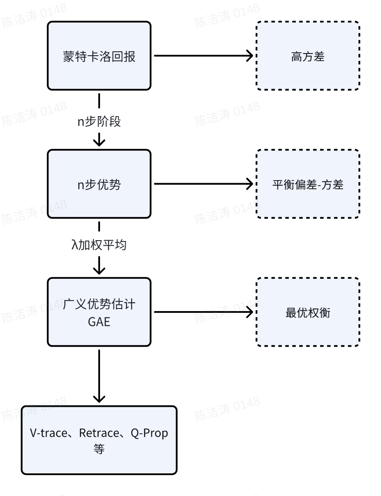

    - n步优势函数
$$A^{(n)}(s_t,a_t)=∑^{n−1}_{k=0} γ^k r_{t+k}+γ^n V(s_{t+n})−V(s_t)$$

```python
def n_step_advantage(trajectory, t, n, gamma):
    """n步优势：平衡短期和长期"""# 计算n步回报
    n_step_return = 0
    for k in range(min(n, len(trajectory.rewards)-t)):
        n_step_return += (gamma**k) * trajectory.rewards[t+k]
        
        # 加上n步后的价值估计
        if t + n < len(trajectory.states):
            n_step_return += (gamma**n) * critic(trajectory.states[t+n])
            
    return n_step_return - critic(trajectory.states[t])
```
  - n 的选择策略：
    - n=1：TD残差，高偏差低方差（密集奖励）
    - n=5：常用折中（大多数任务）
    - n=10+：接近蒙特卡洛，低偏差高方差（稀疏奖励）

### 9.4.2 广义优势估计（GAE）：黄金标准
- 核心思想: 从单步到多步的平滑过渡
- GAE的核心公式
  $$A^{GAE(\gamma, \lambda)} = \sum ^{\infty}_{l=0} (\gamma \lambda)^{l} \delta _{t+l}$$
  - 其中 $\delta _{t} = r_t + \gamma V(s_{t+1}) - V(s_t)$
- 关键转换: 用TD残差替代完整回报
- 核心突破:
  - 将不确定的 $G_t$替换为可预测的 $V(S_t)$ + TD残差
  - 利用Critic的可训练性来稳定估计
  - 通过 $\lambda$ 实现平滑的偏差-方差权衡

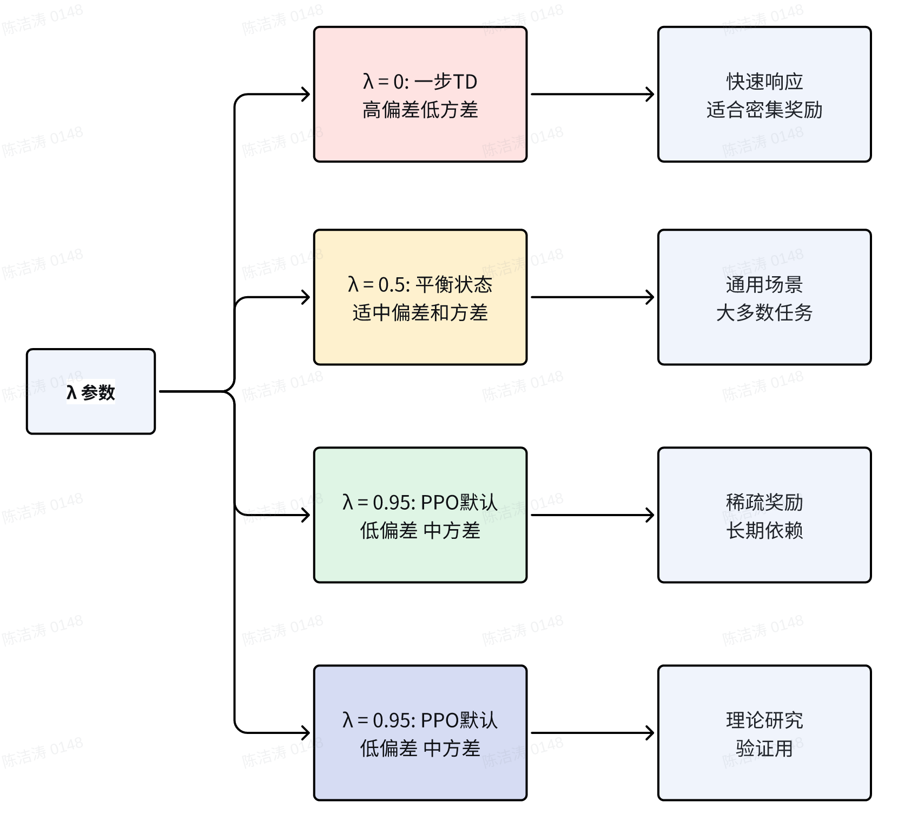

- $\lambda$ 的数学效应
  - GAE的递归形式
    $$A_t = \delta_t + \gamma \lambda A_{t+1}$$
  - 展开后权重分布：

```python
# λ控制未来TD残差的衰减速度
weights = {0: 1.0,           # 当前步权重总是1
           1: γλ,           # 下一步权重
           2: (γλ)²,        # 下两步权重
           3: (γλ)³,        # 下三步权重
           # ... 指数衰减
           }
```
- 具体数值示例 ( $\gamma = 0.99$)

| λ值 | 10步后权重 | 物理意义 |
|--------|--------|--------|
| 0.0 | 0% | 只看当前步 |
| 0.5 | (0.99×0.5)^10 ≈ 0.6% | 快速衰减 |
| 0.95 | (0.99×0.95)^10 ≈ 60% | 缓慢衰减 |
| 1.0 | (0.99)^10 ≈ 90% | 几乎不衰减 |

- 常见问题与解决

| 问题现象 | 可能原因 | 解决方案 |
|--------|--------|--------|
| 训练波动大 | λ太小（如0.8）→ 方差低但噪声敏感 | 增大λ到0.9-0.95 |
| 收敛缓慢 | λ太大（如0.99）→ 方差高更新慢 | 减小λ到0.9-0.95 |
| 早期探索差 | Critic不准导致GAE不准确 | 先训练Critic，后引入GAE |
| 优势值过小 | 奖励尺度问题 | 标准化优势，缩放奖励 |


# 10. Actor-Critic算法
## 10.1 TRPO：Trust Region Policy Optimization
- TRPO指出在 REINFORCE 或普通 Policy Gradient 中，我们直接按梯度方向更新参数：
$$\theta = \theta + \alpha \varDelta_{\theta}J(\theta)$$
- 但是
  - 步长 $\alpha$很难调，太大容易让策略突然偏离原策略，性能骤降；
  - 目标函数的一阶梯度只保证在“无穷小步”情况下改进；
  - 策略变化太快会导致采样分布变化过大，旧数据估计的梯度不再准确（off-policy 失效）。
    （即小步改进能保证性能提升，但无法知道步子多大会出问题。）
- 这意味着：梯度上升没有安全步幅的保证。所以TRPO希望能找到一个有安全步幅的方法，通过信任域概念确保：
  - 策略性能单调改进（或至少不降低）
  - 更新步长自动适应
  - 有效利用样本数据
- 推导过程
  - 策略性能度量为
  $$η(π) = \mathbb{E}_{s_0,a_0,…}[∑^∞_{t=0}γ^tr(s_t)], where s_0 ∼ \rho_0(s_0), a_t  \sim  \pi(a_t|s_t)$$
    - 其中
      - $\gamma$ 为折扣因子
      - $r(s_t)$ 为状态 $s_t$下的即时奖励
  - 已知优势函数, 表示在状态 $s$采取动作 $a$相对于平均水平的优势
      $$A_π(s,a)=Q_π(s,a)−V_π(s)$$
  - 状态访问分布, 折扣加权状态访问频率
  $$ρ_π(s)=∑^{∞}_{t=0} γ^tP(s_t=s∣π) = P(s_0 = s) + \gamma P(s_1=s)+ \gamma^2 P(s_2=s) + ....$$
    - 它表示在折扣权重下，一个策略访问每个状态的频率
    - $P$ 不是我们传统的简单的概率，而是转移概率分布，所以这里的加法不是求和，而是在每一个 $s$维度的相加
  - 策略性能的恒等变换
    - 任意两个策略 $\pi$和 $\tilde{\pi}$的性能满足：
  $$η(\tilde{\pi})=η(\pi)+∑_s ρ_{\tilde{\pi}}(s)∑_a\tilde{\pi}(a∣s)A_π(s,a)$$
    - 物理意义：新策略的性能 = 旧策略性能 + 在旧策略优势函数下的期望提升
  - 对旧策略加上优势函数，来代表新策略

  $$η(\tilde{\pi}) = η(π) + \mathbb{E}_{s_0,a_0,… ∼\tilde{\pi} }[∑^∞_{t=0}γ^t A_{\pi}(s_t, a_t)]$$
  $$= η(π) + ∑_{s} \rho_{\tilde{\pi}}(s) ∑_{a} \tilde{\pi}(a|s)A_{\pi}(s_t, a_t)$$ 
    (将时间步 $t$消去， 化为 $s$和 $a$)

    - 这个式子在大部分情况是递增的
    - 因为新策略比旧策略更偏向那些 $A_{\pi}(s_t, a_t) > 0$的动作，则权重落在"好动作"上多一些， 那么加权平均自然也会 > 0.
    - 所以加号后应该是一个非负的分量，即 $∑_{a} \tilde{\pi}(a|s)A_{\pi}(s_t, a_t)$
    - 但是因为估计和近似的误差，难免避免存在 $∑_{a} \tilde{\pi}(a|s)A_{\pi}(s_t, a_t) < 0$ 的情况。
    - 出现一个方案：当更新步长很小时，选择忽略状态分布的变化，用旧策略分布代替：
          $$ρ_{\tilde{\pi}}(s) \approx ρ_{\pi}(s)$$
    - 引入代理目标函数（Surrogate Objective）, 同时用旧策略分布代替, 可以构造一个代理（surrogate）函数 $L$：
      $$L_{\pi}(\tilde{\pi})=η(π)+∑_s ρ_π(s)∑_a \tilde{\pi} (a∣s) A_π(s,a)$$
      - 这个函数有一个好处，就是它消除了耦合的影响
      - 强化学习的耦合（Coupling）
        - 原式中$L_{\pi}(\tilde{\pi})=η(π)+∑_s ρ_{\tilde{\pi}}(s)∑_a \tilde{\pi} (a∣s) A_π(s,a)$的 $ρ_{\tilde{\pi}}(s)$和 $\tilde{\pi} (a∣s)$都取决于 $\tilde{\pi} $。
        - 例如 $y = x^2 + 2x$, $x$是一个变量，而 $ρ_{\tilde{\pi}}(s)$和 $\tilde{\pi} (a∣s)$是一个概率分布
        - 当修改 $x$值，$x$的二次项和一次项同步变化，而$ρ_{\tilde{\pi}}(s)$和 $\tilde{\pi} (a∣s)$，任意修改一个分量，另外一个都会变化，在数学上变得很难处理
        - 于是定义
            $$L_{\pi}(\tilde{\pi})=η(π)+∑_s ρ_π(s)∑_a \tilde{\pi} (a∣s) A_π(s,a)$$
          - 这样一来
            - $ρ_{\pi}(s)$是固定的（不依赖 $\tilde{\pi} $）
            - 优化变量只剩下 $\tilde{\pi} (a∣s)$
            - 可方便用样本估计、求梯度
            - 仍能在小步长范围内保证与真实 $η$一阶等价 （当 $\tilde{\pi}$与 $\pi$接近时, $L_{\pi}(\tilde{\pi})$$ 是 $$\eta(\tilde{\pi})$的一阶近似) 可微的 $L_{\pi}(\tilde{\pi})$ 在当前点 $\theta_0$的一阶展开与真实 $\eta(\tilde{\pi})$相等
                $$L_{\pi_{\theta_0}}(\pi_{\theta_0}) =η(\pi_{\theta_0}), L_{\pi_{\theta}}(\pi_{\theta}) |_{\theta=\theta_0} = \varDelta_{\theta}η(\pi_{\theta})|_{\theta=\theta_0}$$
          - 混合策略更新
                 $$\pi_{new}(a|s) = (1-\alpha)\pi_{old}(a|s) + \alpha\pi'(a|s)$$
            - 存在下界
                  $$η(π_{new})≥L_{π_{old}}(π_{new})−\frac{2ϵγ}{(1−γ)^2} α^2$$
                  - 其中  $$\epsilon = \max_s |\mathbb{E}_{a\sim\pi'} A_{\pi_{old}}(s, a)|$$
            - 因而给出了单调改进的充分条件
          - 推广到任意策略
            - 将混合策略推广到任意策略对，用总变差距离（Total Variation Divergence）度量策略差异：
                $$D^{\max}_{TV}(\pi, \tilde{\pi}) = \max_s D_{TV}(\pi || \tilde{\pi})$$
            - 得到新的下界
                $$η(\tilde{\pi}) ≥ L_{π}(\tilde{\pi})−\frac{4ϵγ}{(1−γ)^2} (D^{\max}_{TV}(\pi, \tilde{\pi}))^2$$ 
            - 再用 $LD^2_{TV} \leqslant D_{TV} $ 得到最终近似形式
                $$η(\tilde{\pi}) ≥ L_{π}(\tilde{\pi})− C * D^{\max}_{KL}(\pi || \tilde{\pi})$$  其中 $$C =\frac{4ϵγ}{(1−γ)^2} $$
            - 这就是 TRPO 的理论核心不等式,  优化 $ L_{π}(\tilde{\pi})$同时限制 KL 散度，可以保证策略单调改进。(拓展成任意两个随机策略（而非上面 $\alpha$的形式），最后找到了一个包含KL散度的下界)
          - 换元后
                $$η(\theta) ≥ L_{π_{old}}(\theta)− C * D^{\max}_{KL}(\theta_{old}, \theta)$$ 
            - 其中
              - $L_{π_{old}}(\theta)$是在旧策略分布下定义的 surrogate 目标，
              -  $D^{\max}_{KL}$限制新旧策略间的最大 KL 散度，
              - $C$是理论上推导出的常数。
            - 在保证上面不等式成立的情况下，只要让右边的值尽量大就好了
          - TRPO不是纯策略梯度算法了！因为它根本没有以梯度的损失函数为目标。
          - 惩罚项优化变成: 
$$\max_{\theta} L_{\theta_{old}}(\theta) - C * D^{\max}_{KL}(\theta_{old}, \theta)$$

- TRPO 优化问题
  - 理论优化目标
    $$maximize_θ ~~L_{θ_{old}}(θ)$$
    $$subject~~to~~ \bar{D}_{KL}(θ_{old},θ) ≤ δ$$
    - 其中：
      - $\theta$为策略参数
      - $\bar{D}_{KL}$为平均KL散度: 
      $$\mathbb{E}_{s\sim\rho_{\theta_{old}}}[D_{KL}(\pi_{\theta_{old}}(\cdot|s) | \pi_\theta(\cdot|s))]$$
    - 但要找到最大的（max）的KL散度就得一个个去算，计算开销非常大，于是TRPO用期望代替了最大值
      $$D^{\rho_{\theta_{old}}}_{KL}(\pi_{old}, \pi) := \mathbb{E}_{s\sim\rho_{\theta_{old}}}[D_{KL}(\pi_{\theta_{old}}(\cdot|s) | \pi_\theta(\cdot|s))]$$
    - 这就是所谓的"average KL"或"expected KL".
  - 于是约束变成
    $$D^{\rho_{\theta_{old}}}_{KL}(\pi_{old}, \pi) ≤ δ$$
  - 那么就是不要求每个状态都满足 KL ≤ δ, 而是只要求在旧策略访问的状态分布下，平均KL足够小，在要求一定探索性的强化学习背景下是可以接受的。
  - 注意上面的期望不是对所有状态均匀平均，而是用旧策略的访问分布加权：
$$s ∼ \rho_{\theta_{old}}(s)$$
  - 旧策略 $η_{old}$ 是我们手里已经采样过的策略；我们有这些状态的样本，能准确估计期望。
  - 对极少访问(或没访问过)的状态，即使 KL 大一点也无所谓，因为它们几乎不会影响到 $η (\pi)$ 的实际值。

- 重要性采样形式
  - 使用分布变换技巧，计算新策略下的期望
    $$\mathbb{E}_{a \sim \pi(\cdot|s)}[f(s,a)]$$
  - 但手里只有旧策略的数据  $a \sim \pi_{old}(\cdot|s)$
  - 因此采用用重要性采样恒等式
    $$\mathbb{E}_{a \sim \pi(\cdot|s)}[f(s,a)] = \mathbb{E}_{a \sim \pi_{old}(\cdot|s)} [\frac{\pi(a|s)}{\pi_{old}(a|s)} f(s, a)]$$
    - 其中 $r(s, a) = \frac{\pi(a|s)}{\pi_{old}(a|s)}$ 称为重要性采样权重
    - 而  $L_{\pi_{old}}(\pi) = \mathbb{E}_{a \sim \pi_{old}(\cdot|s)} [\frac{\pi(a|s)}{\pi_{old}(a|s)} A_{\pi_{old}}(s, a)]$ 称为TRPO实际优化时使用的采样形式目标函数。

## 10.1 “二阶段”：强化学习训练的范式
  - 几乎所有强化学习算法（包括 PPO、DDPG、SAC、TRPO……） 都有一个两阶段循环（two-phase loop）:
    - 采样阶段（data collection） 　→ 用当前策略与环境交互，得到一批数据 (s, a, r, s′)。
    - 优化阶段（policy/value update） 　→ 用刚采到的数据更新网络参数。
    - 这两个阶段几乎是所有 RL 算法共有的结构—— 无论是 on-policy 还是 off-policy，都遵循：
      - 「采样 → 优化 → 再采样」的交替过程。
        - On-policy —— “在” 策略上学习
          - 用于执行的动作策略与用于学习的策略相同
        - Off-policy —— “离” 策略而学
          - 当用于执行动作的策略与用于更新的策略不同


| 类型 | 定义 | 举例 |
|--------|--------|--------|
| On-policy（在） | 用当前策略 πθ 产生的数据来更新自己。更新后旧数据丢弃。 | PPO、A2C、TRPO、SARSA |
| Off-policy（离） | 可以用旧策略或别的策略产生的数据来更新当前策略。 | DQN、DDPG、TD3、SAC |


## 10.2 PPO（Proximal Policy Optimization）
    https://arxiv.org/pdf/1707.06347
- 从 TRPO 到 PPO：动机与思想简化
- 在 TRPO 中，策略更新需要满足 KL 散度约束：
       $$\max_{\theta} L_{\theta_{old}}(\theta)$$
       $$subject~~to~~ \mathbb{E}_t [D_{KL}(\pi_{\theta_{old}}(\cdot|s) | \pi_\theta(\cdot|s))] < δ$$
  - 其核心思想是控制新旧策略之间的信任域，避免策略更新过大导致性能崩溃。然而，TRPO 需要二阶优化（如共轭梯度法）去求解约束问题，这使得算法复杂，不利于部署在 GPU 集群上工业训练.
- 为求解上面带约束的最值问题，需要使用数学技巧
  - 对KL散度做二阶（Hessian）近似
  - 然后用共轭梯度（Conjugate Gradient, CG）求解该近似下的约束优化问题
  $${maximize}_{\theta} [\nabla_{\theta} L_{\theta_{old}}(\theta)|_{\theta = \theta_{old}} * (\theta - \theta_{old})]$$
  $$subject~~to~~ \frac{1}{2}(\theta_{old} - \theta)^{T} A(\theta_{old})(\theta_{old} - \theta) < δ$$
  $$where A(\theta_{old})_{ij} = \frac{\delta}{\delta \theta_{i}} \frac{\delta}{\delta \theta_{j}} \mathbb{E}_{s\sim\rho_{\pi}}[D_{KL}(\pi(\cdot|s, \theta_{old})||\pi(\cdot|s, \theta))]|_{\theta = \theta_{old}}$$
- 避免处理二阶问题
  - 裁剪形式（Clipped Surrogate Objective)
    - 设重要性采样的策略分布比值为 $r_t(\theta)$

  $$r_t(\theta) = \frac{\pi_{\theta}(a_t | s_t)}{\pi_{\theta_{old}}(a_t | s_t)}$$
    - 这个形式下的损失函数为:
      $$L^{CLIP}(\theta) = \mathbb{E}_t[\min(r_t(\theta)\hat{A_t}, clip(r_t(\theta), 1 - \epsilon), 1 + \epsilon)\hat(A_t)]$$
      - 其中 $\epsilon$是一个超参数（一般取0.1-0.3）
      - 策略分布比值为 $r_t(\theta)$能反应新旧分布的相似性程度
    - 直接放弃了约束条件，用一个裁剪方法来保证 $r_t(\theta)$的绝对值不会过大， 若 $r_t$超出区间 $[1 - \epsilon, 1 + \epsilon]$，则对目标函数按着找优势函数 $$A$$值分类进行截断，其中裁剪方式如下图
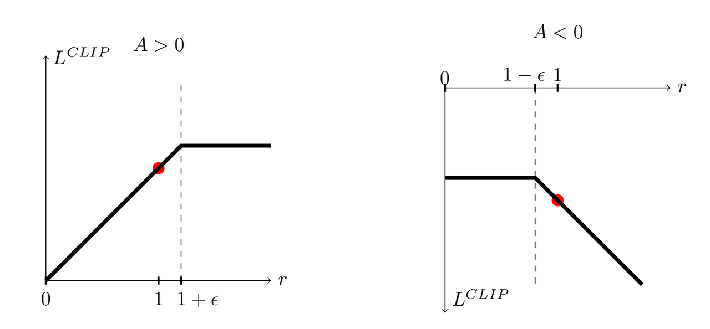
      - 当优势函数为正，代表当前它在向好的地方优化，假如分布差距太大（超过$1 + \epsilon$），我们让它速度慢一点；
      - 当优势函数为负，代表当前它在向差的地方优化，假如分布差距太大（超过 $1 - \epsilon$），我们也让它速度慢一点。
  - 虽然这个方法看上去太暴力了，但是实测发现，它的效果非常好，是PPO的最常用形式。
  - PPO 在目标函数内部隐式地限制了 KL 散度变化的范围，不用再显式地去算 Hessian 矩阵或求解约束。
  - 于是优化就退化为一个普通的“一阶梯度上升问题”：
      $$\max_{\theta}L^{CLIP}(\theta)$$
  - 直接用 SGD 或 Adam 等深度学习方法即可优化参数
          
- 自适应KL散度惩罚项
  - 设散度KL的期望值为 $$d = \hat{\mathbb{E}_t} [KL[\pi_{old}(\cdot|s_t), \pi_0(\cdot | s_t)]]$$
  $$L^{KLPEN}(\theta) = \mathbb{E}_t[r_t(\theta)\hat{A_t} - \beta * D_{KL} (\pi_{\theta(old)}(\cdot|s_t)|| \pi_{\theta}(\cdot|s_t))]$$
    - 其中  $\beta$是惩罚系数，并会根据目标 KL 值 $d_{targ}$动态调整：
    $$if D_{KL} < \frac{d_{target}}{1.5} \implies \beta <- \frac{\beta}{2},$$
    $$if D_{KL} > 1.5 * d_{target} \implies \beta <- 2 * \beta$$
  - PPO的惩罚项形式用一个启发式规则自适应调  $\beta$以把平均 KL 推到目标附近( $d_{target}$)，而不是通过 KKT/对偶最优把它精确等价为一个硬约束问题，这样就避免了求复杂方程.
  - TRPO关于带惩罚项的无约束问题和带约束问题（拉格朗日/KKT）等价转换的。
  - 而PPO损失函数看起来像TRPO的减法形式。但KL散度前面的参数 $\beta$和TRPO的参数 $C$（一个用数学公式严谨计算出的式子）是不一样的。

- Actor与Critic网络共享参数时的形式
  - 这个形式是有时代背景的，在强化学习早期，硬件很难面对大参数量的形式，常让两个网络共享参数以降低参数量。
  - 但是这样的操作有一个问题：其中一个网络被优化时，会干扰另一个。
  - 假设我们只优化策略的损失（例如 PPO 的  $L^{KLPEN}(\theta)$），那么反向传播时，梯度会更新共享的底层参数，使底层特征偏向于更适合策略输出。
  - 反之亦然，如果只最小化价值函数的误差  $(V_{\theta}(s) - V^{target})^2$，底层特征又会偏向拟合价值任务，导致策略分支学到的特征不再对动作分布有区分性。
  - 这就会让训练过程出现：
    - 不稳定（两个头互相干扰）
    - 收敛缓慢（梯度方向不一致）
  - 解决方案：联合优化（combined loss）
    - 必须使用一个联合损失函数，通常写成：
          $$L(\theta) = L_{policy}(\theta) + c_1 L_{value}(\theta) - c_2 S[\pi_{\theta}](s)$$
      - 其中
        - $$L_{policy}$$: 策略的代理损失(surrogate loss)函数（例如 PPO 的裁剪形式）
        - $L_{value}$: 价值函数误差（如价值函数 $$V$$的 MSE）
        - $S[\pi_{\theta}]$: 熵项，用于增加探索；
        - $c_1, c_2$: 系统控制平衡
      - 作用
        - 梯度统一来源：共享参数的梯度更新同时考虑两个任务
        - 特征共享稳定化：底层网络学到的特征既能支持策略区分，又能预测状态价值
      $$L^{PPO}(\theta) = \mathbb{E}_t[L^{CLIP}_{t}(\theta) - c_1 L^{VF}_{t}(\theta) + c_2 S[\pi_{\theta}](s)]$$
        - 其中  $$L^{CLIP}_t(\theta) = \min(r_t(\theta)\hat{A_t}, clip(r_t(\theta), 1 - \epsilon), 1 + \epsilon)\hat(A_t)$$

- PPO 不是利用整个迹的数据训练，而其最小训练单元是Horizon
  - PPO 的损失函数确实写成期望形式，比如：
    $$L^{CLIP}(\theta) = \mathbb{E}_t[\min(r_t(\theta)\hat{A_t}, clip(r_t(\theta), 1 - \epsilon), 1 + \epsilon)\hat(A_t)]$$
  - 看起来好像要对整个 episode 的所有时间步求期望。但这里的「期望」，不是说算法执行时要真的等完整轨迹、计算整个迹中数据的期望。
  - 在实现时，这个期望是用采样的 mini-batch 平均值来近似的。
    $$\mathbb{E}_t[\cdot] \approx \frac{1}{N} \sum_{t \in mini-batch} (\cdot)$$ (利用GAE实现)
  - 此时，PPO在训练时，GAE没用上整条迹，而是采样T时间步（叫做Horizon），这个T就是输入GAE的长度。

### PPO是On-Policy学习
- PPO 收集数据 → 使用这些数据更新策略几次 → 丢弃旧数据 → 重新采样新轨迹
1️⃣ 采样阶段（第一阶段）：
- 由当前策略  $$\pi_{\theta_{old}}$$采样 T 步。
- 所有数据都与 $$\pi_{\theta_{old}}$$ 直接对应。
2️⃣ 优化阶段 （第二阶段）：
- 在这批数据上做 K 轮 mini-batch 更新。
- 这时使用的比率  $$r_t = \pi_{\theta}(a_t | s_t)/ (\pi_{\theta_{old}} a_t | s_t)$$。
- 因为数据来自 $\pi_{\theta_{old}}$ ，更新时是严格基于自己刚刚的表现进行学习。
3️⃣ 更新后丢弃旧数据：
- 当 $\theta$ 更新完后（ $\theta_{old}$$ < $$\theta$ ），旧数据对应的分布已不再一致，
- 所以下一轮必须重新采样新轨迹。
这正是 on-policy 的关键约束。
  - PPO 每一轮的优化都只依赖于当前策略 $\pi_{\theta_{old}}$ 采集的数据，
  - 旧数据不会被放进经验池反复使用（那是 off-policy 的做法，如 DDPG、SAC）。
        
## 10.3 DDPG（Deep Deterministic Policy Gradient）
- DDPG 是 神经网络版的 DPG（Deterministic Policy Gradient），是 连续版的DQN
- DDPG 是首个将深度神经网络与确定性策略结合的算法（适用于连续动作空间）
  - 核心特征
      - 确定性策略：输出确定性的动作值，而非动作概率分布
      - 连续动作空间：专门设计用于连续控制问题（如机器人控制、自动驾驶）
      - Actor-Critic架构：结合策略网络（Actor）和价值网络（Critic）
      - 离线学习：使用经验回放机制，支持从历史经验中学习
  - 关键技术组件
    - 双网络架构（Actor-Critic）
      - Actor网络（策略网络）：输入状态，输出确定性动作
        - 参数： $\mu(s|\theta^{\mu})$
        - 目标：最大化价值函数
      - Critic网络（价值网络）：评估状态-动作对的价值
        - 参数： $Q(s, a | \theta^{Q})$
        - 目标：准确估计 $Q$值
    - 目标网络（Target Networks）
        - 独立的Actor和Critic目标网络
        - 参数更新采用软更新（缓慢跟踪）：
        $$\theta^{'} <- ~~~\tau \theta + (1 - \tau) \theta^{'}$$ (通常 $\tau =0.001$）
        - 减少价值估计的波动，提高训练稳定性
    - 经验回放（Experience Replay）
        - 存储转移元组 $(s,a,r,s^{'},done)$
        - 随机采样打破数据相关性
        - 提高数据效率和训练稳定性
    - 探索策略
        - 在确定性动作上添加噪声：
        - $a_t = \mu (s_t | \theta^{\mu}) + N$
        - 常用噪声类型：OU过程噪声、高斯噪声
  - 推导过程
    - Actor-Critic主网络：
      - Actor 输出动作  $a = \mu(s|\theta^{\mu})$
      - Critic 评估动作   $Q(s, a | \theta^{Q})$

- $\mu$是一个神经网络，直接预测 $a$的最佳值。换字母$\mu$以和 $\pi$（预测动作的概率分布）区分.
- 但 $\pi$不一定不是输出确定值的，也就是说也可以用 $\pi$表示确定值输出。
- DDPG用的 Ornstein-Uhlenbeck 噪声做探索，确保预测确定值具备探索性
- $\theta $有上标 $Q$
  - 数学上，尤其是强化学习领域，上标表示标记属于某个特定网络，下标通常用来标记索引、时间步或样本
  - Actor 和 Critic 的参数是分开的，两套参数来自完全独立的神经网络，不共享.
    - 因为是确定Action输出，在一次更新中，直接使用Critic网络的输出值处理后当作预测真值标签 $y_i$
  $$y_i = r_i + \gamma Q^{'}(s_{i+1}, \mu^{'}(s_{i+1} | \theta^{\mu})| \theta^{Q{'}})$$
      - 而之前非确定网络的输出还需要使用贪心策略挑选:
        $$y_i = r_t + \max_{a^{'} \in A} Q(s_{t+1}, a^{'})$$
      - Critic 的损失函数:
        $$L = \frac{1}{N} \sum_i(y_i - Q(s_i, a_i | \theta^{Q}))^2$$
      - Actor 策略梯度的损失函数
        $$\nabla_{\theta^{\mu}}J \approx \frac{1}{N}\sum_i \nabla_a Q(s, a|\theta^{Q})|_{s=s_i, a=\mu(s_i)} \nabla_{\theta^{\mu}}\mu(s|\theta^{\mu})|s_i$$
        - 条件概率的链式法则，在求动作价值Q的梯度
      - 目标网络: 解决损失函数难收敛问题
        - 用均方误差构造损失函数, 会通过梯度下降更新 $\theta^{Q}$, 以更新Q网络 $Q(s, a| \theta^{Q})$
        $$L(\theta^{Q}) = \mathbb{E} [(Q(s_t, a_t | \theta^{Q}) - y_t)^2]$$
        - 实际上这里有更新循环依赖的问题: 目标值 $y_t$也来自于待更新的 $Q$网络 $Q(s, a| \theta^{Q})$
          - 当 $\theta^{Q}$每次更新时, 下一次的 $y_t$计算基准也跟着改变
          - 如果网络预测产生一点噪声或过估计噪声，它会在下一轮目标计算中被放大
          - 这种连锁方法效应导致TD目标不稳定，表现为训练震荡甚至 $Q$值发散
- 直接用同一个网络计算目标值往往会使损失函数难以收敛。
      - 一种让 $y_t$变化不要那么剧烈的方法:
        - 直接复制一份原有网络 $Q$网络，记为 $Q^{'}(s, a| \theta^{Q^{'}})$
        - 原有 $Q$网络依然按照梯度下降更新
          $$\theta^{Q^{'}} $$<- $$\tau * \theta^{Q} + (1 - \tau) *\theta^{Q^{'}}$$ ( $$\tau $$<<  1, 论文中取 0.001)
- 这是“软更新”的方法，与DQN第二篇论文里面“硬更新”的方法不同
      - 同理， Actor网络也运用相同的思路:
           $$\theta^{\mu^{'}} $$<- $$\tau * \theta^{\mu} + (1 - \tau) *\theta^{\mu^{'}}$$ 
      - 于是DDPG 中不但有两套神经网络，而且每套又有对应的目标网络，- 共四个网络


| 网络类型 | 参数 | 功能 |
|--------|--------|--------|
| Actor 主网络 | $\theta^{\mu}$ | 输出确定动作 |
| Critic 主网络 | $\theta^{Q}$ | 评估动作价值 |
| Actor 目标网络 | $\theta^{\mu^{'}}$ | 提供稳定的策略估计 |
| Critic 目标网络 |  $\theta^{Q^{'}}$ | 提供稳定的 $Q$值估计 |

  - Actor-Critic目标网络：
    - Actor 输出动作  $a^{'} = \mu^{'}(s|\theta^{\mu^{'}})$
    - Critic 评估动作  $Q^{'}(s, a | \theta^{Q^{'}})$
  - 两套主网络 + 两套目标网络，主网络用来训练，目标网络用来计算目标值，保证训练稳定。

- 经验回放（Replay Buffers）
  - 当智能体在环境里探索时，存储过去交互经验，把每一步经验都存入回放池 $D$
      $$D= {(s_t, a_t, r_t, s_{s+1})}$$
    - 每条经验包含:
      - $s_t$: 当前状态
      - $a_t$: 执行动作
      - $r_t$: 奖励
      - $s_{t+1}$: 下一个状态
- 为何需要经验回收？
  - 打破时间相关性
    - 强化学习数据是时序相关的，但是如果直接用顺序数据训练神经网络：
      - 网络容易记住最近状态的模式
      - 梯度更新方差大，训练不稳定
    - 经验回放通过随机抽样 minibatch，打破时间依赖：
    $$ {(s_t, a_t, r_t, s_{s+1})} \sim Uniform(D)$$
    - 同时这个“池子”是有容量的，当它满了，最老的样本就要被抛弃
因为V或Q用时序差分计算时，都需要知道下一状态 $s_{t+1}$
- 提高样本利用率
  - 一条经验可以被使用多次（在不同 minibatch 中），加快训练收敛

## 10.4 TD3（Twin Delayed Deep Deterministic policy gradient）
- TD3 可视为 DDPG 的 “增强版” 或 “修正版”，其通过三个关键改进大幅提升了性能。
- DDPG 三个核心问题:
  - Q 值过估计：单 Critic 网络容易高估动作的真实价值（尤其是在高维空间），导致 Actor 学习到次优策略。
  - 策略更新频繁：Actor 与 Critic 同步更新，Critic 的估计误差会直接传递给 Actor，导致策略震荡
    - 在训练初期，Critic 输出的 Q 值可信度极低，同时在后期经验回放池也会召回优化效果差的样本（离线学习的固有问题），因此不好的优化参数被Critic在早期被过多的传递给了Actor去学习，会导致收敛慢。
  - 探索噪声设计粗糙：依赖手动添加的高斯噪声，在复杂环境中难以平衡探索与利用。
    - 基于解析的方法得出的噪声的探索性有限，不能满足真实场景的需求。

- TD3对DDPG对应的三大改进

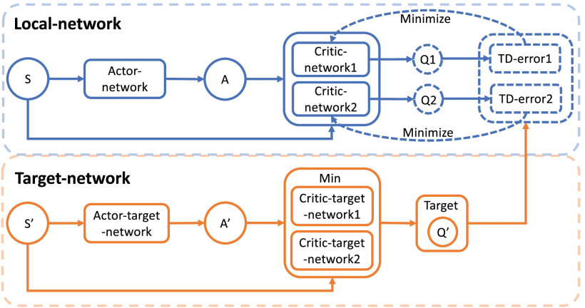

  - 双Q值裁剪 Critic 网络（Twin Critics）
    - TD3 借鉴了Double Q-Learning的思路，维护两个独立的 Critic 网络( $(Q_1, Q_2)$)。训练时取两者的最小值作为目标 Q 值（ $\min(Q_1, Q_2)$ ），通过 “保守估计” 抑制单网络的过估计偏差。这是对 DDPG 单 Critic 设计的直接修正。
    - 我们知道噪声是随机的，有大有小。易知两动作价值函数的噪声有以下四种情况，就是向下取（“裁剪”），刚好和过高估计形成了定性视角下一定程度的抵消。
      - (偏大、次偏大) -> 次偏大
      - (偏大、偏小) -> 偏小
      - (偏小、偏大) -> 偏小
      - (偏小、更偏小) -> 更偏小
  - 延迟策略更新（Delayed Policy Updates）
    - TD3 中，Actor 网络的更新频率低于 Critic（例如每更新 2 次 Critic 才更新 1 次 Actor），给 Critic 留出更多时间收敛到更准确的估计，减少了 Actor 因 Critic 误差导致的震荡。
      - $d$ : 更新固定倍率
      - $\tau$: 软更新系数
    - TD3保留了DDPG的软更新系数： $\theta$<- $\tau * \theta + (1 - \tau) *\theta^{'}$ 注意和我们这里的“延迟策略更新”做区分.
- 不让Critic自己先训练一段时间，再指导Action。
- Actor-Critic 框架的本质 ——两者是 “共生关系”：Actor 依赖 Critic 的可靠估计更新策略，Critic 依赖 Actor 的当前策略产生样本。Actor 不更新，就没有新动作带来的新样本，Critic 会在错误的方向上越走越远，后续再指导 Actor 时，只会让 Actor 学到更差的策略。

- 目标策略平滑（Target Policy Smoothing）
  - 在计算网络预测的动作 $a$时，TD3 会给目标 Actor 的输出添加少量噪声$(\tilde{a} = \mu_{target}(s^{'}) + clip(N, -c, c))$，用来更新标签 $y$ , 避免目标 $Q$ 值因动作微小变化而剧烈波动，进一步稳定训练。
  - 与TD3不同的是 DDPG的噪声只是让输出有一点变化，给 $\mu$网络加上噪声，没用来更新标签 $y$.
  - 动作 $a$是希望策略网络 $\pi$预测的操作，标签 $y$是希望 $Q$预测出的评估动作好坏的值。

- 他们正是Actor-Critic的输出好动作+评估好坏的两个方面.
  - 作用上的区别
    - 在使用确定型动作输出时，容易过拟合，输出卡在一个尖点走不出去了
    - 于是学习SARSA的思想，加入了一个阶段的高斯噪声，以便学到更好的 $Q$函数
    $$\epsilon \sim clip(N(0, \sigma), -c, c)$$ 
    其中 $-c, c$代表输入量在输入N的时候按照下界$-c$，上界$c$进行截断

## 10.5 SAC（Soft Actor-Critic）
- https://arxiv.org/pdf/1801.01290
- Soft Actor-Critic (SAC) 是一种在连续控制任务中表现出色的深度强化学习算法，它结合了演员-评论家框架和最大熵强化学习思想，在探索与利用间实现了卓越平衡。其核心在于，智能体追求的目标不仅是最大化长期累积奖励，还要最大化策略的熵（不确定性）。这使得策略在寻找高回报动作的同时，尽可能保持随机性，从而进行充分的探索。
- 提出的背景: 主流DRL算法的局限


| 传统 RL 问题 | 说明 |
|--------|--------|
| 样本效率低（sample inefficiency） | On-policy 算法（PPO、TRPO、A3C 等）每次更新都必须重新采样 → 非常昂贵 |
| 训练不稳定（brittle training） | Off-policy 算法如 DDPG、NAF，虽然复用数据，但经常崩掉，参数敏感 |

- 因此目标是找一个既稳定又高效的 deep RL 算法。
- SAC 的核心诉求：能像 DDPG 那样复用旧数据（off-policy），但比DDPG 更稳定；并像 PPO 那样稳定，但比 PPO 更高效。


- SAC 算法核心：最大熵强化学习（MERL）
  - 熵的定义：衡量随机变量的混乱度（无序性），熵越高，策略随机性越强
    - MERL 目标函数：相比标准 RL，额外加入熵项（ $\alpha$为温度系数，调节熵的权重）:
      $$\pi^{*}_{MaxEnt} = \arg \max_{/pi} \sum_t \mathbb{E}_{(s_t,a_t)\sim \rho_{\pi}}[r(s_t,a_t) + \alpha H(\pi(\cdot | s_t))]$$
      - 其中 $$\rho_{\pi}$$是状态-动作对的分布， $$H(\pi(\cdot | s_t)) = - \mathbb{E}_{a \sim \pi}[\log \pi(a | s_t)]$$表示策略在状态 $s_t$下的熵
    - Soft 函数
      - SAC 基于最大熵框架推导出 Soft Q-Learning 方程
      - 定义 soft 状态价值函数:
          $$V_{soft}(s_t) = \mathbb{E}_{a_t \sim \pi}[Q(s_t, a_t) - log \pi(a_t|s_t)]$$
      - soft 动作价值函数就是把 $$V_{soft}(s_t) $$代入进来:
          $$Q_{soft}(s_t, a_t) = r(s_t, a_t) + \gamma \mathbb{E}_{s_{t+1} \sim p}[V_{soft}(s_{t+1})]$$
          - 相比标准Bellman方程，它在下一个状态的值里加入了对动作熵 $$ log \pi(a_t|s_t)$$的考虑，因此称为软Bellman方程.
    - Soft Policy Iteration（软策略迭代）
      - 策略评估（Soft Policy Evaluation）
        - 在评估值 $Q$迭代的过程中，论文使用了比较复杂的数学描述语言，实际上和我们之前的思路是一样的。算子是函数到函数的映射。
          - Soft Bellman方程是TD的思想，用下一步的 $Q^{'}$ 计算 $Q$ ，而这样就可以实现反复迭代了。
          - $Q_{soft}(s_t, a_t) $实际是一个计算值方程:
            $$Q_{soft}(s_t, a_t) = r(s_t, a_t) + \gamma \mathbb{E}_{s_{t+1} \sim p}[V_{soft}(s_{t+1})]$$
            - $$s_t$$是变量 $$s$$的一个值，如果数学上 $$x_0$$是变量 $$x$$的具体值
          - 当不想用 "值" -> "值"的描述语言，而是用"函数" -> "函数"的描述语言时，可以借助一个算子  $\tau^{\pi}$:
          $$\tau^{\pi}(Q(s, a)) = r(s, a) + \gamma \mathbb{E_{s^{'}\sim p}}[V(s^{'})]$$
          - 当反复作用 $T$ 后，它会收敛到唯一解 $Q^{*}$，也就是最优 $Q$函数：
            $$Q_0 ---T --- Q_1 ---T---Q_2 --- T--- ->... --- Q$$

- 策略改进（Soft Policy Improvement）
  - 能量函数（Energy Function）
在物理中，系统趋向于能量最低的稳定状态（例如物体往低处掉、电荷趋向最低势能）
  - 基于能量的概率分布
    - 能量函数的 "低 = 好" 特性，需要通过指数函数 $\exp(-E(x))$转化为 "可用于计算概率的权重"
    - 能量的约定是 "低能量 = 高概率"，但直接对  取指数会导致 "高能量->大指数值"，与我们的需求相反。加上负号后，关系完全反转：
      - 低能量 $E(x)$ -> 大的  $-E(x)$ ；
      - 高能量 $E(x)$ -> 小的  $-E(x)$  。
    - 指数函数 $\exp(t)$有两个关键性质，完美适配 "概率权重" 的需求:
      - 非负数: 无论 $t$(这里是$-E(x)$ ) 是正还是负， $\exp(t)$的结果永远大于0 —— 而概率的取值范围 $(0, 1)$，非负的权重是后续归一化的前提;
      - 单调性: $\exp(t)$是严格单调递增函数，即 "$(t_1 > t_2) $ -> $(\exp(t_1) > \exp(t_2))$"  ——  能量的 "概率排序" 能完整传递到权重上。
      - 但是此时值之和不等于一，需进行归一化。

- 配分函数$Z$（Partition Function)  
  - 配分函数 $Z$的定义非常简单：所有事件的 "概率权重" 之和（离散事件）或积分（连续事件），数学表达式为：
    - 离散事件: $Z = \sum_x \exp (- E(x))$
    - 连续事件:  $Z = \int \exp (- E(x))dx$
  - 最终的基于能量的概率分布公式
    - 结合前两步，每个事件 $x$的概率为: 
      $$p(x) = \frac{\exp(-E(x))}{Z}$$
      - 其中  $Z = \sum_x \exp (- E(x))$是配分函数
    - 玻尔兹曼分布（Boltzmann Distribution）与 Softmax：
      - 玻尔兹曼分布来自统计物理，用于描述一个系统在温度 $TTT$ 下出现在能量状态 $E(x)E(x)E(x)$ 的概率：
      $$p(x) = \frac{\exp(-\frac{E(x)}{kT})}{Z}$$
        - 其中
          - $E(x)$: 该状态的能量
          - $T$: 温度
          - $k$: 玻尔兹曼常数
          - $Z$: 配分函数
        - 当把常数 $k$合并进温度，把 $\frac{1}{T}$视为一个可调超参数，就能够得到机器学习中常用形式: 
          $$p(x) = \frac{\exp(-E(x)/\tau)}{Z}$$ $$（\tau = temperature）$$
          - $\tau$超参数用来控制 $E(x)$的重要性程度
          - $\tau$-> 0：系统几乎只选最低能量（最大概率）的状态 -> 接近 argmax
          - $\tau$-> ∞：所有状态差不多等概率 -> 完全随机
      - 能量函数 $E(x)$换成 价值函数 / $Q$值的相反数: $E(a|s) = - Q(s, a)$就得到:
            $$p(a|s) = \frac{\exp(Q(s, a))}{Z(s)}$$
        - 这就是最大熵强化学习中的策略更新公式的关键思想:
          - $Q$值高 -> 该动作概率更大（利用探索性）
        - 策略与 $\exp(Q^{\pi}(s, \cdot)$成正比
          $$\pi_{new} (\cdot | s) \propto \exp (Q^{\pi}(s, \cdot))$$
          - 这意味着策略倾向于在高 $$Q$$值的动作附近分配更高概率。
          - 通过最小化 KL 散度来实现策略迭代，并证明该迭代收敛到最优最大熵策略:
              $$\pi_{new} = \arg \min_{\pi^{'}\in \prod}D_{KL}(\pi^{'}(\cdot|s) || \frac{\exp(Q^{\pi}(s, \cdot))}{Z^{\pi}(s)})$$
      - 要找一个新策略 $\pi_{new}$，让它尽量接近诱导出来形如玻尔兹曼分布 的"目标分布"。
      - 策略更新不是直接最大化 $Q$，而是变成 "让策略更像高 $Q$的分布"
        - 其中 $\prod$是新策略分布预先给定的族.
          - $\prod$是一组可被神经网络参数化的、可微、可采样的概率分布.
          - 在连续动作领域，$\prod$通常指高斯策略网络族:
          $$\pi_{\phi}(a|s) = N(\mu_{\phi}(s), \sum_{\phi}(s))$$
- "族" 是强调元素间有明确关联（如共同结构、来源）的特定汇集，
- "集合" 是仅需元素满足某属性、不刻意突出关联性的通用汇集。
- Ps: 为什么说是"给定":
  - 因为我们不可能优化无限复杂的策略，只能优化可参数化、可微、可更新的一类策略, 如高斯分布.


- Soft Actor-Critic 实现结构:
  - 损失函数
    - value网络（辅助）
      - $V_{\psi}(s_t)$的作用是用来计算 $V_{\bar\psi}(s_{t+1})$，进而计算更新预测 $Q$值的函数 $\hat Q(s_t, a_t)$:
      - value网络的更新公式使用了均方差MSE如下:
        $$J_V(\psi) = \mathbb{E}_{s_t \sim D}[\frac{1}{2}(V_{\psi}(s_t) - \mathbb{E}_{a_t \sim \pi_{\theta}}[ Q_{\theta}(s_t, a_t) - \log \pi_{\phi}(a_t | s_t))^2]$$
        - 其中  $$\mathbb{E}_{a_t \sim \pi_{\theta}}[ Q_{\theta}(s_t, a_t) - \log \pi_{\phi}(a_t | s_t) = V_{soft}(s_t)$$
      - $D$指的是经验回收池(Replay Buffer)
        - $D$ <- $D \cup (s_t,a_t,r(s_t,a_t), s_{t+1})$——表示每一步环境交互得到的四元组都会被加入$D$.

| 好处 | 解释 |
|--------|--------|
| ⭐ 提升样本效率| 不需要像 PPO 一样每更新一次就丢掉数据 |
| ⭐ 支持多次梯度更新 | 一条轨迹可用于多次训练 |
| ⭐ 训练更稳定 | 数据分布不会随策略快速漂移 |

          - 目标value网络软更新
              $$\bar\psi $$ <- $$\tau \psi + (1 - \tau)\bar{\psi}$$
          - $V_{\bar\psi}(s_{t+1})$是目标网络

| 网络 | 符号 | 作用 |
|--------|--------|--------|
| 训练中的 Value 网络 | $V_{\psi}$ | 参与优化，反向传播损失 $J_V(\psi)$ |
| 目标 Value 网络 | $V_{\bar\psi}$ | 只用于计算 Q 的目标值，不反传梯度 |

    - $Q$网络
        $$J_Q(\theta) = \mathbb{E}_{(s_t, a_t) \sim D}[\frac{1}{2}[ Q_{\theta}(s_t, a_t) - \hat Q(s_t, a_t) )^2]$$
        $$with~~~ \hat Q(s_t, a_t) = r_t + \gamma V_{\bar{\psi}}(s_{t+1})$$
    - 策略网络
        $$J_{\pi}(\phi) = \mathbb{E}_{s \sim D}D_{KL}(\pi_{\phi}(\cdot|s) || \frac{\exp(Q_{\theta}(s, \cdot))}{Z_{\theta}(s)})$$
        等价于
        $$J_{\pi}(\phi) = \mathbb{E}_{s \sim D， \epsilon \sim N}[\log \pi_{\phi} (a_t | s_t) - Q_{\theta}(s_t, a_t)]$$
        其中 $a_t = f_{\phi}(\epsilon_t;s_t)是重参数化。$

  - 重参数化技巧 (它重写函数，把随机性从分布参数里剥离，重新参数化到了这个独立的  身上，实现可导)
    - 原本策略采样动作 $a$是产生于它的概率分布:
                $$a \sim \pi_{\phi}(a|s)$$
      - 也就是说动作是直接从一个带参数的概率分布里抽样出来。
      - 动作采样过程本身不可微，梯度无法穿过它，所以只能用 REINFORCE似然比法（也就是REINFORCE方法）或其变式算法。
    - 设 $g(a)$是关于动作的损失函数，且是新环境的主要决定因素
              $$\nabla_{\phi}\mathbb{E}_{\pi_\phi}[g(a)] = \mathbb{E}[\nabla_{\phi}\log\pi_{\phi}(a)R(\tau)]$$
      - 那么就算用上了优势函数降低方差:
              $$\nabla_{\phi}\mathbb{E}_{\pi_\phi}[g(a)] = \mathbb{E}[\nabla_{\phi}\log\pi_{\phi}(a)A]$$
      - 奖励信号/优势函数依然是作为乘子，方差难以保持一个满意水平，因为它们都是来自随机采样。
  - SAC 采用重参数化法：
    - 将随机采样写为确定性（可导）函数加上噪声（可导）的形式：
        $$a_t = \mu_{\phi}(s_t) + \sigma_{\phi}(s_t)  ⊙\epsilon, \epsilon \sim N(0, I)$$ (⊙哈达玛积)
      - 从而可以直接对策略网络 $\phi$反向传播梯度
    - 原来的参数化方式: 随机变量 $a$直接由分布参数 $\theta = (\mu, \sigma)$决定:
                  $$a \sim p_{\theta}(a)$$
    - 随机性隐含在 $p$里面
    - 新的参数化方式: 引入了一个辅助变量 $\epsilon$
    - 将 $a$表示为 $\epsilon$和 $\theta$的确定性变换
                  $$a = g(\theta, \epsilon)$$
    - 将随机性从分布参数中剥离，重新参数化到这个独立的 $\epsilon$上
  - 假设没有这个技巧，生成 $a$为
    $$a \sim N(\mu, \sigma)$$ （在计算图中，这里有一个节点叫 采样）
    - 前向传播（Forward）：可以从正态分布中拿到一个数值 $a$，前向过程可以正常计算
    - 反向传播（Backward）：当我们想通过 $a$反向传播梯度到分布参数 $\mu$和 $\sigma$时，如果只看计算图的采样节点，它会说采样是随机过程，这次得到 $a$只是我根据分布概率随机抽取的一个结果，并不是从 $\mu$和 $\sigma$通过一个确定性可导函数算出的。因此，输出 $a$ 对参数 $\mu$和 $\sigma$的梯度在普通微积分意义下是不存在的 —— 因为稍微改变 $\mu$或 $\sigma$，采样结果并不会连续可导地变化，而是从另一个分布重新抽样，结果可能跳变。
      - 为了解决这个问题，既然采样不可导，那就把随机性抽取出来，将其变成一个输入常量
      - 将动作 $a$的定义，从"一个从分布里抽出来的随机变量"，重写为"一个确定性的函数":
      $$a = g(\mu, \sigma, \epsilon) = \mu +\sigma * \epsilon, \epsilon \sim N(0, 1)$$
        - $\mu$决定了动作的基准
        - $\epsilon$提供了随机方向
        - $\sigma$决定了随机的幅度
      - 计算图变化
        - $\epsilon$不再是运算过程中的随机行为，而变成了计算图的一个外部输入节点。对于这一次运算来说， 就是一个固定的常数（比如 0.5）
        - $+$和 $\times$：采样变成了普通的加法和乘法
        - 再来求导
          $$\frac{\partial a}{\partial \mu} = \frac{\partial (\mu+\sigma *\epsilon)}{\partial \mu}  = 1$$
          $$\frac{\partial a}{\partial \mu} = \frac{\partial (\mu+\sigma *\epsilon)}{\partial \sigma}  = \epsilon$$
        - 现在的 $a$对于 $\mu$和 $\sigma$来说，是一个完全连续、可导的函数。梯度可以顺畅地流过加法和乘法节点，一直流回神经网络的权重里.
        - 实际操作: 由 Tanh 限制范围
          - 这一步在物理仿真（MuJoCo等）中必不可少。上面的  $a_{raw}$理论上可以是 $(-\infty, \infty)$，但机器人的电机输入通常限制在 $[-1, 1]$之间（在这个范围内，梯度传播最健康，权重更新最稳定, 所以最后会过一个 tanh 激活函数:
                $$a_{final} = \tanh(a_{raw})$$
    - 网络结构
      - 单一 $Q$网络的形式：
          $$J_{Q}(\theta) = \mathbb{E}_{(s_t,a_t) \sim D} [\frac{1}{2}(Q_{\theta}(s_t, a_t) - \hat{Q}(s_t, a_t))^2]$$
          $$with ~~ \hat{Q}(s_t, a_t) = r_t + \gamma V_{\bar \psi} (s_{t+1})$$
        - 原论文的 $Q$ 网络损失函数完整形式为:
          $$J_{Q_1}(\theta_1) = \mathbb{E}_{(s_t,a_t) \sim D} [\frac{1}{2}(Q_{\theta_1}(s_t, a_t) - \hat{Q}(s_t, a_t))^2]$$
          $$J_{Q_2}(\theta_2) = \mathbb{E}_{(s_t,a_t) \sim D} [\frac{1}{2}(Q_{\theta_2}(s_t, a_t) - \hat{Q}(s_t, a_t))^2]$$
        - 双 Q 最小值 $\min(Q_1, Q_2)$，替代了训练策略网络和 $V$ 网络的原有的 $Q$ 函数的位置：
          $$V_{\phi}(s_t) = \mathbb{E}_{(a_t \sim \pi_{\phi})} [\min(Q_{\theta_1}(s_t,a_t), Q_{\theta_2}(s_t,a_t)) - \log \pi_{\phi}(a_t | s_t)]$$
          $$J_{\pi}(\phi) = \mathbb{E}_{(s_t \sim D, \epsilon)} [\log \pi_{\phi}(a_t | s_t) - \min(Q_{\theta_1}(s_t,a_t), Q_{\theta_2}(s_t,a_t))]$$
        - 训练中所涉及的5个神经网络:


| 网络名称 | 记号 | 输入 | 输出 |作用 |
|--------|--------|--------|--------|-------|
| 策略网络 | $\pi_{\theta}(a|s)$ | $s$ | 动作分布 |采样动作、更新策略 |
| $Q$网络1 | $Q_{\theta_1}(s, a)$ | $s, a$ | 标量 $Q$值 |估计软 $Q$值 |
| $Q$网络2 | $Q_{\theta_2}(s, a)$ | $s, a$ | 标量 $Q$值 |用$Q$抑制$Q$值正偏差 |
| $V$网络（状态值） | $V_{\psi}(s)$ | $s$ | 标量 $V$值 |估计软 $V$值，用作 $Q$目标 |
| 目标$V$网络 | $V_{\bar\psi}(s)$ | $s$ | 标量 $V$值 |平滑更新于TD目标 |

