## 1. 基本概念

- **Agent（智能体）**：在环境中执行动作并学习如何最大化累积奖励的实体。
- **Environment（环境）**：智能体与之交互的外部系统，定义了状态空间、动作空间和奖励机制。
- **Observation（观察）**：智能体从环境中获取的当前状态信息。
- **Action（动作）**：智能体在某个状态下可以执行的操作，影响环境的状态。
- **Reward（奖励）**：智能体执行某个动作后环境反馈的即时信号，用于指导智能体的学习。

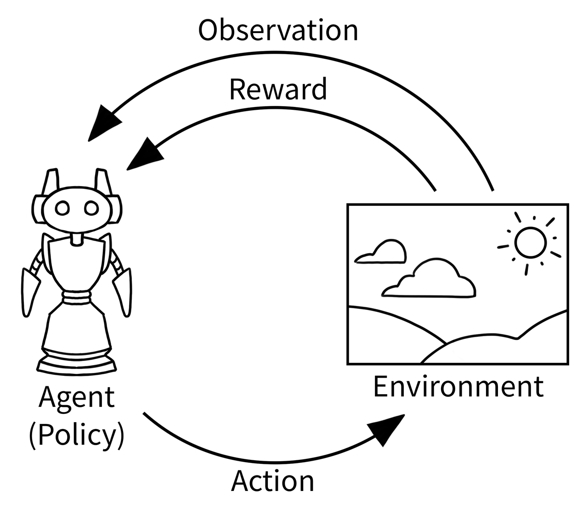

强化学习就是智能体和环境之间持续交互，通过与环境交互并观察环境的状态，学习如何采取进一步的行动，以最大化累积奖励，在不断试错的过程中学习如何在不同状态下做出最佳决策的过程。

## 2. 马尔可夫过程

### 2.1 马尔可夫性质

#### 2.1.1 **本质**

   - 一个随机过程在给定现在状态及所有过去状态情况下，其未来状态的条件概率分布仅依赖于当前状态，与历史状态无关。

#### 2.1.2 **数学定义**

   - 假设随机变量 $X_0, X_1, ..., X_{T-1}, X_T$ 构成一个随机过程。这些随机变量的所有可能取值的集合被称为状态空间。如果

$$
p(X_{t+1}=x_{t+1}|X_{0:t}=x_{0:t})=p(X_{t+1}=x_{t+1}|X_{t}=x_{t})
$$

     则称其满足马尔可夫性质。

   - 其中：
     - $X_{0:t}$ 表示变量集合 $X_0, X_1, ..., X_{t-1}, X_t$
     - $x_{0:t}$ 表示变量集合 $x_0, x_1, ..., x_{t-1}, x_t$

   - 马尔可夫性质也可以描述为：给定当前状态时，将来的状态与过去状态条件独立。如果某过程满足马尔可夫性质，未来的转移与过去无关，只取决于现在。

#### 2.1.3 **直观理解**

- 一个失忆的人：
  - 只记得：我现在在哪里
  - 不记得：我是怎么到这里来的
  - 决策下一步行动时，只基于当前位置

> 假设机器人有三种状态：静止(S)、移动(M)、充电(C)
>
> 传统模型（有记忆性）：
>
> ```python
> # 下一状态可能依赖于整个历史：
> # P(下一状态 | 历史 = [C, M, M, S, M]) = ?
> ```
>
> 马尔科夫模型（无记忆性）：
>
> ```python
> # 下一状态只依赖于当前状态：
> # P(下一状态 | 当前状态 = M) = ?
> ```

#### 2.2 马尔科夫链

##### 2.2.1 一阶马尔科夫链 （简单 强大）

###### 基本思路

```python
from enum import Enum
from dataclasses import dataclass
import numpy as np

class RobotState(Enum):
    """机器人状态空间"""
    IDLE = "空闲"      # 静止等待
    MOVING = "移动"    # 正在移动
    CHARGING = "充电"  # 正在充电

@dataclass
class MarkovChain:
    """一阶马尔科夫链实现"""

    # 状态转移矩阵
    # P[next_state | current_state]
    transition_matrix = {
        RobotState.IDLE: {
            RobotState.IDLE: 0.5,     # 保持空闲
            RobotState.MOVING: 0.4,   # 开始移动
            RobotState.CHARGING: 0.1  # 开始充电
        },
        RobotState.MOVING: {
            RobotState.IDLE: 0.3,     # 停止移动
            RobotState.MOVING: 0.5,   # 继续移动
            RobotState.CHARGING: 0.2  # 开始充电
        },
        RobotState.CHARGING: {
            RobotState.IDLE: 0.8,     # 充满电，空闲
            RobotState.MOVING: 0.1,   # 充满电，开始移动
            RobotState.CHARGING: 0.1  # 继续充电
        }
    }

    def next_state(self, current: RobotState) -> RobotState:
        """基于当前状态生成下一个状态"""
        import random

        # 获取当前状态的所有可能转移
        transitions = self.transition_matrix[current]

        # 随机选择（按概率权重）
        states = list(transitions.keys())
        weights = list(transitions.values())

        return random.choices(states, weights=weights)[0]
```

###### 优点

- 计算简单
    - 只需维护当前状态的转移概率，不存储历史状态
- 数据需求少
    - 估计的参数数量少
- 完整理论体系支持

###### 状态转移矩阵

主要是将转移考虑表示为矩阵的形式，便于运算

```python
import numpy as np

# 状态顺序：[空闲, 移动, 充电]
# 行：当前状态，列：下一状态
P = np.array([
    [0.5, 0.4, 0.1],  # 空闲 → [空闲, 移动, 充电]
    [0.3, 0.5, 0.2],  # 移动 → [空闲, 移动, 充电]
    [0.8, 0.1, 0.1]   # 充电 → [空闲, 移动, 充电]
])

# 关键性质：每行和为1（概率归一化）
print("行和验证:", np.sum(P, axis=1))  # [1., 1., 1.]
```

    2. 高阶马尔科夫链 （捕捉时间依赖）
      1. 一阶假设有时候过于简化，预测可能不准

```python
# 一阶模型：P(下雨|今天=晴) = 0.2
# 问题：连续10天晴天后，下雨概率还是0.2吗？

# 三阶模型更准确：
weather_probs = {
    # (前前天, 前天, 今天) → 明天天气概率
    ('晴', '晴', '晴'): {'雨': 0.6, '晴': 0.4},  # 长期晴天后更可能下雨
    ('雨', '晴', '晴'): {'雨': 0.3, '晴': 0.7},
    ('晴', '雨', '晴'): {'雨': 0.4, '晴': 0.6},
}

```

###### 通用高阶实现

```python
class HigherOrderMarkovChain:
    """τ阶马尔科夫链通用实现"""

    def __init__(self, order: int):
        self.order = order  # 记忆长度
        self.memory = []    # 存储最近order个状态

        # 转移概率表：P(X_t | X_{t-τ}, ..., X_{t-1})
        self.transitions = {}

    def add_transition(self, history: tuple, next_state: str, prob: float):
        """添加转移概率"""
        if history not in self.transitions:
            self.transitions[history] = {}
        self.transitions[history][next_state] = prob

    def predict(self) -> str:
        """基于历史预测下一个状态"""
        if len(self.memory) < self.order:
            return None

        # 获取最近的order个状态作为历史
        recent_history = tuple(self.memory[-self.order:])

        if recent_history in self.transitions:
            # 根据概率随机选择
            probs = self.transitions[recent_history]
            import random
            return random.choices(list(probs.keys()),
                                 weights=probs.values())[0]
        return None
```

###### 高阶到一阶的转换技巧

- 复合状态方法
高阶马尔科夫链可以通过状态扩展转换为一阶链:

```python
def convert_to_first_order(states: list, high_order_probs: dict, order: int):
    """
    将高阶马尔科夫链转换为等价的一阶链

    思想：将长度为order的历史序列视为一个"复合状态"
    例如：二阶链的(S,M)视为一个新状态
    """

    # 1. 创建所有可能的复合状态
    composite_states = []
    from itertools import product

    # 生成所有长度为order的状态序列
    for combo in product(states, repeat=order):
        composite_states.append(combo)

    # 2. 构建一阶转移矩阵
    n_composite = len(composite_states)
    P_first_order = np.zeros((n_composite, n_composite))

    # 3. 填充转移概率
    composite_index = {cs: i for i, cs in enumerate(composite_states)}

    for history_tuple, next_probs in high_order_probs.items():
        i = composite_index[history_tuple]

        for next_state, prob in next_probs.items():
            # 新历史：(移出最旧状态，加入新状态)
            # 例如：(S,M) + M → (M,M)
            new_history = history_tuple[1:] + (next_state,)
            j = composite_index[new_history]
            P_first_order[i, j] = prob

    return composite_states, P_first_order

# 示例：二阶链转换
states = ['S', 'M', 'C']
second_order_probs = {
    ('S', 'S'): {'S': 0.6, 'M': 0.3, 'C': 0.1},
    ('S', 'M'): {'S': 0.2, 'M': 0.6, 'C': 0.2},
    ('M', 'S'): {'S': 0.4, 'M': 0.5, 'C': 0.1},
    # ... 其他组合
}

composite_states, P_1st = convert_to_first_order(states, second_order_probs, order=2)
print(f"原始状态数: {len(states)}")
print(f"复合状态数: {len(composite_states)}")  # 3² = 9
```

例子:

```python
import matplotlib.pyplot as plt
import networkx as nx
from matplotlib.patches import FancyBboxPatch

def visualize_markov_chains():
    """改进的可视化：二阶马尔科夫链转换为一阶链"""

    # 创建图形
    fig, axes = plt.subplots(1, 2, figsize=(16, 8))
    fig.suptitle('Transforming Second-Order Markov Chain to First-Order',
                fontsize=16, fontweight='bold', y=0.95)

    # ========== 左图：二阶马尔科夫链 ==========
    ax1 = axes[0]
    ax1.set_title('Second-Order Markov Chain\n(Needs memory of past 2 days)',
                 fontsize=14, fontweight='bold', pad=20)
    ax1.set_xlim(-1, 11)
    ax1.set_ylim(-1, 11)
    ax1.axis('off')

    # 时间线标签
    time_labels = ['Day -2', 'Day -1', 'Today']
    times = [2, 5, 8]

    # 绘制时间线
    ax1.plot([1.5, 8.5], [8, 8], 'k-', linewidth=2, alpha=0.7)

    for i, (time, label) in enumerate(zip(times, time_labels)):
        ax1.text(time, 8.3, label, ha='center', fontsize=11,
                fontweight='bold', color='darkblue')
        # 时间点标记
        ax1.plot(time, 8, 'ko', markersize=10)

    # 天气示例：Sunny, Sunny, Cloudy
    weather_sequence = ['Sunny', 'Sunny', 'Cloudy']
    weather_icons = {'Sunny': '☀️', 'Cloudy': '☁️', 'Rainy': '🌧️'}

    for i, (time, weather) in enumerate(zip(times, weather_sequence)):
        ax1.text(time, 7.5, weather_icons[weather], fontsize=40, ha='center')
        ax1.text(time, 7.0, weather, ha='center', fontsize=12,
                fontweight='bold', color='darkblue')

    # 依赖箭头
    ax1.arrow(times[0], 6.8, times[1]-times[0]-0.3, -0.7,
              head_width=0.15, head_length=0.2, fc='red', ec='red', alpha=0.7)
    ax1.arrow(times[1], 6.8, times[2]-times[1]-0.3, -0.7,
              head_width=0.15, head_length=0.2, fc='red', ec='red', alpha=0.7)

    # 状态空间说明
    state_space_box = FancyBboxPatch((1, 3), 8, 2,
                                    boxstyle="round,pad=0.3",
                                    facecolor="lightcoral", alpha=0.2,
                                    edgecolor="red", linewidth=1.5)
    ax1.add_patch(state_space_box)

    ax1.text(5, 4.5, 'State Space Size Problem',
            ha='center', fontsize=12, fontweight='bold', color='darkred')
    ax1.text(5, 3.8, '3 weather types → 3² = 9 possible history pairs',
            ha='center', fontsize=10, color='darkred')
    ax1.text(5, 3.3, 'P(Today | Yesterday, Day-before-yesterday)',
            ha='center', fontsize=10, color='darkred', style='italic')

    # 内存需求
    memory_box = FancyBboxPatch((1, 0.5), 8, 1.5,
                               boxstyle="round,pad=0.3",
                               facecolor="lightblue", alpha=0.2,
                               edgecolor="blue", linewidth=1.5)
    ax1.add_patch(memory_box)

    ax1.text(5, 1.7, 'Memory Requirement',
            ha='center', fontsize=12, fontweight='bold', color='darkblue')
    ax1.text(5, 1.0, 'Need to remember last 2 states',
            ha='center', fontsize=10, color='darkblue')

    # ========== 右图：转换为一阶链 ==========
    ax2 = axes[1]
    ax2.set_title('Equivalent First-Order Markov Chain\n(Composite states)',
                 fontsize=14, fontweight='bold', pad=20)
    ax2.set_xlim(-1, 11)
    ax2.set_ylim(-1, 11)
    ax2.axis('off')

    # 复合状态的概念
    composite_box = FancyBboxPatch((1, 8), 8, 2,
                                  boxstyle="round,pad=0.3",
                                  facecolor="lightgreen", alpha=0.2,
                                  edgecolor="green", linewidth=2)
    ax2.add_patch(composite_box)

    ax2.text(5, 9.5, 'Composite State = Memory Encoded in State Name',
            ha='center', fontsize=12, fontweight='bold', color='darkgreen')

    ax2.text(5, 8.8, 'Instead of: P(Weather_today | Weather_yesterday, Weather_day-before)',
            ha='center', fontsize=9, color='darkgreen')
    ax2.text(5, 8.2, 'We use: P(Composite_today | Composite_yesterday)',
            ha='center', fontsize=9, color='darkgreen')

    # 复合状态示例
    ax2.text(3, 7.0, 'Composite State Example:', ha='left', fontsize=11, fontweight='bold')

    # 状态分解图示
    # 复合状态
    comp_state = FancyBboxPatch((3, 5.5), 4, 1,
                               boxstyle="round,pad=0.3",
                               facecolor="lightblue", alpha=0.3)
    ax2.add_patch(comp_state)
    ax2.text(5, 6.0, '"Sunny-Sunny"', ha='center', fontsize=12,
            fontweight='bold', color='darkblue')
    ax2.text(5, 5.5, 'represents: Sunny yesterday + Sunny day-before',
            ha='center', fontsize=9, color='blue')

    # 箭头到天气
    ax2.arrow(5, 5.2, 0, -1, head_width=0.2, head_length=0.15,
              fc='purple', ec='purple', alpha=0.7, linestyle='--')

    # 对应天气
    weather_box = FancyBboxPatch((3, 3.5), 4, 1,
                                boxstyle="round,pad=0.3",
                                facecolor="yellow", alpha=0.2)
    ax2.add_patch(weather_box)
    ax2.text(5, 4.0, 'Actual Weather Today', ha='center', fontsize=10, fontweight='bold')
    ax2.text(5, 3.5, 'Sunny', ha='center', fontsize=14, fontweight='bold', color='darkorange')
    ax2.text(5, 3.5, '☀️', fontsize=30, ha='center')

    # 状态转移示例
    ax2.text(3, 2.5, 'State Transition Example:', ha='left', fontsize=11, fontweight='bold')

    # 转移箭头
    ax2.plot([2, 8], [2, 2], 'k-', linewidth=1, alpha=0.5)

    # 从状态 (Sunny, Sunny)
    state1_box = FancyBboxPatch((1.5, 1.2), 2, 1,
                               boxstyle="round,pad=0.3",
                               facecolor="lightblue", alpha=0.4)
    ax2.add_patch(state1_box)
    ax2.text(2.5, 1.7, 'State: (S,S)', ha='center', fontsize=10, fontweight='bold')

    # 转移箭头
    ax2.arrow(3.5, 1.7, 2, 0, head_width=0.15, head_length=0.2,
              fc='red', ec='red', alpha=0.7)

    # 到状态 (Sunny, Cloudy)
    state2_box = FancyBboxPatch((5.5, 1.2), 2, 1,
                               boxstyle="round,pad=0.3",
                               facecolor="lightblue", alpha=0.4)
    ax2.add_patch(state2_box)
    ax2.text(6.5, 1.7, 'State: (S,C)', ha='center', fontsize=10, fontweight='bold')

    # 转移概率说明
    prob_text = 'Transition Probability:\nP((S,C) | (S,S)) = 0.4'
    ax2.text(6.5, 0.5, prob_text, ha='center', fontsize=9,
            bbox=dict(boxstyle="round,pad=0.2", facecolor="yellow", alpha=0.3))

    # 关键优势
    advantage_box = FancyBboxPatch((1, -0.5), 8, 1.5,
                                  boxstyle="round,pad=0.3",
                                  facecolor="gold", alpha=0.2,
                                  edgecolor="orange", linewidth=1.5)
    ax2.add_patch(advantage_box)

    ax2.text(5, 0.0, 'Key Advantage: Standard Markov techniques apply',
            ha='center', fontsize=11, fontweight='bold', color='darkorange')
    ax2.text(5, -0.5, 'State space: 9 composite states instead of complex memory',
            ha='center', fontsize=9, color='darkorange')

    plt.tight_layout()
    plt.show()

visualize_markov_chains()
```

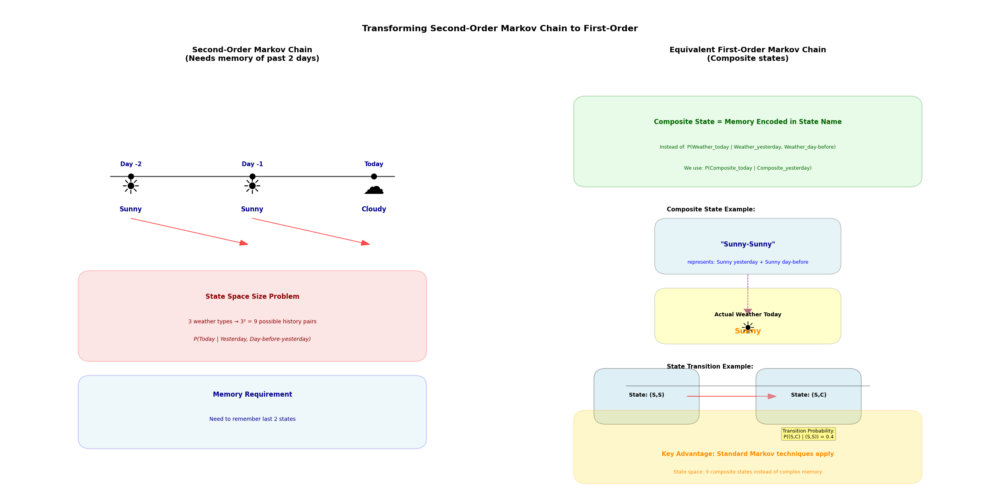

#### 2.3 马尔科夫决策过程 (Markov Decision Process， MDP)

马尔可夫链在强化学习领域的具体应用，包括一组状态、一组动作、状态转移概率、奖励函数和折扣因子。
  - 在MDP中，智能体可以选择动作，然后在环境下根据状态转移考虑确定下一个状态，并返回一个即时奖励。
  - MDP的目标是找到一个最优策略，以最大化期望累计回报（或价值函数）

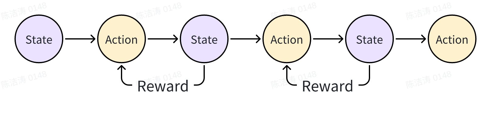


### 3. 策略函数 （Policy Function）

- 在某个state下可以选择一个具体动作action，这依赖策略函数
  - 确定性策略（Deterministic Policy）
    - 给定一个状态，策略函数输出一个动作
$$
\pi(s) = a
$$
  - 随机性策略（Stochastic Policy） (实际主要是这种情况)
    - 对于给定的状态，策略输出的是一个动作的概率分布
    $\pi(a \mid s)$ 表示在状态 $s$ 下选择动作 $a$ 的概率。
        - 注意：在深度学习中，这个策略函数由神经网络表示
        - 所有的可能为树形结构

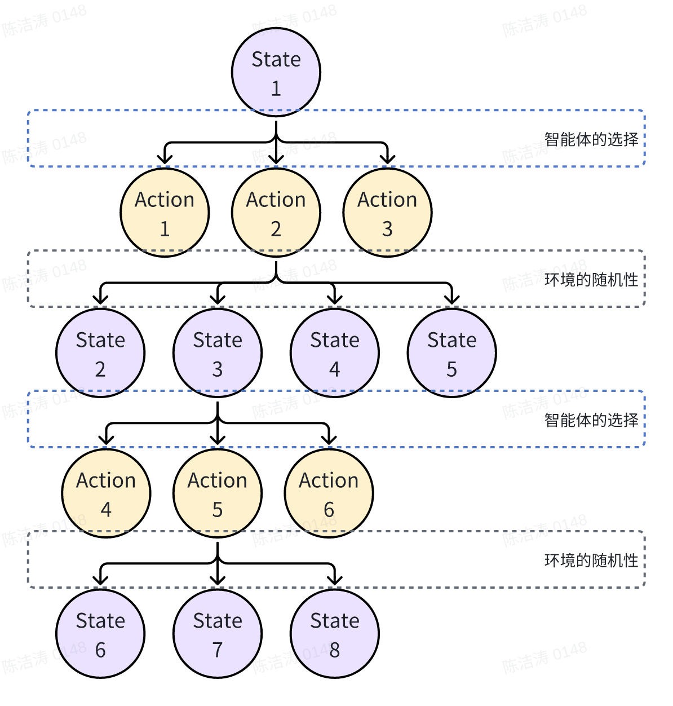


#### 3.1 策略序列/轨迹 $\tau$ (trajectory)

- 状态、动作、奖励的序列
$$
\tau = (s_0, a_0, r_1, s_1, a_1, r_2, \ldots, s_{T-1}, a_{T-1}, s_T)
$$

  奖励穿插在状态和动作之间。

#### 3.2 轨迹对应的概率 $P$：

  - 描述了在策略 $\theta$下，智能体agent在环境中采取一系列动作，从初始状态开始并最终达到某个终止状态的可能性有多大。这个概率分布通常用于强化学习算法中的策略优化，目标是找到使得期望回报最大化的最佳策略参数$\theta$ .

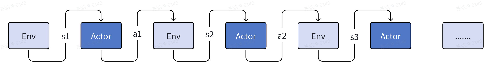

$$
(Trajectory-\tau =(s_1, a_1, s_2, a_2, ..., s_{T}, a_{T}))
$$
  （核心是 状态-动作交替）

  - 环境动态: $p(s_{t+1}|s_{t}, a_{t})$，这是环境决定的（与策略无关）
  - 策略
    - 于是，一条给定轨迹的概率（假设初始状态分布为 $p(s_1)$）为：
$$
p_\theta(\tau) = p(s_1) \prod_{t=1}^T\pi_\theta(a_t|s_t)p(s_{t+1}|s_t, a_t)
$$
        - 具体展开
$$
p_\theta(\tau) = p(s_1)p_{\theta}(a_1 | s_1)p(s_2|s_1, a_1)p_{\theta}(a_2 | s_2)p(s_3|s_2, a_2)......
$$

#### 3.3 确定性策略 vs 随机策略 的轨迹分布区别

  - 确定性策略只固定“给定状态时的动作”，环境转移或初始状态随机时仍存在轨迹分布；随机策略还引入动作采样的随机性
    - 确定性策略 （仅依赖环境随机）
      - 在每个状态 s 下固定输出一个特定动作，即
$$
a = f(s)
$$
          (函数映射)
        - 在完全确定性环境 + 确定性策略时：只要初始状态固定，整条轨迹完全固定。（只有一条轨迹概率为1，其他为0）
        - 如果环境动态随机而策略确定：初始状态固定时，第一次动作固定；后续状态随机，动作随到达的状态变化，因此动作序列也未必固定。（不同轨迹的概率来自于环境随机，而不是策略随机）
    - 随机性策略（可依赖环境随机和轨迹随机）
      - 在每个状态 s 下输出动作的概率分布，例如高斯或分类分布等
          - 即使环境动态确定:$p(s_{t+1}|s_{t}, a_{t})$是确定性的，因为策略选择动作是随机的，所以从同一个初始状态出发也可以获得多条不同轨迹。
          - 如果环境也是随机的，那么此时随机性来自两者的叠加。

确定性策略本身不会因为策略的选择而随机生成多条轨迹（动作固定），随机策略会在选择动作时引入随机性，从而即使环境确定也可能有多条轨迹。因此 $p_\theta(\tau)$是一个具备更宽的概率分布，表示由于策略的随机选择导致可能有很多条轨迹，每条有不同概率。

### 4. 强化学习衡量 Reward 的重要指标

智能体通过与环境交互后的Reward来学习最优策略， 而累计回报、状态价值、动作价值是理解这一过程的核心逻辑链条。他们从单条路径的收益到状态的平均价值，再到动作的具体价值，层层递进刻画智能体的决策依据。

#### 4.1 累计回报 $G_t$

本节使用教材中常见的 $R_{t+1}$：它是执行 $A_t$ 后收到的奖励。后文实现与策略梯度部分把同一奖励记为 $r_t$，即 $r_t=R_{t+1}$；只是下标约定不同，并未多延迟一步。

- 累计回报是从时刻 t 开始， 未来所有奖励的折扣累计和，公式为：
$$
G_t = R_{t+1} + \gamma R_{t+2} + \gamma^2 R_{t+3} + \cdots
= \sum_{k=0}^{\infty} \gamma^k R_{t+k+1}
$$
  - 其中
    - $\gamma \in [0, 1]$ 是折扣因子，用于体现未来奖励的当前价值衰减；无限时域通常取 $\gamma<1$ 并要求回报可积， $\gamma$越接近0，越重视即时奖励；越接近1，越重视长期奖励
    - $R_{t+k+1}$ 是时刻 $t+k+1$的即时奖励。

#### 4.2 状态价值 $V^{\pi}(s)$

- 状态价值函数是策略 $\pi$下，从状态 s 出发的累积回报的期望，公式为

$$
V^{\pi}(s) = \mathbb{E}_{\pi}\left[G_t \mid S_t = s\right]
$$

#### 4.3 动作价值 $Q^{\pi}(s, a)$

- 动作价值函数是在策略 $\pi$下， 从状态 s 执行动作 a 后， 累积回报的期望， 公式为
$$
Q^{\pi}(s, a) = \mathbb{E}_{\pi}\left[G_t \mid S_t = s, A_t = a\right]
$$
它比状态价值更具体， 直接评估在状态 s 选动作 a ， 再按策略$\pi$行为的长期价值

#### 4.4 $G$、$V$、$Q$ 的关系

$$
V^{\pi}(s) = \sum_a \pi(a \mid s) Q^{\pi}(s, a)
$$

- 状态 s 的价值， 等于在这个状态下所有可能动作的 $Q$ 值，按照你选动作的策略 $\pi$ 的概率加权平均
- 累积回报是 $Q$值和 $V$值的计算基础： $Q$值和 $V$值都是对未来累积回报的期望，因为强化学习中存在随机性（比如环境随机反馈、动作随机选择），所以要用期望来描述长期规律。

#### 4.5 将 $G$、$V$、$Q$ 化成递推式：Bellman 方式

- 累计回报 $G_t$、状态价值 $V^{\pi}(s)$、动作价值 $Q^{\pi}(s, a)$ 都是长期价值，很难直接计算，需要遍历从当前时刻到任务结束的所有未来步骤，这在现实场景中几乎不可行。
    - 任务无终止时（如持续运行的机器人控制），未来步骤是无限的，$(G_t  = \sum_{k=0}^\infty \gamma^k*R_{t+k+1})$无法直接求和。
    - 任务有终止但步骤极多（如复杂游戏通关），遍历所有未来路径的计算量会呈指数级增长，远超算力承载能力。而递推Bellman方程将无限/极多步骤的长期价值转化为当前步的奖励+下一步价值的折扣期望，只需关注当前与下一步的关联，大幅降低了计算复杂度。
    - 同时，递推式让价值学习具备迭代优化的可能。例如 Q-Learning 使用下面的更新式，让 $Q$ 值在每次交互后逐步向最优值收敛：

$$
Q(s, a) \leftarrow Q(s, a) + \alpha
\left[R + \gamma \max_{a'} Q(s', a') - Q(s, a)\right]
$$

#### 4.6 价值递推核心：Bellman 方程

- 强化学习中，某状态（某状态-动作对）的价值，可分解为即时奖励和后续状态的价值的折扣期望。
- Bellman方程就是用递推公式来刻画这种现在与未来的价值关联：用选择策略的回报和可达的下一状态的值描述当前状态的值。

##### 4.6.1 Bellman期望方程：针对 $V$ 值

- 状态价值函数 $V^{\pi}(s)$的Bellman方程为

$$V^{\pi}(s) = \mathbb{E}_{a \sim \pi,\, s' \sim P} \left[ R_{t+1} + \gamma V^{\pi}(S_{t+1}) \mid S_t = s \right]
$$

- 含义:在策略 $\pi$下, 状态 s 的价值 = 『即时奖励 $R_{t+1}$的期望』+ 『折扣后, 下一步状态 $S_{t_1}$的价值 $V^{\pi}(S_{t+1})$的期望』
- 与 $G$ 的联系:$G_t = R_{t+1} + \gamma G_{t+1}$(累积回报的递推式),而 $V^{\pi}(s) = \mathbb{E}[G_t \mid S_t = s]$,因此 Bellman 方程是对累积回报期望的递推分解。
- 为什么 $R$ 是 $t + 1$？
- 执行当前动作后, 在进入下一个状态 $S_{t+1}$的同时,才能获得对应的奖励 $R_{t+1}$
- 如何理解 $S_{t+1}$？
- 当模型有关 model-base(环境转移可推算)时:通过 $P(S_{t+1} | S_t, A_t)$可知
- Model-free 方法不需要显式转移模型，而是从交互或已收集的数据中取得下一状态样本。

##### 4.6.2 Bellman期望方程:针对 $Q$ 值

- 动作价值函数  $Q^{\pi}(s, a)$的Bellman方程为:
$$
Q^{\pi}(s, a) = \mathbb{E}_{S_{t+1},R_{t+1},\,A_{t+1}\sim\pi(\cdot\mid S_{t+1})} \left[ R_{t+1} + \gamma Q^{\pi}(S_{t+1}, A_{t+1}) \mid S_t = s, A_t = a \right]
$$

- 含义:在策略 $\pi$下, 状态 s 的价值 = 『即时奖励 $R_{t+1}$的期望』+ 『折扣后, 转移概率 $P$给出下一步状态$S_{t+1}$通过采样选动作$A_{t+1}$的$Q$ 值的期望』
- 与 $V$ 的联系是 $V^\pi(s)=\sum_a\pi(a\mid s)Q^\pi(s,a)$；求和中的状态和动作必须与左侧及求和变量一致。下一状态、随机奖励和下一动作都参与相应的期望。

##### 4.6.3 Bellman最优方程

$$
Q^*(s, a) = \mathbb{E}_{s' \sim P}\left[
R_{t+1} + \gamma \max_{a'} Q^*(s', a')
\mid S_t = s, A_t = a
\right]
$$

- 这是表格价值迭代与 Q-Learning 分析的基础。收敛还依赖任务条件、充分访问状态动作对以及学习率条件；神经网络函数逼近不自动继承表格算法的收敛结论。

### 5. 无模型的学习方法:MC 与 TD

在无模型(Model-Free)场景下,我们无法依赖环境转移概率计算价值,只能通过与环境交互的经验学习。蒙特卡洛(MC)和时序差分(TD)是两种核心的无模型价值学习方法,前者依赖 “完整轨迹”,后者侧重 “单步 / 多步交互”,适用于不同场景需求。

#### 5.1 MC 蒙特卡洛(Monte Carlo)

- 在强化学习中MC方法的本质是通过完整轨迹的累积回报,平均估计状态/动作的价值。它要求智能体完成一整个交互序列(从初始状态到终止状态),获得完整的累积回报  $G_t$ 后,再用这个真实回报更新价值:不依赖任何估计值,只基于实际交互结果。
- 关键公式
- 对于每个经历过状态 s 的轨迹, 记录该轨迹中状态 s 对应的累积回报 $G_t$, 多次交互后,状态价值的估计值为所有包含s的轨迹中 $G_t$的平均值。
$$
V(s) \leftarrow \frac{1}{N(s)} \sum_{i=1}^{N(s)} G_t^{(i)}
$$

- 其中
- 若采用 first-visit MC，每回合只记录第一次访问 $s$ 的回报，$N(s)$ 是这些样本的数量。Every-visit MC 则记录每一次访问；同一回合的样本会相关，不能把访问次数混写成独立轨迹数。
- 对于原公式
$$
V(s) = \mathbb{E}[G_t | S_t = s]
$$

- 这与一般蒙特卡洛估计使用同一思路：把难以直接求的期望换成样本平均。是否无偏、如何估计误差，还要核对固定策略、访问规则、轨迹相关性和截断方式。
- 案例
- 求圆周率

```python
import random

def estimate_pi(num_samples, seed=42):
    if num_samples <= 0:
        raise ValueError("num_samples must be positive")
    rng = random.Random(seed)
    inside = sum(rng.uniform(-1, 1)**2 + rng.uniform(-1, 1)**2 <= 1
                 for _ in range(num_samples))
    return 4 * inside / num_samples

for n in [100, 1000, 10000, 100000]:
    estimate = estimate_pi(n)
    print(f"N={n}: pi={estimate:.6f}")
```

- 结果特点:
- 随机性：固定种子方便复现；大样本使估计在概率意义上更集中，但单次实验的误差不保证随 N 单调下降。
- 收敛速度:误差大致按 $1 / \sqrt {N}$ 下降,这就是蒙特卡洛的典型特征。
- 求积分

```python
import math
import random

def mc_integral(func, a, b, num_samples, seed=42):
    if num_samples <= 0 or not a < b:
        raise ValueError("need positive samples and a < b")
    rng = random.Random(seed)
    total = sum(func(rng.uniform(a, b)) for _ in range(num_samples))
    return (b - a) * total / num_samples

for n in [1000, 10000, 100000]:
    result = mc_integral(lambda x: math.exp(-x*x), 0, 1, n)
    print(f"N={n}: integral={result:.6f}")
```

- 核心思想
- 把问题转换成某种随机过程的概率或期望值。
- 求 $\pi$→ 随机点落在圆内的概率
- 求积分 → 随机变量 $f(X)$的期望值,其中 $X$均匀分布
- 用大量随机样本来估计这个期望值。
- 独立同分布且方差有限时，样本均值的标准误差是 $\sigma/\sqrt N$。指数不显含维度，但方差常数、采样成本和稀有事件概率仍可能随维度恶化；相关轨迹还会降低有效样本数。
- 特点与适用场景
- 优势:无偏差(仅用真实累积回报,不依赖估计值),逻辑直观,适合 “必须完成完整任务才能评估价值” 的场景(如棋类游戏、一次性决策任务)。
- 劣势:需等待轨迹终止才能更新,学习效率低；对轨迹数量要求高(需大量完整轨迹才能让平均值收敛),不适合 “无终止状态” 的持续任务(如机器人持续导航)。

### 5.2 TD 时序差分 (Temporal Difference)

- TD 方法结合了 MC 的 “经验采样” 和动态规划(DP)的自举(Bootstrapping)思想: 无需等待完整轨迹,每执行一步交互(获得 $S_t,A_t,R_{t+1},S_{t+1}$)后,立即用即时奖励 + 下一个状态的估计价值更新当前状态价值,是无模型场景下应用最广泛的方法。

| 方法 | 思想 | 局限性 |
|--------|--------|--------|
| MC(蒙特卡洛)  | 等完整一条轨迹跑完,再用累计回报更新前面所有状态  | 只能用于 episodic 场景,收敛慢  |
| DP(动态规划)  | 用「当前奖励 + 下一状态的估计值」进行自举(用估计的未来状态价值,来辅助计算当前状态价值)  | 必须知道环境模型(转移概率)  |

- 比喻:学车时的“实时教练”
假设你在学开车,目标是掌握在不同路况(状态)下如何平稳驾驶(获得高回报)。

- 动态规划(DP)方法:像一个“理论派教练”。
- 他不开车,只坐在书房里研究地图和交通规则。
- 他会告诉你:“在十字路口(状态 $S$),如果你直行,根据规则,你可能会到达下一个街区(状态  $S^{'}$),而那个街区的驾驶难度评分是 X 分。所以,这个路口直行的价值是…”。
- 特点:需要世界模型(地图和规则表),完全依赖推理(自举),没有真实经验。
- 蒙特卡洛(MC)方法:像一个“事后复盘教练”。
- 他会让你开完全程(完成一个Episode),比如从家开到公司。
- 停好车后,他根据你这一趟的整体表现(是顺利到达还是磕磕碰碰)来给你一路上经过的每个路口打分。
- 特点:必须等待结局,学习是基于完整经验的,但更新延迟严重。
- 时序差分(TD)方法:像一个 “坐在副驾的实时教练”。
- 你每开过一个路口,他马上就会点评。
- 比如,刚才你平稳通过了这个拥堵路口(状态 $S_t$),得到了即时的良好感觉(即时奖励 $R_{t+1}$),并进入了下一个路口(状态 $S_{t+1}$)。教练马上说:“刚才这个路口你处理得不错！而且看,下一个路口车流也很顺畅( $S_{t+1}$ 的价值估计很高),所以我判断你刚才的选择总体价值很高。”
- 他没有等到终点,就结合了:
- 你的即时感受(奖励)
- 他对下一个路口的预判(价值估计)
- 立刻更新了你对刚才那个路口的认知。
- 特点:边走边学,实时更新,结合了真实体验片段和原有认知预测。
- 因此在每一步交互后:
$S_t,A_t,R_{t+1},S_{t+1}$
我们就立即用「即时奖励 + 下一状态的估计值」作为新的目标来更新当前状态的估计值。
这个思想其实是在逼近「期望回报」的定义式:
$$
V^{\pi}(S_t) = \mathbb{E}_{\pi}\left[
R_{t+1} + \gamma R_{t+2} + \gamma^2 R_{t+3} + \cdots \mid S_t
\right]
$$
$$
V^{\pi}(S_{t+1}) = \mathbb{E}_{\pi}\left[
R_{t+2} + \gamma R_{t+3} + \gamma^2 R_{t+4} + \cdots \mid S_{t+1}
\right]
$$
但我们没法一次算出所有未来奖励,于是参考上面的公式用一步近似:
$$
V(S_t) \approx R_{t+1} + \gamma V(S_{t+1})
$$
这就是所谓的「自举(bootstrapping)」: 用当前估计值的一部分去更新自己。

#### 5.2.1 核心(默认)公式

- TD (0)(单步 TD,更新状态价值):仅用 “下一步状态的估计价值” 计算更新目标,是最基础的 TD 形式:
$$
V(S_t) \leftarrow V(S_t) + \alpha\left[R_{t+1} + \gamma V(S_{t+1}) - V(S_t)\right]
$$

- 其中
- $\alpha$是学习率, 决定了我们更新的幅度
- $R_{t+1} + \gamma  V(S_{t+1})$成为TD目标
- $R_{t+1} + \gamma  V(S_{t+1})  - V(S_t)$是TD误差, 衡量当前估计与目标的差距
- 同时, 它还可以用于 $Q(s, a)$的递推.(sarsa算法)

#### 5.2.2 SARSA (更新动作价值,On-Policy TD控制算法)

名称来源于 $S_t,A_t,R_{t+1},S_{t+1}, A_{t+1}$

- 针对动作价值 $Q(s, a)$, 更新时依赖实际执行的下一个动作 $A_{t+1}$ :
$$
Q(S_t, A_t) \leftarrow Q(S_t, A_t) + \alpha\left[
R_{t+1} + \gamma Q(S_{t+1}, A_{t+1}) - Q(S_t, A_t)
\right]
$$

- 其中
- $R_{t+1} +   \gamma  Q(S_{t+1}, A_{t+1})$被称为 TD目标
- $R_{t+1} + \gamma Q(S_{t+1}, A_{t+1}) - Q(S_t, A_t)$ 被称为 TD 误差(TD error)。
- 我们定义其更新目标(监督信号或标签)为:
$$
  y_t = R_{t+1} + \gamma Q(S_{t+1}, A_{t+1})
$$

- TD目标,它代表了当前状态-动作的理想预测值
- SARSA是一种 On-policy 学习算法:每次更新都基于智能体在当前策略下实际执行的下一步动作 $A_{t+1}$

### 6. 价值函数算法

#### 6.1 Q-Learning

- Q-Learning 是一种典型的异策略（Off-Policy）时序差分(TD)强化学习算法。其核心目标是学习一个最优的动作价值函数 $Q^{*}(s, a)$,该函数表示在状态s下采取动作a后,遵循最优策略所能获得的期望累计折扣回报

#### 6.1.1 算法流程

- 初始化
- 创建一个表格,存储所有 $(s, a)$组合的 $Q$值,为所有状态-动作对赋予初始值
- 交互与更新
- 在每个时间步 $t$,智能体在状态 $S_t$下根据某种策略(贪心算法等)选择动作 $A_t$
- 执行动作
- 执行动作 $A_t$,环境返回奖励 $R_{t+1}$和下一个状态 $S_{t+1}$
- 更新$Q$值,也可以用收敛快的启发式算法得出
$$
Q^*(s, a) = \mathbb{E}\left[
R_{t+1} + \gamma \max_{a'} Q^*(S_{t+1}, a')
\mid S_t = s, A_t = a
\right]
$$

- 重复
- 令 $S_t \leftarrow S_{t+1}$,重复2-4步骤,直至 $Q$表收敛
这样就可以反复迭代更新每个情况s下每一种动作a的动作价值 $Q$

#### 6.1.2 (查表)决策

最终优化好了 $Q$ 值表后,选择当前状态下 $Q$ 值最大的动作,通过查训练好的$Q$值表快速到达终点。

#### 6.2 SARSA 和 Q-Learning 的对比测试

- Code :

```python
import numpy as np

# 4x12：起点 36，终点 47，悬崖 37..46。
# 掉崖奖励 -100 并回到起点，但 episode 不终止；到达终点才终止。
def step(state, action):
    row, col = divmod(state, 12)
    dr, dc = [(-1, 0), (0, 1), (1, 0), (0, -1)][action]
    row, col = np.clip(row + dr, 0, 3), np.clip(col + dc, 0, 11)
    next_state = int(row * 12 + col)
    if 37 <= next_state <= 46:
        return 36, -100.0, False
    return next_state, -1.0, next_state == 47

def epsilon_greedy(q, state, rng, epsilon):
    if rng.random() < epsilon:
        return int(rng.integers(4))
    choices = np.flatnonzero(q[state] == q[state].max())
    return int(rng.choice(choices))

def train(method, episodes=500, seed=42, alpha=0.5, gamma=1.0, epsilon=0.1):
    if method not in ("sarsa", "q_learning"):
        raise ValueError("unknown method")
    rng = np.random.default_rng(seed)
    q = np.zeros((48, 4))
    returns = []
    for _ in range(episodes):
        state, total = 36, 0.0
        action = epsilon_greedy(q, state, rng, epsilon)
        for _ in range(10000):
            next_state, reward, terminated = step(state, action)
            next_action = epsilon_greedy(q, next_state, rng, epsilon)
            bootstrap = (q[next_state, next_action] if method == "sarsa"
                         else q[next_state].max())
            target = reward + gamma * (0.0 if terminated else bootstrap)
            q[state, action] += alpha * (target - q[state, action])
            total += reward
            if terminated:
                break
            state, action = next_state, next_action
        else:
            raise RuntimeError("episode exceeded the demonstration step budget")
        returns.append(total)
    return q, np.array(returns)

if __name__ == "__main__":
    for method in ("sarsa", "q_learning"):
        _, returns = train(method)
        print(method, "last-100 mean return:", returns[-100:].mean())
```

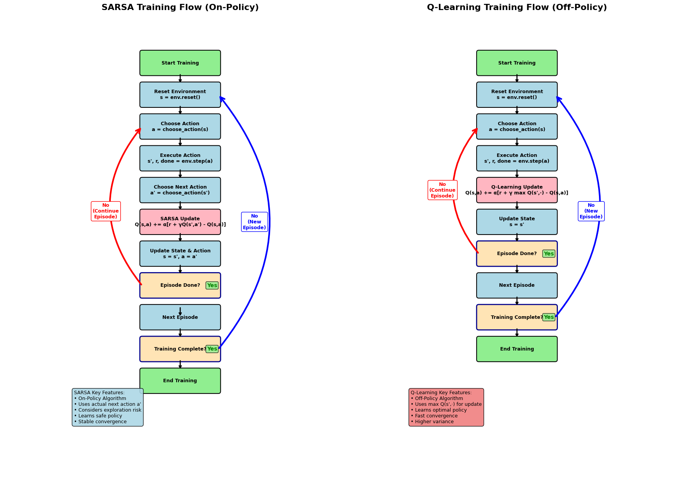

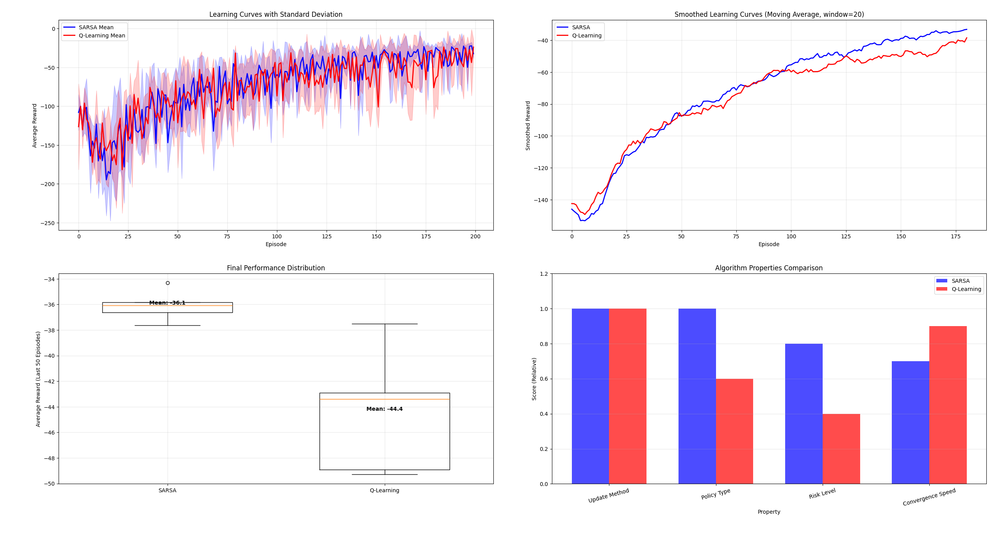

上方两张图保留历史实验的路径与回报对比，不是当前精简代码的固定输出。运行代码会打印所选种子的末 100 回合平均回报；多种子实验才适合比较稳定性。

### 6.3 $Q$ 值过估计(Overrstimation Bias)

#### 6.3.1 问题定义

- 同一组带噪声估计同时用于选择最大动作与评估其价值时，会产生最大化偏差；但不能断言每个训练阶段、每个状态动作的估计都高于 Q*。

#### 6.3.2 产生原因

- 纯价值函数方法容易产生价值过估计,原因出在迭代过程中的取最大动作价值$Q$,在于更新公式中 $\max$ 操作和估计误差的结合。
- 更新公式
$$
Q(s,a)\leftarrow Q(s,a)+\alpha\left[r+\gamma(1-d)\max_{a'}Q(s',a')-Q(s,a)\right]
$$
其中 α 是学习率，d 表示真正终止；时间限制截断不能一概当作终止。

- 采样时
$$
Q^{d}(s^{'}, a^{'}) = Q^{*}(s^{'}, a^{'}) + \epsilon_{a^{'}}
$$

- 其中 $\epsilon_{a^{'}}$是估计误差,可能正或可能负,由于$\max$操作倾向于选择误差最大的那个动作,很可能存在某个样本导致:
$$
\mathbb{E} [\max_{a^{'}}  Q^{d}(s^{'}, a^{'})] > \max_{a^{'}}  Q^{*}(s^{'}, a^{'})
$$

- 因此,纯价值函数方法(如Q-Learning、DQN)天然容易出现过估计
- Actor-Critic 将动作生成与价值评估分开，但 Actor 仍依赖 Critic 的估计，因此结构本身不能消除过估计。TD3 的双 Critic 取小目标和延迟更新才是针对性机制，见 [TD3 官方说明](https://spinningup.openai.com/en/latest/algorithms/td3.html)。

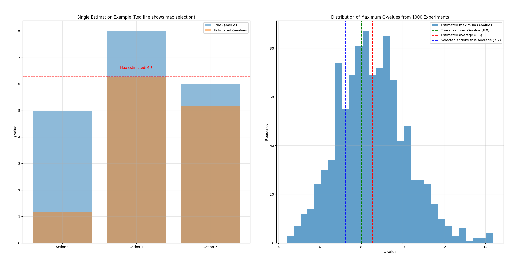

### 6.4 从最大化偏差到 Double Q-Learning

下面先隔离“同一组带噪声估计既选择又评估动作”这一机制。所有动作的真实价值设为零；这个统计实验不是完整的强化学习训练，也不能证明任意环境中 Double Q 的回报一定更高。

```python
import numpy as np

rng = np.random.default_rng(42)
selector = rng.normal(size=(100000, 10))
evaluator = rng.normal(size=selector.shape)
chosen = selector.argmax(axis=1)
coupled = selector[np.arange(len(selector)), chosen]
decoupled = evaluator[np.arange(len(selector)), chosen]
print("same estimator:", coupled.mean())
print("independent evaluator:", decoupled.mean())

def double_q_update(q1, q2, state, action, reward, next_state,
                    terminated, rng, alpha=0.1, gamma=0.99):
    """两个同形状二维 Q 表；随机更新其中一个，另一个负责评估。"""
    select, evaluate = (q1, q2) if rng.random() < 0.5 else (q2, q1)
    target = reward
    if not terminated:
        next_action = int(np.argmax(select[next_state]))
        target += gamma * evaluate[next_state, next_action]
    select[state, action] += alpha * (target - select[state, action])
```

训练时可用 `q1 + q2` 形成 ε-greedy 行为策略。两个表由同一条经验流学习，并不严格统计独立；Double Q 将动作选择与评估解耦，缓解最大化偏差，但仍可能低估，不能保证偏差永远为零。

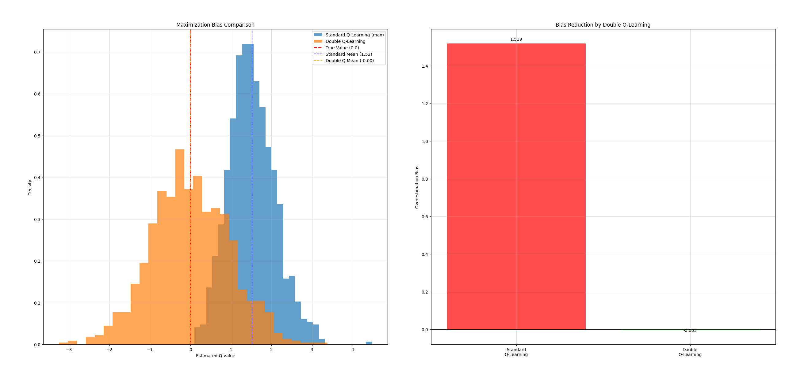

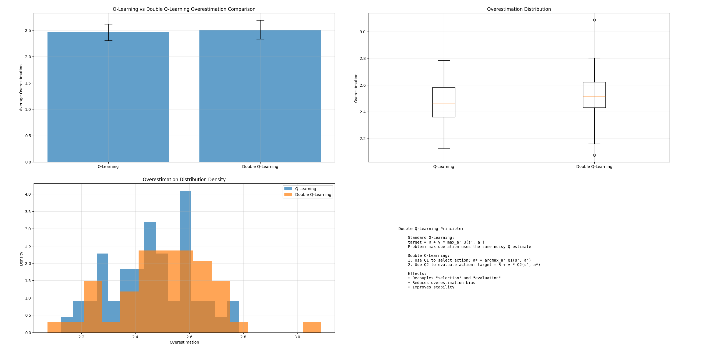

以上保留的两张图来自历史实验，并非上方精简示例的本次运行结果。曲线差异受到环境、随机种子、训练预算和估计器相关性的影响，不据单次试验宣称固定提升比例。

### 6.5 DQN (Deep Q-Network 使用神经网络的Q-Learning)

- 核心思想
- 一旦S和A的组合增加,Q值表的计算和存储的开销都会很大。用深度学习网络近似Q函数,通过输入状态 s 直接预测所有动作 a 的 Q 值,解决传统Q-Learning在高维状态空间下的"维数灾难"问题。

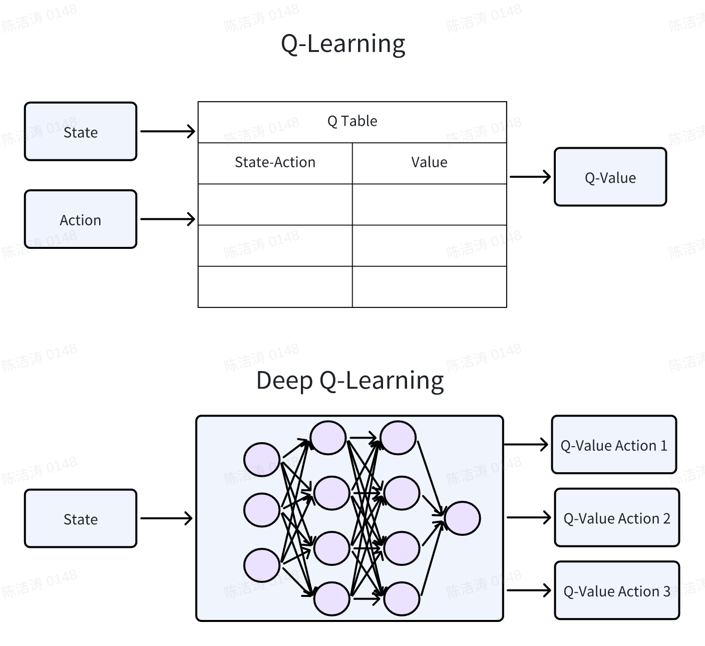

- 输入维度:适应高维状态
- 输出维度:等于离散动作空间的尺寸
- DQN 的逻辑:拟合 Q 值,间接生成策略
- 神经网络的角色：用深度神经网络拟合 Q(s,a)，输入是状态 s(如游戏画面),输出是所有动作的 Q 值(如 “向左走的 Q 值、向右走的 Q 值”)。
- 一次反向传播用到的数据:  $s_t,a_t,r_{t+1},s_{t+1}$
- 反向传播只回归当前采样动作对应的标量 `Q(s,a)`，不是把所有动作输出当作同一个目标向量。TD 目标由目标网络计算并停止梯度；真终止时目标只有奖励。
- 策略的生成:训练完成后,策略是 “选 Q 值最大的动作”(贪心策略),策略由 Q 值间接推导,而非网络直接输出动作概率。
- 训练机制
- 前向传播: 输入状态 $s_t$ -> 网络 -> 得到所有动作的预测Q值
- 选择动作: ε-greedy(训练时)或 greedy策略(测试时)
- 执行动作: 获得奖励 $r_{t+1}$和新状态 $S_{t+1}$
- 计算目标：
$$
  y = R + \gamma(1-d)\max_{a'}Q(s', a'; \theta')
$$

- 反向传播：更新 θ，最小化 `(y - Q(s,a;θ))²` 或对应 Huber 损失，而不是有符号误差本身。下方回放与目标网络代码块是流程伪代码。
- 关键技术：
DQN 通过经验回放（Experience Replay）和目标网络（Target Network）等技术解决了 Q-learning 中样本相关性和目标值不稳定的问题。

- 经验回放

```text
# 传统Q-Learning问题：序列样本强相关
for (s, a, r, s') in sequential_experience:
update(Q)  # 连续相关样本 → 训练不稳定
# DQN解决方案：经验回放
replay_buffer.append((s, a, r, s'))
batch = random.sample(replay_buffer, k)  # 随机采样 → 打破相关性
update(Q)  # 稳定训练
```

- 目标网络

```text
# 传统问题：目标值y与预测值Q来自同一网络
y = r + γ * max Q(s', a'; θ)  # θ快速变化 → 目标值波动大
# DQN解决方案：固定目标网络
y = r + γ * max Q(s', a'; θ^-)  # θ^-每N步同步一次θ → 目标稳定
```

- 总结：

| 特性 | Q-Learning | DQN |
|--------|--------| --------|
|状态表示 |表格（离散状态） | 神经网络（连续/高维状态） |
|Q值存储 |Q表（S×A矩阵） |网络权重参数 |
|泛化能力 |无（查表） | 强（函数逼近）|
|适用场景 | 小型离散环境| 复杂高维环境（Atari游戏等） |
|训练样本 | 在线更新|经验回放池 |
|目标稳定性 |不稳定 | 目标网络稳定训练|

- Q-Learning：仅适用于低维离散状态 / 动作（如 10×10 网格世界）
- DQN：可处理高维状态（如图像、传感器数据），但动作仍需是离散的（如 Atari 游戏的上下左右按键）
- 因此，DQN标志着深度强化学习时代的开启，将深度学习的表示能力与强化学习的决策框架相结合，实现了从低维表格到高维函数逼近的跨越，为处理真实世界复杂问题奠定了基础。

## 7. 策略梯度算法(Policy Gradient, PG)

价值方法先估计 $Q(s,a)$，再据此选择动作；策略梯度直接优化参数化策略 $\pi_\theta(a\mid s)$。两者都可以不学习环境模型，也都可以使用神经网络。

### 7.1 策略梯度的数学形式

先固定本文这一节的约定：一回合执行 $T$ 次动作，$r_t$ 是执行 $a_t$ 后收到的奖励，最后到达 $s_T$。从回合起点计算的目标为

$$
J(\theta)=\mathbb E_{\tau\sim p_\theta}\!\left[\sum_{t=0}^{T-1}\gamma^t r_t\right],
\qquad G_t=\sum_{k=t}^{T-1}\gamma^{k-t}r_k.
$$

在环境转移与初始状态分布不依赖 $\theta$ 的条件下，利用因果性可得

$$
\nabla_\theta J(\theta)=\mathbb E_\tau\!\left[
\sum_{t=0}^{T-1}\gamma^t G_t\nabla_\theta\log\pi_\theta(a_t\mid s_t)
\right].
$$

**这里的外层 $\gamma^t$ 不能在保持目标定义不变时直接删掉。** 如果设 $\gamma=1$，或者已把时间权重纳入状态采样分布，公式才可相应改写；许多实践还会优化另一种代理目标。对照论文或代码时，先核对目标、回报定义与采样权重这三件事。

### 7.2 强化学习梯度的反向传播

REINFORCE 用采样动作的 **log-probability** 建立梯度路径。它不需要对真实环境、电机或奖励传感器求导。一次采样得到的动作、奖励与回报，在这次策略更新中作为固定数据使用。

令 $w_t=\gamma^t(G_t-b(s_t))$，梯度下降优化器可以最小化

$$
L_\pi(\theta)=-\sum_t \operatorname{stopgrad}(w_t)
\log\pi_\theta(a_t\mid s_t).
$$

负号把“增加加权 log-probability”写成最小化问题。若基线由另一个网络估计，策略损失中的权重也应停止梯度；价值网络用自己的回归目标更新。相关 API 区别见 [PyTorch 的 score-function 与 pathwise derivative 说明](https://docs.pytorch.org/docs/stable/distributions.html)。

### 7.3 优化目标与学习信号的区别

| 维度 | 监督学习 | 本节的回合式 REINFORCE |
|---|---|---|
| 数据 | 输入与监督目标 | 策略交互得到的状态、动作、奖励 |
| 优化目标 | 例如预测误差的期望 | 策略诱导的期望回报 |
| 梯度路径 | 预测损失 → 模型参数 | 加权 log-probability → 策略参数 |
| 数据变化 | 取决于数据收集方式 | 改变策略会改变后续采集的数据 |
| 是否需要可微环境 | 通常不涉及环境 | 不需要 |

<figure class="article-figure">

<figcaption><span class="article-figure__number">图 1</span><span class="article-figure__text">采样期间沿环境返回的下一状态继续；回合结束后，优化器更新策略参数，再开始下一回合。回报是权重，环境不在这条反向传播路径上。</span></figcaption>
</figure>

监督学习的梯度并不普遍等于“误差乘输入特征”；那只适用于特定模型和损失的组合。同样，策略梯度也不是仅仅把梯度下降改成梯度上升。关键是：如何从由策略产生的数据，构造对期望回报有效的梯度估计。

### 7.4 REINFORCE算法和策略梯度定理

#### 7.4.1 REINFORCE的核心突破

[Williams 的 REINFORCE 论文](https://link.springer.com/article/10.1007/BF00992696)给出了随机单元的奖励加权更新方法。下面用轨迹分布解释其基本思想，重点是梯度估计的条件，而不是把算法发展画成单一路线。

#### 7.4.2 关键数学工具：对数导数技巧（Log-Derivative Trick）

对密度为正、可微且满足交换积分与求导条件的分布，

$$
\nabla_\theta p_\theta(x)=p_\theta(x)\nabla_\theta\log p_\theta(x).
$$

这不是“概率分布无法求导”，而是把包含未知积分的梯度改写成可用样本估计的期望。分布支持集若随参数改变，需要另行处理边界项。

#### 7.4.3 策略梯度定理的完整推导

令 $\tau=(s_0,a_0,r_0,\ldots,s_{T-1},a_{T-1},r_{T-1},s_T)$。为简洁起见，把奖励视作给定轨迹上的固定函数；随机奖励也可并入与参数无关的环境核。

$$
p_\theta(\tau)=\rho_0(s_0)\prod_{t=0}^{T-1}
\pi_\theta(a_t\mid s_t)P(s_{t+1}\mid s_t,a_t).
$$

固定一条轨迹求导时，$\rho_0$ 与 $P$ 的参数梯度为零，因此

$$
\nabla_\theta\log p_\theta(\tau)
=\sum_{t=0}^{T-1}\nabla_\theta\log\pi_\theta(a_t\mid s_t),
$$

$$
\nabla_\theta J=
\mathbb E_\tau\left[R(\tau)\sum_t\nabla_\theta\log\pi_\theta(a_t\mid s_t)\right].
$$

动作 $a_t$ 不能改变已经发生的奖励；过去奖励与当前 score 相乘的条件期望为零。因此 $R(\tau)$ 在第 $t$ 项中可以替换成 $\sum_{k=t}^{T-1}\gamma^k r_k=\gamma^tG_t$，得到 7.1 节公式。

#### 7.4.4 REINFORCE算法的理论价值矩阵

| 问题 | Q-learning / DQN | REINFORCE |
|---|---|---|
| 直接学习什么 | 动作价值 | 策略参数 |
| 学习信号 | 带 bootstrap 的 TD 目标 | 采样回报加权的 score |
| 是否需要环境梯度 | 不需要 | 不需要 |
| 动作类型 | 标准实现主要面向可枚举离散动作 | 可参数化离散或连续动作分布 |
| 主要误差来源 | 价值近似、bootstrap、分布覆盖 | 采样方差、分布覆盖、优化误差 |

#### 7.4.5 因果性、基线与优势估计 {#745-reinforce算法的理论价值矩阵}

不依赖当前动作的状态基线满足

$$
\mathbb E_{a\sim\pi_\theta(\cdot\mid s)}
[b(s)\nabla_\theta\log\pi_\theta(a\mid s)]=0.
$$

因此以 $G_t-b(s_t)$ 替换 $G_t$ 不改变相应条件下的期望梯度。常用 $V^\pi(s)$ 作为基线，但它一般不是严格的最小方差基线，后者还与 score 的大小有关。有限数据拟合、同一批次的数据依赖和价值估计误差，也需要与这个理想恒等式区分。

Actor-Critic 进一步用学到的价值函数构造优势估计。它可以减少方差，但引入的近似或 bootstrap 误差不会因为多了一个 Critic 就消失。

#### 7.4.6 从REINFORCE到现代方法的演变

| 方法 | 要解决的更新问题 | 不能直接推出的结论 |
|---|---|---|
| Reward-to-go | 删除与当前动作无关的过去奖励 | 方差从此很小 |
| 状态基线 | 减少回报中的公共波动 | 任意依赖动作的基线都无偏 |
| Actor-Critic / GAE | 用价值估计调整偏差与方差 | Critic 总比真实回报准确 |
| TRPO | 限制策略分布变化 | 有限样本实现每次回报都提高 |
| PPO | 裁剪代理目标、限制更新激励 | 概率比或 KL 被硬性限制 |
| SAC | 将熵奖励纳入异策略连续控制 | 最大熵目标等同原始奖励目标 |

PPO 的正负优势裁剪可以继续阅读 [PPO、DPO 与 GRPO](../ai/ppo-dpo-grpo/)。SAC 的重参数化与温度项见 10.5 节。

#### 7.4.7 附录：符号说明表

| 符号 | 含义 |
|---|---|
| $s_t,a_t,r_t$ | 动作前状态、动作、执行动作后获得的奖励 |
| $\theta,\pi_\theta$ | 策略参数及条件动作分布 |
| $T$ | 回合动作数；最后状态为 $s_T$ |
| $\gamma$ | 从回合起点定义目标时的折扣因子 |
| $G_t$ | 从当前时刻起、以当前时刻为零点的折扣回报 |
| $R(\tau)$ | 从回合起点计算的折扣总回报 |
| $b(s_t)$ | 与当前动作无关的基线 |

## 8. 连续动作空间：动作优化与策略参数化

### 8.1 连续动作空间：为什么策略梯度算法更适合

#### 8.1.1 问题的本质：连续 vs 离散

- 时间采样与动作离散化是两件事
数字控制器通常按采样时刻更新动作；采样周期取决于控制层级、计算延迟与执行器动态，不能给所有机器人算法套用同一频率。连续时间控制与事件触发控制也有各自的建模方式。
- 动作参数离散化的弊端
问题分析：
1. 精度损失：电机实际精度可达0.001°，离散化为0.1°档位造成浪费
2. 维度爆炸：若要达到0.001°精度，180°范围需要180,000个离散动作
3. 平滑性问题：离散动作导致机械臂抖动，影响控制稳定性

#### 8.1.2 连续动作空间的技术实现

- 为什么计算机能处理"连续"动作？
- 本质：计算机使用浮点数近似连续空间
- float32 约有 7 位十进制有效数字，float64 约有 16 位。是否足够取决于数值尺度、条件数与误差预算，不能仅凭“机器人控制”判断。
- 价值函数方法的局限
价值函数方法（如DQN）的问题：
1. 输出维度固定： $Q(s, a)$需要为每个动作 $a$输出值
2. 连续动作空间无限：无法为无限个动作都计算 $Q$值
3. 解决方法受限：

- 离散化：精度损失
- 函数拟合：需要额外优化过程

#### 8.1.3 策略梯度算法的优势

- 高斯分布是常见的连续动作参数化，不保证适合多峰策略。下面演示未压缩高斯与 REINFORCE 的 score-function 梯度，不是完整 SAC。

```python
import torch
from torch import nn
from torch.distributions import Normal

class GaussianPolicy(nn.Module):
    """未压缩高斯策略，演示 REINFORCE 的 score-function 梯度。"""
    def __init__(self, state_dim, action_dim):
        super().__init__()
        self.net = nn.Sequential(
            nn.Linear(state_dim, 128), nn.ReLU(),
            nn.Linear(128, 64), nn.ReLU(),
            nn.Linear(64, action_dim * 2),
        )

    def forward(self, state):
        mean, log_std = self.net(state).chunk(2, dim=-1)
        return mean, log_std.clamp(-5, 2).exp()

    def sample_action(self, state):
        mean, std = self(state)
        normal = Normal(mean, std)
        # score-function：把抽到的动作视为固定样本。
        action = normal.sample()
        log_prob = normal.log_prob(action).sum(dim=-1)
        return action, log_prob

policy = GaussianPolicy(state_dim=8, action_dim=2)
action, log_prob = policy.sample_action(torch.zeros(4, 8))
assert action.shape == (4, 2) and log_prob.shape == (4,)
```

这个例子使用 `sample()`，使动作样本不带重参数化梯度。SAC 的路径导数则使用 `rsample()`，并对 tanh 压缩后的 log-probability 加 Jacobian 修正；二者不能直接互换，见 [SAC 的策略更新说明](https://spinningup.openai.com/en/latest/algorithms/sac.html)。

未压缩高斯动作没有边界，不能直接发送给真实机械臂。受限动作需要明确压缩、缩放和密度变换；每个动作维度都有自己的均值和标准差，标准差也不保证随训练单调减小。

| 参数 | 物理意义 | 在强化学习中的作用 |
|--------|--------| --------|
| 均值 μ | 未压缩高斯的中心与众数 | 常用于确定性评估，但不保证是最优动作；tanh 变换后的密度众数也未必在 tanh(μ) |
| 标准差 σ | 分布的宽度，探索程度 | 探索：尝试均值附近的其他动作 |

## 9. 强化学习三大方法：Actor-Critic架构的提出

- 强化学习的算法设计围绕 “如何选择最优动作” 展开，根据 “是否依赖价值函数”和 “是否直接建模策略” ，可分为三大主流方法：纯价值函数、纯策略梯度、Actor-Critic，前两个一一对应，最后一个是前两者的结合方法。

### 9.1 纯价值函数方法

- 代表算法：Q-Learning、SARSA、DQN
- 核心思想：学习价值函数 $V(s)$或 $Q(s, a)$ ，然后通过贪心（或ε-贪心）策略选动作
$$
      a = \arg \max_a Q(s, a)
$$

- 思想：TD （Temporal Difference）
- 优势：可以直接从价值估计构造动作选择规则；表格算法在相应条件下有收敛结论，DQN 等函数逼近方法需另外分析。
- 劣势：标准表格法和 DQN 面向离散动作；连续动作也能建模 Q(s,a)，但每次求 argmax 需要额外优化或结构假设。函数逼近和最大化目标还可能引入估计偏差。
- 适用场景：离散动作、低维 / 高维状态的任务（如 Atari 游戏、网格世界导航）。

### 9.2 纯策略梯度方法

- 代表算法：REINFORCE
- 核心思想：建模策略函数 $\pi_\theta(a|s)$直接优化策略参数 $\theta$ ，让期望回报 $J(\theta)$最大。
$$
  \nabla_\theta J(\theta) = \mathbb{E}_{\pi_{\theta}} [ \left(  \nabla_\theta \log \pi_\theta(a|s) \right) R]
$$

- 思想：MC （Monte Carlo）
- 优势：可直接处理连续动作空间；策略更新更直接，不易受价值过估计影响。
- 劣势：策略梯度方差高（观测值  累计后方差大）；收敛速度较慢，易陷入局部最优。
- 适用场景：连续动作、高动态性的任务（如机器人控制、自动驾驶、机械臂操作）。

### 9.3 Actor-Critic方法

- 代表算法：A2C、A3C、SAC、DDPG、PPO
- Actor-Critic 同时建模策略与价值，两个模块通过训练目标联系；计算结构不要求总是串行，也可以共享特征。
- Actor（策略模块）：建模可微的策略 $\pi_\theta(a\mid s)$，负责选动作；
- Critic（价值模块）：建模评价标准 $V_{\phi}(s)$或 $Q_{\phi}(s, a)$ 或使用优势函数 $A(s, a)$ ，负责 “评估 Actor 选的动作好不好”
- 使用参数 $\phi$就是为了和Actor的参数 $\theta$做区分
- 通过 Critic 的评估结果指导 Actor 的策略更新，新Actor又会给Critic提供新样本，实现 “边评估、边改进”。

| 问题 | Actor-Critic 的解决方式 |
|--------|--------|
| PG 方差大 | Critic 使用降低方差的方法（如优势函数） |
| 连续动作的 argmax 难求 | Actor 学习动作映射，减少在线动作搜索开销。 |
| 学习效率低 | Critic 提供更快的学习信号（TD 误差），比整段回报 R 快得多。 |
| 高方差策略更新 | Critic 提供可学习的估计，但也可能引入偏差，不能保证收敛。 |

### 9.4 Actor-Critic 思路

- 关键洞察：将决策者（Actor） 和评价者（Critic） 分开，各自专注于自己的任务：
- Actor：专注于如何选择动作（策略优化）
- Critic：专注于如何评价动作（价值评估）
- 核心思想：分而治之，专业分工
1. 分离关注点：将"选择动作"和"评估动作"分开
2. 专业化分工：每个网络专注于自己的任务
3. 互相促进：Actor为Critic提供数据，Critic为Actor提供指导

#### 9.4.1 优势函数的演进

1. 为什么需要替代整个时间段的回报？

- 问题分析：蒙特卡洛回报的缺陷

```text
# REINFORCE使用的完整回报
G_t = r_t + γr_{t+1} + ... + γ^{T-1-t}r_{T-1}
# 问题：
1. 回报可能包含较多来自后续动作和环境的随机波动
2. 完整回报需等到回合结束；bootstrap 方法可提前构造估计
3. 样本效率还取决于任务、采样方式和估计器，不能仅由回合长度判断
```

- 优势函数的本质任务
- 任务：在"立即反馈"和"长期效果"间找到平衡
- 目标：用部分信息准确估计动作的额外价值
2. 优势函数的三种基础形式

- 完整对比矩阵

| 形式 | 公式 | 需要学习 | 更新时机 | 偏差 | 方差 | 适用场景 |
|--------|--------|--------|--------|--------|--------|--------|
| Q-V形式 | $A^\pi=Q^\pi-V^\pi$ | 实现可估计 Q、V，也可使用其他结构 | 取决于估计器 | 取决于价值误差 | 取决于估计器 | 先区分定义与估计 |
| TD残差形式 | $\delta=r+\gamma V(s')-V(s)$ | 通常学习 V | 单步后 | 取决于 V 与边界处理 | 来自奖励与转移随机性 | 用于 bootstrap |
| 蒙特卡洛形式 | $G_t-V(s)$ | 基线可以学习或固定 | 回合结束 | 取决于基线、回报与采样条件 | 完整回报可能高方差 | 不依赖中间 bootstrap |

3. 核心替代方法: 从基础到高级

- n步优势函数
$$
A^{(n)}(s_t,a_t)=∑^{n−1}_{k=0} \gamma^k r_{t+k}+\gamma^n V(s_{t+n})−V(s_t)
$$

```python
def n_step_advantage(rewards, values, terminated, t, n, gamma):
    """单条、不跨 reset 的轨迹；values 长度 T+1，其他数组长度 T。"""
    if len(values) != len(rewards) + 1 or len(terminated) != len(rewards):
        raise ValueError("inconsistent trajectory lengths")
    if not 0 <= t < len(rewards) or n < 1 or not 0 <= gamma <= 1:
        raise ValueError("invalid t, n or gamma")
    total = 0.0
    end = min(t + n, len(rewards))
    for index in range(t, end):
        total += gamma**(index - t) * rewards[index]
        if terminated[index]:
            return total - values[t]  # 真终止：不 bootstrap。
    # 采样片段/时间限制截断：用最后一个真实 observation 的价值。
    total += gamma**(end - t) * values[end]
    return total - values[t]
```

- $n=1$ 使用一次 bootstrap；增加 $n$ 通常减少对近期价值估计的依赖，但会纳入更多随机奖励。只有走到真正终止并停止 bootstrap，才成为完整回报。$n=5$ 或 $n=10$ 不是跨任务通用的最佳值。

#### 9.4.2 广义优势估计（GAE）：残差加权 {#942-广义优势估计gae黄金标准}

- 核心思想: 从单步到多步的平滑过渡
- GAE的核心公式
$$
  A^{GAE(\gamma, \lambda)} = \sum ^{\infty}_{l=0} (\gamma \lambda)^{l} \delta _{t+l}
$$

- 其中 $\delta _{t} = r_t + \gamma V(s_{t+1}) - V(s_t)$
- 上式先省略了回合边界；真正终止时取消 bootstrap，截断或重置处停止跨步的优势递推。GAE 的推导见[原论文](https://arxiv.org/abs/1506.02438)。
- 关键转换: 用TD残差替代完整回报
- 核心突破:
- 将不确定的 $G_t$替换为可预测的 $V(S_t)$ + TD残差
- 利用Critic的可训练性来稳定估计
- 通过 $\lambda$ 实现平滑的偏差-方差权衡

- $\lambda$ 的数学效应
- GAE的递归形式
$$
    A_t = \delta_t + \gamma \lambda A_{t+1}
$$

实际批次可能拼接多个回合，需要两个不同的掩码。令 $b_t=1-\mathrm{terminated}_t$，$c_t=1-(\mathrm{terminated}_t\lor\mathrm{truncated}_t)$：

$$
\delta_t=r_t+\gamma b_tV(s_{t+1}^{\mathrm{final}})-V(s_t),\qquad
\hat A_t=\delta_t+\gamma\lambda c_t\hat A_{t+1}.
$$

`next_values[t]` 必须对应当前这次转移的真实下一观测，即使环境已经自动重置，也不能用新回合的初态价值代替。以下例子在下标 1 处截断，下标 2 属于新回合：

```python
def gae_advantages(rewards, values, next_values, terminated, truncated,
                   gamma=0.99, lam=0.95):
    """按时间顺序存储转移；next_values 对应每次转移的真实下一观测。"""
    count = len(rewards)
    if any(len(x) != count for x in
           (values, next_values, terminated, truncated)):
        raise ValueError("inconsistent transition lengths")
    if not 0 <= gamma <= 1 or not 0 <= lam <= 1:
        raise ValueError("gamma and lam must be in [0, 1]")
    advantages = [0.0] * count
    following = 0.0  # 本批次末尾没有更多 TD 残差，仍可由 next_values bootstrap。
    for t in reversed(range(count)):
        bootstrap = 0.0 if terminated[t] else next_values[t]
        delta = rewards[t] + gamma * bootstrap - values[t]
        continuation = not (terminated[t] or truncated[t])
        following = delta + gamma * lam * continuation * following
        advantages[t] = following
    return advantages

advantages = gae_advantages(
    rewards=[1.0, 2.0, 100.0], values=[3.0, 4.0, 8.0],
    next_values=[4.0, 20.0, 0.0],
    terminated=[False, False, True], truncated=[False, True, False],
    gamma=0.9, lam=0.8,
)
assert all(abs(a - b) < 1e-10
           for a, b in zip(advantages, [13.12, 16.0, 92.0]))
print(advantages)
```

截断步的残差是 $2+0.9\times20-4=16$，并保留了最后观测的价值；它没有加上新回合的 $92$。这与[Gymnasium 对终止和截断的区分](https://gymnasium.farama.org/tutorials/gymnasium_basics/handling_time_limits/)一致。有限时域本来就是任务定义的一部分时，应由环境给出相应的真正终止语义。

- 展开后权重分布：

```python
gamma, lam = 0.99, 0.95
weights = {lag: (gamma * lam)**lag for lag in range(11)}
print(weights[10])  # 约 0.5415
```

<figure class="article-figure">

<figcaption><span class="article-figure__number">图 2</span><span class="article-figure__text">曲线只表示残差的数学权重，不表示训练得分、估计方差或推荐参数。λ 越大，较远处残差保留的权重越多。</span></figcaption>
</figure>

图中数值由 $(\gamma\lambda)^l$ 直接计算，可用 [gae_weights.py](gae_weights.py) 复现。

- 具体数值示例 ( $\gamma = 0.99$)

| λ值 | 10步后权重 | 权重含义 |
|--------|--------|--------|
| 0.0 | 0% | 只看当前步 |
| 0.5 | (0.99×0.5)^10 ≈ 0.088% | 快速衰减 |
| 0.95 | (0.99×0.95)^10 ≈ 54.1% | 缓慢衰减 |
| 1.0 | (0.99)^10 ≈ 90% | 衰减仍由 γ 决定 |

- 常见问题与解决

| 问题现象 | 可能原因 | 解决方案 |
|--------|--------|--------|
| 训练波动大 | 可能来自价值误差、学习率或回报方差 | 同时检查 TD 残差、价值损失和多种子结果，不能仅凭现象调 λ |
| 收敛缓慢 | 采样覆盖、优化步长、价值误差或方差都可能参与 | 固定评估预算对照不同 λ，并同时记录价值误差；不要由速度直接反推 λ |
| 早期探索差 | 奖励稀疏、策略方差或 Critic 误差 | 分别检查探索和价值估计，不把先训练 Critic 当成通用规则 |
| 优势值过小 | 奖励尺度问题 | 标准化优势，缩放奖励 |

## 10. Actor-Critic算法

### 10.1 TRPO：Trust Region Policy Optimization

TRPO 仍然属于策略优化方法：用旧策略数据估计改进方向，同时限制新旧策略分布的差异。[原论文](https://proceedings.mlr.press/v37/schulman15.html)明确区分了理论改进界与实际算法中的近似。

先定义无限时域折扣收益 $\eta(\pi)$，以及**未归一化**的状态访问频率

$$
\rho_\pi(s)=\sum_{t=0}^{\infty}\gamma^tP(s_t=s\mid\pi),
\qquad d_\pi(s)=(1-\gamma)\rho_\pi(s),\quad 0\leq\gamma<1.
$$

$d_\pi$ 才是归一化分布。把 $\rho_\pi$ 写成普通概率分布并直接取期望，会漏掉 $1/(1-\gamma)$ 这个尺度。

性能差恒等式使用**新策略**的状态访问频率：

$$
\eta(\tilde\pi)-\eta(\pi)
=\sum_s\rho_{\tilde\pi}(s)\sum_a\tilde\pi(a\mid s)A_\pi(s,a).
$$

这个差值可以为负。为了使用已有数据，代理目标把访问频率固定成旧策略的 $\rho_\pi$：

$$
L_\pi(\tilde\pi)=\eta(\pi)+
\sum_s\rho_\pi(s)\sum_a\tilde\pi(a\mid s)A_\pi(s,a).
$$

在新旧策略相同处，代理目标与真实目标的值及一阶导数一致；离开该点后，状态分布变化产生误差。论文用最大状态总变差距离控制这项误差：

$$
\eta(\tilde\pi)\geq L_\pi(\tilde\pi)
-\frac{4\epsilon_A\gamma}{(1-\gamma)^2}
\left[D_{\mathrm{TV}}^{\max}(\pi,\tilde\pi)\right]^2,
\quad \epsilon_A=\max_{s,a}|A_\pi(s,a)|.
$$

这里 $D_{\mathrm{TV}}^{\max}=\max_s\frac12\sum_a|\pi(a\mid s)-\tilde\pi(a\mid s)|$。再利用 TV 与 KL 的关系，可得到最大状态 KL 的保守惩罚界。**足够提高这个完整下界**才给出相应的改进条件；仅提高代理目标，或仅满足一个 KL 阈值，都不能单独推出回报增加。

实际 TRPO 用采样平均 KL 代替最大状态 KL，优化近似问题：

$$
\max_\theta\;
\mathbb E_{s\sim d_{\mathrm{old}},\,a\sim\pi_{\mathrm{old}}}
\left[\frac{\pi_\theta(a\mid s)}{\pi_{\mathrm{old}}(a\mid s)}
\hat A(s,a)\right],
$$

$$
\text{subject to}\quad
\mathbb E_{s\sim d_{\mathrm{old}}}
\left[D_{\mathrm{KL}}(\pi_{\mathrm{old}}(\cdot\mid s)
\parallel\pi_\theta(\cdot\mid s))\right]\leq\delta.
$$

重要性比率只变换同一状态下的动作分布，不会把旧策略的状态分布也自动变成新的。实现还包含优势估计、局部近似、共轭梯度与回溯线搜索；普通 rollout 的时间采样权重也要与实际优化目标核对。少访问状态上的大变化仍可能影响未来轨迹，因此平均 KL 通过不等于所有状态都满足约束，更不等于部署安全保证。

### 10.1.1 采样与优化：常见训练循环

- PPO、DDPG、SAC、TRPO 等在线训练通常包含采样和优化两个环节；可以交替、流水线或异步执行。离线 RL 则可能只使用固定数据集。
- 采样阶段（data collection） 　→ 用当前策略与环境交互，得到一批数据 (s, a, r, s′)。
- 优化阶段（policy/value update） → 用当前 rollout 或经验回放中的样本更新参数，取决于算法。
- 一种常见在线组织形式是：
- 「采样 → 优化 → 再采样」的交替过程。
- On-policy —— “在” 策略上学习
- 用于执行的动作策略与用于学习的策略相同
- Off-policy —— “离” 策略而学
- 当用于执行动作的策略与用于更新的策略不同

| 类型 | 定义 | 举例 |
|--------|--------|--------|
| On-policy（在） | 用与被评估/优化策略相符的数据；PPO 可在同一轮 rollout 上执行多次受限更新。 | PPO、A2C、TRPO、SARSA |
| Off-policy（离） | 可以用旧策略或别的策略产生的数据来更新当前策略。 | DQN、DDPG、TD3、SAC |

### 10.2 PPO（Proximal Policy Optimization）

[PPO 原论文](https://arxiv.org/abs/1707.06347)希望保留对策略变化的控制，同时使用常规的一阶优化器。对比上一节的 TRPO：在旧参数附近，一阶展开代理收益、二阶展开平均 KL，可写成

$$
\max_{\Delta\theta}\;g^T\Delta\theta,
\qquad \frac12\Delta\theta^TF\Delta\theta\leq\delta,
$$

其中 $g$ 是代理目标在旧参数处的梯度，$F$ 是**平均 KL** 在该处的 Hessian。实现通常用 Hessian–vector product 与共轭梯度近似求解，再通过线搜索验收更新，而不是显式构造完整 Hessian。PPO 的裁剪或惩罚形式简化了这条优化路径；这不表示 TRPO 不能使用 GPU，也不表示 PPO 自动保证策略性能单调增加。

- 避免处理二阶问题
- 裁剪形式（Clipped Surrogate Objective)
- 设重要性采样的策略分布比值为 $r_t(\theta)$
$$
  r_t(\theta) = \frac{\pi_{\theta}(a_t | s_t)}{\pi_{\theta_{old}}(a_t | s_t)}
$$

- 这个形式下的损失函数为:
$$
      L^{\mathrm{CLIP}}(\theta)=\mathbb{E}_t\!\left[\min\left(r_t(\theta)\hat A_t,\;\operatorname{clip}(r_t(\theta),1-\epsilon,1+\epsilon)\hat A_t\right)\right]
$$

- 其中 $\epsilon$是一个超参数（一般取0.1-0.3）
- 策略分布比值为 $r_t(\theta)$能反应新旧分布的相似性程度
- 裁剪发生在代理目标内部，不是把新策略的实际比率强制限制在区间内。共享参数、多轮 minibatch 更新仍可能使其他样本的比率或 KL 显著变化。推导与实现应对照 [PPO 原论文](https://arxiv.org/abs/1707.06347)。

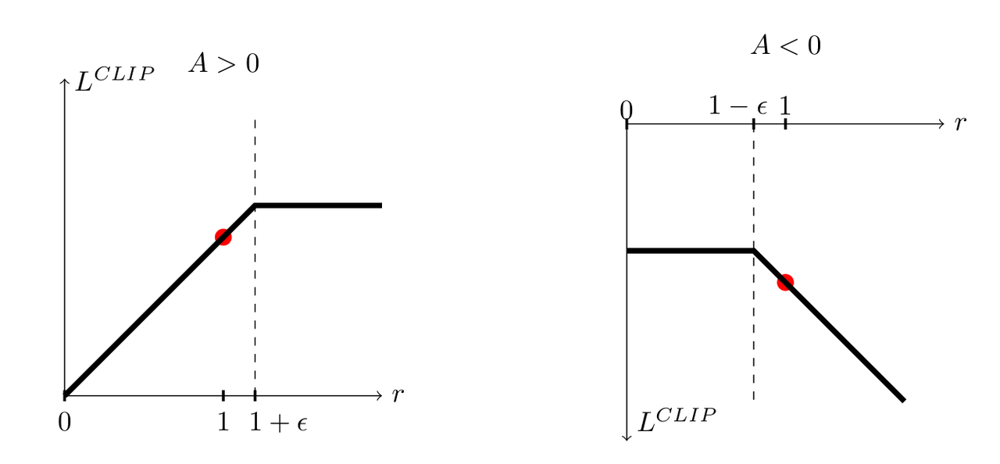

用四个标量样本检查裁剪方向，避免负优势分支写反：

```python
import numpy as np

def ppo_surrogate(ratio, advantage, epsilon=0.2):
    ratio, advantage = np.asarray(ratio), np.asarray(advantage)
    if not 0 < epsilon < 1 or ratio.shape != advantage.shape:
        raise ValueError("invalid epsilon or shapes")
    if (not np.isfinite(ratio).all() or not np.isfinite(advantage).all()
            or np.any(ratio <= 0)):
        raise ValueError("ratio must be positive and inputs finite")
    clipped = np.clip(ratio, 1 - epsilon, 1 + epsilon)
    return np.minimum(ratio * advantage, clipped * advantage)

np.testing.assert_allclose(ppo_surrogate([1.4, 0.6], [1.0, -1.0]), [1.2, -0.8])
np.testing.assert_allclose(ppo_surrogate([0.6, 1.4], [1.0, -1.0]), [0.6, -1.4])
```


- 优势为正时，增大该动作概率有利，但比率超过上界后该样本的有利收益被截平。
- 优势为负时，降低该动作概率有利，但比率低于下界后同样停止增加该样本的有利收益。反方向的坏更新并不会被对称地消除。
- 因此实现仍应监控近似 KL、clip fraction 和熵；KL 提前停止是额外保护机制，不是裁剪公式自动带来的硬约束。
- 于是优化就退化为一个普通的“一阶梯度上升问题”：
$$
      \max_{\theta}L^{CLIP}(\theta)
$$

- 直接用 SGD 或 Adam 等深度学习方法即可优化参数
- 自适应KL散度惩罚项
- 设当前批次估计的平均 KL 为 $d = \hat{\mathbb{E}}_t[D_{\mathrm{KL}}(\pi_{\mathrm{old}}(\cdot\mid s_t)\parallel\pi_\theta(\cdot\mid s_t))$。
$$
  L^{KLPEN}(\theta) = \mathbb{E}_t[r_t(\theta)\hat{A_t} - \beta * D_{KL} (\pi_{\theta(old)}(\cdot|s_t)|| \pi_{\theta}(\cdot|s_t))]
$$

- 其中  $\beta$是惩罚系数，并会根据目标 KL 值 $d_{targ}$动态调整：
$$
    if D_{KL} < \frac{d_{target}}{1.5} \implies \beta <- \frac{\beta}{2},
$$
$$
    if D_{KL} > 1.5 * d_{target} \implies \beta <- 2 * \beta
$$

- PPO的惩罚项形式用一个启发式规则自适应调  $\beta$以把平均 KL 推到目标附近( $d_{target}$)，而不是通过 KKT/对偶最优把它精确等价为一个硬约束问题，这样就避免了求复杂方程.
- KL 惩罚与 KL 约束是相关的优化形式；固定一个惩罚系数不保证等价于指定阈值的非凸约束问题，不能未经条件检查就用 KKT 声称两者等价。
- 而PPO损失函数看起来像TRPO的减法形式。但KL散度前面的参数 $\beta$和TRPO的参数 $C$（一个用数学公式严谨计算出的式子）是不一样的。
- Actor与Critic网络共享参数时的形式
- 共享特征提取层可以减少重复计算，但策略损失和价值损失也会同时影响这部分参数。
- 假设我们只优化策略的损失（例如 PPO 的  $L^{KLPEN}(\theta)$），那么反向传播时，梯度会更新共享的底层参数，使底层特征偏向于更适合策略输出。
- 如果只最小化价值函数的误差 $(V_{\theta}(s)-V^{\mathrm{target}})^2$，共享特征的变化也可能与策略需要的更新方向冲突。
- 这可能使训练出现：
- 不稳定（两个头互相干扰）
- 收敛缓慢（梯度方向不一致）
共享参数时，一种常见做法是联合优化策略、价值和熵项。先统一优化方向：下面的 $J$ 是要最大化的收益目标，而交给梯度下降优化器的是损失 $L=-J$。联合训练可以协调梯度来源，但并不保证两个任务的梯度没有冲突。

$$
J(\theta)=\mathbb E_t\left[L_t^{\mathrm{CLIP}}(\theta)-c_1(V_\theta(s_t)-V_t^{\mathrm{target}})^2+c_2\mathcal H(\pi_\theta(\cdot\mid s_t))\right].
$$

其中 $c_1,c_2\geq0$ 分别控制价值误差和熵奖励。裁剪项必须把优势乘在两个候选项上：

$$
L_t^{\mathrm{CLIP}}(\theta)=\min\left(r_t(\theta)\hat A_t,\operatorname{clip}(r_t(\theta),1-\epsilon,1+\epsilon)\hat A_t\right).
$$

这是 [PPO 原论文公式 7 与 9](https://arxiv.org/pdf/1707.06347) 的最大化约定。若使用最小化损失，策略项和熵项前面取负号，价值误差前面取正号；不能把两种写法混在同一个优化器中。

采样长度（horizon）与优化 mini-batch 大小是两个参数。多个环境各采集 T 步，先计算回报目标和优势，再把数据分成 mini-batch 进行多轮更新。T 不必等于完整 episode 的长度，也不是最小训练单元。非终止片段末尾通常需要价值 bootstrap；真正终止与时间截断的处理应按环境语义区分。

#### PPO是On-Policy学习

- PPO 收集数据 → 使用这些数据更新策略几次 → 丢弃旧数据 → 重新采样新轨迹
1️⃣ 采样阶段（第一阶段）：

- 由当前策略  $\pi_{\theta_{old}}$采样 T 步。
- 所有数据都与 $\pi_{\theta_{old}}$ 直接对应。
2️⃣ 优化阶段 （第二阶段）：

- 在这批数据上做 K 轮 mini-batch 更新。
- 这时使用的比率  $r_t = \pi_{\theta}(a_t | s_t)/ (\pi_{\theta_{old}} a_t | s_t)$。
- 因为数据来自 $\pi_{\theta_{old}}$ ，更新时是严格基于自己刚刚的表现进行学习。
3️⃣ 更新后丢弃旧数据：

- 当 $\theta$ 更新完后（ $\theta_{old}$<$\theta$ ），旧数据对应的分布已不再一致，
- 所以下一轮必须重新采样新轨迹。
这正是 on-policy 的关键约束。

- PPO 每一轮的优化都只依赖于当前策略 $\pi_{\theta_{old}}$ 采集的数据，
- 旧数据不会被放进经验池反复使用（那是 off-policy 的做法，如 DDPG、SAC）。

### 10.3 DDPG（Deep Deterministic Policy Gradient）

- DDPG 是 神经网络版的 DPG（Deterministic Policy Gradient），是 连续版的DQN
- DDPG 是首个将深度神经网络与确定性策略结合的算法（适用于连续动作空间）
- 核心特征
- 确定性策略：输出确定性的动作值，而非动作概率分布
- 连续动作空间：专门设计用于连续控制问题（如机器人控制、自动驾驶）
- Actor-Critic架构：结合策略网络（Actor）和价值网络（Critic）
- 离线学习：使用经验回放机制，支持从历史经验中学习
- 关键技术组件
- 双网络架构（Actor-Critic）
- Actor网络（策略网络）：输入状态，输出确定性动作
- 参数： $\mu(s|\theta^{\mu})$
- 目标：最大化价值函数
- Critic网络（价值网络）：评估状态-动作对的价值
- 参数： $Q(s, a | \theta^{Q})$
- 目标：准确估计 $Q$值
- 目标网络（Target Networks）
- 独立的Actor和Critic目标网络
- 参数更新采用软更新（缓慢跟踪）：
$$
        \theta^{'} <- ~~~\tau \theta + (1 - \tau) \theta^{'}
$$
(通常 $\tau =0.001$）

- 减少价值估计的波动，提高训练稳定性
- 经验回放（Experience Replay）
- 存储转移元组 $(s,a,r,s^{'},done)$
- 随机采样打破数据相关性
- 提高数据效率和训练稳定性
- 探索策略
- 在确定性动作上添加噪声：
- $a_t = \mu (s_t | \theta^{\mu}) + N$
- 常用噪声类型：OU过程噪声、高斯噪声
- 推导过程
- Actor-Critic主网络：
- Actor 输出动作  $a = \mu(s|\theta^{\mu})$
- Critic 评估动作   $Q(s, a | \theta^{Q})$
- $\mu$是一个神经网络，直接预测 $a$的最佳值。换字母$\mu$以和 $\pi$（预测动作的概率分布）区分.
- 但 $\pi$不一定不是输出确定值的，也就是说也可以用 $\pi$表示确定值输出。
- DDPG用的 Ornstein-Uhlenbeck 噪声做探索，确保预测确定值具备探索性
- $\theta$有上标 $Q$
- 数学上，尤其是强化学习领域，上标表示标记属于某个特定网络，下标通常用来标记索引、时间步或样本
- Actor 和 Critic 的参数是分开的，两套参数来自完全独立的神经网络，不共享.
- DDPG 用目标 Actor 产生下一步动作，再用目标 Critic 构造 TD 目标；它是带估计误差的监督信号，不是真实价值标签。
$$
  y_i = r_i + \gamma(1-d_i)Q'(s_{i+1},\mu'(s_{i+1};\theta^{\mu'});\theta^{Q'})
$$

- 而之前非确定网络的输出还需要使用贪心策略挑选:
$$
        y_i = r_i + \gamma(1-d_i)\max_{a'\in A}Q'(s_{i+1},a')
$$

- Critic 的损失函数:
$$
        L = \frac{1}{N} \sum_i(y_i - Q(s_i, a_i | \theta^{Q}))^2
$$

- Actor 策略梯度的损失函数
$$
        \nabla_{\theta^{\mu}}J \approx \frac{1}{N}\sum_i \nabla_a Q(s, a|\theta^{Q})|_{s=s_i, a=\mu(s_i)} \nabla_{\theta^{\mu}}\mu(s|\theta^{\mu})|s_i
$$

- 这里使用复合函数求导的链式法则，不是条件概率公式。
- 目标网络: 解决损失函数难收敛问题
- 用均方误差构造损失函数, 会通过梯度下降更新 $\theta^{Q}$, 以更新Q网络 $Q(s, a| \theta^{Q})$
$$
        L(\theta^{Q}) = \mathbb{E} [(Q(s_t, a_t | \theta^{Q}) - y_t)^2]
$$

- 实际上这里有更新循环依赖的问题: 目标值 $y_t$也来自于待更新的 $Q$网络 $Q(s, a| \theta^{Q})$
- 当 $\theta^{Q}$每次更新时, 下一次的 $y_t$计算基准也跟着改变
- 如果网络预测产生一点噪声或过估计噪声，它会在下一轮目标计算中被放大
- 这种连锁方法效应导致TD目标不稳定，表现为训练震荡甚至 $Q$值发散
- 直接用同一个网络计算目标值往往会使损失函数难以收敛。
- 一种让 $y_t$变化不要那么剧烈的方法:
- 直接复制一份原有网络 $Q$网络，记为 $Q^{'}(s, a| \theta^{Q^{'}})$
- 原有 $Q$网络依然按照梯度下降更新
$$
          \theta^{Q'} \leftarrow \tau \theta^Q + (1 - \tau)\theta^{Q'}
$$
其中 $\tau \ll 1$，论文中取 $0.001$。

- 这是“软更新”的方法，与DQN第二篇论文里面“硬更新”的方法不同
- 同理， Actor网络也运用相同的思路:
$$
          \theta^{\mu'} \leftarrow \tau \theta^\mu + (1 - \tau)\theta^{\mu'}
$$

- 于是DDPG 中不但有两套神经网络，而且每套又有对应的目标网络，- 共四个网络

| 网络类型 | 参数 | 功能 |
|--------|--------|--------|
| Actor 主网络 | $\theta^{\mu}$ | 输出确定动作 |
| Critic 主网络 | $\theta^{Q}$ | 评估动作价值 |
| Actor 目标网络 | $\theta^{\mu^{'}}$ | 提供稳定的策略估计 |
| Critic 目标网络 |  $\theta^{Q^{'}}$ | 提供稳定的 $Q$值估计 |

- Actor-Critic目标网络：
- Actor 输出动作  $a^{'} = \mu^{'}(s|\theta^{\mu^{'}})$
- Critic 评估动作  $Q^{'}(s, a | \theta^{Q^{'}})$
- 两套主网络与相应目标网络分担训练和目标估计，能缓解目标快速变化，但不保证训练稳定或收敛。
- 经验回放（Replay Buffers）
- 当智能体在环境里探索时，存储过去交互经验，把每一步经验都存入回放池 $D$
$$
      D= {(s_t, a_t, r_t, s_{s+1})}
$$

- 每条经验包含:
- $s_t$: 当前状态
- $a_t$: 执行动作
- $r_t$: 奖励
- $s_{t+1}$: 下一个状态
- 为何需要经验回收？
- 打破时间相关性
- 强化学习数据是时序相关的，但是如果直接用顺序数据训练神经网络：
- 网络容易记住最近状态的模式
- 梯度更新方差大，训练不稳定
- 经验回放通过随机抽样 minibatch，打破时间依赖：
$$
    {(s_t, a_t, r_t, s_{s+1})} \sim Uniform(D)
$$

- 同时这个“池子”是有容量的，当它满了，最老的样本就要被抛弃
因为V或Q用时序差分计算时，都需要知道下一状态 $s_{t+1}$

- 提高样本利用率
- 一条经验可以被使用多次（在不同 minibatch 中），加快训练收敛

### 10.4 TD3（Twin Delayed Deep Deterministic policy gradient）

TD3 在 DDPG 的基础上结合双 Critic 目标取小、延迟策略更新和目标策略平滑。阅读 [TD3 论文](https://proceedings.mlr.press/v80/fujimoto18a.html)与[作者实现](https://github.com/sfujim/TD3/blob/master/TD3.py)时，先区分以下三条更新路径。

<figure class="article-figure">

<figcaption><span class="article-figure__number">图 3</span><span class="article-figure__text">Critic 回归使用回放中实际执行过的动作；Actor 更新才使用当前策略新算出的动作。构造目标值时整条路径停止梯度。</span></figcaption>
</figure>

**第一条：构造 TD 目标。** 从回放池取 $(s,a,r,s',d)$，$d$ 表示真正终止。目标 Actor 先加截断噪声，再裁剪到动作上下界：

$$
\epsilon\sim\mathcal N(0,\sigma^2I),\qquad
\tilde a=\operatorname{clip}\!\left(
\mu_{\bar\theta}(s')+\operatorname{clip}(\epsilon,-c,c),
a_{\min},a_{\max}\right),
$$

$$
y=\operatorname{stopgrad}\!\left[
r+\gamma(1-d)\min_{i=1,2}Q_{\bar\phi_i}(s',\tilde a)
\right].
$$

噪声截断与动作裁剪是两次不同操作。目标平滑噪声也不同于采集数据时的探索噪声：前者改变训练目标，后者改变实际执行的动作。

**第二条：每次更新两个 Critic。** 两个网络分别最小化

$$
L_{Q_i}=\mathbb E_{\mathcal D}[(Q_{\phi_i}(s,a)-y)^2].
$$

此处 $a$ 是回放数据中的动作。取小可以抑制过估计，也可能带来低估；两个 Critic 的误差会相关，不能把四种“偏大/偏小”组合假设成等概率事件。

**第三条：延迟更新 Actor 与目标网络。** 每隔 $d_{\mathrm{policy}}$ 次 Critic 更新，最小化

$$
L_\mu=-\mathbb E_{s\sim\mathcal D}[Q_{\phi_1}(s,\mu_\theta(s))].
$$

Actor 更新时不优化 Critic 权重，但要保留从 $Q_1$ 对动作再到 $\theta$ 的梯度，不能把整个 $Q_1$ 前向放进 `no_grad()`。之后对目标 Actor 和两个目标 Critic 软更新：$\bar w\leftarrow\tau w+(1-\tau)\bar w$。更新间隔按优化次数计数，不自动等于环境步数。[Spinning Up 的 TD3 说明](https://spinningup.openai.com/en/latest/algorithms/td3.html)也给出了这三个步骤。

外部时间限制导致的截断不一定等于 $d=1$。需要根据任务是否真正终止决定 bootstrap，并取得截断前的最后观测，不能误用自动重置后的新回合观测。

### 10.5 SAC（Soft Actor-Critic）

SAC 用随机 Actor 和异策略价值学习优化最大熵目标。熵项鼓励策略保留随机性，但不保证充分探索，也不保证在每个任务上优于 PPO 或 TD3。以下先固定温度 $\alpha>0$，统一写出 soft 价值关系。

$$
V^\pi_{\mathrm{soft}}(s)=\mathbb E_{a\sim\pi}
[Q^\pi_{\mathrm{soft}}(s,a)-\alpha\log\pi(a\mid s)],
$$

$$
Q^\pi_{\mathrm{soft}}(s,a)=r(s,a)+\gamma\mathbb E_{s'}
[V^\pi_{\mathrm{soft}}(s')].
$$

固定策略 $\pi$ 反复应用评估算子，在相应收敛条件下得到的是 **$Q^\pi_{\mathrm{soft}}$**，不是最优 $Q^*$。还要执行策略改进，才构成 soft policy iteration。[原始 SAC 论文](https://proceedings.mlr.press/v80/haarnoja18b.html)分别讨论了这两个步骤；函数近似与有限样本实现不能直接继承理想迭代的全部保证。

如果能在整个动作分布空间内精确优化，固定 $Q$ 后的改进方向可写为 Boltzmann 分布

$$
p_Q(a\mid s)=\frac{\exp(Q(s,a)/\alpha)}{Z(s)},
\qquad Z(s)=\int\exp(Q(s,a)/\alpha)\,da.
$$

离散动作把积分换成求和；连续情形还要求归一化积分存在。神经网络只表达其中一个策略族，常用的改进损失为

$$
\alpha D_{\mathrm{KL}}(\pi_\phi(\cdot\mid s)\parallel p_Q(\cdot\mid s))
=\mathbb E_{a\sim\pi_\phi}[\alpha\log\pi_\phi(a\mid s)-Q(s,a)]
+\alpha\log Z(s).
$$

固定 $Q$、$\alpha$ 更新策略时，最后一项与 $\phi$ 无关，因此不必计算配分函数。有限动作集上，较大的温度使分布更平坦；连续无界动作空间不能直接照搬“温度无穷大就是均匀分布”。

**重参数化如何提供梯度？** 令

$$
u=\mu_\phi(s)+\sigma_\phi(s)\odot\epsilon,
\qquad\epsilon\sim\mathcal N(0,I),
\qquad a=c+b\odot\tanh(u).
$$

固定本次抽到的 $\epsilon$，动作是参数的可微函数，梯度可以通过 $Q(s,a)$ 对动作再流向 Actor。普通 `sample()` 与可重参数化分布的 `rsample()` 暴露的计算图不同；不能据此断言所有随机变量都“不可求导”，也不是所有分布都支持这种路径梯度。

| 环节 | 固定什么 | 更新什么 |
|---|---|---|
| 计算 TD 目标 | 下一步目标值停止梯度 | 此处不更新网络 |
| Critic 回归 | 回放中的状态、动作与 TD 目标 | 两个在线 Q 网络 |
| Actor 更新 | 回放状态、一次基础噪声样本与 Q 权重 | 策略参数；保留 Q 对动作的梯度 |
| 目标网络更新 | 更新后的在线参数 | 通过软更新修改目标参数 |

回放可以多次复用数据，但并不让数据分布永远不变。PPO 也可在同一轮 rollout 上执行多个 minibatch 更新；其限制是数据与策略变化的关系，而不是“每做一次梯度更新就必须丢弃全部数据”。

### 10.5.1 区分早期 SAC 与无独立 V 网络的版本

软价值函数可以作为数学定义存在，不要求总有一个独立 V 网络。早期 SAC 变体使用 V 及目标 V；另一常见实现保留两个 Q 网络、两个目标 Q 网络及一个随机策略，直接构造软 TD 目标。参数计数时还要区分网络与可学习的温度 α。

令 d 表示真正终止，下一步动作 a′ 从当前策略新采样：

$
y=r+\gamma(1-d)\left[
\min_{j=1,2}Q_{\bar\theta_j}(s',a')
-\alpha\log\pi_\phi(a'\mid s')
\right].
$

两个 Q 网络分别回归该停止梯度的目标：

$
L_{Q_i}=\mathbb E\left[(Q_{\theta_i}(s,a)-y)^2\right].
$

策略通过重参数化动作最小化：

$
L_\pi=\mathbb E_{s,\epsilon}\left[
\alpha\log\pi_\phi(a_\phi(s,\epsilon)\mid s)
-\min_i Q_{\theta_i}(s,a_\phi(s,\epsilon))
\right].
$

不要把“固定 α=1 的早期推导”“自适应温度”和“移除独立 V 网络”的公式拼成一个含义不明的实现。参见 [SAC 算法说明](https://spinningup.openai.com/en/latest/algorithms/sac.html)。

### 10.5.2 tanh 改变动作，也改变概率密度

设 u 为高斯样本，a=c+b⊙tanh(u)，其中 b=(high−low)/2 为正尺度，c=(high+low)/2 为中心。其 log-probability 为：

$
\log\pi(a\mid s)=\sum_i\left[
\log\mathcal N(u_i;\mu_i,\sigma_i^2)
-\log b_i-\log(1-\tanh^2u_i)
\right].
$

下面仅测试采样、密度变换和梯度，不是完整 SAC 训练。softplus 写法避免直接计算接近零的 1−tanh²(u)。

```python
import math
import torch
from torch.nn import functional as F
from torch.distributions import Normal

torch.manual_seed(42)
mean = torch.zeros((4, 2), dtype=torch.float64, requires_grad=True)
log_std = torch.full((4, 2), -0.5, dtype=torch.float64, requires_grad=True)
low = torch.tensor([-2.0, -1.0], dtype=mean.dtype)
high = torch.tensor([2.0, 3.0], dtype=mean.dtype)
scale, center = (high - low) / 2, (high + low) / 2
distribution = Normal(mean, log_std.exp())
raw = distribution.rsample()
action = center + scale * torch.tanh(raw)
log_tanh_jacobian = 2 * (math.log(2) - raw - F.softplus(-2 * raw))
log_prob = (distribution.log_prob(raw) - scale.log()
            - log_tanh_jacobian).sum(dim=-1)

assert torch.all((action >= low) & (action <= high))
assert torch.isfinite(log_prob).all()
(-log_prob.mean()).backward()  # 只验证计算图，不代表实际 SAC 的策略损失。
assert torch.isfinite(mean.grad).all()
assert torch.isfinite(log_std.grad).all()
```

动作经额外硬裁剪后，以上连续密度公式不能直接照搬；环境的动作变换也应与训练时记录的 log-probability 一致。

## 11. 训练日志的最小集合

至少同时记录 episode 回报、长度、终止/截断比例、价值损失、策略熵与实际动作范围。PPO 增加 KL 与 clip fraction，SAC 增加温度及双 Q 的统计量。日志只能帮助定位问题，不能由单个损失下降推断策略一定变好。

固定评估策略、环境版本和评估预算，报告多个随机种子的分布。不要把探索期回报、关闭探索后的回报以及不同 episode 终止规则的结果直接比较。

### 11.1 用四条轨迹核对梯度与更新路径

下载 [rl_update_checks.py](rl_update_checks.py)，在安装了 PyTorch 的环境运行 `python -B rl_update_checks.py`。脚本仅在 CPU 上检查公式与计算图，不执行环境训练。

第一个实验包含两个独立 Bernoulli 动作，$r_0=a_0$、$r_1=2a_1$，策略概率为 $p_t=\operatorname{sigmoid}(\theta_t)$。取 $\gamma=0.9$，目标可以直接求出：

$$
J=p_0+2\gamma p_1,\qquad
\nabla_\theta J=[p_0(1-p_0),\;2\gamma p_1(1-p_1)].
$$

脚本穷举四条轨迹，将解析梯度、中心差分、带外层折扣的 score-function 梯度和加入状态基线后的梯度互相比较。取 $\theta=[0.4,-0.2]$ 时，正确结果约为 `[0.240261, 0.445530]`；漏掉外层折扣后，第二项变成 `0.495033`。这个差异来自公式的权重，和采样噪声无关。

第二个实验检查 TD3 的三条路径：终止样本的目标等于即时奖励；Critic 回归不会更新 Actor 或目标网络；冻结 Critic 参数后，Actor 仍能通过动作获得非零梯度。这些检查能发现更新对象错误，但不能证明策略训练有效；最终仍需前述环境评估。


## 阅读自测与验收

- 手算正、负优势下 PPO 的四种裁剪情形，再检查 SAC 中 tanh 与动作缩放后的 log-probability。
- 区分在线/离线数据、同策略/异策略以及终止/截断；单一训练损失下降不能替代多种子的策略评估。
