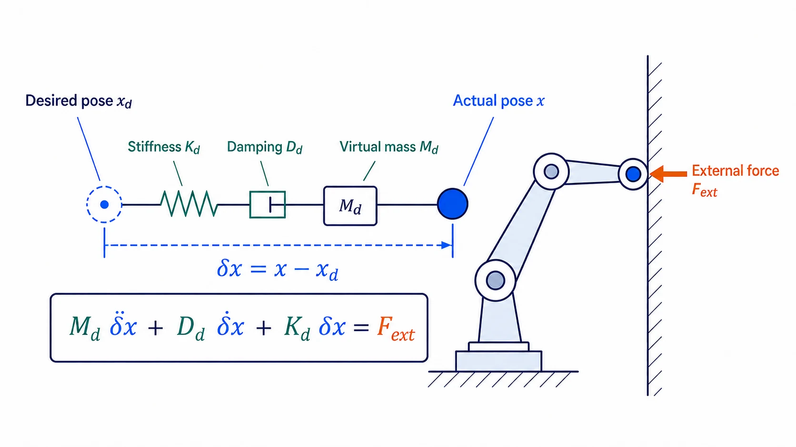
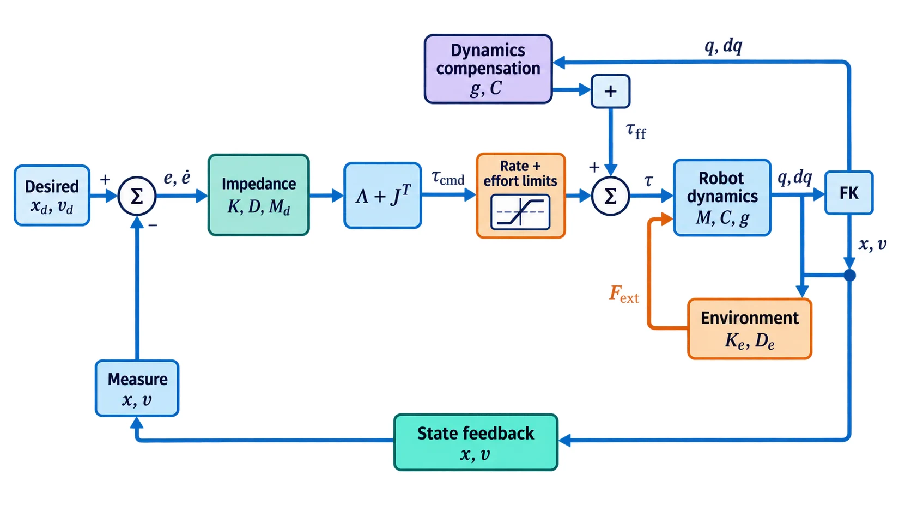
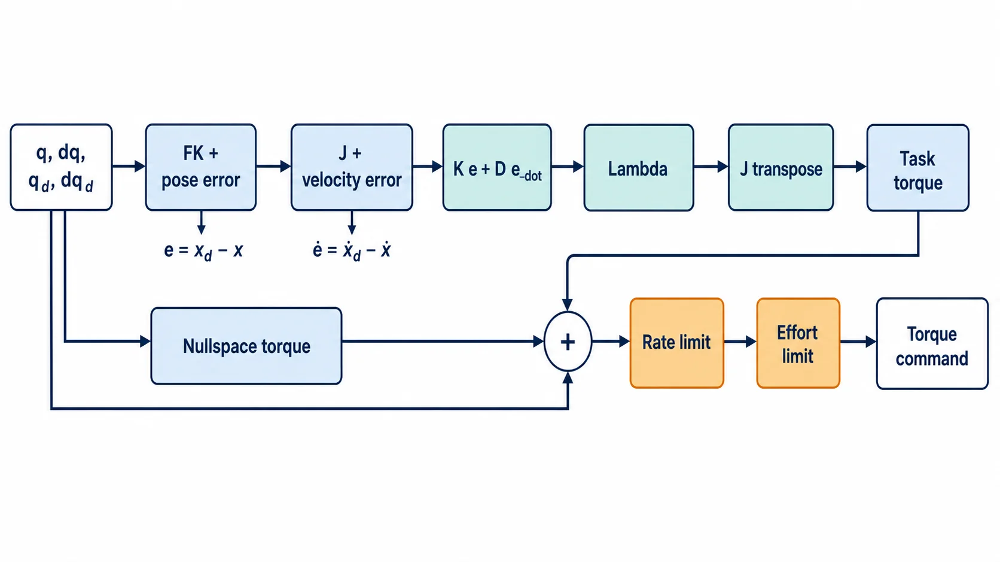
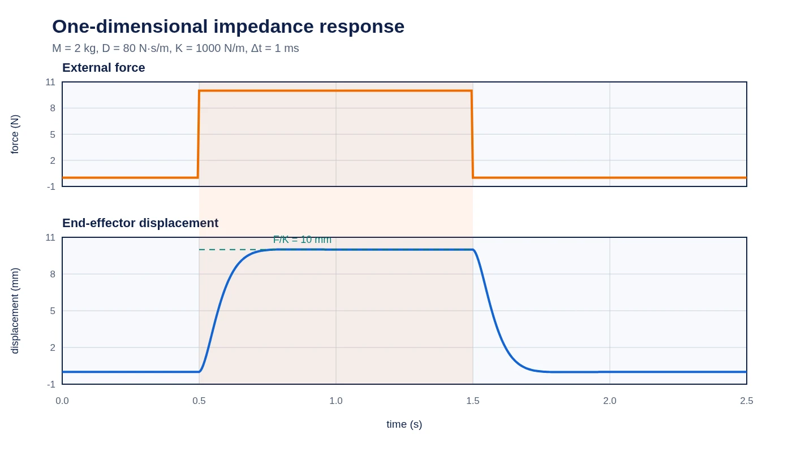
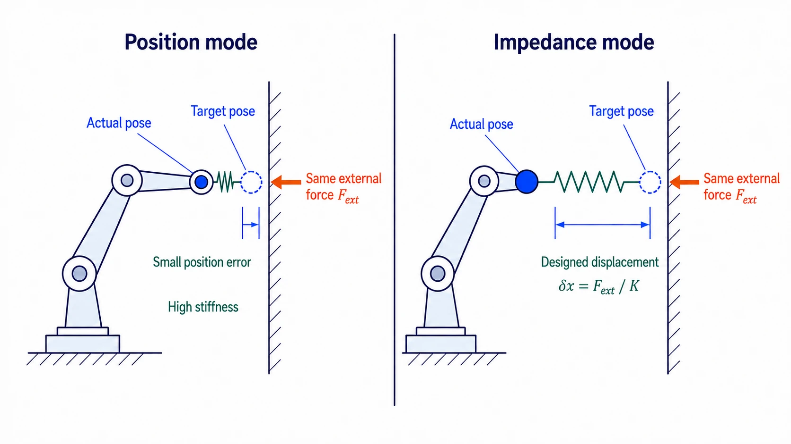
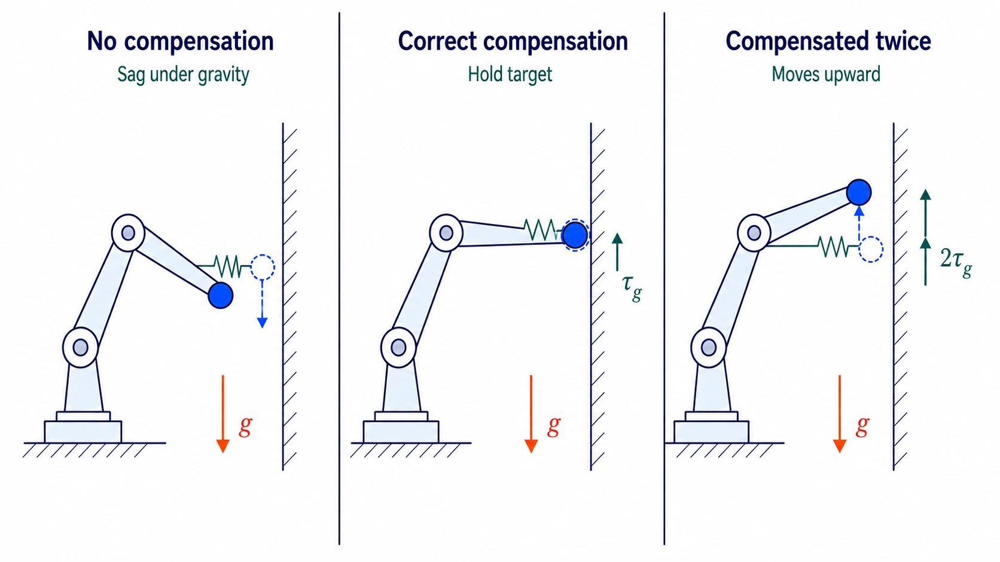

阻抗控制不直接要求机器人严格跟踪某条位置轨迹，而是规定“运动误差与交互力之间应该呈现怎样的动态关系”。它让机器人表现得像一个可调的质量—弹簧—阻尼系统，常用于装配、打磨、拖动示教、人机协作和接触任务。

阻抗控制中的 $M(q)$、$g(q)$、payload 和摩擦模型从哪里来，以及如何通过数据得到并验证，可参考[机器人动力学参数辨识专题]()。本文只讨论这些模型量进入阻抗控制后的使用方式。

> **安全提示**：阻抗控制通常最终输出关节力矩。错误的雅可比、坐标系、动力学模型、刚度或力矩限幅都可能产生危险运动。真机调试必须从低刚度、低速度和保守力矩限制开始，并具备急停、watchdog、碰撞检测和回退控制模式。

这是一篇从原理延伸到工程落地的长文，可以按目标选择阅读路径：

| 阅读目标 | 建议章节 |
| --- | --- |
| 先建立直觉并选择方案 | 第 1～3 节：阻抗关系、接口差异和实现形式 |
| 理解核心推导 | 第 4 节：位姿误差、操作空间动力学和六维增益 |
| 开始写控制器 | 第 5～7 节：零空间、实时循环、示例和 Pinocchio |
| 从需求计算参数 | 第 8 节：整定算例、离散极点和故障排查 |
| 准备真机测试 | 第 9～10 节：状态机、安全保护和量化验收 |

文中的技术图均可点击打开原始分辨率，便于在窄屏设备上查看公式和标注。

## 1. 阻抗控制到底控制什么

理想笛卡尔阻抗关系为：

$$M_d\delta\ddot x+D_d\delta\dot x+K_d\delta x=F_{ext},
\qquad \delta x=x-x_d$$

[](assets/impedance-principle-v2.webp)

其中 $\delta x=x-x_d$ 是相对目标的位移，$M_d$、$D_d$、$K_d$ 分别是期望惯性、阻尼和刚度，$F_{ext}$ 是外部作用力。直观上：

- $K_d$ 决定机器人偏离目标位置时“推回去”的力度；
- $D_d$ 抑制振荡并决定响应快慢；
- $M_d$ 决定机器人表现出的惯性感；
- 外力越大，允许产生的位移或动态响应越明显。

这里 $F_{ext}$ 表示环境施加在机器人上的外力，$\delta x$ 表示机器人相对目标的位移。控制器内部后文采用回正误差 $e=x_d-x=-\delta x$。区分这两个量可以避免把“外力导致的位移方向”和“弹簧控制力方向”混为一谈。

在静态且速度为零时：

$$F_{ext}=K_d\delta x$$

因此一维刚度为 $1000\,\mathrm{N/m}$ 时，$10\,\mathrm{N}$ 的恒定外力对应约 $10\,\mathrm{mm}$ 的静态位移。这个关系适合建立直觉，但真实机器人还受到重力补偿、摩擦、限幅和环境刚度影响。

### 1.1 本文统一使用的符号

| 符号 | 含义 | 典型维度/单位 |
| --- | --- | --- |
| $q,\dot q,\ddot q$ | 关节位置、速度、加速度 | $n\times1$；转动关节用 rad，移动关节用 m |
| $x,x_d$ | 实际与期望任务位姿 | 位姿或局部六维表示 |
| $\delta x=x-x_d$ | 外力引起的物理位移偏差 | m 与 rad |
| $e=x_d-x$ | 控制器使用的回正误差 | m 与 rad |
| $v,J\dot q$ | 末端 twist | m/s 与 rad/s |
| $F=[f;\mu]$ | 任务空间 wrench | N 与 N·m |
| $M,C,g,h$ | 关节动力学项 | 与关节坐标维度一致 |
| $\Lambda$ | 操作空间惯量 | 平移与旋转混合单位 |
| $M_d,D_d,K_d$ | 期望惯量、阻尼、刚度 | 按平移/旋转方向区分 |
| $J^{\#},N$ | 动态一致广义逆与零空间投影 | 与任务、关节维度一致 |

六维量同时包含平移和旋转分量，因此不能只写“单位为 N”或直接比较平移、旋转增益的数值。本文默认下标 $d$ 表示 desired，$ext$ 表示环境施加在机器人上的 external wrench。

## 2. 阻抗控制与导纳控制

| 对比 | 阻抗控制 | 导纳控制 |
| --- | --- | --- |
| 典型输入 | 位姿与速度误差 | 测得的外力/外力矩 |
| 典型输出 | 力/力矩命令 | 位置或速度修正量 |
| 常见底层接口 | 力矩控制机器人 | 高带宽位置/速度接口 |
| 主要依赖 | 准确动力学和可靠力矩通道 | 可靠力/力矩测量与稳定内环 |

两者描述的目标机械行为可以相似，但实现接口不同。位置控制器外面套一个“虚拟质量—弹簧—阻尼”并输出位置偏移，通常属于导纳控制；直接计算任务空间 wrench 并映射为关节力矩，通常属于阻抗控制。

## 3. 关节空间阻抗控制

最基本的关节阻抗形式是：

$$\tau=K_q(q_d-q)+D_q(\dot q_d-\dot q)+\tau_{ff}$$

$\tau_{ff}$ 可以包含重力、科氏/离心力和期望加速度前馈：

$$\tau_{ff}=M(q)\ddot q_d+C(q,\dot q)\dot q+g(q)$$

关节阻抗实现简单、计算量低，也容易逐关节限幅；但关节刚度并不直接等于末端在 $x/y/z$ 或旋转方向上的刚度。机器人姿态变化时，末端呈现的刚度也会变化。

在固定构型附近进行小位移线性化，有：

$$
\delta x\approx J(q)\delta q
$$

若希望笛卡尔虚拟弹簧储能为
$V=\frac12\delta x^TK_x\delta x$，代入上式可以得到局部等效关节刚度：

$$
\boxed{K_q\approx J^TK_xJ}
$$

当机器人恰好是非冗余、$J$ 为方阵且可逆时，可以形式化地反推：

$$
K_x\approx J^{-T}K_qJ^{-1}
$$

这个反推不能直接用于冗余机器人或奇异位形。对正定关节刚度 $K_q$，可以改从静态柔顺度推导。小外力 $F$ 引起的关节位移近似满足：

$$
\delta q=K_q^{-1}J^TF
$$

因此：

$$
\delta x=JK_q^{-1}J^TF
=C_xF
$$

末端柔顺度与刚度为：

$$
\boxed{C_x\approx JK_q^{-1}J^T},\qquad
K_x\approx C_x^{-1}
$$

最后一个逆只在任务方向满秩时成立；接近奇异位形时，某些方向柔顺度会急剧增大，不能靠普通求逆得到可靠刚度。实现时应使用矩阵分解并监控秩与条件数。

不同的零空间刚度可能对应相同或相近的末端局部行为，但关节限位裕度和内部运动会不同。即使在可逆构型，$J(q)$ 也随姿态变化，相同 $K_q$ 会产生不同 $K_x$。

在相同的小速度、零外载近似下，阻尼也可以按能量耗散关系局部映射：

$$
D_q\approx J^TD_xJ
$$

但 $J$ 随时间变化时还存在 $\dot J\dot q$、动力学耦合和滤波延迟，因此不能仅用这个式子保证动态阻尼比。

上述关系还是零外载附近的一阶近似。存在较大末端 wrench 时，$\tau=J^TF$ 对 $q$ 求导还会出现由 $\partial J^T/\partial q$ 引起的几何刚度项；结构柔性、减速器和内层伺服也会改变实测刚度。因此工程上应通过逐方向加载实验验证 $F/\delta x$，不能只由 Jacobian 换算后就宣称得到目标笛卡尔刚度。

### 3.1 根据接口和任务选择实现形式

“阻抗控制器”并不是唯一固定结构。开始编码前，应先根据底层接口和任务目标选择层级：

| 实现形式 | 典型输出 | 适用场景 | 主要代价或限制 |
| --- | --- | --- | --- |
| 关节空间阻抗 | 关节力矩 | 拖动、姿态保持、快速建立安全基线 | 末端刚度随构型变化 |
| 笛卡尔直接 wrench | $J^T(K e+D\dot e)$ | 低速接触、已有重力补偿的力矩接口 | 未显式整形操作空间惯量 |
| 操作空间逆动力学 | $J^TF_{ctrl}$ 加模型补偿 | 动态跟踪、希望各方向响应更一致 | 更依赖 $M,J,\dot J$ 和实时计算 |
| 混合位置/力或选择性阻抗 | 分方向组合的 wrench | 插入、打磨、沿曲面运动 | 接触法向和切换逻辑必须可靠 |
| 约束 QP / 分层优化 | 满足约束的关节力矩 | 多任务、限位、接触和力矩约束并存 | 求解器最坏耗时和不可行处理更复杂 |
| 导纳外环 | 位置或速度参考 | 只有位置/速度接口的机器人 | 稳定性取决于内环和力传感器延迟 |

如果机器人只暴露高刚度位置接口，就不能假装向接口发送的“力矩字段”会形成真正的力矩闭环；此时通常选择导纳外环。若机器人提供可靠的关节力矩或电流接口，也仍要确认驱动器内部是否包含重力、摩擦、速度环、碰撞限幅或额外滤波，因为这些隐藏内环会改变实际阻抗。

第一次实现建议先建立关节空间低刚度基线，验证力矩方向、重力补偿和安全状态，再增加笛卡尔映射。只有任务确实需要一致的动态响应时，才逐步加入 $\Lambda$、$\dot J\dot q$ 和完整操作空间补偿；复杂度应与可验证收益对应。

## 4. 笛卡尔空间阻抗控制

下面的闭环图同时画出了阻抗环、操作空间映射、机器人动力学、环境接触和状态反馈。橙色模块表示输出限制与外部环境，蓝绿色模块表示控制和动力学计算：

[](assets/impedance-control-loop-v3.webp)

### 4.1 位姿误差

平移误差可以直接写为：

$$e_p=p_d-p$$

旋转误差不能直接对欧拉角相减。常见做法是使用四元数或 $SO(3)$ 对数映射。若使用四元数，需要先保证当前与目标四元数符号位于同一半球，再构造最短旋转：

$$q_e=q^{-1}\otimes q_d$$

然后将轴角向量转换到控制器采用的参考坐标系。最终六维误差为：

$$e=\begin{bmatrix}e_p\\e_R\end{bmatrix},\qquad
\dot e=v_d-J(q)\dot q$$

也可以使用旋转矩阵的对数映射：

$$e_R=\operatorname{Log}(R_dR^T)^\vee$$

必须明确 $e$、速度和 wrench 都表达在基坐标系、末端坐标系还是混合坐标系中；坐标系不一致是阻抗控制方向错误的常见原因。

本文默认六维 motion 向量和 wrench 的排列为：

$$v=\begin{bmatrix}v_{linear}\\\omega\end{bmatrix},\qquad
F=\begin{bmatrix}f\\\mu\end{bmatrix}$$

其中 $f$ 是力，$\mu$ 是力矩。部分动力学库使用 `[angular, linear]` 顺序；必须同时调整 Jacobian 行、误差向量、刚度矩阵、速度和 wrench，不能只交换显示顺序。还要确认库的 frame Jacobian 是 `LOCAL`、`WORLD` 还是 `LOCAL_WORLD_ALIGNED` 定义。

#### 把坐标系写成控制器接口契约

“全部使用同一个坐标系”仍然不够具体。建议在控制器接口或设计文档中逐项冻结下面的契约，并在启动日志中打印实际选择：

| 量 | 必须冻结的定义 | 一个可行选择 |
| --- | --- | --- |
| 末端位姿 $x$ | 哪个 frame 相对哪个 frame | 工具控制点相对 base |
| 位姿误差 $e$ | 左误差还是右误差、在哪个 frame 表达 | base 中的局部六维误差 |
| $J$ 与 $\dot J$ | 参考 frame、控制点和六维排列 | `LOCAL_WORLD_ALIGNED`、工具控制点、`[linear, angular]` |
| twist $v$ | 空间速度还是体速度 | 与 $J\dot q$ 完全一致 |
| wrench $F$ | 环境作用于机器人还是机器人作用于环境 | 环境作用于机器人 |
| $K,D,M_d$ | 参数定义所在的任务 frame | 固定任务 frame $T$ |
| 力传感器数据 | 传感器原点、轴方向和去偏方式 | 经工具重力补偿后转换到控制点 |

这里的“工具控制点”不一定等于 URDF 末端 frame 或力传感器原点。假设控制点相对传感器原点有位移 $r$，在不改变表达方向的简化情形下，控制点处的等效力矩包含力臂项：

$$
\mu_{control}=\mu_{sensor}+r\times f
$$

$r$ 的方向取决于变换定义；实现时应通过完整 wrench 变换得到，不能看到该式后凭经验选择正负号。

提交真机前至少做三个不依赖复杂轨迹的方向测试：

1. **单位关节速度测试**：逐关节令 $\dot q_j>0$，比较 $J\dot q$ 与 FK 有限差分得到的末端速度，确认行顺序、方向和控制点一致。
2. **虚功测试**：随机取小量 $\delta q$ 和 wrench $F$，用两次 FK 得到实际微小位移 $\delta x_{FK}$，检查
   $F^T\delta x_{FK}\approx(J^TF)^T\delta q$；再跨 frame 检查 $F^Tv$ 在变换前后不变。若等式两边都直接复用同一个 $J$，只能验证代数恒等式，发现不了错误的 Jacobian 定义。
3. **单位 wrench 测试**：在仿真或悬空低限幅状态下，依次施加六个很小的正向 wrench，确认 $J^TF$ 产生的末端运动趋势与标注轴一致；每一轴单独测试，出现反向立即停止。

第一项验证运动映射，第二项验证 motion/wrench 的对偶关系，第三项验证从控制输出回到真实机构的完整符号链。三项都通过，才说明“公式一致”真正延伸到了库接口和机器人接线。

### 4.2 虚拟弹簧—阻尼 wrench

最常见的目标 wrench 为：

$$F_{imp}=K_de+D_d\dot e+K_i\int e\,dt$$

积分项不是阻抗控制的必需组成。它可以减小摩擦或模型偏差导致的稳态误差，但会在接触、饱和和目标突变时积累，因此必须限幅、复位并采用 anti-windup。

若 $M_d,K_d$ 取对角形式，并希望各轴阻尼比为 $\zeta$，可以使用：

$$D_d=2\zeta\sqrt{M_dK_d}$$

等价地，可先选择期望自然频率 $\omega_n=2\pi f_n$：

$$K_d=M_d\omega_n^2,\qquad D_d=2\zeta M_d\omega_n$$

$\zeta=1$ 对应临界阻尼的常用起点，但离散采样、模型误差、通信延迟和环境刚度都会改变实际稳定裕度。

这里的误差和外力符号必须与实现保持一致。本文采用 $e=x_d-x$ 生成回正 wrench，同时用 $\delta x=x-x_d$ 描述外力产生的物理位移。环境施加在机器人上的力与机器人施加在环境上的力方向也相反；改变约定时，弹簧、阻尼和外力方程必须整体一致，不能只修改其中一个负号。

### 4.3 操作空间惯量与力矩映射

先从关节动力学开始：

$$M(q)\ddot q+h(q,\dot q)=\tau+J^TF_{ext}$$

$h$ 汇总科氏、离心和重力项。忽略零空间并假设任务满秩，可将其写成操作空间形式：

$$\Lambda(q)\ddot x+\mu(q,\dot q)+p(q)=F_{ctrl}+F_{ext}$$

机器人质量矩阵为 $M(q)$，末端雅可比为 $J(q)$，操作空间惯量为：

$$\Lambda(q)=\left(JM^{-1}J^T\right)^{-1}$$

最直接的逆动力学阻抗令：

$$F_{ctrl}=\mu+p+\Lambda\ddot x_d
-D_d\delta\dot x-K_d\delta x$$

代回操作空间动力学后得到：

$$\boxed{\Lambda\delta\ddot x+D_d\delta\dot x+K_d\delta x=F_{ext}}$$

这说明闭环的表观惯量自然是随构型变化的 $\Lambda(q)$，而刚度和阻尼由控制器指定。对应关节力矩为：

$$\tau_{task}=J^TF_{ctrl}$$

若只关心较慢的准静态接触，常省略完整的惯量、$\mu$ 和 $p$ 整形，仅用 $J^T(K_de+D_d\dot e)$ 加上接口所需的动力学补偿。

若希望指定与 $\Lambda$ 不同的常量虚拟惯量 $M_d$，一种常见中间步骤是先计算期望任务加速度：

$$\ddot x_{cmd}=\ddot x_d+M_d^{-1}F_{imp}$$

考虑 $\dot J\dot q$ 后，任务空间 wrench 可以写为：

$$F_{task}=\Lambda\left(\ddot x_{cmd}-\dot J\dot q\right)$$

然后映射为任务力矩：

$$\tau_{task}=J^TF_{task}$$

但必须注意：仅使用上述加速度映射而不反馈 $F_{ext}$，通常不能对任意 $M_d$ 精确实现开头定义的
$M_d\delta\ddot x+D_d\delta\dot x+K_d\delta x=F_{ext}$；外力通道仍受到真实 $\Lambda$ 影响。精确惯量整形需要一致推导外力反馈项，并依赖可靠的外力测量或估计。许多工程控制器因此接受自然表观惯量，重点整形 $K_d,D_d$，或只在低频范围内近似目标 $M_d$。

接近奇异位形时，$JM^{-1}J^T$ 可能病态。工程实现需要稳定伪逆、阻尼正则化、奇异值监控和速度/力矩降级策略，不能直接对矩阵求逆。

#### 两种常见实现为什么公式不同

较简单的实现直接将弹簧—阻尼输出视为期望 wrench：

$$F_{cmd}=K_de+D_d\dot e,\qquad \tau_{task}=J^TF_{cmd}$$

这种形式直观、计算量较低，常用于已具备重力补偿的力矩接口。另一种形式先把阻抗输出解释为虚拟系统中的“驱动力”，通过 $M_d^{-1}$ 得到期望加速度，再使用 $\Lambda$ 进行操作空间惯量整形：

$$\tau_{task}=J^T\Lambda\left[M_d^{-1}(K_de+D_d\dot e)-\dot J\dot q\right]$$

两种形式中的 $K,D$ 数值含义不完全相同，不能直接复制参数。阅读或移植控制器时，应先确认中间量究竟表示 wrench、加速度还是已经经过操作空间惯量整形的 wrench。

### 4.4 各向异性刚度与任务坐标系

实际接触任务通常不希望六个方向使用相同刚度。例如插孔时，可以沿插入轴设置较低刚度以顺应接触，横向设置适中刚度用于对准，绕插入轴设置较低旋转刚度避免卡死：

$$K_T=\operatorname{diag}(k_x,k_y,k_z,k_{rx},k_{ry},k_{rz})$$

这里的 $K_T$ 通常定义在工具或任务坐标系 $T$ 中。若控制误差和 wrench 在基坐标系 $B$ 中表达，需要使用伴随变换将刚度、阻尼和误差一致地转换，不能仅旋转平移的三个对角元素。对只考虑同一点纯旋转的简化情形，可写成：

$$K_B=\mathcal R K_T\mathcal R^T,\qquad
\mathcal R=\operatorname{diag}(R_{BT},R_{BT})$$

当坐标原点也发生平移时，应使用完整的 wrench/twist 伴随变换。否则力与力矩之间的耦合会被遗漏。

设 ${}^BT_T=(R,p)$ 表示任务坐标系 $T$ 在基坐标系 $B$ 中的位姿。按本文 `[linear, angular]` 排列，twist 的伴随矩阵为：

$$
A=\operatorname{Ad}_{{}^BT_T}
=\begin{bmatrix}
R &[p]_\times R\\
0 &R
\end{bmatrix}
$$

于是 twist 与 wrench 分别按互为对偶的方式变换：

$$
{}^Bv=A\,{}^Tv,\qquad
{}^BF=A^{-T}\,{}^TF
$$

这里的逆转置保证功率不随坐标表示改变：

$$
({}^BF)^T{}^Bv=({}^TF)^T{}^Tv
$$

对小位移误差，若 ${}^B\delta x=A{}^T\delta x$ 且
${}^TF=K_T{}^T\delta x$，则刚度矩阵应变换为：

$$
K_B=A^{-T}K_TA^{-1}
$$

阻尼矩阵使用同样的双边变换。若控制点相对传感器原点有偏移 $p$，纯力还会产生 $p\times f$ 力矩；这就是只旋转前三维力向量会出错的直接原因。不同库对 ${}^BT_T$ 的方向、空间向量排列和 `LOCAL/WORLD` 定义可能不同，使用公式前必须先核对约定。

混合位置/力或选择性阻抗控制还可以使用选择矩阵 $S$：

$$F=S F_{motion}+(I-S)F_{force}$$

$S$ 选择运动/阻抗控制方向，$I-S$ 选择力控制方向。切换方向或接触状态时必须平滑更新参考值和积分状态，避免 wrench 跳变。

### 4.5 六维增益矩阵必须满足什么条件

对角矩阵容易整定，但完整的 $6\times6$ 矩阵可以表达轴间耦合。例如沿倾斜表面法向的柔顺，应先在任务坐标系中定义主方向增益，再整体变换到控制坐标系，而不是分别猜测基坐标系的 $x/y/z$ 参数。

为了让无外力的理想系统具有正的储能和耗散，通常要求：

$$
M_d=M_d^T\succ0,\qquad
K_d=K_d^T\succeq0,\qquad
D_d=D_d^T\succeq0
$$

对应的候选储能函数为：

$$
V=\frac{1}{2}\delta\dot x^TM_d\delta\dot x
+\frac{1}{2}\delta x^TK_d\delta x
$$

若矩阵存在明显非对称部分、负特征值或非常大的条件数，控制器可能在某些方向主动注入能量，或因数值误差产生异常 wrench。加载配置时应先对称化候选矩阵并检查特征值；但不能把严重错误的矩阵“修正后继续运行”，而应拒绝该配置并报告来源。

当 $M_d$ 和 $K_d$ 不是同时对角化的简单情形时，逐元素使用
$D_d=2\zeta\sqrt{M_dK_d}$ 不再严谨，因为 $M_dK_d$ 一般不对称。可以先通过广义特征值问题

$$
K_d\phi_i=\omega_i^2M_d\phi_i
$$

得到模态方向与自然频率，再在模态坐标中指定阻尼比并变换回来。工程上若没有明确的耦合需求，优先在物理含义清楚的任务坐标系使用对角参数，通常更容易验证。

在线改变完整增益矩阵时，每个时刻仍需保持上述半正定/正定条件。两个有效矩阵的线性凸组合仍保持半正定，但突然改变刚度会改变存储能量；因此即使插值后的矩阵数学有效，也仍应使用变化率限制或能量约束。

## 5. 冗余机器人的零空间控制

当关节自由度多于任务维度时，可以在不明显影响末端任务的方向上调节关节姿态。动态一致广义逆为：

$$J^{\#}=M^{-1}J^T\Lambda$$

力矩空间零空间投影可写为：

$$N^T=I-J^TJ^{\#T}$$

零空间力矩为：

$$\tau_{null}=N^T\left(K_n(q_n-q)-D_n\dot q\right)$$

总目标力矩：

$$\tau^*=\tau_{task}+\tau_{null}+\tau_{model}$$

$\tau_{model}$ 是否需要单独包含重力/科氏补偿，取决于任务 wrench 推导和底层接口约定。最危险的错误之一是同一动力学项被补偿两次，或完全遗漏。

零空间目标不一定只是固定关节姿态，也可以来自一个代价函数 $V(q)$：

$$\tau_{null}=N^T\left(-k_n\nabla_qV(q)-D_n\dot q\right)$$

常见代价包括偏离中间关节位置、接近软限位以及可操作度降低。例如一个简单的归一化关节居中代价为：

$$V_{center}(q)=\frac{1}{2}\sum_i
\left(\frac{q_i-q_{mid,i}}{q_{max,i}-q_{min,i}}\right)^2$$

靠近机械限位时可以使用增长更快的 barrier，但梯度必须限幅并在软限位内提前生效。零空间投影只表示理想模型下不影响主任务；模型误差、数值伪逆、离散延迟和饱和仍会造成耦合。因此零空间力矩、变化率和势函数梯度都需要独立限制，并在主任务误差或奇异性增大时降低权重。

## 6. 通用实现流程

一个完整的笛卡尔阻抗控制循环可以按下图组织：

[](assets/cartesian-impedance-pipeline.webp)

核心关系与代码对应如下：

| 实现步骤 | 通用计算内容 |
| --- | --- |
| 位置/姿态误差 | `err_p`、`err_w`，并进行误差限幅 |
| 末端速度误差 | `v_cmd - J * feedback_dq` |
| 阻抗 wrench | `stiffness * error + damping * velocity_error + integral` |
| 操作空间惯量 | `lambda = pinv(J * M^-1 * J.transpose())` |
| 任务力矩 | `tau_task = J.transpose() * F_impedance` |
| 零空间 | 动态一致投影矩阵 `Np` |
| 输出保护 | 力矩变化率限制与逐关节 effort limit |

积分常见做法是只作用于平移误差，旋转误差不积分；控制器复位时应清除积分状态和上一周期力矩命令。无效维度、非有限输入、质量矩阵分解失败或中间结果非有限时，控制器应拒绝更新并进入预先验证的安全状态。

闭环图中的 `Dynamics compensation` 是可选支路。基本目标力矩可写成：

$$\tau_{target}=\tau_{task}+\tau_{nullspace}$$

是否再显式叠加 $g(q)$ 或 $C(q,\dot q)\dot q$，取决于底层力矩接口或驱动器是否已经补偿这些项。既不能默认存在，也不能在两个层级重复补偿。

### 6.1 输出保护的正确顺序

设本周期未经限制的力矩为 $\tau_{raw,k}$，上一周期真正发送给驱动器的命令为 $\tau_{cmd,k-1}$。先限制单周期变化量：

$$
\Delta\tau_k=\operatorname{clip}
\left(\tau_{raw,k}-\tau_{cmd,k-1},
-\dot\tau_{max}\Delta t,\dot\tau_{max}\Delta t\right)
$$

再应用绝对力矩限制：

$$
\tau_{cmd,k}=\operatorname{clip}
\left(\tau_{cmd,k-1}+\Delta\tau_k,
-\tau_{max},\tau_{max}\right)
$$

下一周期必须以 $\tau_{cmd,k}$ 而不是 $\tau_{raw,k}$ 为变化率限制的起点。若驱动层还会执行更严格的动态限幅，最好读取或估计其实际接受的命令，否则上层控制器会误以为期望 wrench 已经执行。

力矩限幅会改变任务 wrench 的方向，不只是缩小其模长。逐关节独立裁剪后，笛卡尔空间可能产生非期望分量；高风险接触任务可进一步使用带关节力矩约束的二次规划，使任务误差、零空间目标和力矩边界在同一个优化问题中协调。

### 6.2 积分项与 anti-windup

最简单的积分状态更新为：

$$
\eta_k=\operatorname{clip}
\left(\eta_{k-1}+e_k\Delta t,-\eta_{max},\eta_{max}\right),
\qquad F_i=K_i\eta_k
$$

仅限制 $\eta$ 的大小还不够：当关节力矩已经饱和时，积分仍可能继续朝错误方向累积。常见处理有两种：

1. **条件积分**：输出饱和且当前误差会进一步加重饱和时暂停积分；误差有助于退出饱和时允许释放积分。
2. **反算回馈**：根据实际可实现 wrench 与未限幅 wrench 的差值，将积分状态拉回。

反算形式可以写成：

$$
\dot\eta=e+K_{aw}\left(F_{achieved}-F_{raw}\right)
$$

其中 $F_{achieved}$ 可由限幅后的任务力矩通过稳定的 $J^{T\#}$ 近似恢复。接近奇异位形时该估计不可靠，应退回条件积分或直接冻结积分。目标切换、接触状态切换、控制器重新使能、长时间饱和和故障恢复时，都应明确决定积分是清零、保持还是平滑衰减，不能沿用未定义的旧状态。

### 6.3 速度滤波、时间对齐与实时循环

阻尼项直接使用速度，因此编码器差分噪声会被 $D_d$ 放大为力矩噪声。若驱动器没有提供质量足够的关节速度，可以先差分再低通：

$$
\dot q_k^{raw}=\frac{q_k-q_{k-1}}{\Delta t_k},\qquad
\dot q_k^f=\alpha_k\dot q_{k-1}^f+(1-\alpha_k)\dot q_k^{raw}
$$

一阶低通系数应由实际周期和截止频率计算：

$$
\alpha_k=e^{-2\pi f_c\Delta t_k}
$$

滤波截止频率过高不能有效抑制噪声，过低则引入相位滞后并削弱实际阻尼。应根据速度噪声频谱和目标闭环带宽选择 $f_c$，并把滤波器加入离散仿真，而不是只在真机代码里临时增加。

$q$、$\dot q$、关节力矩和外力若来自不同传感器，必须按时间戳对齐。使用“最新一帧”并不等于同一时刻，尤其是外部力传感器或网络状态反馈。延迟为 $T_d$ 时，可以在低速条件下用
$q(t)\approx q(t-T_d)+\dot q(t-T_d)T_d$ 做有限预测，但预测不能替代可靠同步，也不适合高速或强接触阶段。

实时控制循环还应遵循以下约束：

- 用实际测得的 $\Delta t_k$ 更新滤波器、积分器和变化率限制，同时对异常周期设置上下界；
- 预分配矩阵和日志缓冲区，循环内避免动态内存分配、文件写入和格式化输出；
- 参数更新通过无锁快照或双缓冲进入实时线程，并在非实时线程完成合法性检查；
- 动力学分解失败时不要复用未初始化结果，也不要在实时线程中重建模型；
- 将日志写入有界环形缓冲区，由非实时线程异步落盘，并监控丢弃计数；
- 区分传感器时间戳、控制计算时间和命令生效时间，以便离线重建真实延迟。

如果计算时间长期逼近控制周期，即使尚未发生 deadline miss，也应该降级。操作空间求解、SVD 和日志不能无限挤占安全裕度；应在目标硬件上统计计算耗时分布，而不只记录平均值。

## 7. 可运行示例与控制循环

### 7.1 一维阻抗仿真

下面的 Python 示例模拟：机器人末端在 $0.5\sim1.5\,\mathrm{s}$ 受到 $10\,\mathrm{N}$ 外力，期望阻抗为 $M_d=2\,\mathrm{kg}$、$D_d=80\,\mathrm{N\cdot s/m}$、$K_d=1000\,\mathrm{N/m}$。理论静态位移为：

$$\delta x_{ss}=\frac{F_{ext}}{K_d}=0.01\,\mathrm{m}$$

```python
import csv

dt = 0.001
duration = 2.5
mass = 2.0          # kg
damping = 80.0      # N*s/m
stiffness = 1000.0  # N/m

position = 0.0
velocity = 0.0
rows = []

for step in range(int(duration / dt) + 1):
    time_s = step * dt
    external_force = 10.0 if 0.5 <= time_s < 1.5 else 0.0

    # M*x_ddot + D*x_dot + K*x = F_ext
    acceleration = (
        external_force - damping * velocity - stiffness * position
    ) / mass
    velocity += acceleration * dt
    position += velocity * dt

    if step % 10 == 0:
        rows.append((time_s, external_force, position, velocity))

with open("impedance_response.csv", "w", newline="") as output:
    writer = csv.writer(output)
    writer.writerow(["time_s", "force_n", "position_m", "velocity_m_s"])
    writer.writerows(rows)

peak_during_force = max(
    abs(position_m) for time_s, _, position_m, _ in rows
    if 0.5 <= time_s < 1.5
)
final_position = rows[-1][2]

print(f"expected static displacement: {10.0 / stiffness:.6f} m")
print(f"peak displacement:            {peak_during_force:.6f} m")
print(f"final position:               {final_position:.6f} m")

assert peak_during_force < 0.02
assert abs(final_position) < 1e-4
```

可以直接[下载完整示例 `impedance_1d.py`](impedance_1d.py)，或将上面的代码保存为同名文件后执行：

```bash
python3 impedance_1d.py
```

预期输出接近：

```text
expected static displacement: 0.010000 m
peak displacement:            0.010013 m
final position:               -0.000000 m
```

[](assets/impedance-response.webp)

程序会生成 `impedance_response.csv`。可以绘制 `force_n` 和 `position_m`，检查施力后位移是否趋近 $10\,\mathrm{mm}$、撤去外力后是否平稳回零。示例采用先更新速度、再更新位置的半隐式 Euler，只用于教学；真实控制器需要结合采样周期选择经过稳定性验证的离散化方法。

这组参数对应的自然频率和阻尼比为：

$$
f_n=\frac{1}{2\pi}\sqrt{\frac{K_d}{M_d}}
\approx3.56\,\mathrm{Hz},\qquad
\zeta=\frac{D_d}{2\sqrt{M_dK_d}}\approx0.894
$$

$\zeta$ 略小于 1，因此响应较快并只有很小超调。示例峰值约为
$10.013\,\mathrm{mm}$，相对 $10\,\mathrm{mm}$ 静态值的超调约为：

$$
M_p=\frac{x_{peak}-x_{ss}}{x_{ss}}\times100\%
\approx0.13\%
$$

若只将刚度提高到 $2000\,\mathrm{N/m}$，同样的外力会把静态位移减为 $5\,\mathrm{mm}$，但在质量和阻尼不变时，自然频率升高、阻尼比下降，响应可能更容易超调。若希望保持相同阻尼比，应同步按 $D_d\propto\sqrt{K_d}$ 调整阻尼。这个例子说明“刚度更高”不仅改变静态柔顺度，也同时改变闭环动态。

### 7.2 六维控制循环骨架

下面是与上述通用结构一致的伪代码：

```cpp
CartesianImpedanceController controller(model, end_effector_frame, dt);

Vector6d stiffness;
stiffness << 100, 100, 100, 10, 10, 10;
controller.SetStiffness(stiffness);
controller.SetDampingRatio(Vector6d::Ones());

while (running) {
    Eigen::VectorXd q = ReadJointPosition();
    Eigen::VectorXd dq = ReadJointVelocity();
    Eigen::VectorXd q_cmd = ReadSafePositionReference();
    Eigen::VectorXd dq_cmd = ReadSafeVelocityReference();

    Eigen::VectorXd tau;
    if (!controller.Update(q, dq, q_cmd, dq_cmd, tau)) {
        EnterSafeState();
        break;
    }
    SendTorqueCommand(tau);
}
```

示例刚度仅用于说明 API，不是任何真实机器人的安全参数。实际值必须结合负载、采样周期、结构柔性、传感器噪声、环境刚度和关节力矩限制验证。

### 7.3 使用 Pinocchio 计算动力学量

Pinocchio 可以提供 FK、frame Jacobian、$\dot J$ 和质量矩阵。下面是 C++ 风格的核心计算骨架，具体函数签名应以所使用的 Pinocchio 版本为准：

```cpp
pinocchio::Data data(model);

pinocchio::forwardKinematics(model, data, q, dq);
pinocchio::updateFramePlacements(model, data);

Eigen::MatrixXd J = Eigen::MatrixXd::Zero(6, model.nv);
pinocchio::computeFrameJacobian(
    model, data, q, frame_id,
    pinocchio::ReferenceFrame::LOCAL_WORLD_ALIGNED, J);

pinocchio::computeJointJacobiansTimeVariation(model, data, q, dq);
Eigen::MatrixXd Jdot = Eigen::MatrixXd::Zero(6, model.nv);
pinocchio::getFrameJacobianTimeVariation(
    model, data, frame_id,
    pinocchio::ReferenceFrame::LOCAL_WORLD_ALIGNED, Jdot);

Eigen::MatrixXd M = pinocchio::crba(model, data, q);
M.triangularView<Eigen::StrictlyLower>() =
    M.transpose().triangularView<Eigen::StrictlyLower>();

const Eigen::MatrixXd M_inv_Jt = M.ldlt().solve(J.transpose());
Eigen::MatrixXd lambda =
    DampedPseudoInverse(J * M_inv_Jt, damping);

Eigen::VectorXd task_acceleration = desired_task_acceleration
    + virtual_mass.ldlt().solve(K * error + D * velocity_error);
Eigen::VectorXd task_wrench =
    lambda * (task_acceleration - Jdot * dq);
Eigen::VectorXd task_torque = J.transpose() * task_wrench;
```

实现时要保持 `ReferenceFrame` 一致：位姿误差、twist、$J$、$\dot J$ 和 wrench 必须在相容坐标系表达。不要显式计算 $M^{-1}$ 或 $\Lambda^{-1}$ 的普通逆，应使用 LDLT/LLT 求解和带阻尼伪逆，并检查分解、维度和非有限结果。

Pinocchio 还可以分别计算纯重力项和包含科氏/离心项的非线性项：

```cpp
Eigen::VectorXd gravity =
    pinocchio::computeGeneralizedGravity(model, data, q);

Eigen::VectorXd nonlinear =
    pinocchio::nonLinearEffects(model, data, q, dq);
```

其中 `gravity` 对应 $g(q)$，而 `nonlinear` 对应 Pinocchio 刚体模型中的
$C(q,\dot q)\dot q+g(q)$。因此常见输出只能根据接口契约选择一种：

```cpp
// A. 原始力矩接口，只补偿重力
tau_command = tau_impedance + gravity;

// B. 原始力矩接口，控制律需要完整刚体非线性补偿
tau_command = tau_impedance + nonlinear;

// C. 底层已经完成所需补偿
tau_command = tau_impedance;
```

不能使用 `tau_impedance + gravity + nonlinear`，因为 `nonlinear` 已经包含重力。Pinocchio 默认不会替驱动器发送或执行补偿，它只根据模型计算数值；究竟选择 A、B 还是 C，仍由机器人力矩接口和控制律推导决定。

工具与 payload 必须已经体现在用于构建 `model` 的惯性参数中，否则 `gravity` 和 `nonlinear` 都只对应空载或旧负载。运行时切换 payload 时，应构造并批准对应模型版本，避免实时线程临时修改尚未验证的惯性数据。

若已知期望关节加速度，RNEA 可以计算完整逆动力学力矩：

```cpp
Eigen::VectorXd tau_inverse_dynamics =
    pinocchio::rnea(model, data, q, dq, desired_joint_acceleration);
```

其理想刚体含义是：

$$
\tau_{inverse\ dynamics}
=M(q)\ddot q_d+C(q,\dot q)\dot q+g(q)
$$

当 `desired_joint_acceleration` 为零时，RNEA 的刚体部分与 `nonLinearEffects` 对应；它并不包含 URDF 刚体模型之外的摩擦、线缆力或驱动器内部补偿。

不能把 `tau_inverse_dynamics` 无条件加到前面已经通过
$J^T\Lambda\ddot x_{cmd}$ 计算出的任务力矩上，因为两条路径都可能包含惯量和非线性补偿。常见正确结构有两类：

1. 在操作空间完整推导 $F_{ctrl}$，再映射为 $J^TF_{ctrl}$，只补充推导中尚未包含的关节空间项。
2. 先把任务目标转换为一致的 $\ddot q_d$，再使用一次 RNEA 计算完整关节力矩。

两种结构都可以成立，但不能把它们各自的“完整输出”相加。代码审查时应给每个力矩分量标注来源，例如 `tau_task`、`tau_gravity`、`tau_coriolis`、`tau_null`，并写出它是否已经包含在其他分量中。

如果使用其他库，例如 RBDL、Drake、KDL 或厂商动力学 SDK，也可以按同一接口组织：模型层提供 FK、$J$、$\dot J$、$M$ 和非线性项，阻抗控制层只负责误差、目标 wrench、零空间和安全限制。

### 7.4 一份可审查的参数配置示例

不要把增益和限幅散落在控制代码中。下面的 YAML 展示一种通用组织方式，便于版本管理、离线检查和运行日志关联。可以直接[下载示例配置 `impedance_example.yaml`](impedance_example.yaml)：

```yaml
schema_version: 1
config_id: cartesian-impedance-sim-001
model_hash: replace-with-urdf-sha256

frames:
  base: base_link
  controlled: tool0
  reference: local_world_aligned
  spatial_order: [linear, angular]

interface:
  command: raw_joint_torque
  driver_compensation: none

control:
  period_s: 0.001
  formulation: inertia_shaped
  model_compensation: gravity
  stiffness: [300.0, 300.0, 200.0, 12.0, 12.0, 8.0]
  damping_ratio: [1.0, 1.0, 1.0, 1.0, 1.0, 1.0]
  virtual_mass: [3.0, 3.0, 3.0, 0.15, 0.15, 0.10]
  integral_gain: [0.0, 0.0, 0.0, 0.0, 0.0, 0.0]

filter:
  joint_velocity_cutoff_hz: 30.0
  external_wrench_cutoff_hz: 20.0

nullspace:
  enabled: false
  stiffness: 0.0
  damping_ratio: 1.0

safety:
  translation_error_m: [0.02, 0.02, 0.02]
  rotation_error_rad: [0.10, 0.10, 0.10]
  wrench_abs_limit: [20.0, 20.0, 20.0, 3.0, 3.0, 3.0]
  torque_rate_nm_s: 100.0
  state_timeout_s: 0.005
  consecutive_deadline_misses: 3
```

六维数组顺序与 `spatial_order` 对应：前三项分别使用 N/m、kg 或 N，后三项分别使用 N·m/rad、kg·m² 或 N·m。该示例刻意关闭积分和零空间，数值只用于仿真演示，不能作为特定机器人的真机推荐参数。逐关节绝对力矩上限应来自机器人手册和风险评估，通常还需要单独配置，不能用一个通用数值替代。

`driver_compensation` 描述驱动器已经完成的补偿，`model_compensation` 描述本文控制器还要增加的补偿。后者建议只允许 `none`、`gravity` 和 `nonlinear` 三种枚举值。示例表示驱动器接收原始关节力矩，上层仅加入重力补偿。`formulation` 只允许 `direct_wrench` 或 `inertia_shaped`，接口 `command` 则明确区分 `raw_joint_torque` 与 `compensated_joint_torque`。

控制器加载配置时至少应验证：数组长度均为 6、所有元素有限、质量和刚度非负、阻尼比非负、截止频率低于 Nyquist 频率、frame 存在、模型哈希匹配，以及安全限制不超过硬件允许值。若 `driver_compensation` 已包含重力，则 `model_compensation: gravity` 或 `nonlinear` 应判定为冲突并拒绝使能，而不是只打印警告。运行日志应记录最终生效配置的完整内容或哈希，而不只是文件路径，因为同一路径下的文件可能已经改变。

可以[下载配置校验脚本 `validate_impedance_config.py`](validate_impedance_config.py)。脚本依赖 PyYAML，运行方式为：

```bash
python3 -m pip install pyyaml
python3 validate_impedance_config.py impedance_example.yaml
```

正常输出为：

```text
valid: impedance_example.yaml
```

该示例会检查主要数值约束和补偿互斥关系，但不会读取机器人厂商的真实关节力矩上限，也无法判断 URDF 哈希、frame 和控制接口语义是否真实匹配。工程控制器仍需在加载模型后完成这些上下文检查。

## 8. 参数如何整定

推荐按以下顺序：

1. 确认重力补偿、关节方向、雅可比和力矩方向正确；
2. 关闭积分和零空间，使用很低的平移/旋转刚度；
3. 将阻尼比从接近临界阻尼开始，观察自由空间阶跃响应；
4. 逐轴提高刚度，每次只改变一个方向；
5. 接触柔软环境，再逐步测试更硬环境；
6. 加入保守的零空间刚度，确认不干扰主任务；
7. 最后才考虑小积分项，并验证饱和恢复与目标切换。

平移刚度单位通常是 $\mathrm{N/m}$，旋转刚度单位是 $\mathrm{N\cdot m/rad}$；两者数值不能直接比较。虚拟质量平移部分单位为 kg，旋转部分对应 $\mathrm{kg\cdot m^2}$。

| 调整项 | 增大后的典型效果 | 过大时的风险 |
| --- | --- | --- |
| 刚度 $K_d$ | 自由空间跟踪更紧，静态偏差更小 | 接触冲击、噪声力矩和振荡增加 |
| 阻尼比 $\zeta$ | 振荡和超调减小 | 响应迟钝，速度噪声影响变大 |
| 虚拟质量 $M_d$ | 响应更平缓、加速度更小 | 接触响应迟缓，需要更大力矩维持带宽 |
| 积分 $K_i$ | 减少恒定扰动造成的稳态误差 | windup、接触力持续增大 |
| 零空间刚度 $K_n$ | 更积极保持偏好关节姿态 | 与主任务耦合，接近限位时产生大力矩 |

### 8.1 从任务指标反推参数：一个算例

假设一个沿工具 $z$ 轴接触的任务提出以下初始指标：

- 期望在 $12\,\mathrm{N}$ 稳态外力下允许约 $6\,\mathrm{mm}$ 位移；
- 希望该方向的名义自然频率约为 $3\,\mathrm{Hz}$；
- 初始阻尼比取 $\zeta=1$；
- 控制器周期为 $1\,\mathrm{ms}$。

先由静态柔顺关系计算刚度：

$$
k_z=\frac{F}{\delta z}
=\frac{12}{0.006}=2000\,\mathrm{N/m}
$$

再由 $k_z=m_{d,z}\omega_n^2$ 反推虚拟质量，其中 $\omega_n=2\pi f_n$：

$$
m_{d,z}=\frac{k_z}{(2\pi f_n)^2}
=\frac{2000}{(2\pi\times3)^2}
\approx5.63\,\mathrm{kg}
$$

临界阻尼为：

$$
d_z=2\zeta\sqrt{m_{d,z}k_z}
\approx212\,\mathrm{N\cdot s/m}
$$

因此该方向的第一组仿真候选值为
$k_z=2000\,\mathrm{N/m}$、$d_z\approx212\,\mathrm{N\cdot s/m}$、
$m_{d,z}\approx5.63\,\mathrm{kg}$。它们只是由理想二阶模型得到的起点，不能直接视为真机安全值。

如果控制器没有进行精确惯量整形，应先在代表性构型计算该方向的自然操作空间惯量，而不是强行使用上述 $m_{d,z}$。对方向单位向量 $a_z$，可评估：

$$
m_{eff,z}=\left(a_z^TJM^{-1}J^Ta_z\right)^{-1}
$$

然后用 $d_z=2\zeta\sqrt{m_{eff,z}k_z}$ 重新计算阻尼。由于 $m_{eff,z}$ 会随构型变化，应在整个任务工作空间采样其范围，并以仿真和真机响应决定是否采用增益调度。

其余方向不应照抄 $k_z$。例如插入轴需要顺应时，轴向刚度可能低于横向对准刚度；旋转刚度还具有不同单位。第一轮真机测试仍应按比例降低全部候选刚度，并同步降低速度、误差上限和力矩上限，再逐步接近设计值。

### 8.2 离散实现与极点检查

一维无外力阻抗可以写成状态空间形式：

$$
\frac{d}{dt}
\begin{bmatrix}e\\\dot e\end{bmatrix}
=
\underbrace{\begin{bmatrix}
0&1\\
-K_d/M_d&-D_d/M_d
\end{bmatrix}}_{A}
\begin{bmatrix}e\\\dot e\end{bmatrix}
$$

若教学示例使用前向 Euler，离散状态矩阵为：

$$A_d=I+\Delta t A$$

只有 $A_d$ 的所有特征值都位于单位圆内，离散系统才渐近稳定。实际控制器还包含延迟、滤波、饱和和机器人未建模动态，因此极点检查只是起点，不是稳定性证明。

提高刚度会提高自然频率：

$$f_n=\frac{1}{2\pi}\sqrt{\frac{K_d}{M_d}}$$

控制频率需要显著高于期望闭环带宽，并为速度滤波、通信延迟和环境动态留出裕度。若修改控制周期 $\Delta t$，应重新验证参数、滤波器、力矩变化率限制和积分离散化，不能沿用原参数后只改变循环频率。

### 8.3 常见响应现象与排查

| 现象 | 优先检查 |
| --- | --- |
| 自由空间高频振荡 | 刚度过高、阻尼不足、速度噪声、控制延迟 |
| 接触瞬间力矩尖峰 | 参考轨迹不连续、环境过硬、误差/力矩变化率限幅不足 |
| 响应非常迟钝 | 虚拟质量或阻尼过大、力矩限幅长期生效 |
| 稳态位置持续偏差 | 重力/摩擦补偿误差；最后才考虑小积分项 |
| 某个方向运动相反 | wrench、姿态误差或 Jacobian 的坐标系/符号错误 |
| 接近奇异位形力矩变大 | 操作空间矩阵病态、伪逆阻尼不足、缺少降级策略 |
| 零空间动作拖动末端 | 投影矩阵公式、质量矩阵或 Jacobian frame 不一致 |

## 9. 稳定性与安全保护

阻抗控制至少需要以下保护：

- 位姿误差和速度误差限幅；
- 逐关节力矩与力矩变化率限制；
- 奇异值、条件数或可操作度监控；
- 指令超时、状态时间戳和控制周期 watchdog；
- 积分限幅、复位和饱和 anti-windup；
- 碰撞、接触突变和传感器异常检测；
- 控制模式切换时的无冲击初始化；
- 无效输入或数值失败时进入经过验证的安全状态。

离散系统的稳定性还取决于采样周期和延迟。连续时间下看似合理的 $K,D,M$，在低频控制、网络抖动或刚性环境中仍可能振荡。必要时应进行离散域极点分析、被动性分析或能量罐设计。

### 9.1 控制器状态机与无冲击切换

阻抗控制不应只有“运行/停止”两个状态。一个更容易验证的最小状态机可以分为：

| 状态 | 进入动作 | 允许的输出 | 退出条件 |
| --- | --- | --- | --- |
| `DISABLED` | 清空积分和历史量 | 不发送阻抗力矩 | 收到使能请求 |
| `ARMING` | 将当前位姿设为初始目标，初始化滤波器 | 保持原安全控制模式 | 状态连续且模型检查通过 |
| `FREE_SPACE` | 斜坡增加刚度和力矩权限 | 自由空间阻抗力矩 | 确认接触或收到停机请求 |
| `CONTACT` | 锁存接触点，切换接触方向参数 | 受接触力、能量和速度限制的力矩 | 接触释放、超限或停机 |
| `DEGRADED` | 降低刚度、速度和输出上限 | 保守的重力补偿或低刚度保持 | 恢复条件持续满足或停机 |
| `FAULT` | 冻结参考、撤销积分并请求安全控制器接管 | 预先验证的安全输出 | 人工复位且故障已消除 |

进入 `ARMING` 时应令 $x_d=x$、$q_n=q$，并把上一控制器的实际输出作为力矩斜坡起点。这样初始误差为零，不会因为目标仍停留在旧值而产生瞬时弹簧力。目标、刚度、阻尼和选择矩阵都应经过连续插值：

$$
u_k=u_{k-1}+\operatorname{clip}
\left(u_k^{target}-u_{k-1},-\Delta u_{max},\Delta u_{max}\right)
$$

这里的 $u$ 可以表示目标位姿的平移分量、单个刚度元素或允许力矩上限。姿态目标应在 $SO(3)$ 上插值，不能直接逐元素插值旋转矩阵。

接触状态不要由单点阈值决定。可以同时检查估计外力、末端速度和持续时间，并使用不同的进入/退出阈值形成滞回：

$$
\begin{aligned}
\text{enter contact}:&\quad \lVert \hat F_{ext}\rVert>F_{on}
\text{ 持续 }T_{on}\\
\text{leave contact}:&\quad \lVert \hat F_{ext}\rVert<F_{off}
\text{ 持续 }T_{off},\qquad F_{off}<F_{on}
\end{aligned}
$$

若任务本来就不需要区分自由空间和接触，可以始终保持同一阻抗参数；不要为了“状态完整”引入不必要的硬切换。

### 9.2 运行时诊断与降级条件

控制循环除了输出 `tau_command`，还应同步记录足以解释控制行为的诊断量：

- `pose_error`、`velocity_error` 和各轴阻抗 wrench；
- `tau_task`、`tau_null`、`tau_model`、限幅前后的总力矩；
- $J$ 的最小奇异值或操作空间矩阵条件数；
- 外力估计、接触状态、积分状态和能量指标；
- 实际控制周期、状态数据年龄、连续丢帧数；
- 当前状态机状态、降级原因和首次异常时间戳。

诊断条件最好区分“瞬时告警”和“持续故障”。例如一次周期超时可以暂时沿用上一条受限命令；连续超时、状态数据过期或出现 NaN 则必须进入 `FAULT`。接近奇异位形、长期发生力矩饱和或模型残差升高时，可先进入 `DEGRADED`，降低任务刚度与速度，并提高伪逆阻尼；这比等到数值求解失败后才停机更平滑。

力矩限幅比例也是重要诊断量。若控制器长期满足

$$
r_{sat}=\frac{\lVert\tau_{limited}-\tau_{raw}\rVert}
{\max(\lVert\tau_{raw}\rVert,\epsilon)}>r_{max}
$$

则闭环实际执行的已不是设计的阻抗关系。此时不能通过继续提高刚度弥补误差，应检查目标是否可达、负载模型是否正确，以及速度、加速度和力矩预算是否匹配。

### 9.3 接触稳定性与被动性

机器人在自由空间稳定，并不保证接触刚性环境后仍稳定。环境可近似为：

$$F_e=K_e(x_e-x)-D_e\dot x$$

环境刚度 $K_e$ 越大，控制延迟、采样保持、结构柔性和速度噪声越容易形成振荡。不能只在自由空间调好参数后直接接触金属工装；应按软垫、弹性件、目标工件的顺序逐步提高环境刚度。

从能量角度，端口瞬时功率为：

$$P=F^Tv$$

被动系统不会无界地产生净能量。工程上可以监控累计能量，并在控制器将要注入过多能量时降低刚度、增加阻尼或限制输出。能量罐方法将允许注入的控制能量显式保存为状态，适合可变刚度和远程通信场景。

以下因素会破坏理想被动性：

- 通信延迟、抖动和丢包；
- 速度估计噪声与因果滤波延迟；
- 力矩饱和、变化率限幅和积分 windup；
- 刚度或目标位姿瞬间切换；
- 未补偿的摩擦、柔性和齿隙；
- 任务空间伪逆在奇异位形附近突变。

因此在线改变 $K_d,D_d,M_d$ 时应使用有界斜坡，并重新验证能量和力矩限制。对高刚度接触、遥操作或显著网络延迟系统，应优先采用通过被动性证明或实验验证的架构，而不是仅依赖临界阻尼公式。

## 10. 验证清单

- [ ] FK、Jacobian、$\dot J$ 的坐标系和排列一致。
- [ ] 四元数符号处理正确，姿态误差选择最短旋转。
- [ ] 质量矩阵对称正定，操作空间求解具有数值保护。
- [ ] 重力和科氏项没有重复补偿或遗漏。
- [ ] 平移、旋转刚度及虚拟质量的单位正确。
- [ ] 速度滤波器使用实际控制周期，截止频率已纳入闭环验证。
- [ ] 多源反馈按时间戳对齐，数据年龄与端到端延迟可观测。
- [ ] 积分、误差、力矩和力矩变化率均有限幅。
- [ ] 零空间投影不会明显影响主任务。
- [ ] 静止、自由空间、软接触和硬接触工况均完成验证。
- [ ] 急停、watchdog、通信中断和 NaN 输入路径已测试。
- [ ] 启用、退出、接触切换和故障接管过程中没有力矩跳变。
- [ ] 日志能够区分任务、零空间、模型补偿和限幅造成的力矩。
- [ ] 实时循环的最坏计算耗时留有裕度，日志落盘不会阻塞控制线程。
- [ ] 持续饱和、接近奇异位形和数据延迟会触发预期降级策略。
- [ ] 真机参数从低值逐步提高，并保留稳定配置回滚。

### 10.1 分阶段测试，不要直接从仿真跳到硬接触

建议为每组参数建立唯一的 `config_id`，并按固定顺序验证。某一阶段失败时，应先定位原因并重新从该阶段开始，而不是带着未知问题进入下一阶段：

| 阶段 | 测试内容 | 主要观察量 | 通过后才能做什么 |
| --- | --- | --- | --- |
| 1. 数值测试 | 随机构型、零误差、极小奇异值和 NaN 注入 | 维度、有限性、投影误差、异常分支 | 进入动力学仿真 |
| 2. 动力学仿真 | 自由空间阶跃、正弦扫频、外力脉冲 | 超调、稳定时间、相位滞后、峰值力矩 | 使用真实控制周期回放 |
| 3. 硬件在环/日志回放 | 抖动、丢帧、旧时间戳、力矩饱和 | deadline、降级和故障状态 | 真机低功率使能 |
| 4. 真机自由空间 | 小位移逐轴阶跃和缓慢轨迹 | 跟踪误差、噪声、重力漂移、饱和率 | 软材料接触 |
| 5. 软接触 | 手持测力计或已知弹性件逐轴加载 | 实测柔顺度、接触超调、力方向 | 提高环境刚度 |
| 6. 目标工况 | 实际工具、负载、速度和工件 | 成功率、峰值力、温升、重复性 | 冻结发布参数 |

每次试验至少保存：机器人与工具版本、控制周期、全部 $K/D/M$、滤波参数、限幅、起止时间、原始反馈、分项力矩和状态机事件。只保存末端轨迹，通常无法判断异常来自控制律、动力学补偿还是输出限幅。

### 10.2 用量化指标验收阻抗

自由空间跟踪误差可以使用位置 RMS：

$$
e_{rms}=\sqrt{\frac{1}{N}\sum_{k=1}^{N}\lVert p_{d,k}-p_k\rVert^2}
$$

阶跃响应还应记录最大超调、稳定时间和稳态误差。接触测试的核心不是位置误差最小，而是实测柔顺度是否接近期望值。沿单一方向缓慢施加多个已知外力，可通过直线斜率估计等效柔顺度：

$$
\hat C=\frac{\sum_k(F_k-\bar F)(\Delta x_k-\overline{\Delta x})}
{\sum_k(F_k-\bar F)^2},\qquad
\hat K=\hat C^{-1}
$$

应在摩擦死区之外、饱和之前拟合，并分别进行加载与卸载，以观察迟滞。六维场景可以逐轴测试，也可以拟合 $\Delta x=C F$ 的完整柔顺矩阵，检查非期望轴间耦合。

运行限制可用占空比表达。例如关节 $i$ 的力矩饱和率为：

$$
d_{sat,i}=\frac{1}{N}\sum_{k=1}^{N}
\mathbf{1}\left(|\tau_{raw,i,k}|>\tau_{limit,i}\right)
$$

同时记录力矩变化率限幅占空比、控制周期的均值与最大值、deadline miss 次数、最小奇异值以及接触峰值力。验收阈值不能脱离机器人和任务统一规定，但必须在试验前写入测试配置，不能看完结果后再修改“通过标准”。最终报告应同时给出中位数、最差值和多次重复试验的离散程度。

一个参数版本只有在独立测试轨迹、不同初始姿态以及允许的负载范围内均通过，才适合标记为可发布版本；用于调参的数据不能同时充当唯一验收数据。

建议最终冻结的不是一组散落在代码中的数字，而是一个可以追溯的参数包：

```text
impedance-config-v3/
├── controller.yaml      # K、D、M、积分、零空间与控制周期
├── safety.yaml          # 误差、速度、力矩、变化率和接触限制
├── robot-model.sha256   # URDF、工具和负载模型版本
├── acceptance.yaml      # 试验前冻结的通过阈值
├── validation.csv       # 每个工况的量化结果
└── release.json         # 审批人、时间、适用范围和回滚版本
```

发布后若更换工具、负载、控制周期、滤波器或底层力矩补偿策略，应视为控制对象发生变化，至少重新执行相关阶段的验证，不能仅沿用旧参数包的版本号。

## 11. 常见问题

### 阻抗越大，跟踪越好吗？

通常刚度越高，稳态位置误差越小，但碰撞力、噪声放大和振荡风险也越高。接触任务需要在跟踪性能与柔顺性之间权衡，而不是追求最大刚度。

### 阻抗模式与位置模式的本质区别是什么？

| 对比 | 位置模式 | 阻抗模式 |
| --- | --- | --- |
| 首要目标 | 尽量减小位置误差 | 规定误差与交互力之间的关系 |
| 面对外力 | 内环通常继续提高输出以保持目标位置 | 按设定刚度允许可预测的位移 |
| 接触表现 | 高增益时接触力可能迅速增大 | 可以通过较低刚度主动顺应环境 |
| 稳态误差 | 有积分且未饱和时可以很小 | 受力偏移通常是设计行为 |
| 典型风险 | 硬接触、积分饱和和冲击 | 模型误差、低刚度漂移和动态不稳定 |

[](assets/position-vs-impedance.webp)

图中两侧承受相同外力。静态平衡时，两种模式的控制反力都应与外力大小相等；区别是高刚度位置模式只需很小位移就产生该反力，而有限刚度阻抗允许产生设计好的 $\delta x=F_{ext}/K$。因此不能仅根据最终力的大小区分两种模式。

位置模式并非绝对“没有误差”。它也会受到有限增益、摩擦、负载、饱和、柔性和编码器分辨率影响；只是工业位置伺服通常带有较高增益、前馈和积分，所以自由空间误差看起来很小。代价是遇到刚性约束时，控制器仍可能持续输出较大作用力。

事实上，一个关节 PD 位置环

$$
\tau=K_p(q_d-q)+K_v(\dot q_d-\dot q)
$$

在目标附近本身就表现得像关节弹簧—阻尼器。受到恒定外力矩时，如果没有积分且未考虑其他扰动，也会出现近似

$$
q_d-q\approx-K_p^{-1}\tau_{ext}
$$

的稳态误差。因此“位置控制”和“阻抗控制”并不是仅由公式中有没有 PD 项决定。主要区别是：位置伺服通常把增益当作提高跟踪精度的手段，而阻抗控制把外部端口呈现的刚度、阻尼、惯量和能量行为当作首要设计目标。

若位置环包含积分，恒定外力下的误差可能逐渐回到零，但积分器会累积出与外力相反的持续力矩。对自由空间跟踪这是优点，对受约束接触则可能导致接触力继续上升，直到达到力矩限制或保护阈值。阻抗控制中的积分因此通常较小、分方向启用，或在接触与饱和时冻结。

反过来，位置模式设置较低增益并增加力矩限制，可能产生“看起来柔顺”的效果，但如果没有测量并验证末端 $F/\delta x$、动态响应和坐标方向，就不能认为已经实现了目标笛卡尔阻抗。

例如沿末端 $x$ 方向持续施加 $10\,\mathrm{N}$ 外力，忽略摩擦和模型误差：

| 控制行为 | 等效刚度/积分 | 理想稳态位置偏移 | 稳态控制力 |
| --- | --- | --- | --- |
| 高刚度 PD 位置环 | $K=20000\,\mathrm{N/m}$ | $0.5\,\mathrm{mm}$ | 约 $-10\,\mathrm{N}$ |
| 柔顺阻抗 | $K=1000\,\mathrm{N/m}$ | $10\,\mathrm{mm}$ | 约 $-10\,\mathrm{N}$ |
| 带积分的位置环 | $K=20000\,\mathrm{N/m}$ 且 $K_i>0$ | 最终趋近 $0$ | 积分项维持约 $-10\,\mathrm{N}$ |

前三者最终都可能输出约 $10\,\mathrm{N}$ 的反向作用力，但位移过程和动态响应不同。有限刚度阻抗允许外力通过位移释放；带积分位置环则把该位移继续压回零。如果外部物体阻止机器人回到目标，积分状态仍可能增长，因此还必须考虑限幅和 anti-windup。

阻抗模式允许在外力下产生位移。例如静态笛卡尔关系为：

$$
\delta x_{ss}=K_d^{-1}F_{ext}
$$

因此接触时存在稳态位置偏差并不一定是控制失败，它往往正是目标柔顺性。判断对错时应同时检查实测外力：若 $F_{ext}/\delta x$ 接近期望刚度，控制器可能工作正常；若自由空间无外力时仍明显偏移，则需要检查重力、摩擦、模型和传感器零偏。

### 正常情况下阻抗控制会有稳态误差吗？

需要区分三种情况：

1. **无外力且模型补偿准确**：理想阻抗的平衡点就是目标位姿，理论稳态误差为零。
2. **存在持续外力或接触力**：有限刚度必然产生 $K_d^{-1}F_{ext}$ 量级的稳态位移，这是有意设计的柔顺行为。
3. **存在未补偿的重力、摩擦或负载误差**：这些扰动也会通过有限刚度转化为非期望偏移。
4. **目标持续运动**：有限闭环带宽、缺失前馈、滤波和延迟会产生跟踪滞后；此时更适合报告幅值误差和相位差，而不是只讨论静态稳态误差。

例如采用自然操作空间惯量 $\Lambda$，控制器包含位置和速度误差，但遗漏目标加速度前馈时，运动误差近似满足：

$$
\Lambda\delta\ddot x+D_d\delta\dot x+K_d\delta x
=F_{ext}-\Lambda\ddot x_d
$$

即使 $F_{ext}=0$，非零 $\ddot x_d$ 仍会驱动跟踪误差。加入一致的 $\Lambda\ddot x_d$ 前馈可以在理想模型中消除这一项，但真实系统仍受模型误差和饱和限制。若控制器连 $\dot x_d$ 也未使用，匀速轨迹还会通过阻尼项形成额外跟随误差。

因此测试“正常情况下是否有误差”时必须说明工况：静止保持、恒速运动、加减速轨迹和持续接触的结论不同。对周期轨迹应记录 RMS、峰值和相位滞后；对静止保持才使用最终偏移描述稳态误差。

可以通过改变单一工况观察偏差模式，快速缩小排查范围：

| 偏差特征 | 更可能的原因 | 建议验证 |
| --- | --- | --- |
| 静止时随关节构型系统变化 | 本体或 Payload 的质量、质心、重力符号错误 | 多姿态静止测试，对比 $K_qe_q$ 与重力残差 |
| 随运动方向翻转，低速最明显 | 库仑摩擦、齿隙或速度零点附近模型错误 | 正反向等速往返，关闭积分对比 |
| 随速度幅值增加 | 粘性摩擦、科氏项或速度滤波误差 | 多档恒速测试，检查相位延迟 |
| 主要出现在加减速阶段 | 惯量参数或加速度前馈不足 | 改变轨迹加速度，保持位置范围一致 |
| 只在接触后出现且满足 $F\approx K\delta x$ | 设计的阻抗柔顺位移 | 独立测量外力并拟合等效刚度 |
| 接近特定位姿突然放大 | Jacobian 病态、可操作度下降 | 记录最小奇异值和伪逆阻尼 |
| 误差增大时力矩长期贴限 | 输出饱和或变化率限制 | 对比限幅前后力矩与饱和占空比 |
| 使能瞬间固定方向跳变 | 目标未锁存、补偿重复或上一命令未初始化 | 令 $q_d=q$，逐项关闭补偿支路 |

这些特征不是唯一判据。例如摩擦和重力误差可能同时存在，因此每次只改变一个变量，并保留分项力矩与时间戳日志，避免凭单条曲线直接下结论。

以静止的关节阻抗为例，若命令为

$$
\tau_{cmd}=K_q(q_d-q)+\hat g(q)
$$

而实际静态动力学满足 $g(q)=\tau_{cmd}+\tau_{ext}$，则：

$$
q_d-q=K_q^{-1}\left[g(q)-\hat g(q)-\tau_{ext}\right]
$$

这个式子直接说明：重力估计误差、外力矩和较低关节刚度都会形成稳态偏差。积分项可以减小恒定模型误差，但也可能破坏期望柔顺性并在接触时累积。工程上通常优先改善重力、负载和摩擦补偿，只在明确需要的方向加入受限积分。

### 阻抗控制需要重力补偿吗？

通常需要，但必须先确认由哪一层完成：

- **原始关节力矩接口**：控制器一般需要显式加入 $\hat g(q)$；动态运动时还要根据所选推导决定是否加入科氏、离心和加速度前馈。
- **已经重力补偿的力矩接口**：阻抗控制器通常只发送附加交互力矩，不能再次叠加重力。
- **位置或速度接口**：底层伺服往往已经隐式承担重力与负载保持，上层更接近导纳控制，仍需查清接口语义。

[](assets/gravity-compensation-cases.webp)

图中的虚线圆表示目标位置，实心圆表示实际末端位置。它只表达补偿方向：真实重力是分布在各连杆上的广义力矩，应由完整机器人与工具模型计算，不能简单用一个末端竖直力替代。

设第 $i$ 个刚体的质量为 $m_i$，质心线速度 Jacobian 为 $J_{v,c_i}(q)$，世界坐标系重力加速度向量为 $\mathbf g_w$。重力对关节产生的广义力可以写成：

$$
\tau_{grav}(q)=\sum_i J_{v,c_i}^T(q)m_i\mathbf g_w
$$

补偿力矩应与它方向相反：

$$
\tau_{comp}(q)=-\tau_{grav}(q)
$$

在常见动力学记号
$M(q)\ddot q+C(q,\dot q)\dot q+g(q)=\tau$ 中，$g(q)$ 通常已经表示上述抵消重力所需的关节力矩，因此控制器直接叠加 $+g(q)$。如果所用库把重力广义力定义为另一方向，符号也会改变；应通过单关节或安全姿态测试确认，不能只根据变量名猜测。

末端工具或 payload 也不是只增加一个质量数字。若 payload 质量为 $m_p$，其质心相对法兰有偏移，则对应补偿为：

$$
\tau_{payload}(q)=-J_{v,c_p}^T(q)m_p\mathbf g_w
$$

质心偏移会显著改变各关节力矩，并且工具姿态变化时影响也随之变化。只填写质量但把质心默认在法兰原点，可能在某个姿态看似正确、换姿态后却产生系统漂移。

静止重力补偿主要由质量与质心决定，Payload 绕质心的转动惯量不会改变静态重力势能；但在加减速运动中，惯量张量会进入 $M(q)$、科氏/离心项和操作空间惯量 $\Lambda$。因此 Payload 变化后需要更新哪些量取决于控制器使用范围：

| 使用场景 | 至少需要的 Payload 参数 |
| --- | --- |
| 静止保持、低速重力补偿 | 质量、三维质心 |
| 动态逆动力学和惯量整形 | 质量、质心、质心处惯量张量 |
| 腕部力/力矩传感器补偿 | 质量、质心；动态时还需惯量和传感器外参 |
| 摩擦或传动补偿 | 还可能需要随负载变化的摩擦、效率参数 |

腕部六维力传感器读数中通常同时包含环境接触 wrench、工具重力和工具加速产生的惯性 wrench。若不先扣除工具自身贡献，机器人抬起或旋转工具时也可能被误判为接触。低速场景可以只做重力与零偏补偿；高速交互则需要使用工具的完整空间惯量和传感器到工具质心的刚体变换。

不做重力补偿时，机械臂会下沉，直到虚拟弹簧力矩足以平衡重力；刚度越低，下沉越明显。重复补偿则会向相反方向持续施力，同样危险。工具质量、质心或负载改变后，旧的 $\hat g(q)$ 也会产生残差，因此重力补偿配置必须与当前 URDF、工具和 payload 版本绑定。

最简单的静态检查是：在安全姿态下令 $q_d=q$、关闭积分并保持低刚度。如果使能后立即出现与重力方向相关的持续漂移，优先检查补偿缺失；如果向反重力方向加速，优先检查重复补偿或符号错误。不要先用提高刚度或积分掩盖问题。

#### 重力补偿不等于完整逆动力学补偿

机器人非线性项可以写成：

$$
h(q,\dot q)=C(q,\dot q)\dot q+g(q)+\tau_f(\dot q)
$$

这些项的用途并不相同：

| 补偿项 | 主要解决的问题 | 是否总要显式加入 |
| --- | --- | --- |
| $g(q)$ | 静止时抵消本体、工具和负载重量 | 原始力矩接口通常需要 |
| $C(q,\dot q)\dot q$ | 动态运动中的科氏与离心效应 | 取决于速度和控制律推导 |
| $M(q)\ddot q_d$ | 期望加速度前馈或惯量整形 | 仅在相应逆动力学形式中加入 |
| $\tau_f(\dot q)$ | 减少摩擦造成的死区和稳态偏差 | 可选，模型错误可能降低柔顺性 |

重力应使用当前反馈构型计算 $\hat g(q)$，而不是使用目标构型 $q_d$；两者偏差较大时，使用 $q_d$ 会形成额外力矩误差。科氏项只在运动时显著，不能解释静止机械臂持续下沉。惯量前馈也不是“更完整就一定更好”：如果底层接口已经包含相关项，或上层操作空间控制律已经等效补偿，再叠加一次反而会破坏目标阻抗。

#### 一套简单的重力补偿验收

1. 安装实际工具和 payload，并固定模型版本；使用支撑装置或保守限幅保证失补偿时不会坠落。
2. 在多个安全构型静止采样，记录补偿力矩 $\hat g(q)$、测得关节力矩和漂移方向。
3. 令阻抗目标锁存当前位姿，关闭轨迹加速度前馈、积分和外力补偿，只保留已确认唯一来源的重力补偿。
4. 从低刚度短时间使能，检查是否存在随关节角系统变化的漂移；不要只测试单一姿态。
5. 分别在空工具和额定 payload 下重复，比较稳态误差、保持力矩和饱和占空比。
6. 最后才加入缓慢运动，检查科氏/离心补偿是否改善速度相关残差，而不是引入新的方向错误。

验收时可以记录单位刚度下的等效残差：

$$
\hat\tau_{res}=K_q(q_d-q)
$$

若 $\hat\tau_{res}$ 随构型重复出现相似模式，通常提示质量、质心或 payload 模型存在系统偏差；若主要随速度方向改变，则更可能来自摩擦或科氏项。这个判断只是诊断线索，不能替代关节力矩传感器标定与动力学参数验证。

### 没有六维力传感器可以做阻抗控制吗？

可以。基于位置误差直接生成力矩的阻抗控制不一定需要外力传感器，但外力估计、接触检测和性能评估会更困难。若需要精确控制接触力，通常需要可靠的力/力矩测量或动量观测器。

### 外力如何测量或估计？

| 方法 | 优点 | 主要限制 |
| --- | --- | --- |
| 腕部六维力/力矩传感器 | 直接获得末端 wrench，适合接触任务 | 需要零偏、重力和工具惯性补偿 |
| 关节力矩传感器 | 可观察整条机械臂上的接触 | 外力定位和 $J^{-T}$ 映射受奇异性影响 |
| 电机电流估计 | 不增加传感器 | 摩擦、减速器效率和电流环误差较大 |
| 动量观测器 | 不直接对速度求二阶导，适合碰撞检测 | 强依赖动力学模型与关节力矩质量 |

关节侧外力矩常写为：

$$\tau_{ext}=\tau_{meas}-\tau_{model}$$

在 $J$ 满足相应秩条件时，可以估计末端 wrench：

$$\hat F_{ext}=J^{T\#}\tau_{ext}$$

这里应使用稳定伪逆并明确 wrench 表达坐标系。机械臂其他位置发生接触时，把所有外力都解释为末端 wrench 会得到错误结果。

外力信号通常需要低通滤波、零偏补偿和工具重力/惯性补偿，但滤波会引入延迟。接触检测阈值应结合静止噪声、运动残差和速度设置滞回，避免在阈值附近反复切换控制状态。

### 为什么姿态接近目标时会突然翻转？

常见原因是四元数双覆盖没有处理，或直接对欧拉角相减。应统一四元数符号并使用轴角/$SO(3)$ 误差，同时在接近 $\pi$ 时处理数值连续性。

### 阻抗和力控制是什么关系？

纯力控制直接调节接触力误差；阻抗控制规定力与运动误差之间的关系。工程系统常用混合位置/力控制或在选定方向使用不同刚度，实现某些方向跟踪位置、某些方向顺应接触。

## 12. 进一步阅读

- Neville Hogan, [*Impedance Control: An Approach to Manipulation, Part I—Theory*](https://doi.org/10.1115/1.3140702), 1985。阻抗控制的经典起点，重点解释为什么交互任务需要控制动态关系，而不仅是单独控制位置或力。
- Oussama Khatib, [*A Unified Approach for Motion and Force Control of Robot Manipulators: The Operational Space Formulation*](https://khatib.stanford.edu/publications/pdfs/Khatib_1987_RA.pdf), 1987。本文中 $\Lambda$、操作空间动力学、冗余与奇异性处理的主要理论背景。
- [Pinocchio 官方项目与示例](https://github.com/stack-of-tasks/pinocchio)以及[官方 API 文档](https://gepetto.github.io/doc/pinocchio/doxygen-html/)。适合对应第 7.3 节实现 FK、Jacobian、CRBA 和逆动力学；实际代码应固定 Pinocchio 版本并查阅该版本 API。

前两篇论文用于理解理论框架，不能替代具体机器人厂商的接口说明与安全限制。将论文公式移植到真机前，仍需确认控制周期、力矩语义、坐标系、内部补偿和驱动保护。

## 13. 小结

笛卡尔阻抗控制的主线是：可靠位姿误差 → 虚拟质量/弹簧/阻尼 → 操作空间动力学 → $J^T$ 力矩映射 → 动态一致零空间 → 输出限幅与安全状态。控制效果不仅取决于 $K,D,M$，还取决于模型精度、坐标系、采样延迟、环境刚度和真机安全保护。

最终可以记住四点：

1. **阻抗控制的目标不是消灭所有位置误差**。持续外力下的有限偏移是 $F=K\delta x$ 所定义的目标机械行为；无外力偏移才更可能提示补偿或模型问题。
2. **位置模式也具有表观阻抗**。区别在于传统位置环优先压低跟踪误差，而阻抗控制显式设计并验证外力端口的刚度、阻尼、惯量和能量行为。
3. **重力补偿通常需要，但只能补偿一次**。原始力矩接口一般由控制器加入 $\hat g(q)$；已补偿接口则只发送附加力矩。工具与 payload 必须属于同一模型版本。
4. **先验证简单结构，再增加复杂度**。从低刚度关节阻抗和静态重力检查开始，再依次加入笛卡尔映射、操作空间惯量、零空间、积分和接触切换；每增加一项，都保留独立日志、限幅和回滚路径。

真正可用的阻抗控制器不是一条孤立公式，而是一套包含模型契约、实时信号链、状态机、安全边界和分阶段验收的闭环系统。
