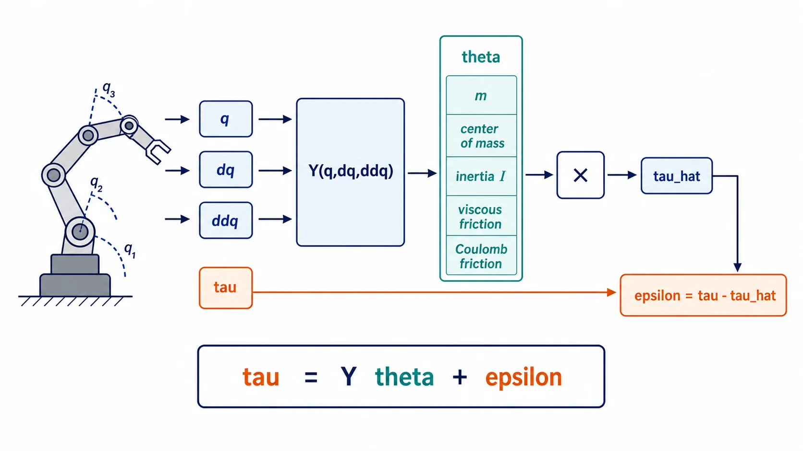
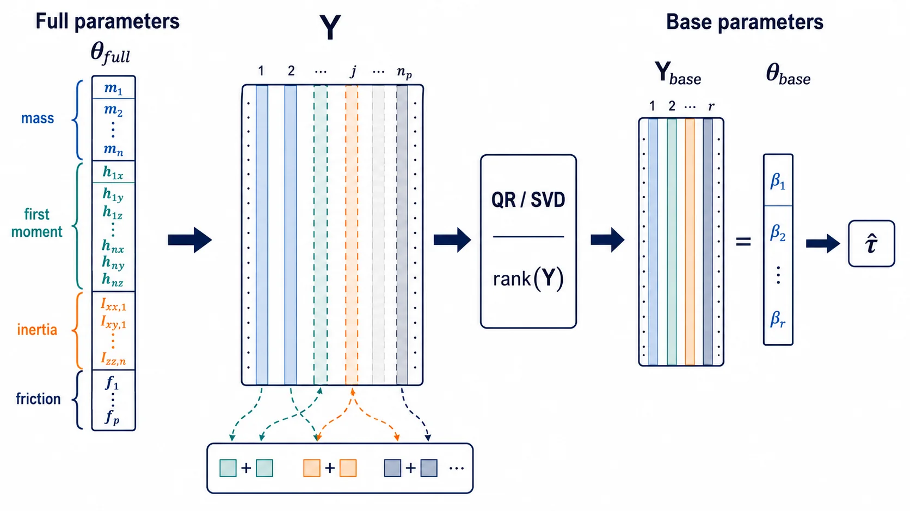
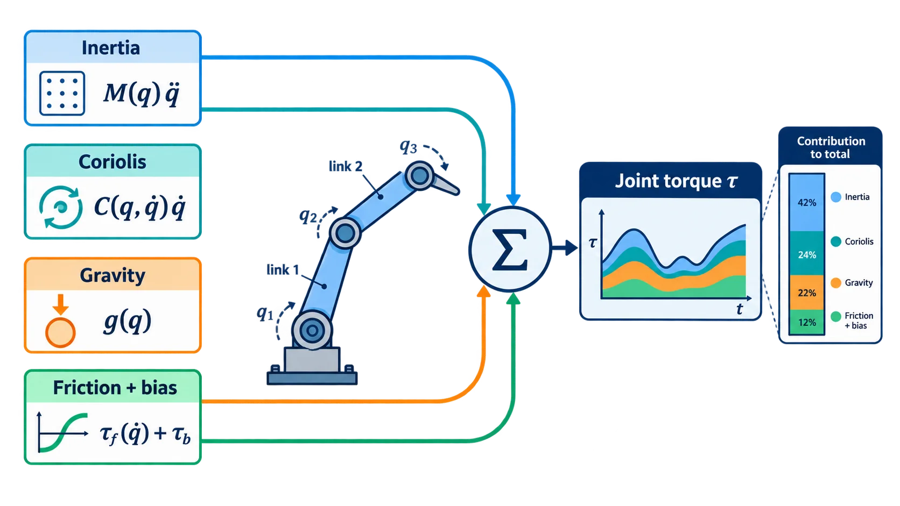
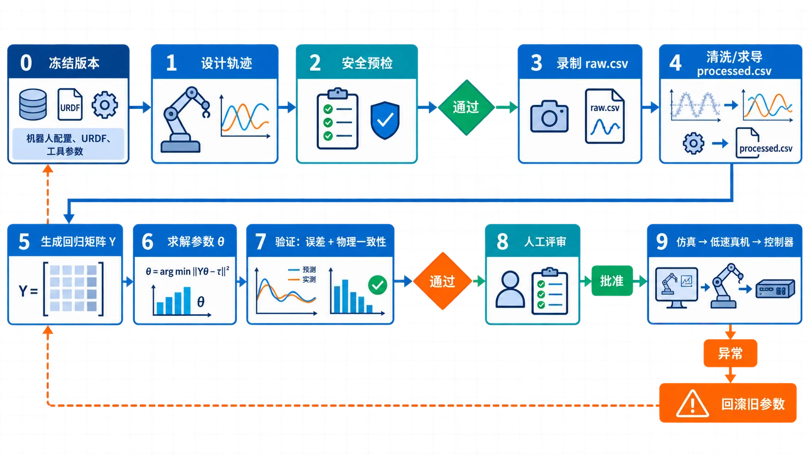
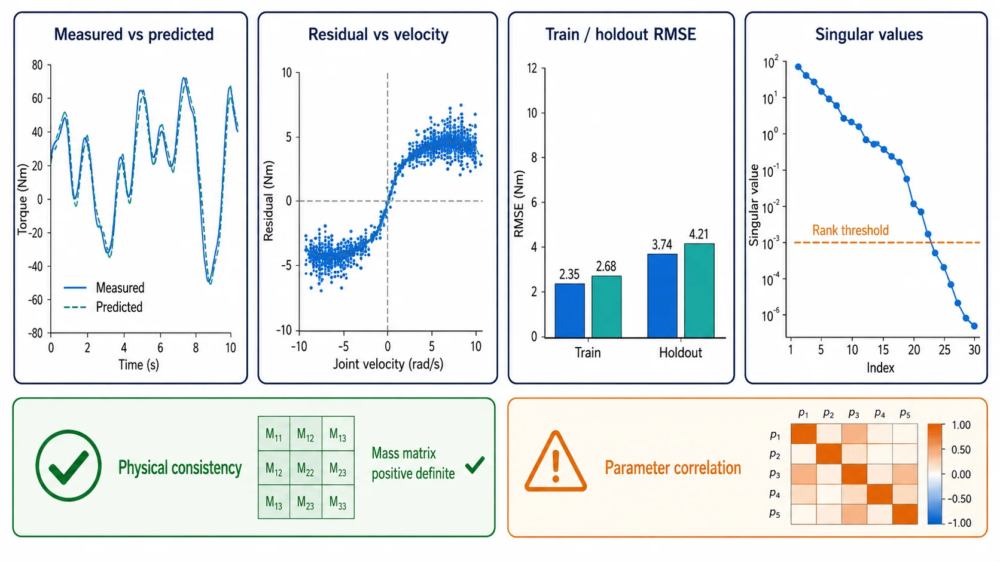
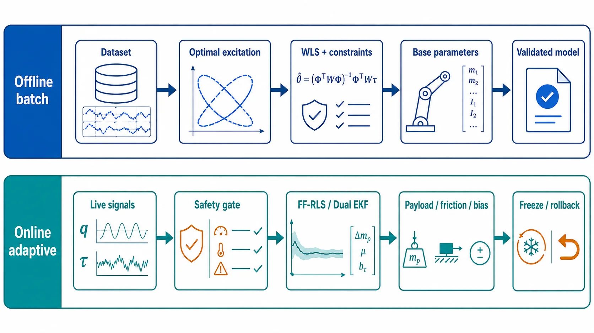

动力学参数辨识的目标，是从关节位置、速度、加速度和力矩观测中估计质量、质心、惯量及摩擦等参数。它服务于重力补偿、逆动力学、阻抗控制和仿真，但辨识结果首先是“候选参数”，不能未经审查就覆盖真机配置。

辨识完成后，质量、质心、惯量和摩擦参数如何进入重力补偿、操作空间动力学与柔顺交互，可继续阅读[机器人阻抗控制专题]()。

> **安全提示**：求解器正常退出、训练误差很小或回归矩阵满秩，都不代表参数可以直接进入实时控制器。候选结果必须经过独立数据验证、物理一致性检查、人工审批和可回滚的低速真机验证。辨识程序不得在线热更新正在使用的力矩模型。

> 本文只讨论动力学参数辨识。关节零位、连杆几何、关节轴、Base/Tool 外参等属于运动学参数标定，将在独立专题中介绍。

## 阅读指南

- 第一次搭建离线辨识流程：先读第 1、2、3、4、6、7 节；
- 只估计末端工具负载：重点读 6.3.1 和第 7 节；
- 研究摩擦与传动：重点读 2.3、3.1 和 6.3.2；
- 需要在线更新：重点读 4.4–4.7，并先完成离线基准；
- 准备部署：直接检查第 7、11 节；
- 需要对照代码：阅读第 8、9、10 节。

动力学参数辨识内部还可以继续细分：

| 子问题 | 主要参数 | 最低数据需求 | 常用方法 |
| --- | --- | --- | --- |
| 静态重力/负载辨识 | 工具质量、质心、重力项、bias | 多个静止姿态的 $q,\tau$ | 静态 LS/WLS |
| 完整刚体动力学辨识 | 质量、质心一阶矩、惯量 | 动态 $q,\dot q,\ddot q,\tau$ | 基参数 + WLS/TLS/IV |
| 物理一致辨识 | 同上，但保证惯量可实现 | 动态轨迹与物理边界 | SDP、Cholesky/NLS |
| 摩擦辨识 | Coulomb、viscous、Stribeck | 正反向低速/匀速数据 | LS、鲁棒或非线性拟合 |
| 传动辨识 | 转子惯量、效率、减速比误差、摩擦 | 电机侧与关节侧同步数据 | 残差拟合、联合优化 |
| 柔性系统辨识 | 刚度、阻尼、回差、模态 | 力矩、双编码器或振动数据 | 时域/频域 system ID |
| 在线自适应辨识 | 工具负载、摩擦变化、bias 漂移 | 实时状态和力矩 | FF-RLS、EKF/UKF、MHE |

如果目标是改善刚体逆动力学和力矩前馈，主线通常是“静态重力/负载 → 摩擦 → 完整刚体参数”。柔性与传动模型需要额外传感器和不同激励，应作为后续独立阶段，而不是无条件塞入同一个回归矩阵。

### 第一次实践的最小可行路线

如果暂时不需要在线自适应、柔性模型和浮动基辨识，可以先完成下面这个最小闭环：

1. 固定 URDF、工具、减速比、力矩来源和关节顺序；
2. 录制一组训练多谐波轨迹和一组不同系数的验证轨迹；
3. 保留 `raw.csv`，离线生成带 $q,\dot q,\ddot q,\tau$ 的 `processed.csv`；
4. 用 Pinocchio 生成 $Y$，通过 QR/SVD 检查秩和条件数；
5. 使用 WLS 或 Huber 得到 candidate；
6. 检查独立验证误差、参数不确定性和质量矩阵正定性；
7. 保存 review 与 rollback，先仿真再低速上机。

只有这七步全部打通后，再考虑 FF-RLS、Dual EKF、MHE 或更复杂的摩擦/柔性模型。这样可以避免同时调试数据、模型、求解器和实时更新逻辑。

## 1. 动力学回归模型

### 1.1 动力学参数辨识原理

先看信号、回归矩阵和参数之间的关系：



对固定基刚体系统，逆动力学可写成关于动力学参数线性的形式：

$$\boldsymbol{\tau}=Y(\boldsymbol q,\dot{\boldsymbol q},\ddot{\boldsymbol q})\boldsymbol\theta+\boldsymbol\epsilon$$

其中 $Y$ 是由运动状态计算得到的回归矩阵；$\boldsymbol\theta$ 包含质量、质心一阶矩、转动惯量，也可以追加黏性摩擦、库仑摩擦和力矩偏置；$\boldsymbol\epsilon$ 是测量噪声与未建模动力学。采集 $N$ 个样本后，将各个 $Y_i$ 和 $\tau_i$ 叠加即可用最小二乘求解：

$$
\underbrace{\begin{bmatrix}\tau_1\\\tau_2\\\vdots\\\tau_N\end{bmatrix}}_{\bar\tau}
=
\underbrace{\begin{bmatrix}Y_1\\Y_2\\\vdots\\Y_N\end{bmatrix}}_{\bar Y}
\theta+\bar\epsilon
$$

$$\hat{\theta}_{WLS}=(\bar Y^TW\bar Y)^{-1}\bar Y^TW\bar\tau$$

实际实现不应显式求逆，应使用 QR、SVD 或稳定的线性求解器。带 ridge 的目标为：

$$\hat\theta_{ridge}=\arg\min_\theta\left(\|W^{1/2}(\bar Y\theta-\bar\tau)\|_2^2+\lambda_r\|L\theta\|_2^2\right)$$

辨识的核心就是寻找一组 $\hat\theta$，使预测力矩 $\hat\tau=Y\hat\theta$ 尽可能接近实测力矩。`RobotServer` 的 `RegressorBackend` 将“如何生成 $Y_i$”与通用数据处理、求解器解耦；`robot_identification_pinocchio` 使用 Pinocchio 刚体动力学回归器生成参数列。

### 符号、参考侧与单位

| 量 | 推荐单位 | 说明 |
| --- | --- | --- |
| $q$ | rad | 转动关节统一使用弧度；移动关节使用 m |
| $\dot q$ | rad/s | 必须与模型关节方向一致 |
| $\ddot q$ | rad/s² | 记录求导/滤波方法 |
| $\tau$ | N·m | 统一换算到模型定义的关节侧 |
| $m$ | kg | 质量必须为正 |
| $mc_x,mc_y,mc_z$ | kg·m | 质心一阶矩，不是质心坐标本身 |
| $I_{xx},\ldots,I_{zz}$ | kg·m² | 明确是在质心还是连杆原点表达 |
| $f_v$ | N·m·s/rad | 黏性摩擦系数 |
| $f_c$ | N·m | 库仑摩擦幅值 |
| $J_m$ | kg·m² | 明确是电机侧惯量还是已反射到关节侧 |

数据、回归器和最终配置必须使用同一参考侧。电机侧惯量反射到理想关节侧时通常与减速比平方有关；若模型后端已经包含传动映射，就不能再次换算。对移动关节，力矩和相关摩擦单位应相应改为 N，而不是 N·m。

对每个刚体，常见的 10 维惯性参数由质量 $m$、质心一阶矩 $m c_x,m c_y,m c_z$ 和六个对称惯量分量组成。注意辨识通常直接得到一阶矩，而不是单独的质心；需要在 $m>0$ 时通过 $c_x=(m c_x)/m$ 等关系恢复质心坐标。摩擦和驱动惯量属于额外扩展列，不应与刚体的 10 维参数混为一谈。

### 完整参数不等于可辨识参数



将每个连杆的 10 个参数全部放入 $\theta$，并不意味着它们都能被独立估计。受机器人拓扑和关节运动约束影响，某些参数列在 $Y$ 中线性相关，力矩只能观测到它们的组合。对 $Y$ 做 QR/SVD 等秩分析后得到的独立组合通常称为**基参数**。

对堆叠回归矩阵进行奇异值分解：

$$Y=U\Sigma V^T$$

大于数值阈值的奇异值数量给出有效秩 $r$；接近零的奇异值对应无法由当前数据区分的参数方向。阈值必须结合矩阵缩放、噪声和奇异值谱设置，不能机械使用一个对所有机器人通用的常数。

因此需要区分：

- **完整参数**：URDF 中每个刚体的质量、质心和惯量描述；
- **基参数**：能够从当前关节力矩中唯一影响输出的参数组合；
- **可观测程度**：即使属于基参数，不同方向也可能因激励不足而具有很大不确定性。

`rank < parameter_count` 时，不应把完整参数的普通最小二乘解直接解释成真实物理值。可以在明确映射的基参数空间求解，或引入可信 CAD 先验和物理一致性约束；无论哪一种，都要保存参数空间转换关系。

从传统关节动力学角度，同一个模型也可以写为：

$$\tau=M(q)\ddot q+C(q,\dot q)\dot q+g(q)+\tau_f(\dot q)+\tau_b$$



其中 $M$ 是质量矩阵，$C\dot q$ 是科氏力和离心力，$g$ 是重力项，$\tau_f$ 是摩擦，$\tau_b$ 是力矩 bias。$M$、$C$ 和 $g$ 看起来是非线性函数，但对质量、质心一阶矩和惯量参数仍然保持线性，因此可以整理成 $Y\theta$。

### 参数结果与实际用途

| 辨识结果 | 通常写入 | 实际作用 | 使用前检查 |
| --- | --- | --- | --- |
| 连杆质量、质心、惯量 | URDF 或动力学模型 | 重力补偿、RNEA、质量矩阵、仿真 | 质量为正、惯量物理一致、坐标系正确 |
| 工具质量、质心、惯量 | tool profile | 更换末端工具后的补偿 | 与当前工具 ID 和安装方向绑定 |
| 黏性/库仑摩擦 | controller profile | 低速跟踪和力矩前馈 | 正反向残差、温度依赖、死区 |
| 力矩 bias | 驱动或控制器标定文件 | 消除传感器/电流零偏 | 静止复测，防止掩盖外力 |
| 驱动反射惯量 | transmission/actuator profile | 加速段前馈 | 减速比和电机侧/关节侧单位 |

不要把所有结果直接覆盖到 URDF：刚体参数、工具参数和控制器经验参数应分别进入自己的配置层，并保持共同的版本号和审核记录。

### 1.2 一页式全流程

先只看主线，不必先理解公式。下面的图对应从 `0` 到 `9` 的十阶段流程，包括数据文件、验证闸门、批准节点和异常回滚分支：



其中 `raw.csv` 永远不修改，`processed.csv` 可以重新生成，`result.json` 永远先标记为 candidate。可以把一次辨识看成下面十个阶段。只有当前阶段的检查通过，才进入下一步：

| 阶段 | 要做的事 | 输入 | 必须留下的结果 | 不通过时 |
| --- | --- | --- | --- | --- |
| 0. 冻结版本 | 固定 URDF、减速比、工具和控制周期 | 机器人 profile | `session.json`、版本哈希 | 版本变化后重新开始 |
| 1. 设计激励 | 生成多谐波轨迹，优化信息量 | 关节限制、模型、轨迹系数 | `excitation.yaml` | 调整频率、幅值或相位 |
| 2. 安全预检 | 检查限位、速度、jerk、碰撞和驱动能力 | 候选轨迹、机器人 profile | 预检报告 | 降低幅值或重设计 |
| 3. 录制原始数据 | 执行已批准轨迹，记录状态与力矩 | $t,q,\tau$ 及上下文 | 不可变 `raw.csv` | 丢帧/饱和则整段作废 |
| 4. 清洗求导 | 对齐信号、剔除异常、得到 $\dot q,\ddot q$ | `raw.csv` | `processed.csv`、排除区间 | 回查时钟和滤波设置 |
| 5. 构造回归 | 由模型计算每个样本的 $Y_i$ | processed 数据、URDF | 矩阵摘要、参数名列表 | 查关节顺序和坐标系 |
| 6. 数值求解 | WLS/ridge/Huber 求 $\hat\theta$ | $Y,\tau$ | `result.json`（candidate） | rank/条件数不合格则返工 |
| 7. 离线验证 | holdout、残差、物理一致性 | 独立数据和工作空间网格 | 验证报告 | 重新激励或修正模型 |
| 8. 人工评审 | 检查量纲、来源、风险和回滚 | candidate + 报告 | `review.json`、`rollback.json` | 拒绝并保留审查记录 |
| 9. 分阶段导入 | 仿真→低速位置模式→力矩/阻抗 | 已批准版本 | 发布版本和运行日志 | 立即恢复 rollback |

这张表中的“结果”不是临时终端输出，而是后续阶段的输入。这样即使换机器、换工具或更换力矩传感器，也能定位差异来自哪一阶段。

### 每个阶段只回答一个问题

0. **版本冻结**：我现在辨识的到底是哪台机器人、哪套工具和哪版模型？
1. **轨迹设计**：所有待估参数是否都被充分激励？
2. **安全预检**：这条轨迹在位置、速度、加速度和 jerk 限制内吗？
3. **数据录制**：传感器是否在同一时间轴上提供了可信的 $q$ 和 $\tau$？
4. **预处理**：求导和滤波是否引入了可接受的噪声与延迟？
5. **构造回归**：关节顺序、坐标系与 $Y$ 的参数列是否完全对应？
6. **数值求解**：从 $Y\theta\approx\tau$ 得到的参数是否数值可辨识？
7. **独立验证**：参数能否预测另一段未参与拟合的数据？
8. **人工评审**：参数的单位、符号、物理范围和风险是否有人负责确认？
9. **实际使用**：新模型是否能在可观测、可停止、可回滚的条件下改善控制？

## 2. 先定义可靠的数据契约

处理后的 CSV 表头为：

```text
time_s,q/<joint>...,dq/<joint>...,ddq/<joint>...,tau/<joint>...
```

关节名称必须非空、唯一且顺序稳定；时间戳必须有限并严格递增；所有状态和力矩值必须有限。原始 CSV 应保持不可变，并记录力矩来源（驱动电流估算、关节传感器或外部传感器）、URDF/模型摘要、软件版本和被排除的接触、饱和、丢帧区间。

ROS 2 只负责采集和会话编排：录制器读取具名 `JointState.position/effort`，按稳定关节名重排，并使用进程单调时钟打时间戳；它不发送运动命令。ROS 2 在这里是可选的中间件，不是辨识算法的依赖；如果系统使用 EtherCAT、串口、TCP、厂商 SDK 或控制器日志，只要导出相同的数据契约，就可以直接进入后续离线流程。这样算法库可以在没有 ROS graph 的环境下测试。

### 2.1 录制后立即检查

在机器人离开实验状态前，先检查采样间隔 $\Delta t$ 的最小值、最大值、中位数和抖动，确认没有时间回退；统计缺失、重复、非有限和饱和样本；画出每个关节的 $q$ 与 $\tau$ 时序，并核对运动方向和力矩方向。若发现关节错序、单位错误、持续饱和或大段丢帧，应重新录制，而不是留到求解阶段修补。

### 2.2 时间对齐与延迟

位置和力矩即使拥有相同消息时间戳，也可能经过不同的驱动、滤波和通信链路。若实测力矩相对 $q,\dot q,\ddot q$ 延迟 $\Delta t_\tau$，回归实际使用的是错误时刻的数据：

$$\tau(t+\Delta t_\tau)\not\approx Y(q(t),\dot q(t),\ddot q(t))\theta$$

应使用同一单调时钟记录各信号的采集时刻，并保存设备时间戳与接收时间戳。可以通过已知激励下的互相关或小范围延迟扫描估计固定延迟，但估计值必须在独立数据上复核。禁止分别平移训练集和验证集来追求各自最小误差，否则延迟参数会吸收模型错误。

零相位离线滤波不会产生固定相位延迟，但会使用未来样本，因此只能用于离线辨识；实时控制器中的因果滤波器仍有延迟，部署时不能假设两者等价。

### 2.3 力矩从哪里来

回归目标应是与模型关节坐标一致的关节侧力矩。常见来源并不等价：

| 来源 | 优点 | 主要风险 |
| --- | --- | --- |
| 关节力矩传感器 | 直接观测关节侧力矩 | 零偏、温漂、带宽和交叉耦合 |
| 电机电流估算 | 易获取、采样频率高 | 力矩常数、减速比、效率和电流环偏差 |
| 应变片/六维力传感器映射 | 可观察外力或末端载荷 | 坐标变换、雅可比奇异和接触力混入 |
| 控制器指令力矩 | 无需额外传感器 | 不等于实际输出，可能忽略饱和和驱动动态 |

若由电机电流估算，理想换算可写成：

$$\tau_j=s_j\,\eta_j\,N_j\,K_{t,j}(i_j-i_{0,j})$$

其中 $s_j$ 是方向符号，$\eta_j$ 是传动效率，$N_j$ 是减速比，$K_{t,j}$ 是力矩常数，$i_{0,j}$ 是电流零偏。必须明确减速比定义是电机侧/关节侧还是相反，并确认驱动器报告的是相电流、$q$ 轴电流还是已经换算的力矩。

不要把“指令力矩”默认当作“测量力矩”。如果只能获取指令值，应在结果中明确 `torque_source`，并把电流环动态、限幅和力矩变化率限制当作模型误差来源。

## 3. 激励轨迹与预处理

单一正弦通常无法同时激励所有参数。可使用多谐波轨迹：

$$q_j(t)=q_{0j}+\sum_{k=1}^{K}(a_{jk}\sin k\omega t+b_{jk}\cos k\omega t)$$

速度和加速度应由解析导数得到，避免差分噪声被放大。轨迹在执行前要按每个关节的位置、速度、加速度和 jerk 限制进行完整采样验证；通过验证并不等于可以直接上机，还需要碰撞检查、watchdog 和状态联锁。

轨迹设计同时面对两个不同目标：

- **安全可执行**：整个周期满足位置、速度、加速度、jerk、碰撞距离和力矩限制；
- **信息充分**：堆叠回归矩阵的有效秩足够，较小奇异值不过度接近零，条件数可接受。

仅满足限位并不代表轨迹适合辨识。所有关节使用相同频率、相同相位和相近幅值时，回归矩阵可能高度相关。可为不同关节配置不同的正余弦系数和谐波组合，再通过 SVD、条件数或 Fisher 信息矩阵指标筛选候选轨迹。轨迹优化不能绕过碰撞与驱动能力检查。

训练轨迹与验证轨迹应在姿态、速度或谐波组合上存在明确差异。例如训练集使用一组多谐波系数，验证集使用另一组较低幅值系数；两者都覆盖目标工作空间，但验证数据不参与轨迹参数优化、滤波参数选择和延迟调参。

对真实数据，建议保留原始数据，另存预处理结果。位置可以使用对称零相位平滑窗口，速度和加速度使用非均匀时间三点差分；力矩默认不平滑，除非已经验证滤波器的相位和幅值影响。

### 3.1 摩擦参数需要单独关注

最简单的关节摩擦模型为：

$$\tau_f=f_v\dot q+f_c\operatorname{sign}(\dot q)$$

其中 $f_v$ 是黏性摩擦系数，$f_c$ 是库仑摩擦系数。零速附近的静摩擦、Stribeck 效应、齿槽转矩和减速器回差并不能被这个模型完整描述；直接使用 `sign(0)` 还会让零速样本产生歧义。

采集摩擦数据时，应分别包含稳定的正向和反向速度平台，并记录关节/驱动温度。换向瞬间和极低速爬行区可以单独标记，不与稳态摩擦样本混用。若摩擦残差随温度或速度明显变化，可以建立分段模型，但不能为了降低训练误差无限增加参数。

工程上通常先用低加速度恒速段估计摩擦和 bias，再用多关节动态轨迹估计惯性参数，最后联合求解检查参数耦合。这样更容易区分“惯量估计错误”和“摩擦模型不完整”。

## 4. 求解与诊断

除了普通最小二乘，还可以使用加权最小二乘、ridge 或 Huber IRLS：

```cpp
auto dataset = PreprocessPositionAndTorque(names, time, q, tau, options);
auto problem = BuildRegressionProblem(dataset, backend);
SolverOptions solver;
solver.ridge = 1e-10;              // 仅改善数值稳定性
auto result = Solve(problem, solver);
```

`RobotServer` 示例中的两关节后端声明参数名和数量，构造回归问题后输出 `parameters`、`rmse`、`rank` 和 `condition_number`。真实项目至少检查：

1. `rank == parameter_count`。秩亏表示存在不可辨识方向，不能靠增大 ridge 掩盖。
2. 训练集与独立 holdout 集的 RMSE、逐关节峰值误差。
3. 条件数、协方差或等价不确定性指标。
4. Huber 权重是否大量下降；大量异常点通常意味着接触、通信或力矩映射问题。
5. 在目标工作空间采样验证质量矩阵对称正定，并检查质量、质心和摩擦参数的量纲与物理范围。

### 4.1 物理一致性不是只检查质量为正

候选刚体参数至少满足：

- 质量 $m>0$，并与 CAD、称重或部件规格处于合理范围；
- 质心位于连杆几何附近，且使用了正确的连杆坐标系；
- 质心处惯量张量对称正定；
- 主惯量满足三角不等式，例如 $I_x\le I_y+I_z$；
- 对目标工作空间中的采样姿态，质量矩阵 $M(q)$ 对称正定。

惯量张量可写为：

$$
I_C=\begin{bmatrix}
I_{xx}&I_{xy}&I_{xz}\\
I_{xy}&I_{yy}&I_{yz}\\
I_{xz}&I_{yz}&I_{zz}
\end{bmatrix}
$$

还要确认辨识参数对应的是连杆坐标原点处惯量还是质心处惯量；两者需要通过平行轴定理转换。坐标系或参考点混淆，可能得到数值残差很小但无法正确写入 URDF 的参数。

最后，分别在静态姿态、低速轨迹和动态轨迹上检查重力项、摩擦项和惯性项。若只有联合总力矩拟合良好，而单项出现不合理的大数并相互抵消，说明参数缺乏物理可解释性。

### 4.2 如何阅读不确定性和残差



在线性高斯近似下，参数协方差与 $(Y^TWY)^{-1}$ 有关。对角项反映单个参数的不确定性，非对角项反映参数之间的相关性。两个高度相关的参数可能各自变化很大，却产生几乎相同的预测力矩，因此不能只看参数点估计。

若残差方差估计为 $\hat\sigma^2$，常见近似为：

$$\operatorname{Cov}(\hat\theta)\approx\hat\sigma^2(\bar Y^TW\bar Y)^{-1}$$

Huber 损失在小残差区保持二次项，在大残差区转为线性项：

$$
\rho_\delta(r)=
\begin{cases}
\frac{1}{2}r^2,&|r|\le\delta\\
\delta\left(|r|-\frac{1}{2}\delta\right),&|r|>\delta
\end{cases}
$$

这会降低少量异常点的影响，但 $\delta$ 应依据力矩噪声尺度选择，并报告降权样本比例。

建议为每个参数同时报告：估计值、标准差、相对标准差以及主要相关参数。若参数接近零，相对标准差会失去解释意义，此时应同时观察绝对标准差和对力矩预测的影响。

残差 $r=\tau-Y\hat\theta$ 至少按以下方式绘制：

- 残差随时间：发现接触、丢帧、升温和模式切换；
- 残差随关节位置：发现重力项或坐标系错误；
- 残差随速度：发现摩擦模型不完整；
- 残差随加速度：发现惯量或时间对齐错误；
- 残差直方图与关节间相关性：发现系统性偏差和耦合遗漏。

较低的训练 RMSE 只能说明模型解释了训练力矩，不能证明每个参数都准确。最终判断应结合独立验证误差、参数不确定性、物理约束和实际控制表现。

### 4.3 更有效的辨识方法

普通最小二乘可以作为基线，但真实机器人通常需要组合方法：

| 方法 | 主要解决的问题 | 使用建议 |
| --- | --- | --- |
| 基参数辨识 | 完整参数列线性相关、解不唯一 | 先用 QR/SVD 找独立参数组合，再求解 |
| 最优激励轨迹 | 回归矩阵病态、参数方差大 | 优化最小奇异值、条件数或 Fisher 信息量 |
| 加权最小二乘（WLS） | 不同关节或样本噪声不同 | 权重来自传感器噪声估计，不能凭拟合效果随意调 |
| Huber/Tukey 鲁棒回归 | 少量无法完全剔除的异常点 | 仍需先剔除接触、饱和和通信故障区间 |
| 总最小二乘（TLS） | $Y$ 和 $\tau$ 都含测量误差 | 对 $q,\dot q,\ddot q$ 噪声明显时比 OLS 更合适 |
| 工具变量（IV） | 回归量噪声与残差相关，OLS 有偏 | 需要与噪声不相关、又与运动相关的有效工具变量 |
| 物理约束优化 | 出现负质量或非物理惯量 | 对质量、惯量和质量矩阵施加一致性约束 |
| MAP/贝叶斯方法 | 数据不足但有可信 CAD 先验 | 输出后验不确定性，并明确先验对结果的影响 |

工程上推荐的高性价比路线是：

1. 用 CAD/称重结果初始化并确定合理物理范围；
2. 通过 QR/SVD 得到基参数或至少识别不可观测方向；
3. 优化多谐波激励，使 $Y$ 的较小奇异值增大；
4. 先清洗数据，再用 WLS 或 Huber 求候选解；
5. 若回归量噪声造成明显偏差，再考虑 TLS 或 IV；
6. 用物理一致性约束恢复可部署的完整参数；
7. 使用完全独立的轨迹验证，并与旧模型做逐关节对比。

没有一种高级求解器能够补救错误的力矩换算、时间不同步或缺乏激励。提升效果时，通常应先改善数据和轨迹，再升级求解器。

### 4.4 递推最小二乘与遗忘因子（FF-RLS）



当数据持续到达，或工具负载、摩擦、力矩 bias 随时间缓慢变化时，可以使用递推最小二乘。对单个时刻的回归 $\tau_k=Y_k\theta+\epsilon_k$，带遗忘因子的更新为：

$$K_k=P_{k-1}Y_k^T\left(\lambda I+Y_kP_{k-1}Y_k^T\right)^{-1}$$

$$\hat\theta_k=\hat\theta_{k-1}+K_k\left(\tau_k-Y_k\hat\theta_{k-1}\right)$$

$$P_k=\frac{1}{\lambda}\left(I-K_kY_k\right)P_{k-1}$$

其中 $P$ 表示参数不确定性的递推尺度，$K$ 是增益，$0<\lambda\le1$ 是遗忘因子。$\lambda=1$ 接近标准 RLS，历史数据一直保留；$\lambda<1$ 会逐渐降低旧数据权重，能够跟踪时变参数，但也会放大噪声并增加漂移风险。有效记忆长度可粗略理解为 $1/(1-\lambda)$ 个样本，实际仍要结合采样率、激励和噪声验证。

| 方法 | 适合场景 | 主要风险 |
| --- | --- | --- |
| RLS（$\lambda=1$） | 固定参数、数据逐步到达、避免反复批量求解 | 持续缺乏激励时协方差可能退化 |
| FF-RLS（$\lambda<1$） | 温度相关摩擦、工具负载或 bias 缓慢变化 | 噪声放大、参数漂移、错误吸收接触力 |
| 变遗忘因子 RLS | 工况突变时快速适应、稳定时降低波动 | 切换逻辑和阈值需要独立验证 |
| 投影/约束 RLS | 需要保持质量、摩擦或负载参数在物理范围 | 约束空间必须与参数化一致 |

FF-RLS 的实践建议：

1. 用离线批量辨识结果初始化 $\hat\theta_0$，用离线协方差初始化 $P_0$；
2. 只在线更新少量明确会变化的参数，如工具质量、摩擦或 bias；刚体惯量默认冻结；
3. 只有在回归矩阵满足持续激励条件时更新，否则保持参数不变；
4. 接触、碰撞、饱和、急停和控制模式切换时暂停更新；
5. 对参数范围、单次更新量和变化率加约束，并持续记录创新项 $\tau_k-Y_k\hat\theta_{k-1}$；
6. 在线估计结果仍作为 candidate，不能直接无审查写入实时力矩控制模型。

对于“拿起未知物体后估计负载”，可以只递推工具质量和质心相关参数；对于“整机所有连杆参数”，仍优先使用离线最优激励和批量物理约束辨识。这样既利用 FF-RLS 的适应能力，又避免控制过程中的参数漂移破坏稳定性。

### 4.5 联合参数—状态估计：Augmented EKF 与 Dual EKF

RLS 通常假设回归量 $q,\dot q,\ddot q$ 已经可用。当速度、加速度不可直接可靠测量，或需要同时估计传感器 bias、外部扰动和缓慢变化参数时，可以把动力学写成状态空间模型：

$$x_{k+1}=f(x_k,u_k,\theta_k)+w_k,\qquad y_k=h(x_k,\theta_k)+v_k$$

$$\theta_{k+1}=\theta_k+w_{\theta,k}$$

其中 $x$ 可以包含 $q,\dot q$，$\theta$ 包含待估动力学参数，$w,v$ 分别为过程噪声和测量噪声。

**联合 EKF（Joint/Augmented EKF）**将状态和参数拼成增广状态 $z=[x^T,\theta^T]^T$，用一个滤波器同时更新。它形式统一并能保留状态—参数交叉协方差，但维度较大、线性化和协方差计算成本高，也更容易因尺度差异和不可观测性造成数值问题。

**双 EKF（Dual EKF，DEKF）**使用两个相互耦合的滤波器：状态滤波器在当前参数下估计 $x$，参数滤波器再用当前状态更新 $\theta$。它更容易为状态和参数设置不同的噪声模型、更新频率与约束，但两个滤波器互相依赖，调参不当会产生滞后或相互强化的估计偏差。

| 方法 | 优势 | 更适合 | 主要风险 |
| --- | --- | --- | --- |
| FF-RLS | 实现简单、计算量小、线性参数更新直接 | $q,\dot q,\ddot q$ 可信，少量参数缓慢变化 | 回归量噪声导致偏差 |
| 增广 EKF | 联合保留状态—参数相关性 | 状态与参数强耦合、系统维度可控 | 增广维度大、线性化误差、协方差病态 |
| Dual EKF | 状态/参数可分频率和噪声建模 | 状态快速、参数缓慢的多时间尺度系统 | 双滤波器耦合、调参复杂 |

使用 EKF 类方法时需要特别注意：

1. 先做局部可观测性或灵敏度分析；滤波器收敛不等于真实参数可辨识；
2. 参数过程噪声 $Q_\theta$ 决定参数变化速度，过大导致漂移，过小则无法跟踪；
3. 状态、质量、惯量和摩擦参数量纲差异很大，应进行尺度归一化；
4. 使用 Joseph 形式或平方根滤波等数值稳定实现，监控协方差正定性和创新一致性；
5. 接触力未建模时，滤波器可能把外力吸收到质量、摩擦或 bias 中；应显式估计扰动或停止参数更新；
6. 对参数采用投影、重参数化或约束更新，避免产生负质量和非物理惯量。

实用策略仍是“离线辨识完整模型，在线只估计少量变化量”：先用批量方法确定刚体基参数，再由 FF-RLS、Dual EKF 或增广 EKF 跟踪工具负载、摩擦、零偏或外部扰动。在线估计应有冻结条件、范围限制和回滚版本。

### 4.6 方法选择指南

可以按下面的顺序选择，而不是先决定使用哪一种“高级算法”：

```text
数据能否离线完整获得？
├─ 是 → 状态 q、dq、ddq 是否可信？
│       ├─ 是 → 基参数 + WLS/Huber + 物理约束
│       └─ 否 → TLS/IV，或先进行状态平滑
└─ 否，需要在线更新 → 状态是否可信？
        ├─ 是 → RLS / FF-RLS / 约束 RLS
        └─ 否 → 参数与状态是否强耦合？
                ├─ 维度较小 → 增广 EKF/UKF
                ├─ 多时间尺度 → Dual EKF
                └─ 强约束、算力充足 → MHE
```

| 需求 | 首选方法 | 原因 |
| --- | --- | --- |
| 辨识整机刚体参数 | 批量基参数 + 物理约束 | 能使用全数据、全局诊断和独立验证 |
| 在线估计未知工具质量 | 约束 FF-RLS 或 Dual EKF | 参数少、变化慢，可设置冻结条件 |
| 编码器速度噪声较大 | 状态平滑 + 批量法，或 EKF | 避免直接使用噪声导数 |
| 模型非线性明显且雅可比困难 | UKF | 无需求解析雅可比，但计算量更大 |
| 需要同时满足边界和滑动窗口约束 | MHE | 可显式加入状态/参数约束和鲁棒代价 |
| 存在未知接触扰动 | 扰动观测器 + 冻结参数更新 | 避免把外力错误辨识成模型参数 |

MHE（移动窗估计）在最近一段数据窗口上反复求解带约束优化问题，能够显式处理参数范围、输入饱和和鲁棒损失，但实时计算成本最高。UKF 可以减轻 EKF 的一阶线性化误差，但同样不能解决不可观测性。无论采用哪种在线方法，都应与离线基准结果并行比较，并保留一键冻结和回滚机制。

### 4.7 FF-RLS 更新示例

下面代码展示单个采样块的核心更新，`Y` 的行数等于本次观测的关节数：

```cpp
struct FfRls {
    Eigen::VectorXd theta;
    Eigen::MatrixXd covariance;
    double forgetting_factor{0.999};

    void Update(const Eigen::MatrixXd& Y,
                const Eigen::VectorXd& measured_torque,
                bool excitation_ok,
                bool contact_or_fault) {
        if (!excitation_ok || contact_or_fault) return;  // 冻结更新

        const Eigen::MatrixXd innovation_cov =
            forgetting_factor * Eigen::MatrixXd::Identity(Y.rows(), Y.rows()) +
            Y * covariance * Y.transpose();
        const Eigen::MatrixXd gain =
            covariance * Y.transpose() * innovation_cov.ldlt().solve(
                Eigen::MatrixXd::Identity(Y.rows(), Y.rows()));

        const Eigen::VectorXd innovation = measured_torque - Y * theta;
        theta += gain * innovation;
        covariance = (Eigen::MatrixXd::Identity(theta.size(), theta.size()) -
                      gain * Y) * covariance / forgetting_factor;

        ProjectToAllowedRange(theta);       // 参数范围约束
        SymmetrizeAndFloor(covariance);     // 数值稳定保护
        RecordInnovation(innovation);       // 持续诊断
    }
};
```

这是算法骨架，不是可直接进入实时控制器的完整实现。生产实现还应避免控制周期内动态分配，预先分配矩阵，检查 LDLT 分解状态，限制单步参数变化，并将参数更新与控制输出解耦。若创新持续超限，应冻结估计器并报告数据/模型异常，而不是继续增大协方差让滤波器追随故障信号。

## 5. 推荐实施顺序与安全边界

推荐的迁移顺序是：工具质量/质心和力矩 bias → 单关节黏性与库仑摩擦 → Pinocchio 刚体回归器 → 可观测性优化和独立轨迹 → 可选物理一致性约束。

求解器输出应保存为 candidate artifact，绑定原始 CSV 的 SHA-256、处理参数、模型摘要和代码版本。人工 review 另存独立文件，批准条件包括满秩、数值条件可接受、质量矩阵检查通过和完整回滚清单。任何 URDF、传动、固件、工具、采样频率或力矩来源变化都要求重新评审。

这一章定义“什么时候可以继续”，第 7 章再说明参数具体写入哪些配置。真机验证从位置模式、低速度和低增益开始，逐步检查重力补偿、力矩模式、导纳与阻抗控制。辨识模块绝不在线热更新控制模型；发现异常时恢复旧参数，而不是继续尝试提高控制增益。

## 6. 一次完整辨识实验的执行清单

下面给出一套可以直接转成实验 SOP 的流程。每一步都应留下输入、输出和操作者签名，避免“跑出一组数字”却无法复现。

### 6.1 实验前准备

先冻结机器人版本：记录 URDF、关节顺序、减速比、编码器方向、额定电流/力矩常数、控制周期、末端工具质量与质心。确认急停、限位、碰撞检测和 watchdog 可用，并在仿真或吊装状态下检查轨迹包络。辨识通常分为无负载和带工具两次实验；若要估计工具参数，工具必须固定且在整个数据集期间不更换。

### 6.2 需要采集什么

每个采样时刻至少保存以下字段：

| 数据 | 用途 | 注意事项 |
| --- | --- | --- |
| 单调时间戳 $t$ | 求导、对齐和频率检查 | 不能用消息序号代替；检查丢帧和回退 |
| 关节位置 $q$ | 运动状态和重力项 | 弧度、统一零位和方向 |
| 关节速度 $\dot q$ | 科氏力和黏性摩擦 | 优先使用高质量估计值，或由平滑位置求导 |
| 关节加速度 $\ddot q$ | 惯性项 | 不建议直接对含噪速度差分两次 |
| 关节力矩 $\tau$ | 回归目标 | 标明电流换算、传感器或外部估计来源 |
| 控制模式/使能状态 | 样本筛选 | 排除切换、饱和和故障区间 |
| 温度、电压（可选） | 解释摩擦和电机常数变化 | 用于分段建模或复现实验条件 |

位置、速度、加速度、力矩必须同一关节顺序、同一时间基准。记录原始信号，不要在 recorder 内覆盖滤波后的值。对于电流换算力矩，还要保存电流—力矩比例、减速比、效率假设以及电流零偏。

### 6.3 执行激励并划分数据

轨迹通常包含几秒的静止段（估计重力和 bias）、多谐波往返段（激励惯量与耦合项）以及不同速度的小幅段（摩擦）。每个关节都要覆盖工作空间内的正、负位置和正、负速度；避开机械限位、线缆拉紧和明显碰撞。重复运行至少两遍：一遍用于训练，另一遍作为 holdout 验证，不能随机打散时间序列后“伪造”独立集。

#### 6.3.1 入门实验：静态工具负载辨识

如果当前目标只是识别末端工具质量与质心，不必一开始就执行高速多谐波轨迹。机器人在静止状态下满足近似关系：

$$\tau(q)=g_{robot}(q)+Y_{tool}(q)\theta_{tool}+\tau_b$$

先固定同一个工具，在覆盖不同重力方向的多个安全姿态静止采样。每个姿态等待振动衰减后，取一段力矩均值和方差；方差异常的姿态不进入正常样本。若本体模型可信，也可以用“带工具力矩减去无工具力矩”的差分削弱本体模型误差，但两组实验必须使用相同姿态、温度和控制状态。

最小执行步骤为：

1. 记录无工具或已知工具的基准数据；
2. 安装待辨识工具，记录工具 ID、安装变换和大致质量范围；
3. 选择使工具重力在不同关节上产生明显力矩的多个姿态；
4. 每个姿态采集 $q,\tau$、温度和稳定状态标记；
5. 求解工具质量、三个质心一阶矩及必要的关节 bias；
6. 用未参与求解的静态姿态验证力矩预测误差；
7. 将结果写入 tool profile，而不是修改机器人本体连杆参数。

输出至少包含工具质量、法兰坐标系下质心、参数不确定性、训练/验证逐关节误差及适用的工具安装变换。若工具姿态覆盖不足，质量可能可估而质心某些方向不可观测，应明确保留为未确认状态。

#### 6.3.2 推荐的分阶段实验矩阵

不要直接用一条复杂轨迹同时估计所有参数。更容易诊断的安排如下：

| 实验 | 轨迹特征 | 主要信号 | 目标参数 | 关键验收 |
| --- | --- | --- | --- | --- |
| A. 静态多姿态 | 每个姿态充分静止 | $q,\tau$、温度 | 重力、工具质量/质心、bias | 未见姿态上的静态残差 |
| B. 正反向恒速 | 多个稳定速度平台，低加速度 | $q,\dot q,\tau$ | 黏性/库仑摩擦 | 正反向残差、温度重复性 |
| C. 单关节扫频 | 其他关节保持安全姿态 | $q,\dot q,\ddot q,\tau$ | 驱动惯量、局部摩擦/柔性线索 | 频率响应和重复试验一致 |
| D. 多关节多谐波 | 关节联合运动、充分耦合 | 全部状态、力矩和上下文 | 刚体基参数 | rank、条件数和 holdout 指标 |
| E. 独立验证 | 不同系数、姿态与速度组合 | 与 D 相同 | 不重新拟合 | 新模型相对旧模型稳定改善 |
| F. 在线跟踪 | 正常任务中的安全片段 | 实时状态、力矩、接触标记 | 工具/摩擦/bias 的慢变化 | 有界更新、可冻结和可回滚 |

每完成一阶段，都应固定已通过验证的结果，再决定下一阶段允许更新哪些参数。例如实验 B 不应同时放开所有连杆惯量；实验 F 默认不应更新机器人本体惯量。若后一阶段导致前一阶段指标明显恶化，应检查参数耦合和模型结构，而不是只接受新的总体 RMSE。

### 6.4 清洗、求解和产物

先剔除时间戳异常、丢帧、使能切换、力矩饱和、接触和急停恢复区间，再进行零相位平滑和解析/非均匀差分。随后由机器人模型生成 $Y$，按样本堆叠成 $\mathbf Y\boldsymbol\theta=\boldsymbol\tau$，求解并输出以下结果：

- 参数向量及稳定的参数名（质量、质心、一阶/二阶惯量、黏性摩擦、库仑摩擦、bias）；
- `rank`、奇异值、条件数和 ridge/Huber 配置；
- 训练集与 holdout 的总体 RMSE、逐关节 RMSE/峰值误差和残差曲线；
- 协方差、参数标准差或置信区间，以及被 Huber 降权的样本比例；
- 质量矩阵正定性、质量非负、质心范围和摩擦符号检查；
- 原始数据 SHA-256、处理配置、模型摘要、软件 commit 和排除区间。

这些内容共同构成 candidate artifact；只有参数数组而没有元数据的结果不可审查、不可回滚。

### 6.5 一个两关节示例

假设采集到 `axis_a`、`axis_b` 两个关节，模型后端声明四个参数：`axis_a` 的位置项和黏性摩擦项，以及 `axis_b` 的惯量项和 bias。示例程序用合成轨迹生成 240 个样本，先预处理位置，再根据已知参数合成力矩，最后重新预处理并求解。理想输出类似：

```text
parameters=2.000000 0.350000 1.400000 -0.200000
rmse=0.000000 rank=4 condition=...
```

这里的四个数字能否“用到机器人上”，还要看 `rank=4`、独立轨迹误差、单位和参数物理意义。示例验证的是接口链路，不代表任何真实机械臂的质量或摩擦参数；真实数据必须替换合成力矩，并完成上一节列出的全部闸门。

### 6.6 如何判断结果是否可信

满秩只是必要条件。还要确认 holdout 误差与训练误差接近，逐关节残差没有随位置、速度或温度呈明显趋势，参数不确定性没有异常放大。将辨识模型与原模型分别计算重力力矩和质量矩阵，在目标姿态网格上比较；若某些姿态误差突然变大，通常是激励不足、关节顺序错误、工具质量错误或力矩来源不匹配，而不是继续调大正则化参数。

## 7. 结果如何落到实际控制系统

参数导入应是显式、可回滚的发布流程：

1. 在离线工具中把 candidate 转换为机器人 profile/URDF 所需格式，保留单位转换和参数名映射表。
2. 保存当前线上参数快照，并把新文件、review、数据摘要和回滚清单绑定在同一版本中。
3. 先在仿真中验证重力补偿、逆动力学前馈和质量矩阵；再在无负载、位置模式、低速低增益下上机。
4. 逐步开启重力补偿、力矩前馈、导纳/阻抗控制，限制最大力矩和力矩变化率，实时监视跟踪误差、电流、温度和 watchdog。
5. 任何异常立即切回旧参数；通过一段时间的稳定运行后，才将 candidate 标记为已批准版本。

辨识结果并不一定全部写入一个文件：刚体惯量通常进入 URDF 或动力学模型，摩擦和力矩 bias 进入控制器 profile，工具参数进入 tool profile。不同来源、不同温度或不同负载下的参数可以保留为带条件的版本，但不能静默覆盖默认模型。

| 辨识结果 | 推荐落点 | 实际用途 | 导入前必须检查 |
| --- | --- | --- | --- |
| 连杆质量、质心、惯量 | URDF `<inertial>` 或模型参数文件 | $M(q)$、$C(q,\dot q)$、$g(q)$ | 单位、坐标系、惯量正定 |
| 工具质量与质心 | tool profile | 工具重力补偿、负载模型 | 工具 ID、安装方向和法兰坐标系 |
| 黏性/库仑摩擦 | controller profile | 低速补偿和逆动力学前馈 | 正负速度残差、死区和温度影响 |
| 力矩 bias | 标定/驱动 profile | 传感器或电流估算零偏补偿 | 静止姿态、温漂和上电重复性 |
| 驱动反射惯量 | actuator/transmission profile | 关节等效惯性模型 | 减速比定义、是否已包含在刚体模型中 |

### 导入前后应比较什么

不要只比较总体 RMSE。至少对旧模型和新模型分别记录：

- 静止姿态下的重力补偿残差；
- 相同轨迹下的逐关节 RMS 和峰值力矩预测误差；
- 跟踪误差、最大电流、力矩变化率和温升；
- 不同位置、速度方向及工具负载下的残差分布；
- 质量矩阵最小特征值和数值条件。

只有新模型在独立数据和分阶段真机验证中稳定优于旧模型，并且没有引入新的安全风险，才应批准替换。

### 配置落地示例

刚体参数通常转换为 URDF 的 `<inertial>`：

```xml
<inertial>
  <origin xyz="0.012 -0.004 0.083" rpy="0 0 0"/>
  <mass value="2.430"/>
  <inertia ixx="0.018" ixy="0.0002" ixz="-0.0004"
           iyy="0.021" iyz="0.0001" izz="0.009"/>
</inertial>
```

工具负载和控制器参数更适合放在独立 profile 中：

```yaml
tool_dynamics:
  tool_id: inspection_camera_v2
  mass_kg: 1.27
  center_of_mass_m: [0.018, -0.006, 0.094]

joint_dynamics:
  joint_1:
    viscous_friction_nm_s_per_rad: 0.25
    coulomb_friction_nm: 0.41
    torque_bias_nm: -0.06
```

这些数值只用于展示格式，不是可直接使用的机器人参数。转换工具应按稳定参数名写入目标字段，检查 kg、m、rad、N·m 等单位，并保存生成前后的 diff。不要通过正则表达式修改正在运行的 YAML；应生成新的版本化文件，经过审核后再切换 profile。

## 8. 推荐的实验目录与命令

建议每次实验使用独立目录，避免后处理覆盖原始记录：

```text
session-2026-09-03-arm-tool/
├── raw.csv                 # 只读原始记录
├── processed.csv           # 滤波、求导后的数据
├── session.json            # 关节顺序、力矩来源、模型摘要
├── excitation.yaml         # 轨迹系数与限位检查结果
├── result.json             # status=candidate 的参数结果
├── review.json             # 人工审核结论
└── rollback.json           # 导入前的旧参数快照
```

在 `RobotServer` 中可以先运行独立示例验证工具链：

```bash
./scripts/run_identification_example.sh
```

也可以直接构建 `robot_identification`，运行测试和合成数据示例：

```bash
cmake -S robot_identification -B /tmp/robot-identification \
  -DBUILD_TESTING=ON -DROBOT_IDENTIFICATION_BUILD_EXAMPLES=ON
cmake --build /tmp/robot-identification --parallel 2
ctest --test-dir /tmp/robot-identification --output-on-failure
/tmp/robot-identification/generic_regressor_example
```

这个示例只验证 API、预处理、矩阵组装和诊断流程，不能当作任何真实机器的参数。

### session 与 candidate 示例

`session.json` 描述“这批数据从哪里来”：

```json
{
  "schema_version": 1,
  "kind": "robot_identification_raw_joint_state",
  "session_id": "arm-no-tool-001",
  "time_source": "process_monotonic",
  "joint_names": ["joint_1", "joint_2"],
  "sample_count": 12000,
  "rejected_count": 38,
  "torque_source": "calibrated_joint_torque",
  "dataset_sha256": "<raw.csv SHA-256>",
  "model_digest": "<URDF/model digest>"
}
```

`result.json` 描述“用哪批数据、哪个模型得到了什么候选结果”：

```json
{
  "schema_version": 1,
  "kind": "robot_identification_result",
  "status": "candidate",
  "dataset_sha256": "<same raw.csv SHA-256>",
  "model_digest": "<same model digest>",
  "software_revision": "<git commit>",
  "joint_names": ["joint_1", "joint_2"],
  "parameter_names": ["actuator/joint_1/viscous_friction"],
  "parameters": [0.25],
  "diagnostics": {
    "row_count": 12000,
    "rank": 1,
    "condition_number": 2.0,
    "train_rmse": 0.1,
    "validation_rmse": 0.2,
    "max_absolute_error": 0.5,
    "mass_matrix_passed": true
  }
}
```

`dataset_sha256` 和 `model_digest` 必须在两份文件中一致。`status` 保持 `candidate`；人工批准写入独立的 review artifact，而不是修改求解结果来伪装审批状态。

## 9. 排查与运行示例

### 9.1 常见失败模式

| 现象 | 优先排查 |
| --- | --- |
| rank 小于参数数目 | 激励轨迹过于单一、关节未运动、参数化存在冗余 |
| 训练误差小而 holdout 很大 | 过拟合、训练/验证工况不同、时间泄漏 |
| 所有关节残差有固定偏置 | 力矩零偏、重力方向或坐标系错误 |
| 高速段误差随速度增大 | 减速比/电机常数错误，或未建模摩擦与时延 |
| 质量矩阵非正定 | 惯量参数不物理、单位错误或模型坐标系不一致 |
| Huber 大量降权 | 接触、丢帧、饱和或力矩传感器异常 |

排查时应先修复数据和模型，再重新采集；不要用更强 ridge、删除异常参数或手动修改结果来“改善”指标。

### 9.2 可运行示例

`RobotServer` 中与本文流程对应的组件如下：

| 组件 | 对应阶段 | 职责 |
| --- | --- | --- |
| `robot_identification` | 预处理、求解、诊断、验证 | 中间件无关核心，支持任意自由度和可插拔回归器 |
| `robot_identification_pinocchio` | 生成回归矩阵 $Y$ | 使用 Pinocchio 固定基刚体回归器生成参数列 |
| `robot_identification_ros2` | 原始数据录制、会话编排 | 可选 ROS 2 中间件层，不发送机器人运动命令 |
| `robot_server_tools` | 数据集离线检查 | 检查数据契约与会话元数据，不修改运行配置 |
| `schema/` | candidate、review、rollback | 约束可追溯产物和审批边界 |

实际移植到非 ROS 2 系统时，只需替换数据录制入口；核心预处理、回归求解、诊断和 artifact 结构仍可保留。

#### 9.2.1 示例 A：先用合成数据跑通整条链路

在 `RobotServer` 根目录执行：

```bash
./scripts/run_identification_example.sh
```

该命令会构建并运行 `generic_regressor_example`。示例内部生成两关节正弦位置，计算解析速度/加速度，合成力矩，再调用 `PreprocessPositionAndTorque()`、`BuildRegressionProblem()` 和 `Solve()`。终端会打印参数、RMSE、秩和条件数。它适合确认编译环境和 API 接口，不能替代真实实验。

#### 9.2.2 示例 B：检查一份处理后 CSV

处理后 CSV 的最小样例（两关节、两行）如下：

```csv
time_s,q/axis_a,q/axis_b,dq/axis_a,dq/axis_b,ddq/axis_a,ddq/axis_b,tau/axis_a,tau/axis_b
0.000,0.10,-0.20,0.00,0.10,0.20,0.00,1.23,-0.40
0.010,0.10,-0.199,0.02,0.10,0.19,0.01,1.25,-0.39
```

检查重点是：时间严格递增；`q/dq/ddq/tau` 的关节集合完全相同；没有空值、`NaN` 或 `Inf`；列顺序与模型后端声明一致。真实项目可先用 `robot_server_tools` 的离线检查工具验证 CSV，再进入回归求解。

#### 9.2.3 示例 C：真实实验的伪代码骨架

```cpp
// 1) 从 recorder 读取 raw.csv，并明确稳定关节顺序
auto raw = LoadRawCsv("raw.csv", {"joint_1", "joint_2", "joint_3"});

// 2) 剔除切换、饱和、接触和丢帧区间；保留原始文件不变
auto clean = ExcludeIntervals(raw, excluded_intervals);

// 3) 平滑位置并计算 dq、ddq，得到独立 processed.csv
auto dataset = PreprocessPositionAndTorque(clean.names, clean.time,
                                            clean.position, clean.torque,
                                            preprocessing_options);

// 4) PinocchioRegressor 或自定义后端生成 Y
PinocchioRegressor backend(model);
auto problem = BuildRegressionProblem(dataset, backend);

// 5) 求解后先保存 candidate，不写运行配置
SolverOptions options;
options.ridge = 1e-10;
options.huber_delta = 1.5;
auto candidate = Solve(problem, options);
SaveCandidate("result.json", candidate, sha256("raw.csv"));
```

伪代码中的函数名用于说明数据流；具体版本以 `robot_identification` 头文件和安装包 API 为准。关键约束是第 5 步只生成 candidate，审核和低速验证完成前不得自动覆盖控制器参数。

## 10. 动力学辨识工具与开源项目

下面的项目定位不同，不能简单按星级替代工程选型：

| 项目 | 适合用途 | 特点 |
| --- | --- | --- |
| [Pinocchio](https://github.com/stack-of-tasks/pinocchio) | 自建动力学辨识基础设施 | 提供刚体算法和动力学回归器，适合构造 $Y(q,\dot q,\ddot q)$ |
| [FloBaRoID](https://github.com/kjyv/FloBaRoID) | 人形/浮动基与固定基研究 | 覆盖激励优化、基参数、摩擦和物理一致性流程 |
| [dynamic_parameter_identification](https://github.com/lbr-stack/dynamic_parameter_identification) | 固定基机械臂实验参考 | 面向质量、质心、惯量和摩擦估计 |
| [Physically-Consistent System Identification](https://github.com/ShahramKhorshidi/system_identification) | 研究物理一致参数化 | 包含 LMI/SDP 与 log-Cholesky 非线性参数化思路 |
| [BIRDy](https://github.com/TUM-ICS/BIRDy) | 比较不同辨识算法 | MATLAB 研究框架，覆盖 LS、TLS、IV、滤波与在线方法 |
| [SymPyBotics](https://github.com/cdsousa/SymPyBotics) | 学习和生成符号回归模型 | 可生成动力学项和带摩擦的回归矩阵 |
| [SYMORO Python 3](https://github.com/xu-yang16/symoro-python3) | 符号模型与基参数研究 | 适合理解 identification model 和最小参数结构 |

对当前 `RobotServer`，推荐继续以 Pinocchio 回归器作为模型后端，以 `robot_identification` 承担数据、求解、诊断和 artifact 管理。若后续扩展人形或浮动基数据契约，再重点借鉴 FloBaRoID；若加入物理约束求解器，可参考 SDP 或 log-Cholesky 路线，但保持其为可选后端。

## 11. 上线前最后检查

- [ ] 原始数据仍然存在且 SHA-256 与 `session.json` 一致。
- [ ] 关节顺序、单位、编码器方向和力矩换算已由第二人复核。
- [ ] 激励轨迹没有触发限位、碰撞、饱和或 watchdog。
- [ ] 回归矩阵满秩，条件数和参数不确定性在可接受范围。
- [ ] holdout 误差、逐关节峰值误差和残差趋势均已记录。
- [ ] 质量矩阵在目标工作空间保持正定，质量和质心通过物理范围检查。
- [ ] `review.json` 明确批准范围，`rollback.json` 可以独立恢复旧版本。
- [ ] 已完成仿真、低速位置模式和逐步提高负载的验证，并保存运行日志。

## 12. 常见问题

### 术语速查

| 缩写/术语 | 含义 |
| --- | --- |
| COM | Center of Mass，质心 |
| OLS / LS | 普通最小二乘 / 最小二乘 |
| WLS | 加权最小二乘 |
| TLS | 总最小二乘，同时考虑回归量与观测误差 |
| IV | 工具变量法，用于减小回归量噪声引起的偏差 |
| IRLS | 迭代重加权最小二乘，常用于实现鲁棒损失 |
| RLS / FF-RLS | 递推最小二乘 / 遗忘因子递推最小二乘 |
| EKF / UKF | 扩展卡尔曼滤波 / 无迹卡尔曼滤波 |
| DEKF | Dual EKF，使用状态与参数两个耦合滤波器 |
| MHE | Moving Horizon Estimation，移动窗估计 |
| Base parameters | 对观测力矩具有独立作用的最小动力学参数组合 |
| bias | 传感器、电流换算或模型中的近似恒定偏置 |
| candidate | 尚未获准进入运行配置的候选参数结果 |

### 采样频率越高越好吗？

不是。采样频率需要覆盖轨迹主要动态并留有抗混叠余量，但更高频率也会记录更多编码器量化噪声和通信抖动。应根据轨迹最高谐波、传感器带宽和驱动日志能力选择，并报告真实时间戳，而不是假设固定周期。

### 需要采多少数据？

不能只按样本行数判断。关键是回归矩阵是否达到期望秩、奇异值分布是否合理，以及独立验证误差是否稳定。大量重复姿态或相同速度的数据，信息量可能远小于一段设计良好的多谐波轨迹。

### 必须直接测量 $\dot q$ 和 $\ddot q$ 吗？

不一定。速度可以由编码器估计，加速度通常通过平滑后的状态求导、解析轨迹或状态估计器获得。必须保存生成方法和参数，并避免对含噪信号直接做连续差分。

### 可以使用控制器指令力矩吗？

可以作为受限条件下的近似，但必须明确它不是实际输出力矩。驱动饱和、电流环、力矩变化率限制和通信延迟都会引入偏差；能够获得校准后的关节力矩或电机电流时，应优先使用实际测量链路。

### 辨识结果可以直接在线更新吗？

不可以默认这样做。在线估计器应只更新经过批准的参数子集，并具有持续激励、无接触、无故障等更新条件，以及范围、变化率、冻结和回滚保护。机器人本体惯量通常使用离线批准版本。

### 为什么预测力矩很好，参数却不可信？

多个参数可能高度相关并互相补偿，使 $Y\hat\theta$ 拟合良好，但单个物理参数不唯一。应同时检查基参数、秩、协方差、独立验证和物理一致性，而不是只看总体 RMSE。

### 固定基方法能直接用于人形或移动机器人吗？

不能直接套用。固定基机械臂将基座视为不动，关节状态通常足以构造对应的关节力矩回归矩阵；浮动基系统还需要描述基座的六维运动，并处理接触约束和外力：

$$M(q)\dot v+h(q,v)=S^T\tau+J_c^Tf_c$$

其中 $v$ 包含基座与关节广义速度，$S$ 选择驱动关节，$J_c^Tf_c$ 表示足底、手部等接触力。辨识时通常还需要 IMU、基座位姿/速度、接触状态以及足底或末端力传感器。接触力未知或接触切换未建模时，参数估计会把外力错误吸收到惯量和 bias 中。

当前 `robot_identification_pinocchio` 明确面向 `nq == nv` 的固定基模型。扩展到浮动基时，应版本化扩展数据契约、回归器接口和验证方法，而不是仅修改 URDF 根关节类型。人形机器人可进一步参考 FloBaRoID 一类针对 floating-base 的框架。

## 13. 小结

最终交付的不是一串参数，而是“数据 + 模型 + 诊断 + 审核 + 回滚 + 运行证据”的完整包。只有这个包能够被另一位工程师复现和审查，辨识结果才适合进入实际控制系统。


## 阅读自测与验收

- 检查回归矩阵的秩和条件数，并将采集轨迹与验证轨迹分开；更多重复样本不能替代对不同参数方向的激励。
- 确认质量、惯量等估计参数的物理一致性，再比较留出轨迹上的预测力矩残差；较低训练误差不是唯一标准。
