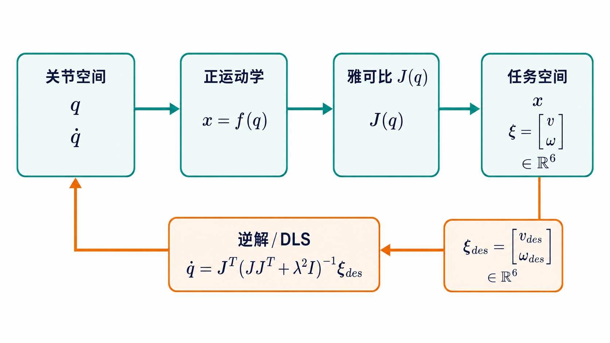
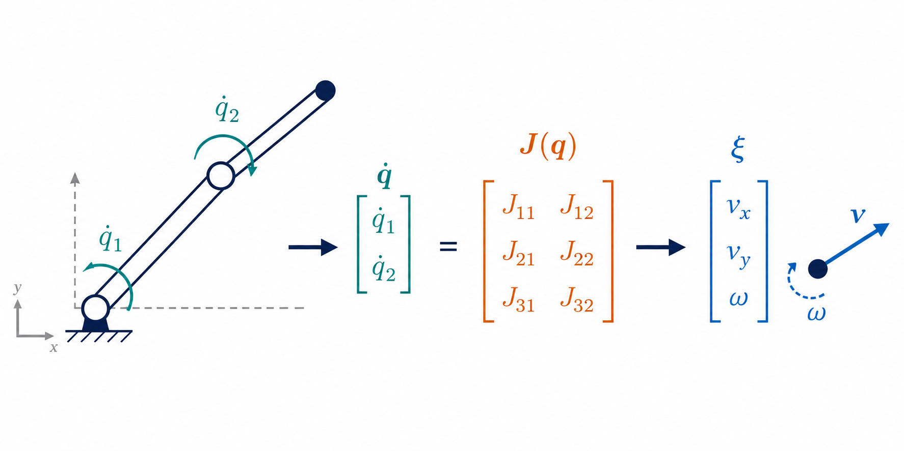
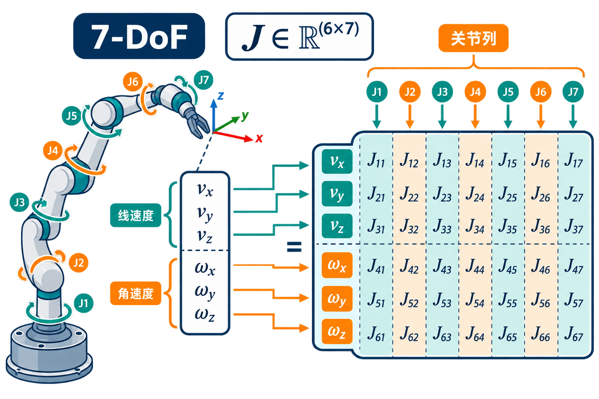
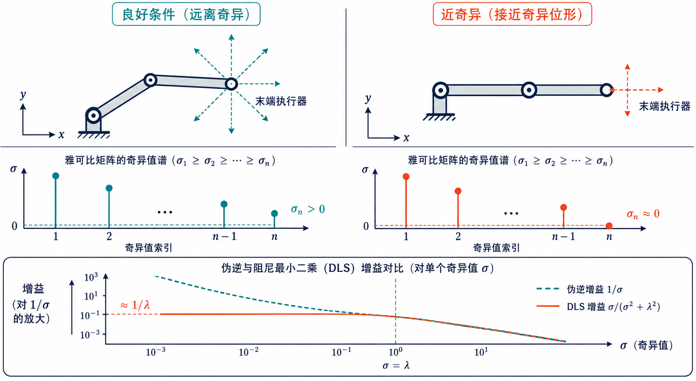

## 1. 雅可比矩阵解决什么问题？

设机器人关节配置为 $q$，末端位姿为 $x=f(q)$。对运动学方程求时间导数，可以得到局部线性关系：

$$
\xi = J(q)\dot q,
$$

其中 $\dot q$ 是关节速度，$\xi$ 是末端的六维 twist（线速度和角速度），$J(q)$ 就是雅可比矩阵。对一个六自由度任务，雅可比通常是 $6\times n_v$；在 Pinocchio 的约定中，前 3 行是线速度，后 3 行是角速度。

雅可比是“关节空间”和“任务空间”之间的速度变换器：给定 $\dot q$ 可以预测末端怎么动；给定期望末端速度，又可以反求一组关节速度。

### 图 1：速度映射的数据流


*图 1　正向路径计算末端速度，逆向路径根据期望 twist 求关节速度。*


*图 2　把雅可比看成“每个关节影响的集合”：矩阵的每一列对应一个关节。*

这张图也说明了雅可比依赖当前姿态：机器人换了一个 $q$，同一个关节速度通常会产生不同的末端速度。

### 给初学者的直观理解：每个旋钮会让手爪往哪里走？

可以先暂时忘掉“矩阵”这个词，把机器人想成几个旋钮串联起来的机械臂：

1. 只拧第 1 个旋钮，记录手爪此刻的运动方向和速度大小；
2. 只拧第 2 个旋钮，再记录一次；
3. 对每个关节都做一次，就得到一组“单个旋钮的影响”；
4. 多个旋钮同时转动时，把这些影响按各自的关节速度加起来。

这组影响按列排在一起，就是雅可比矩阵。也就是说，**第 $i$ 列回答“第 $i$ 个关节转得多快，会给末端带来什么速度”**，而矩阵乘法只是把所有关节的贡献相加。二维平面中的简化例子如下：

$$
\begin{bmatrix}\dot x\\\dot y\end{bmatrix}
=
\underbrace{\begin{bmatrix}J_{x1}&J_{x2}\\J_{y1}&J_{y2}\end{bmatrix}}_{\text{两个关节各自的影响}}
\begin{bmatrix}\dot q_1\\\dot q_2\end{bmatrix}.
$$

如果只给第一个关节速度（$\dot q_2=0$），末端速度就是第一列乘以 $\dot q_1$；两个关节一起动时，就是两列向量的加权和。这种“局部、瞬时”的关系只在当前姿态附近成立，姿态变化后需要重新计算 $J(q)$。

## 2. 几何直觉与两类雅可比

对于旋转关节，第 $i$ 列可写成

$$
J_i=\begin{bmatrix}z_i\times(p_e-p_i)\\z_i\end{bmatrix},
$$

其中 $z_i$ 是关节轴方向，$p_i$ 是关节位置，$p_e$ 是末端位置。它表达了“绕这根轴转一点，末端会产生多少线速度和角速度”。移动关节则对应

$$J_i=\begin{bmatrix}z_i\\0\end{bmatrix}.$$

这里介绍的是几何雅可比（geometric Jacobian），输出角速度。若把姿态改写成欧拉角并对欧拉角求导，得到的是解析雅可比（analytic Jacobian）；两者的角度部分不同，欧拉角还可能引入自身的奇异性。

## 3. 坐标系和 Pinocchio 的 6D 顺序

同一个雅可比可以用不同坐标系表达。Pinocchio 常用的 `ReferenceFrame` 包括：

| 选项 | 含义 | 使用建议 |
| --- | --- | --- |
| `LOCAL` | 在末端自身坐标系表达 | 适合局部控制律 |
| `WORLD` | 在世界坐标系表达，含完整坐标变换 | 适合严格的世界系推导 |
| `LOCAL_WORLD_ALIGNED` | 速度投影到世界坐标轴，但原点仍在末端 | 初学和笛卡尔控制常用 |

在下文中使用 `LOCAL_WORLD_ALIGNED`，这样线速度和角速度都能直观地用世界坐标轴解释。其向量顺序为 `[vx, vy, vz, wx, wy, wz]`，不要与 `[角速度, 线速度]` 的其他库约定混用。

### 表 1：一个 6D twist 的分量和单位

| 分量 | 含义 | 常用单位 | 雅可比对应行 |
| --- | --- | --- | --- |
| $v_x,v_y,v_z$ | 末端原点沿世界 $x,y,z$ 的线速度 | m/s | `J[:3]` |
| $\omega_x,\omega_y,\omega_z$ | 绕世界 $x,y,z$ 轴的角速度 | rad/s | `J[3:]` |

线速度和角速度量纲不同，因此做控制器增益、范数或奇异值比较时，应明确是否使用了任务权重。

### 7 自由度机械臂的矩阵究竟表示什么？

以常见的 7-DoF 固定基座机械臂为例，$q\in\mathbb{R}^7$、$\dot q\in\mathbb{R}^7$，末端 twist $\xi\in\mathbb{R}^6$，所以

$$
J(q)\in\mathbb{R}^{6\times7},\qquad
\begin{bmatrix}v_x\\v_y\\v_z\\\omega_x\\\omega_y\\\omega_z\end{bmatrix}
=
\underbrace{\begin{bmatrix}
J_{11}&\cdots&J_{17}\\
\vdots&&\vdots\\
J_{61}&\cdots&J_{67}
\end{bmatrix}}_{6\text{ 行、7 列}}
\begin{bmatrix}\dot q_1\\\dot q_2\\\vdots\\\dot q_7\end{bmatrix}.
$$

读这个矩阵时可以同时按“行”和“列”提问：

| 观察方向 | 具体含义（7-DoF 示例） |
| --- | --- |
| 第 $i$ 列（$6\times1$） | 只让第 $i$ 个关节以 1 rad/s（或 1 m/s）运动时，末端产生的六维速度；例如第 4 列就是关节 4 的瞬时影响。 |
| 第 1–3 行 | 7 个关节速度分别对 $v_x,v_y,v_z$ 的贡献。 |
| 第 4–6 行 | 7 个关节速度分别对 $\omega_x,\omega_y,\omega_z$ 的贡献。 |
| 一整列相乘再相加 | $J_{:,i}\dot q_i$ 是关节 $i$ 的贡献，七个贡献相加得到最终 twist。 |

因为 7 个关节要完成 6 个末端任务，系统通常有 1 个冗余自由度：满足同一末端速度的 $\dot q$ 不止一组，这正是零空间避限位、避奇异和优化姿态的来源。注意，“7-DoF”描述的是速度维度 `nv=7`；若模型包含浮动基座或四元数，配置维度 `nq` 可能不是 7。


*图 4　7 个关节对应 7 列，末端的 3 个线速度和 3 个角速度对应 6 行。*

#### 把一列数字读成物理量

假设某一姿态下，第 4 列为

$$J_{:,4}=[0.35,\;-0.12,\;0.00,\;0.00,\;0.00,\;1.00]^T.$$

若只让关节 4 以 $0.2\ \mathrm{rad/s}$ 运动，那么它对末端的贡献是

$$J_{:,4}\dot q_4=[0.07,\;-0.024,\;0,\;0,\;0,\;0.2]^T,$$

即末端获得约 $(0.07,-0.024,0)\ \mathrm{m/s}$ 的线速度和 $0.2\ \mathrm{rad/s}$ 的绕 $z$ 轴角速度。完整结果还要把其余 6 列分别乘以对应的关节速度后相加。

## 4. 用 Pinocchio 计算末端雅可比

安装 Python 包（不同发行版的包名可能略有不同）：

```bash
pip install pin
```

下面的脚本读取 URDF，在中性姿态计算末端位姿和雅可比。运行时请把 URDF 路径和 `--frame` 改成自己的机器人模型；`frame` 是 frame 名称，不一定等于最后一个 joint 名称。

```python
from pathlib import Path
import argparse

import numpy as np
import pinocchio as pin


def main() -> None:
    parser = argparse.ArgumentParser()
    parser.add_argument("--urdf", type=Path, required=True)
    parser.add_argument("--frame", default="ee_link")
    args = parser.parse_args()

    model = pin.buildModelFromUrdf(str(args.urdf))
    data = model.createData()
    frame_id = model.getFrameId(args.frame)
    if frame_id >= model.nframes:
        raise ValueError(f"找不到 frame: {args.frame}")

    q = pin.neutral(model)
    J = pin.computeFrameJacobian(
        model, data, q, frame_id, pin.ReferenceFrame.LOCAL_WORLD_ALIGNED
    )
    pin.forwardKinematics(model, data, q)
    pin.updateFramePlacements(model, data)
    placement = data.oMf[frame_id]

    print(f"nq={model.nq}, nv={model.nv}, J.shape={J.shape}")
    print("末端位置 (m):", placement.translation)
    print("线速度部分:\n", J[:3])
    print("角速度部分:\n", J[3:])


if __name__ == "__main__":
    main()
```

`nq` 是配置向量的维度，`nv` 是切空间（速度）的维度。普通转动/移动关节时二者相等，但浮动基座和四元数关节可能不相等，因此雅可比列数应看 `model.nv`。

如果需要分步控制计算，也可以先调用 `pin.computeJointJacobians(model, data, q)` 和 `pin.updateFramePlacements(model, data)`，再用 `pin.getFrameJacobian(...)` 读取指定参考系的结果。不要在没有更新 `data` 的情况下重复使用旧雅可比。

## 5. 从末端速度反求关节速度

最简单的逆解是伪逆：$\dot q=J^\dagger\xi_d$。靠近奇异位形时，伪逆可能放大噪声，工程上通常使用阻尼最小二乘（DLS）：

```python
xi_des = np.array([0.02, 0.0, 0.0, 0.0, 0.0, 0.0])  # m/s, rad/s
damping = 1e-3
JJt = J @ J.T
qdot = J.T @ np.linalg.solve(
    JJt + damping**2 * np.eye(6), xi_des
)

dt = 0.01
q_next = pin.integrate(model, q, qdot * dt)
```

线速度单位是 m/s，角速度单位是 rad/s。若两者量纲或优先级差异很大，应在任务空间加入权重矩阵，而不是盲目调大某一类误差。`pin.integrate` 能正确处理非欧式配置；不要对包含四元数的 `q` 直接做普通加法。

## 6. 奇异性、秩与 SVD

雅可比的奇异值可以揭示当前姿态能否沿各方向灵活运动：

```python
singular_values = np.linalg.svd(J, compute_uv=False)
print("singular values:", singular_values)
print("最小奇异值:", singular_values[-1])
```

最小奇异值接近 0 时，机器人接近奇异位形：某些末端方向几乎无法产生，逆解中的关节速度可能急剧增大。阻尼可以限制速度峰值，但会带来一定跟踪误差；实际控制还应同时设置关节速度、位置和加速度限制。

### 图 3：奇异值与 DLS 的关系

把 $J$ 做 SVD 后，每个奇异方向的伪逆增益为 $1/\sigma_i$，而 DLS 将其改为

$$
g_i=\frac{\sigma_i}{\sigma_i^2+\lambda^2}.
$$

```text
σ_i 较大  ──>  g_i ≈ 1/σ_i，正常跟踪
σ_i 接近 0 ──>  伪逆增益爆炸；DLS 增益趋近 0，牺牲精度换稳定性
```


*图 3　奇异位形会让最小奇异值塌缩；DLS 用阻尼抑制伪逆增益。*

阻尼 $\lambda$ 不是越大越好：它越大，速度越平滑，但末端误差也越明显。常见做法是根据最小奇异值或关节速度余量自适应调节阻尼。

## 7. 用有限差分检查实现

调试 URDF、frame 名称或坐标系约定时，可以用位置的中心差分校验雅可比前三行：

```python
eps = 1e-7
J_pos_fd = np.zeros((3, model.nv))

def frame_position(q_test):
    pin.forwardKinematics(model, data, q_test)
    pin.updateFramePlacements(model, data)
    return data.oMf[frame_id].translation.copy()

for i in range(model.nv):
    dq = np.zeros(model.nv)
    dq[i] = eps
    q_plus = pin.integrate(model, q, dq)
    q_minus = pin.integrate(model, q, -dq)
    J_pos_fd[:, i] = (frame_position(q_plus) - frame_position(q_minus)) / (2 * eps)

print("位置雅可比最大误差:", np.max(np.abs(J[:3] - J_pos_fd)))
```

姿态的有限差分需要先选定旋转误差定义，不能直接对旋转矩阵逐元素相减；因此先验证位置部分通常更稳妥。

## 8. 与逆运动学和冗余控制的关系

雅可比把微分运动学接到许多控制算法上：位置误差可转成期望 twist，再通过 DLS 求 $\dot q$；当 $n_v>6$ 时，还可以加入零空间项

$$
\dot q=J^\dagger\xi_d+(I-J^\dagger J)\dot q_{null},
$$

在不影响末端任务的前提下避开关节极限、远离奇异位形或优化姿态。它是速度级 IK 的核心，但并不替代碰撞检测、动力学约束和轨迹时间参数化。

## 9. 雅可比的主要用途

雅可比不是只为“求逆运动学”服务的矩阵。只要问题涉及关节变量和末端任务之间的局部变化，就可能用到它。

| 用途 | 典型关系 | 说明 |
| --- | --- | --- |
| 末端速度计算 | $\xi=J\dot q$ | 将编码器测得的关节速度转换为末端线速度和角速度。 |
| 速度级逆运动学 | $\dot q=J^\dagger\xi_d$ | 根据笛卡尔速度指令生成关节速度；DLS 用于接近奇异位形的情况。 |
| 位置控制 | $\dot q=J^\dagger K e$ | 把位置/姿态误差 $e$ 转成速度指令，形成 resolved-rate 控制器。 |
| 力到关节力矩 | $\tau=J^T F$ | 末端受到 wrench $F=[f;\mu]$ 时，计算各关节需要承担的力矩。 |
| 可操作性分析 | $JJ^T$、奇异值 | 判断哪些方向容易运动、哪些方向接近失去自由度，并用于姿态规划。 |
| 参数标定 | $\delta x\approx J_p\delta p$ | 将连杆长度、零位偏差等参数误差映射到末端观测误差。这里的 $J_p$ 是对参数的灵敏度矩阵。 |
| 接触与碰撞约束 | $v_c=J_c\dot q$ | 将接触点速度写成关节速度的线性约束，配合 QP、摩擦锥或避碰控制。 |
| 动力学建模 | $M_x=J^{-T}M_qJ^{-1}$（满秩时） | 在任务空间表达惯量；实际实现常使用操作空间动力学和广义逆。 |

### 9.1 雅可比转置：末端力如何传到关节？

速度关系的对偶形式来自虚功守恒：

$$
F^T\xi=F^TJ\dot q=(J^TF)^T\dot q,
\qquad \tau=J^TF.
$$

例如末端沿世界 $x$ 方向受到 $10\ \mathrm{N}$ 的力，可令 `wrench = [10, 0, 0, 0, 0, 0]`，再计算 `tau = J.T @ wrench`。这里的 wrench 和雅可比必须使用同一个 frame、同一个 `[线, 角]` 顺序；否则力矩方向会错误。

### 9.2 Pinocchio 中的相关接口

- `computeFrameJacobian`：直接计算指定 frame 的 6D 雅可比。
- `getFrameJacobian`：在已完成 `computeJointJacobians` 后读取缓存结果。
- `computeJointJacobians`：计算关节雅可比，适合在同一姿态下重复读取多个 joint/frame。
- `getFrameVelocity`：计算给定关节速度下的 frame twist，可用于验证 $J\dot q$。

可以用下面的短代码检查速度映射和力矩映射：

```python
qdot = np.zeros(model.nv)
qdot[0] = 0.1
xi_from_jacobian = J @ qdot

pin.forwardKinematics(model, data, q, qdot)
pin.updateFramePlacements(model, data)
xi_from_pinocchio = pin.getFrameVelocity(
    model, data, frame_id, pin.ReferenceFrame.LOCAL_WORLD_ALIGNED
).vector

print("速度映射误差:", np.max(np.abs(xi_from_jacobian - xi_from_pinocchio)))
wrench = np.array([10.0, 0.0, 0.0, 0.0, 0.0, 0.0])
joint_torque = J.T @ wrench
print("末端力对应的关节力矩:", joint_torque)
```

### 9.3 位置控制：从误差到关节指令

给定当前末端位置 $p$ 和目标位置 $p_d$，先构造误差 $e_p=p_d-p$，再令期望线速度为 $v_d=K_pe_p$。将角度误差 $e_R$ 也加入后，可组成 $\xi_d=[v_d,\omega_d]$，最后交给 DLS 求 $\dot q$。这是一种速度级闭环：每个控制周期都重新读取 $q$、重新计算 $J$ 和误差，因此不会把某个姿态下的线性近似长期外推。

### 9.4 可操作性与姿态规划

矩阵 $JJ^T$ 的椭球描述末端速度在各方向的能力。奇异值大的方向容易产生速度，奇异值小的方向需要很大的关节速度。规划时可以最大化最小奇异值，或使用 Yoshikawa 可操作性指标

$$w(q)=\sqrt{\det(JJ^T)}.$$

该指标只适合在任务维度和单位已统一时比较；混合米和弧度而不加权，会使数值缺乏直接物理意义。

### 9.5 标定与误差传播

如果待估参数为 $p$（例如连杆长度或关节零位），观测到的末端误差可在当前估计附近线性化：

$$\delta x\approx J_p\delta p.$$

收集多组姿态后，可以用最小二乘估计 $\delta p$。这里的 $J_p$ 不是关节雅可比，而是对模型参数求导的灵敏度矩阵；两者概念相似，但列的物理含义不同。

### 9.6 接触、避碰与优化控制

对末端之外的任意接触点同样可以建立 $v_c=J_c\dot q$。在 QP 控制器中，$J_c\dot q=0$ 可表示接触点瞬时不动，$n^TJ_c\dot q\ge0$ 可表示沿法向远离障碍物。多个任务只需把对应的雅可比按行堆叠，并通过权重或优先级解决冲突。

## 10. 从二连杆开始手算一次

对长度为 $l_1,l_2$ 的二维二连杆，末端位置为

$$
\begin{aligned}
x &= l_1\cos q_1+l_2\cos(q_1+q_2),\\
y &= l_1\sin q_1+l_2\sin(q_1+q_2).
\end{aligned}
$$

分别对 $q_1,q_2$ 求偏导，就得到位置雅可比：

$$
J_p(q)=
\begin{bmatrix}
-l_1\sin q_1-l_2\sin(q_1+q_2) & -l_2\sin(q_1+q_2)\\
l_1\cos q_1+l_2\cos(q_1+q_2) & +l_2\cos(q_1+q_2)
\end{bmatrix}.
$$

第一列包含两段连杆，因为关节 1 会带动整条机械臂；第二列只包含 $l_2$，因为关节 2 不会改变第一段连杆的位置。当 $q_2=0$ 或 $q_2=\pi$ 时两根杆共线，两列方向相关，$\det(J_p)=l_1l_2\sin q_2=0$，机械臂失去一个瞬时运动方向。这就是“矩阵降秩”在几何上的样子。

## 11. 从位姿误差构造期望 twist

只控制位置时，可以直接使用 $e_p=p_d-p$。姿态属于旋转群，不能安全地用旋转矩阵逐元素相减。设当前位姿为 $M$、目标位姿为 $M_d$，一种常用做法是通过 SE(3) 对数映射得到六维误差：

\`\`\`python
current = data.oMf[frame_id]
desired = pin.SE3(desired_rotation, desired_translation)

# LOCAL 误差：从当前 frame 到目标 frame 的相对变换
error = pin.log6(current.inverse() * desired).vector
gain = 2.0
xi_des = gain * error
\`\`\`

这里的 \`error\` 在局部坐标系表达，因此应配合 \`ReferenceFrame.LOCAL\` 的雅可比。若采用 \`LOCAL_WORLD_ALIGNED\`，误差也必须转换到相同表达方式。**误差、twist 和雅可比的参考系必须一致**，这是位姿 IK 中最容易遗漏的条件之一。

## 12. 7-DoF 的零空间控制

7-DoF 机械臂执行满秩六维末端任务时，通常剩余一个零空间方向。可以在完成主任务的同时加入次任务：

$$
\dot q=J^\dagger\xi_d+\underbrace{(I-J^\dagger J)}_{N}\dot q_0.
$$

$N$ 是零空间投影矩阵，理想情况下 $JN=0$，因此第二项不会改变末端瞬时速度。下面以“把关节拉向行程中点”为例：

\`\`\`python
J_pinv = np.linalg.pinv(J)
q_mid = 0.5 * (model.lowerPositionLimit + model.upperPositionLimit)
qdot_secondary = -0.2 * (q - q_mid)

null_projector = np.eye(model.nv) - J_pinv @ J
qdot = J_pinv @ xi_des + null_projector @ qdot_secondary
\`\`\`

这段代码只适用于 \`q\` 和速度向量可直接对应的固定基座标量关节模型。更一般的 Pinocchio 模型应使用 \`pin.difference\` 计算配置差，并处理无限或无效的关节限位。接近奇异位形时，零空间维度可能变化，实际控制器通常使用阻尼广义逆和速度限幅。

## 13. 加速度级关系：为什么还有 $\dot J\dot q$？

对速度关系再次求导：

$$
\dot\xi=J(q)\ddot q+\dot J(q,\dot q)\dot q.
$$

其中 $J\ddot q$ 是关节加速度的直接贡献，$\dot J\dot q$ 是机器人运动过程中雅可比本身变化产生的偏置项。高速轨迹或操作空间动力学中忽略该项，会造成明显的加速度误差。

Pinocchio 可以在完成运动学导数计算后读取 frame Jacobian 的时间变化率。不同版本的 Python 绑定接口可能略有差异，使用时应核对当前版本的 \`computeJointJacobiansTimeVariation\` 与 \`getFrameJacobianTimeVariation\` 文档。

## 14. 如何判断计算结果是否合理？

拿到一个 $6\times7$ 数组后，不应只检查形状。建议按以下顺序验证：

1. **零速度检查**：\`qdot=0\` 时，\`J @ qdot\` 必须为零。
2. **单列检查**：每次只给一个关节很小的速度，观察末端方向是否符合直觉。
3. **有限差分检查**：用 \`pin.integrate\` 扰动配置，比较位置变化和 \`J[:3]\`。
4. **接口交叉检查**：比较 \`J @ qdot\` 与 \`getFrameVelocity(...).vector\`。
5. **参考系检查**：旋转机器人基座或末端后，确认向量表达随选定 reference frame 正确变化。
6. **奇异性检查**：观察奇异值和关节速度是否同时出现异常，而不只看矩阵元素大小。

## 15. 常见错误清单

- 把 `joint_id` 传给需要 `frame_id` 的接口，或误把末端 frame 当成最后一个 joint。
- 忘记 `LOCAL`、`WORLD` 和 `LOCAL_WORLD_ALIGNED` 的差别，导致方向看似“反了”。
- 混淆 Pinocchio 的 `[线速度, 角速度]` 顺序。
- 用 `nq` 创建 `dq`；速度向量长度应为 `model.nv`。
- 雅可比与位姿不在同一个 `q`，或修改配置后没有重新计算运动学。
- TCP 有固定工具偏置，却读取了法兰 frame；应在 URDF 中添加工具 frame，或使用对应的 frame 变换。

进一步的接口细节可参考 [Pinocchio 的 frame Jacobian 文档](https://docs.ros.org/en/rolling/p/pinocchio/generated/function_namespacepinocchio_1a10afd10589bb0c0984e504b3685e5910.html) 和 [Pinocchio 项目仓库](https://github.com/stack-of-tasks/pinocchio)。
