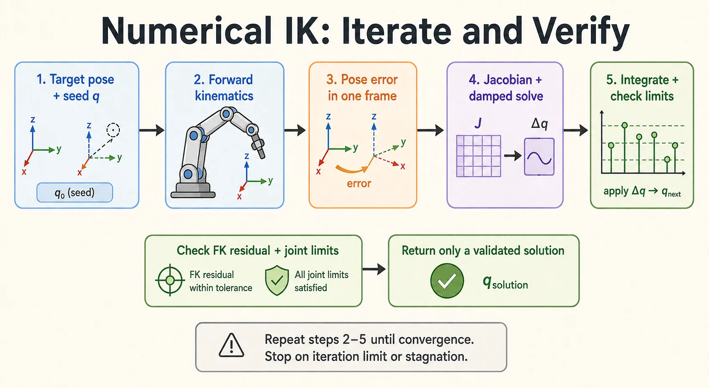

Pinocchio 提供正运动学、雅可比与李群运算，数值逆解需要在这些工具之上定义误差、迭代策略和失败条件。本文使用**末端 frame**作为目标，避免把 URDF 的 link 名称当作 joint 名称再减一。



## 1. 模型和坐标约定

本例适用于固定基座、每个关节以一个标量表示的有界转动或移动关节。浮动基、球关节及使用二维配置表示的连续转动关节，不能直接使用逐元素限位裁剪。

目标 `target` 和当前末端 `current` 都是基座中的位姿。定义：

$$
E = T_{\mathrm{current}}^{-1}T_{\mathrm{target}},
\qquad e=\log(E).
$$

误差与 `LOCAL` frame Jacobian 配合使用，并通过 `Jlog6` 构造误差的雅可比。阻尼最小二乘求一个局部更新；它不保证从任意初值收敛，也不包含碰撞检测。[Pinocchio 官方逆运动学示例](https://gepettoweb.laas.fr/doc/stack-of-tasks/pinocchio/master/doxygen-html/md_doc_b_examples_d_inverse_kinematics.html)

## 2. 可复用的求解函数

```python
import numpy as np
import pinocchio as pin


def solve_ik(model, frame_name, target, q0, max_iter=500,
             position_tol=1e-4, rotation_tol=1e-4, damping=1e-3):
    if any(j.nq != 1 or j.nv != 1 for j in model.joints[1:]):
        raise ValueError("Only fixed-base scalar joints are supported")
    if max_iter < 1 or min(position_tol, rotation_tol, damping) <= 0:
        raise ValueError("Iterations and tolerances must be positive")
    frame_id = model.getFrameId(frame_name)
    if frame_id >= len(model.frames):
        raise ValueError(f"Unknown end-effector frame: {frame_name}")

    lower = model.lowerPositionLimit
    upper = model.upperPositionLimit
    if not (np.isfinite(lower).all() and np.isfinite(upper).all()):
        raise ValueError("Finite joint bounds are required")
    q = np.asarray(q0, dtype=float).copy()
    if q.shape != (model.nq,) or not np.isfinite(q).all():
        raise ValueError("q0 must be a finite vector of size model.nq")
    if np.any(q < lower) or np.any(q > upper):
        raise ValueError("q0 is outside joint limits")
    if not (np.isfinite(target.homogeneous).all()
            and np.allclose(target.rotation.T @ target.rotation,
                            np.eye(3), atol=1e-6)
            and np.isclose(np.linalg.det(target.rotation), 1.0)):
        raise ValueError("target must contain a valid rigid rotation")

    data = model.createData()

    def evaluate(configuration):
        pin.forwardKinematics(model, data, configuration)
        pin.updateFramePlacements(model, data)
        current = data.oMf[frame_id]
        relative = current.actInv(target)
        error = pin.log6(relative).vector
        position_error = np.linalg.norm(current.translation - target.translation)
        rotation_error = np.linalg.norm(pin.log3(relative.rotation))
        return relative, error, position_error, rotation_error

    status = "iteration_limit"
    for iteration in range(max_iter):
        relative, error, pos_err, rot_err = evaluate(q)
        if pos_err <= position_tol and rot_err <= rotation_tol:
            status = "converged"
            break

        jacobian = pin.computeFrameJacobian(
            model, data, q, frame_id, pin.ReferenceFrame.LOCAL
        )
        error_jacobian = -pin.Jlog6(relative.inverse()) @ jacobian
        delta = -error_jacobian.T @ np.linalg.solve(
            error_jacobian @ error_jacobian.T + damping**2 * np.eye(6),
            error,
        )
        if not np.isfinite(delta).all():
            status = "nonfinite_step"
            break

        cost = error @ error
        accepted = False
        for step in (1.0, 0.5, 0.25, 0.125, 0.0625, 0.03125):
            candidate = np.clip(pin.integrate(model, q, step * delta),
                                lower, upper)
            _, candidate_error, _, _ = evaluate(candidate)
            if candidate_error @ candidate_error < cost:
                q = candidate
                accepted = True
                break
        if not accepted:
            status = "stagnation"
            break

    _, _, pos_err, rot_err = evaluate(q)
    success = bool(pos_err <= position_tol and rot_err <= rotation_tol
                   and np.all(q >= lower) and np.all(q <= upper))
    return {
        "success": success,
        "status": "converged" if success else status,
        "q": q,
        "iterations": iteration + 1,
        "position_error": float(pos_err),
        "rotation_error": float(rot_err),
    }
```

旋转误差单位为弧度，位置误差使用 URDF 的长度单位（通常为米）。这里最小化未加权的六维残差，米与弧度的相对尺度是一个建模选择；实际项目可以为两类误差设置权重，并同步缩放雅可比。

## 3. 用正解生成可达目标

把下面代码接在同一个 `frame_ik.py` 文件末尾。目标由一组已知关节角生成，便于区分求解器问题和目标不可达问题：

```python
if __name__ == "__main__":
    import argparse

    parser = argparse.ArgumentParser()
    parser.add_argument("urdf")
    parser.add_argument("frame")
    args = parser.parse_args()

    model = pin.buildModelFromUrdf(args.urdf)
    frame_id = model.getFrameId(args.frame)
    if frame_id >= len(model.frames):
        raise ValueError(f"Unknown frame: {args.frame}")
    q0 = np.clip(pin.neutral(model),
                 model.lowerPositionLimit, model.upperPositionLimit)
    known_q = np.clip(q0 + 0.1,
                     model.lowerPositionLimit, model.upperPositionLimit)
    data = model.createData()
    pin.forwardKinematics(model, data, known_q)
    pin.updateFramePlacements(model, data)
    target = data.oMf[frame_id].copy()

    result = solve_ik(model, args.frame, target, q0)
    print(result)
    if not result["success"]:
        raise SystemExit("IK failed: inspect residuals and seed")
```

```bash
python frame_ik.py /path/to/robot.urdf ee_link
```

URDF 路径和 frame 名称必须替换为实际模型中的值。测试近目标、远目标、关节限位附近与不可达目标，并记录返回状态。

## 4. 限位处理的边界

只在收敛后把角度加减 $2\pi$，不能保证获得合法解；任意裁剪也可能改变末端位姿。本例在每次候选更新时检查限位，最后重新计算 FK 残差。

裁剪式更新仍可能在边界停滞。更复杂的项目可使用带限位的优化问题、多初值搜索或任务层约束求解，但依然需要明确失败返回，不能把未收敛的关节角直接交给控制器。


## 阅读自测与验收

- 用已知 q 的 FK 构造目标，记录位置与旋转残差，再逐渐增大初值扰动；近初值成功不能推广到任意初值。
- 故意输入缺失 frame、越界 q0 和不可达目标，确认返回或异常语义明确；没有成功标记时不能直接下发关节值。
