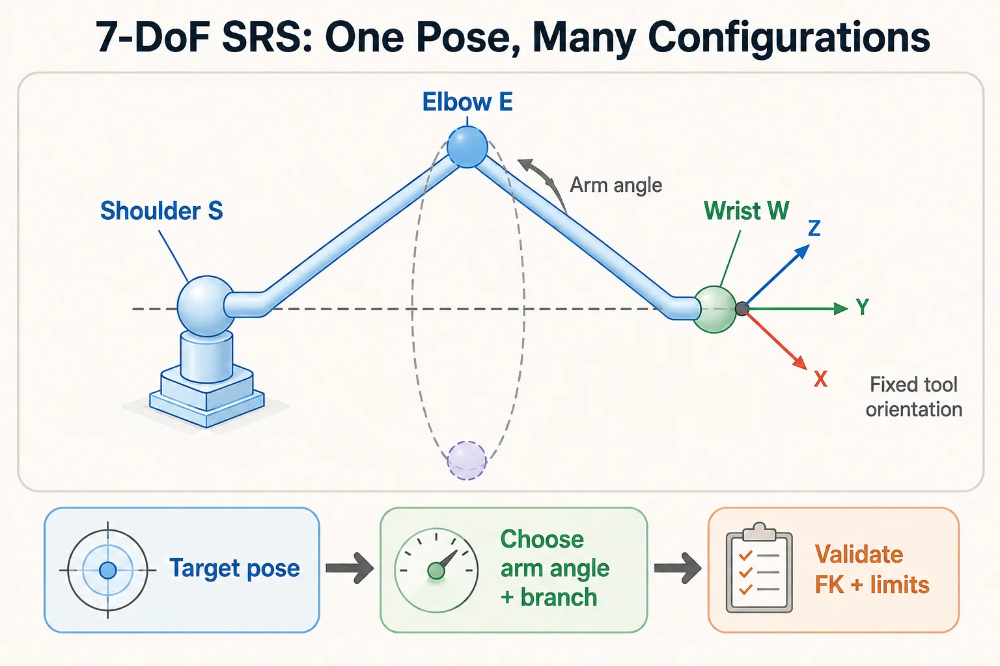

本文针对肩—肘—腕（SRS）结构，展示用臂角参数选择冗余解的 Python/NumPy 实现。不同七自由度机器人的轴线结构未必满足这里的几何假设；链接到的 [7DofSRSKinematics 项目](https://github.com/chase6305/7DofSRSKinematics)提供配套背景。

## 1. 为什么需要臂角

固定末端位姿后，七自由度机械臂通常仍保留一个局部冗余自由度。对理想 SRS 结构，肘部可以绕肩—腕连线改变位置，臂角用于描述这个选择。



## 2. 输入、输出与模型约定

- `pose`：基座中的目标齐次变换，长度单位为米。
- `nsparam`：臂角，单位为弧度。
- `rconf`：肩、肘、腕的离散分支位；改变它可能使关节解跳变。
- 返回关节角及对应肩、腕旋转矩阵的系数，最终要用正解重建目标进行验证。

本例不处理关节限位、碰撞约束或所有奇异分支。连续轨迹需要按上一帧关节角选择临近解，不能逐帧任意切换分支。

## 3. NumPy 实现

```python
import numpy as np
from copy import deepcopy

class SRSKinSolver:
    def __init__(self):
        self.link_lengths = np.array([0.34, 0.4, 0.4, 0.126])
        half_pi = np.pi / 2
        self.dh_params = np.array(
            [
                [self.link_lengths[0], -half_pi, 0, 0],  # Joint 1
                [0,                     half_pi, 0, 0],  # Joint 2
                [self.link_lengths[1],  half_pi, 0, 0],  # Joint 3
                [0,                    -half_pi, 0, 0],  # Joint 4
                [self.link_lengths[2], -half_pi, 0, 0],  # Joint 5
                [0,                     half_pi, 0, 0],  # Joint 6
                [self.link_lengths[3],  0, 0, 0],  # Joint 7
            ]
        )
        self.d_bs = self.link_lengths[0]
        self.d_se = self.link_lengths[1]
        self.d_ew = self.link_lengths[2]
        self.d_wt = self.link_lengths[3]

    @staticmethod
    def skew(vector: np.ndarray) -> np.ndarray:
        """Compute the skew-symmetric matrix of a vector."""
        return np.array(
            [
                [0, -vector[2], vector[1]],
                [vector[2], 0, -vector[0]],
                [-vector[1], vector[0], 0],
            ]
        )

    def dh_calc(self, d: float, alpha: float, a: float, theta: float) -> np.ndarray:
        """Calculate the transformation matrix based on D-H parameters."""
        T = np.array(
            [
                [
                    np.cos(theta),
                    -np.sin(theta) * np.cos(alpha),
                    np.sin(theta) * np.sin(alpha),
                    a * np.cos(theta),
                ],
                [
                    np.sin(theta),
                    np.cos(theta) * np.cos(alpha),
                    -np.cos(theta) * np.sin(alpha),
                    a * np.sin(theta),
                ],
                [0, np.sin(alpha), np.cos(alpha), d],
                [0, 0, 0, 1],
            ]
        )
        return T

    def configuration(self, rconf: int) -> tuple:
        """Determine the configuration of the arm, elbow, and wrist based on rconf."""
        arm_config = -1 if rconf & 1 else 1
        elbow_config = -1 if rconf & 2 else 1
        wrist_config = -1 if rconf & 4 else 1
        return arm_config, elbow_config, wrist_config

    def calculate_joint_angles(
        self, P_s_to_w: np.ndarray, elbow_GC4: int
    ) -> np.ndarray:
        """Calculate joint angles based on the position from shoulder to wrist and elbow configuration."""
        d_bs, d_se, d_ew = (
            self.link_lengths[0],
            self.link_lengths[1],
            self.link_lengths[2],
        )
        joints = np.zeros(7)

        # Check reachability and calculate elbow joint angle
        norm_P26 = np.linalg.norm(P_s_to_w)
        if not d_se + d_ew > norm_P26 > abs(d_se - d_ew):
            raise ValueError("Unreachable or singular shoulder-wrist distance")

        elbow_cos_angle = (norm_P26**2 - d_se**2 - d_ew**2) / (2 * d_se * d_ew)
        if abs(elbow_cos_angle) > 1 + 1e-12:
            raise ValueError("Invalid elbow geometry")
        joints[3] = elbow_GC4 * np.arccos(np.clip(elbow_cos_angle, -1.0, 1.0))

        # Calculate joint 1
        if np.linalg.norm(P_s_to_w[:2]) > 1e-6:
            joints[0] = np.arctan2(P_s_to_w[1], P_s_to_w[0])
        else:
            joints[0] = 0

        # Calculate joint 2
        euclidean_norm = np.hypot(P_s_to_w[0], P_s_to_w[1])
        angle_phi = np.arccos(
            np.clip((d_se**2 + norm_P26**2 - d_ew**2)
                    / (2 * d_se * norm_P26), -1.0, 1.0)
        )
        joints[1] = (
            np.arctan2(euclidean_norm, P_s_to_w[2]) + elbow_GC4 * angle_phi
        )

        return joints

    def reference_plane(self, pose: np.ndarray, elbow_GC4: int) -> tuple:
        """Calculate the reference plane vector, rotation matrix from base to elbow, and joint values."""
        P_target = pose[:3, 3]
        P02 = np.array([0, 0, self.link_lengths[0]])  # Base to shoulder
        P67 = np.array([0, 0, self.dh_params[-1, 0]])  # Hand to end-effector
        P06 = P_target - pose[:3, :3] @ P67
        P26 = P06 - P02

        # Calculate joint angles
        joint_v = np.zeros(7)
        joint_v = self.calculate_joint_angles(P26, elbow_GC4)

        # Express both reference vectors in the base frame.
        _, transforms = self.compute_total_transform(joint_v)
        elbow = transforms[2][:3, 3]
        v1 = (elbow - P02) / np.linalg.norm(elbow - P02)
        v2 = P26 / np.linalg.norm(P26)
        V_v_to_sew = np.cross(v1, v2)

        R03_v = np.eye(3)
        for i in range(3):
            R03_v = R03_v @ self.dh_calc(
                self.dh_params[i, 0],
                self.dh_params[i, 1],
                self.dh_params[i, 2],
                joint_v[i],
            )[:3,:3]

        return V_v_to_sew, R03_v, joint_v

    def inverse_kinematics(self, pose: np.ndarray, nsparam: float, rconf: int) -> tuple:
        """Perform inverse kinematics to calculate joint angles given a target pose, normalization parameter, and configuration."""
        pose = np.asarray(pose, dtype=float)
        if (pose.shape != (4, 4) or not np.isfinite(pose).all()
                or not np.isfinite(nsparam) or rconf not in range(8)
                or not np.allclose(pose[3], [0, 0, 0, 1])
                or not np.allclose(pose[:3, :3].T @ pose[:3, :3], np.eye(3))
                or not np.isclose(np.linalg.det(pose[:3, :3]), 1.0)):
            raise ValueError("Need a rigid pose, finite arm angle and rconf in 0..7")
        arm_config, elbow_config, wrist_config = self.configuration(rconf)
        P_target = pose[:3, 3]
        P02 = np.array([0, 0, self.link_lengths[0]])  # Base to shoulder
        P67 = np.array([0, 0, self.dh_params[-1, 0]])  # Hand to end-effector
        P06 = P_target - pose[:3, :3] @ P67
        P26 = P06 - P02

        joints = np.zeros(7)
        # Calculate joint angles
        joints = self.calculate_joint_angles(P26, elbow_config)

        # Calculate transformations
        T34 = self.dh_calc(
            self.dh_params[3, 0], self.dh_params[3, 1], self.dh_params[3, 2], joints[3]
        )
        R34 = T34[:3, :3]

        # Calculate reference plane
        V_v_to_sew, R03_o, joint_v = self.reference_plane(pose, elbow_config)

        # Another way to compute R03_o

        # Calculate shoulder joint rotation matrices
        usw = P26 / np.linalg.norm(P26)
        skew_usw = self.skew(usw)

        # angle_psi = np.arctan2(pose[1, 0], pose[0, 0])
        angle_psi = nsparam

        # Calculate rotation matrix R03
        A_s = skew_usw @ R03_o
        B_s = -skew_usw @ skew_usw @ R03_o
        # C_s = (usw @ usw.T) @ R03_o
        C_s = (usw.reshape(-1, 1) @ usw.reshape(1, -1)) @ R03_o

        # C_s = P26 @ P26 @ R03_o
        R03 = A_s * np.sin(angle_psi) + B_s * np.cos(angle_psi) + C_s

        # Calculate shoulder joint angles
        joints[0] = np.arctan2(R03[1, 1] * arm_config, R03[0, 1] * arm_config)
        joints[1] = np.arccos(np.clip(R03[2, 1], -1.0, 1.0)) * arm_config
        joints[2] = np.arctan2(-R03[2, 2] * arm_config, -R03[2, 0] * arm_config)

        # Calculate wrist joint angles
        A_w = R34.T @ A_s.T @ pose[:3, :3]
        B_w = R34.T @ B_s.T @ pose[:3, :3]
        C_w = R34.T @ C_s.T @ pose[:3, :3]

        # Calculate wrist rotation matrix R47
        R47 = A_w * np.sin(angle_psi) + B_w * np.cos(angle_psi) + C_w

        # Calculate wrist joint angles
        joints[4] = np.arctan2(R47[1, 2] * wrist_config, R47[0, 2] * wrist_config)
        joints[5] = np.arccos(np.clip(R47[2, 2], -1.0, 1.0)) * wrist_config
        joints[6] = np.arctan2(R47[2, 1] * wrist_config, -R47[2, 0] * wrist_config)

        s_mat = np.zeros((3, 3, 3))
        w_mat = np.zeros((3, 3, 3))
        s_mat[:, :, 0] = A_s
        s_mat[:, :, 1] = B_s
        s_mat[:, :, 2] = C_s
        w_mat[:, :, 0] = A_w
        w_mat[:, :, 1] = B_w
        w_mat[:, :, 2] = C_w

        return (
            joints,
            s_mat,
            w_mat,
        )  # Shoulder and wrist rotation coefficients accompany the solution.


    def compute_total_transform(self, joint_angles):
        """Compute the overall transformation matrix and the list of transformation matrices for each joint."""
        joint_angles = np.asarray(joint_angles, dtype=float)
        if joint_angles.shape != (7,) or not np.isfinite(joint_angles).all():
            raise ValueError("Expected seven finite joint angles")
        T_total = np.eye(4)
        T_total_list = []
        for i, params in enumerate(self.dh_params):
            d, alpha, a, theta = params
            if i < len(joint_angles):
                theta += joint_angles[i]

            T = self.dh_calc(d, alpha, a, theta)
            T_total = T_total @ T
            T_total_list.append(T_total.copy())

        return T_total, T_total_list

# Test example
if __name__ == "__main__":
    np.set_printoptions(6, suppress=True)

    ori_joints = np.array([0.0, np.pi/2, 1, np.pi / 2, 1, np.pi / 2, 0])
    kin_solver = SRSKinSolver()

    T_total, T_total_list = kin_solver.compute_total_transform(ori_joints)

    pose = np.array(deepcopy(T_total))
    nsparam = np.pi / 4
    rconf = 0b00000001

    joints, s_mat, w_mat = kin_solver.inverse_kinematics(pose, nsparam, rconf)
    T_total_1, T_total_list_1 = kin_solver.compute_total_transform(joints)

    position_error = np.linalg.norm(T_total[:3, 3] - T_total_1[:3, 3])
    cosine = (np.trace(T_total[:3, :3].T @ T_total_1[:3, :3]) - 1.0) / 2.0
    rotation_error = np.arccos(np.clip(cosine, -1.0, 1.0))
    print("Joint solution:", joints)
    print("Position error (m):", position_error)
    print("Rotation error (rad):", rotation_error)
    if position_error > 1e-6 or rotation_error > 1e-6:
        raise RuntimeError("FK validation failed")

```


## 4. 验证边界

先用已知关节角生成目标，再做 FK → IK → FK 闭环验证。关节角不必与原始关节角相同，但末端位姿应在容差内一致。

肩—腕距离需满足由上臂和前臂长度组成的三角不等式；基座到肩的高度不能代替上臂长度。伸直、完全折叠以及肩腕欧拉角提取的奇异情况需要独立分支处理，本例在部分边界会拒绝求解。


## 阅读自测与验收

- 固定目标，改变臂角和八类构型分支，分别检查 FK 残差；肘部位置可变化，但目标末端位姿应保持一致。
- 接近肩腕重合、肘伸直等退化情况时检查失败处理；该理想 SRS 模型不能直接代替任意七轴机器人的实测几何。
