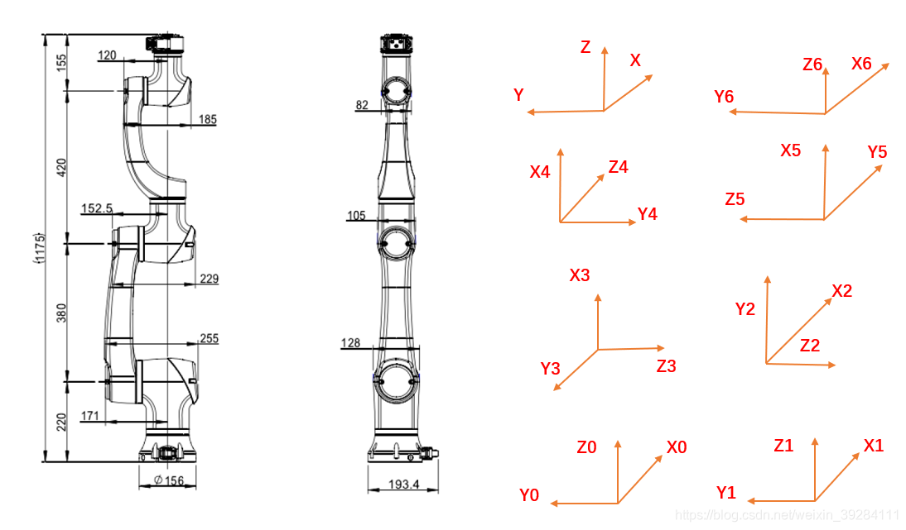

## 简介
本文主要是对传统六自由度机器人进行正逆运动学求解，选取大族机器人Elfin05 为分析的对象，开发语言是C++。（完善中）
## 机器人正运动学
机器人正运动学推导过程



各关节坐标系确定的通用方法：

 1. 坐标系的Z轴，与各关节的旋转中心轴线重合
 2. 坐标系的X轴，与沿着相邻两个Z轴的公垂线重合
 3. 坐标系的Y轴，可以通过右手定则来确定

当相邻两个Z轴相交时，确定坐标系的方法如下：
 1. 坐标系的Y轴，沿着第一个Z轴与下一个X轴相交的延长线为Y轴
 2. 坐标系的X轴，可通过右手定则确定

当相邻两个Z轴平行时，确定坐标系的方法如下：
 1. 坐标系的X轴：沿着第一个Z轴与下一个X轴相交的延长线为Y轴
 2. 坐标系的X轴，可通过右手定则确定


那么：
杆1-杆2：杆长220mm，关节杆长0mm，绕z旋转0度，绕x旋转90度；
杆2-杆3：杆长0mm，关节杆长455mm，绕z旋转90度，绕x旋转0度；
杆3-杆4：杆长0mm，关节杆长0mm，绕z旋转0度，绕x旋转90度；
杆4-杆5：杆长495mm，关节杆长0mm，绕z旋转0度，绕x旋转90度；
杆5-杆6：杆长0mm，关节杆长0mm，绕z旋转90度，绕x旋转90度；
杆6-TCP：杆长-155mm，关节杆长0mm，绕z旋转0度，绕x旋转0度。

### DH 参数表

| 关节(*i*) | 扭角(*α*) | 连杆长度(*a*) | 关节偏距(*d*) | 关节角(*θ*) | 工作范围 |
|-----------|-----------|---------------|---------------|-------------|-----------|
| 1 | 90° | 220mm | 0 | 0° | ±360° |
| 2 | 0° | 0 | 450mm | 90° | ±360° |
| 3 | 90° | 0 | 0 | 0° | ±360° |
| 4 | 90° | 495mm | 0 | 0° | ±360° |
| 5 | 90° | 0 | 0 | 90° | ±360° |
| 6 | 90° | -155mm | 0 | 0° | ±360° |

**参数说明：**
- *α*: 关节扭转角，相邻两连杆之间的角度（绕 X 轴）
- *a*: 连杆长度，相邻两关节轴线间的垂直距离
- *d*: 关节偏距，沿关节轴线的位移
- *θ*: 关节角度，相邻两连杆间的夹角（绕 Z 轴）


matlab代码块
```r
% Link函数调用格式： L（i）=Link( [theta，D，A，alpha，sigma]，‘convention’)
% 其参数与D-H参数相对应
% 前四个参数依次表示：参数‘theta’代表关节角，参数‘D’代表横距，
% 参数‘A’代表杆件长度，参数‘alpha’代表扭转角，参数‘sigma’代表关节类型：0代表旋转关节，非0代表移动关节，默认值为0。
% 参数 ‘convention’ 表示使用D-H参数法创建机器人模型的类型：
% ‘standard’表示采用标准D-H参数法创建机器人模型；‘modified’表示采用该改进D-H参数法创建机器人模型，默认值为'standard'，代码中使用默认值。
clear;
clc;
%建立机器人模型
%       theta    d        a        alpha     offset
L1=Link([0       0.220     0        pi/2       0     ],'standard'); %定义连杆的D-H参数
L2=Link([0       0         0.455     0         0     ],'standard');
L3=Link([0       0         0        pi/2       0     ],'standard');
L4=Link([0       0.495     0        pi/2       0     ],'standard');
L5=Link([0       0         0        pi/2       0     ],'standard');
L6=Link([0       -0.155    0         0         0     ],'standard');
L(1).qlim =[-2*pi, 2*pi];
L(2).qlim =[-2*pi, 2*pi];
L(3).qlim =[-2*pi, 2*pi];
L(4).qlim =[-2*pi, 2*pi];
L(5).qlim =[-2*pi, 2*pi];
L(6).qlim =[-2*pi, 2*pi];
robot=SerialLink([L1 L2 L3 L4 L5 L6],'name','manman'); %连接连杆，机器人取名manman
figure(1);
robot.display();
teach(robot);
```


### 六自由度机器人逆运动学求解步骤

| 步骤 | 输入/输出 | 操作 | 说明 |
|------|-----------|------|------|
| 输入 | P=[*x,y,z*]<br>E=[*α,β,γ*] | - | P: TCP位置<br>E: TCP姿态欧拉角 |
| 输出 | [*q1,q2,q3,q4,q5,q6*] | - | 6个关节角度值 |
| 1 | [*n,s,a*] = forward_euler(*E*) | 欧拉角转换 | 求解TCP的旋转变换矩阵 |
| 2 | *Pw* = *E - d7×a* | 几何计算 | 求解腕关节中心点WCP位置 |
| 3 | [*q1,q2,q3*] = inverse_kinematic(*Pw*) | 解析解法 | 求解前3个关节角度(4组解) |
| 4 | R0_3 = inverse_kinematic_0_3([*q1,q2,q3*]) | 正解计算 | 求基座到WCP的变换矩阵 |
| 5 | R3_6 = R0_3^T×[*n,s,a*] | 矩阵运算 | 求WCP到TCP的变换矩阵 |
| 6 | [*q4,q5,q6*] = inverse_euler(R3_6) | 欧拉角解算 | 求解后3个关节角度(2组解) |
| 7 | generate_ik([*q1,q2,q3,q4,q5,q6*]) | 解优化 | 在±2π范围内寻找最优解 |

**注意事项：**
- 步骤3可得4组解
- 步骤6可得2组解
- 总共可得8组完整解
- 最后步骤选取关节角范围内的最近解


c++代码


```cpp
/**
 * @description: 计算逆运动学，即计算不正确的角度，将有8个解决方案（但并非所有解决方案都有效）
 * 				 tcp.position tcp位置 ；  tcp.orientation tcp方向....
 * @param[in] tcp: 机器人位置+姿态[x,y,z,ox,oy,oz]
 * @param[in] current: 机器人当前关节角
 * @param[in & out] solutions:记录有效的解决方案
 */
void Kinematics::computeInverseKinematicsCandidates(const Pose& tcp, const JointAngles& current, std::vector<KinematicsSolutionType> &solutions)
{
    // 1. 逐步计算Angle 0,在TCP 外计算Transformations Matrix T06,通过手腕长度->手腕中心点 沿着TCP方向转换TCP
    // 通过手腕中心点到地面的投影的arctan计算angle 0 ,产生两个可能的解决方案，称为前向解决方案和后向解决方案
    double sinx = sin(tcp.orientation[X]);
    double cosx = cos(tcp.orientation[X]);
    double siny = sin(tcp.orientation[Y]);
    double cosy = cos(tcp.orientation[Y]);
    double sinz = sin(tcp.orientation[Z]);
    double cosz = cos(tcp.orientation[Z]);
    // 设置转换矩阵 T06 ，左上3X3部分是zyx模型中是那个欧拉角中的旋转矩阵
    // （实际上只需要第三列和第四列 除了计算所有内容以调试）  x-y-z固定角 (http://www-home.htwg-konstanz.de/~bittel/ain_robo/Vorlesung/02_PositionUndOrientierung.pdf)
    HomMatrix T06 ;
    // 绕动轴X-Y-Z旋转（固定角）
     T06  <<
            cosz*cosy,	cosz*siny*sinx-sinz*cosx,	cosz*siny*cosx+sinz*sinx,	tcp.position[0],
            sinz*cosy,	sinz*siny*sinx+cosz*cosx,	sinz*siny*cosx-cosz*sinx,	tcp.position[1],
            -siny,		cosy*sinx,					cosy*cosx,					tcp.position[2],
            0,			0,							0,							1 ;

    T06 *= view2Hand.inverse();

    HomVector wcp_from_tcp_perspective = { 0,0, HandLength,1 }; // 第三个是末端到腕部的距离
    HomVector wcp = T06 * wcp_from_tcp_perspective; // 腕部的位置
    // 通过手腕位置计算在XOY平面下的投影--底角，我们有两种可能的解决方案，向前看和向后看;
    // 根据tcp x 坐标的符号，我们将两个解决方案分配给向前和向后的角度
    double angle0_solution1 = atan2( wcp[Y],  wcp[X]);
    double angle0_solution2 = atan2(-wcp[Y], -wcp[X]);
        // singularity check: if we are right above the origin, keep angle0
    // 奇异性检测: 如果我们在原点上方，则保持角度0
    if ((fabs(wcp[Y]) < floatPrecision) &&  (fabs(wcp[X]) < floatPrecision)) {
        angle0_solution1 = current[0];
        angle0_solution2 = M_PI_set_2 - current[0];
    }
    // 初始化向前和向后的角度值
    double angle0_forward = 0;
    double angle0_backward = 0;

    //判断 X 是否为非负值
    bool tcpXPositive = tcp.position[X] >= 0;

    if (tcpXPositive) {
        angle0_forward =  angle0_solution1;
        angle0_backward = angle0_solution2;
    } else {
        angle0_forward =  angle0_solution2;
        angle0_backward = angle0_solution1;
    }

    // 2.计算anlge1和anlge2，使用joint1 , joint2 和joint3 的三角形
    // 三角形的边 a= 前臂长，b=上臂长 ，c = 距离（wcp和base）,用余弦定理计算角度

    // 计算关节1和wcp的高度差
    double z_distance_joint1_wcp = wcp[Z] - HipHeight; // TCP - 220
    // 计算基座和wcp的俯视图的斜边长
    double distance_base_wcp_from_top = hypothenuseLength(wcp[X],wcp[Y]); // 求解平方和

    // 计算三角形的c边（门字形） z_distance_joint1_wcp 和 distance_base_wcp_from_top
    double c = hypothenuseLength( z_distance_joint1_wcp , distance_base_wcp_from_top );		// 机器人J0-J1轴线相交点到机器人腕部的距离
    double b = UpperArmLength;																// 机器人J1-J2的轴线长
    double a = TotalForearmLength;															// 机器人J2-J3的轴线长
    double alpha = triangleAlpha(a,b,c); 			// 计算TotalForearmLength对应的夹角
    double gamma = triangleGamma(a,b,c);			// 计算三角形的c边对应的夹角

    // 翻转标志: 三角形是出于翻转位置还是非翻转位置
    double flipFlag_forward = tcpXPositive ? 1.0 : -1.0;
    double flipFlag_backward = tcpXPositive ? -1.0 : 1.0;

    // 计算J2肘部在下和肘部在上的角度
    double delta_forward = atan2(z_distance_joint1_wcp, flipFlag_forward * distance_base_wcp_from_top);
    double delta_backward = atan2(z_distance_joint1_wcp, flipFlag_backward * distance_base_wcp_from_top);

    // 计算angle1的4种可能 已知三边长c/b/a求角度
    double angle1_forward_sol1  = - (M_PI_set_2 - ( delta_forward + alpha));
    double angle1_forward_sol2  = - (M_PI_set_2 - ( delta_forward - alpha));
    double angle1_backward_sol1 = - (M_PI_set_2 - ( delta_backward + alpha));
    double angle1_backward_sol2 = - (M_PI_set_2 - ( delta_backward - alpha));

    // 记录angle2两种可能
    double angle2_sol1 = gamma - M_PI_set;
    double angle2_sol2 = M_PI_set  - gamma;

    // 3.计算angle3 /angle4 /angle5
    // 先计算旋转矩阵R03，再计算Inverse R03 （等于转置矩阵）
    // 最后取出T06的R06，通过计算逆R03 × R06 得出 R36，通过求解R36 计算angle3-4-5
    computeIKUpperAngles(tcp, current, PoseConfigurationType::PoseDirectionType::FRONT, PoseConfigurationType::PoseFlipType::NO_FLIP,
            angle0_forward, angle1_forward_sol1, angle2_sol1, T06, solutions[0], solutions[1]);

    computeIKUpperAngles(tcp, current, PoseConfigurationType::PoseDirectionType::FRONT, PoseConfigurationType::PoseFlipType::FLIP,
            angle0_forward, angle1_forward_sol2, angle2_sol2, T06, solutions[2], solutions[3]);

    computeIKUpperAngles(tcp, current, PoseConfigurationType::PoseDirectionType::BACK, PoseConfigurationType::PoseFlipType::NO_FLIP,
            angle0_backward, angle1_backward_sol1, angle2_sol1, T06, solutions[4], solutions[5]);

    computeIKUpperAngles(tcp, current, PoseConfigurationType::PoseDirectionType::BACK, PoseConfigurationType::PoseFlipType::FLIP,
            angle0_backward, angle1_backward_sol2, angle2_sol2, T06, solutions[6], solutions[7]);

}

/**
 * @description: 计算TCP的最后三个角度和前三个角度（2种解）
 * @param[in] tcp:机器人位置+姿态
 * @param[in] current:机器人当前关节角
 * @param[in] poseDirection:肘部在上还是在下
 * @param[in] poseFlip:翻转或非翻转
 * @param[in] angle0:所计算的关节角J0
 * @param[in] angle1:所计算的关节角J1
 * @param[in] angle2:所计算的关节角J2
 * @param[in] T06:转换矩阵T06
 * @param[in & out] sol_up:解决方案（因存在两种解，分别存储）
 * @param[in & out] sol_down:解决方案（因存在两种解，分别存储）
 */
void Kinematics::computeIKUpperAngles(
        const Pose& tcp, const JointAngles& current,
        PoseConfigurationType::PoseDirectionType poseDirection,
        PoseConfigurationType::PoseFlipType poseFlip,
        double angle0, double angle1, double angle2, const HomMatrix &T06,
        KinematicsSolutionType &sol_up, KinematicsSolutionType &sol_down)
{

    // UP
    sol_up.config.poseFlip = poseFlip;						// 翻转或非翻转，根据输入而定
    sol_up.config.poseDirection = poseDirection;			// 肘部在上或在下，根据输入而定
    sol_up.config.poseTurn = PoseConfigurationType::UP;		// 向上
    sol_up.angles[0] = angle0;
    sol_up.angles[1] = angle1;
    sol_up.angles[2] = angle2;

    // DOWN
    sol_down.config.poseFlip = poseFlip;					// 翻转或非翻转，根据输入而定
    sol_down.config.poseDirection = poseDirection;			// 肘部在上或在下，根据输入而定
    sol_down.config.poseTurn = PoseConfigurationType::DOWN;	// 向下
    sol_down.angles[0] = angle0;
    sol_down.angles[1] = angle1;
    sol_down.angles[2] = angle2;

    // 先计算旋转矩阵R03，再计算Inverse R03 （等于转置矩阵）
    // 最后取出T06的R06，通过计算Inverse R03 × R06 得出 R36，通过求解R36 计算angle3-4-5

    HomMatrix T01, T12, T23;
    // 计算矩阵 T01-T12-T23
    computeDHMatrix(HIP, 		angle0, 					T01);
    computeDHMatrix(UPPERARM, 	(angle1 - radians(90.0)), 	T12);
    computeDHMatrix(FOREARM, 	(angle2 - radians(90.0)), 	T23);

    for (int  i = 0; i < 3; ++i)
    {
        for (int j = 0; j < 3 ;++j)
        {
            if( fabs(T01(i,j)) > 0.0   && fabs(T01(i,j)) < (0.0 + floatPrecision) )
            {	T01(i, j) = 0.0;}
            if( fabs(T12(i,j)) > 0.0   && fabs(T12(i,j)) < (0.0 + floatPrecision) )
            {	T12(i, j) = 0.0;}
            if( fabs(T23(i,j)) > 0.0   && fabs(T23(i,j)) < (0.0 + floatPrecision) )
            {	T23(i, j) = 0.0;}
        }
    }

    // 根据矩阵T01-T12-T23 ，提取其姿态矩阵 R01-R12-R23
    RotationMatrix R01 = T01.topLeftCorner(3,3);
    RotationMatrix R12 = T12.topLeftCorner(3,3);
    RotationMatrix R23 = T23.topLeftCorner(3,3);

    // 求姿态矩阵 R02-R03
    RotationMatrix R02 = R01*R12;
    RotationMatrix R03 = R02*R23;
    RotationMatrix R03_inv = R03;
    // 通过手动转置来计算R03的逆 R03_inv = R03.inverse();
    swap(R03_inv(0,1), R03_inv(1,0));
    swap(R03_inv(0,2), R03_inv(2,0));
    swap(R03_inv(1,2), R03_inv(2,1));

    // 提取T06的姿态矩阵R06
    RotationMatrix R06 = T06.topLeftCorner(3,3);
    RotationMatrix R36 = R03_inv * R06;

    // // 关节5
    // sol_up.angles[4] = acos(R36(2,2));
    // sol_down.angles[4] = -sol_up.angles[4];
    // 所以一个非常危险的可能性是c4，s4，c5，s5，c6或s6中的任何一个都可能出现在分母中。
    // 如果c5为零，将使方程退化。
    if(  R36(2,2) == 1 )
    {
        sol_up.angles[4] = atan2( sqrt(pow(R36(1,2),2) + pow(R36(0,2),2)) , R36(2,2));
        sol_down.angles[4] = -sol_up.angles[4];
    }
    else if(R36(2,2) == 0 )
    {
        sol_up.angles[4] = atan2( sqrt(pow(R36(1,2),2) + pow(R36(0,2),2)) , -R36(2,2));
        sol_down.angles[4] = -sol_up.angles[4];
    }
    else
    {
        sol_up.angles[4] = atan2( sqrt(pow(R36(1,2),2) + pow(R36(0,2),2)) , -R36(2,2));
        sol_down.angles[4] = -sol_up.angles[4];
    }

    // 4.计算angle5 atan2值域[-180,180]


    // 判断象限

    double sin_angle4_1 = sin(sol_up.angles[4]);
    double sin_angle4_2 = - sin_angle4_1;

    double cos_angle4_1 = cos(sol_up.angles[4]);
    // 5-6.计算angle4和angle6
    // 如果angle5 手腕为0度，则有无数个解（奇异），这需要特殊处理，使角度保持在当前位置附近
    if ( pow(sin_angle4_1 , 2) < floatPrecision)
    {
        // 保持angle4（弯头）稳定，仅移动其他角度 或 直接为零
        sol_up.angles[3] = current[3] == 0 ? 0 : current[3];
        sol_down.angles[3] = current[3] == 0 ? 0 : current[3];

        //  [-pi/2,+pi/2] 当angle5为0
        double asinR36_10 ;
        if( cos_angle4_1 > 0 ) 	// angle5 = 0
        {
            asinR36_10 = asin(R36(1, 0)); // [-pi/2,+pi/2]
            sol_up.angles[5] = sol_up.angles[3] - asinR36_10;
            sol_down.angles[5]= sol_down.angles[3] - asinR36_10;
        }
        else		// angle5 = 180
        {
            asinR36_10 = asin( - R36(1, 0)); // [-pi/2,+pi/2]
            sol_up.angles[5]  = asinR36_10  - sol_up.angles[3];
            sol_down.angles[5]= asinR36_10  - sol_down.angles[3];
        }
        // 通过将其置于-PI和PI区间来归一化角度
        while ((abs( sol_up.angles[5] - current[5]) > abs( sol_up.angles[5] + M_PI_set - current[5]))
            && (sol_up.angles[5] + M_PI_set <= actuatorConfigType[5].maxAngle))
        {
            sol_up.angles[5]   += M_PI_set;
            sol_down.angles[5] += M_PI_set;
        }
        while ((abs( sol_up.angles[5] - current[5]) > abs( sol_up.angles[5] - M_PI_set - current[5]))
           && (sol_up.angles[5] - M_PI_set >= actuatorConfigType[5].minAngle))
        {
            sol_up.angles[5]   -= M_PI_set;
            sol_down.angles[5] -= M_PI_set;
        }
    }
    else
    {
        // 在这里开始，sin_angle_4_x不接近 0  则
        sol_up.angles[5]   = atan2( - R36(2,1)/sin_angle4_1, R36(2,0)/sin_angle4_1);
        sol_down.angles[5] = atan2( - R36(2,1)/sin_angle4_2, R36(2,0)/sin_angle4_2);

        sol_up.angles[3]   =  atan2( R36(1,2)/sin_angle4_1, R36(0,2)/sin_angle4_1);
        sol_down.angles[3] =  atan2( R36(1,2)/sin_angle4_2, R36(0,2)/sin_angle4_2);
    }
    // 6轴串联关节机器人有三种奇点：腕部奇点，肩部奇点，肘部奇点。
    //   1、腕部奇点发生在4轴和6轴重合(平行)时。
    //   2、肩部奇点发生在腕部中心位于1轴旋转中心线时。
    //   3、肘部奇点发生在腕部中心和2轴3轴一条线 。
    // 解决办法：
    //  1.在规划路径中尽可能的避免机器人经过奇异点。
    //  2.结合机器人运动学，优化机器人反解算法，确保在奇异点附近伪逆解的稳定性 。
    //  3. 
}
}
```

求多解


```cpp
/**
 * @description: 根据所计算机械手逆解,生成更多的解
 * @param joints[in]:各关节角度
 * @param ik[in]:中间处理结果
 * @param new_ik[out]:所有的解
 */
void Kinematics::generate_all_ik(const std::vector<std::vector<double>> &joints, std::vector<double> &ik, std::vector<std::vector<double>> &new_ik)
{
    size_t i = ik.size();

    if (i == joints.size())
    {
        new_ik.push_back(ik);
        return;
    }
    //
    for (auto &j : joints[i])
    {
        ik.push_back(j);
        generate_all_ik(joints, ik, new_ik);
        ik.pop_back();
    }
}


/**
 * @description: return all possible joint value in [min_position, max_position)
 * @param[in] max_position: 最大关节角
 * @param[in] min_position: 最小关节角
 * @param[in] joint: 关节角
 * @return[out] results :所有在关节角范围的可能存在的关节角数值
 */
std::vector<double> Kinematics::lim(const double &max_position,const double &min_position, double joint)
{
    std::vector<double> results;

    // 判断关节角越界问题,将越界的解 正负2 PI 缩回到关节角范围内
    if (joint > max_position)
    {
        while (joint > max_position)
        {
            joint -= 2 * M_PI_set;
        }

        while (joint > min_position)
        {
            results.push_back(joint);
            joint -= 2 * M_PI_set;
        }
    }
    else if (joint < min_position)
    {
        while (joint < min_position)
        {
            joint += 2 * M_PI_set;
        }

        while (joint < max_position)
        {
            results.push_back(joint);
            joint += 2 * M_PI_set;
        }
    }
    else    // 在关节角范围内
    {
        // 把原先的结果放进results
        results.push_back(joint);

        double joint_tmp = joint - 2 * M_PI_set;
        while (joint_tmp > min_position)
        {
            results.push_back(joint_tmp);
            joint_tmp -= 2 * M_PI_set;
        }
        joint_tmp = joint + 2 * M_PI_set;
        while (joint_tmp < max_position)
        {
            results.push_back(joint_tmp);
            joint_tmp += 2 * M_PI_set;
        }
    }
    return results;
}


/**
 * @description: return all possible joint value in [min_position, max_position) 根据关节角范围求更多的解 std::vector<KinematicsSolutionType>
 * @param[in] Solution: 机械比逆接所得的8组解
 * @param[out] MoreSolutions: 所有在关节角范围的可能存在的关节角数值
 */
void Kinematics::ToLimits(const std::vector<KinematicsSolutionType> &Solution, std::vector<KinematicsSolutionType> &MoreSolutions)
{
    // 新的解
    std::vector<std::vector<double>> new_ik;


    for (size_t i = 0; i < Solution.size(); ++i)
    {
        auto &ik = Solution[i];
        // 分配内存
        std::vector<std::vector<double>> ik_joints( (NumberOfActuators-1) , std::vector<double>());

        for (size_t j = 0; j < NumberOfActuators-1; ++j)
        {
            // 求解每个轴可用的关节角
            auto joints = lim(actuatorConfigType[j].maxAngle,actuatorConfigType[j].minAngle, ik.angles[j]);
            ik_joints[j] = joints;
        }
        // 中间结果
        std::vector<double> ik_path;
        // 输出
        generate_all_ik(ik_joints, ik_path, new_ik);
    }

    for (size_t j = 0; j < new_ik.size(); ++j)
    {

        KinematicsSolutionType ik_new;
        for (size_t k = 0; k < NumberOfActuators-1; ++k)
        {
            ik_new.angles[k] = new_ik[j][k];
        }
        MoreSolutions.push_back(ik_new);
    }
}

```
