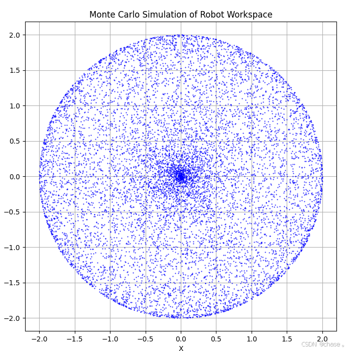

# 蒙特卡罗方法简介
蒙特卡罗方法（Monte Carlo Method）是一种通过随机采样来解决数学问题的数值计算方法。它广泛应用于各种领域，包括物理学、金融、工程和计算机科学。在机械臂的运动学和控制中，蒙特卡罗方法可以用于路径规划、逆运动学求解、碰撞检测等问题。
 ## 制作流程
 - 定义机械臂模型：确定机械臂的关节数、关节类型（旋转或平移）、关节角度范围等参数。
- 随机采样关节配置：在关节角度范围内随机生成大量的关节配置。
- 正向运动学计算：对于每个随机生成的关节配置，计算末端执行器的位置和姿态。
- 记录可达位置：将所有计算得到的末端执行器位置记录下来，形成机械臂的可达空间个的估计。
- 可视化可达空间：将记录的可达位置进行可视化，展示机械臂的工作范围。
## 制作案例


## 案例代码
```python
import numpy as np
import matplotlib.pyplot as plt

# 定义机器人的参数
L1 = 1.0  # 第一个连杆的长度
L2 = 1.0  # 第二个连杆的长度
num_samples = 10000  # 随机采样的数量

def forward_kinematics(theta1, theta2):
    """
    计算正向运动学，得到末端执行器的位置
    :param theta1: 第一个关节的角度
    :param theta2: 第二个关节的角度
    :return: 末端执行器的位置 (x, y)
    """
    x = L1 * np.cos(theta1) + L2 * np.cos(theta1 + theta2)
    y = L1 * np.sin(theta1) + L2 * np.sin(theta1 + theta2)
    return x, y

# 随机采样关节配置
theta1_samples = np.random.uniform(0, 2*np.pi, num_samples)
theta2_samples = np.random.uniform(0, 2*np.pi, num_samples)

# 计算末端执行器的位置
positions = np.array([forward_kinematics(t1, t2) for t1, t2 in zip(theta1_samples, theta2_samples)])

# 绘制可达空间
plt.figure(figsize=(8, 8))
plt.plot(positions[:, 0], positions[:, 1], 'b.', markersize=1)
plt.title('Monte Carlo Simulation of Robot Workspace')
plt.xlabel('X')
plt.ylabel('Y')
plt.axis('equal')
plt.grid(True)
plt.show()
```