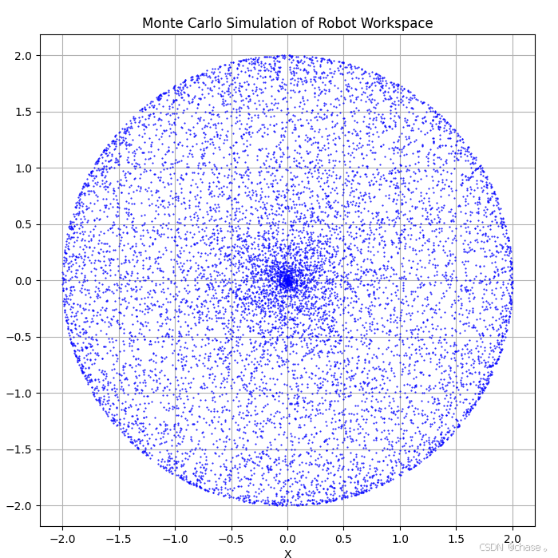

## 蒙特卡罗方法简介

蒙特卡罗方法（Monte Carlo Method）是一种通过随机采样来解决数学问题的数值计算方法。它广泛应用于各种领域，包括物理学、金融、工程和计算机科学。在机械臂的运动学和控制中，蒙特卡罗方法可以用于路径规划、逆运动学求解、碰撞检测等问题。

## 估计范围与限制

本文估计的是位置可达工作空间，有限随机采样不能穷尽“全工作空间”，也不能证明空白区域一定不可达。位置点云不包含每点可实现的姿态范围；加入碰撞和任务约束后，可行集合还会缩小。

关节空间均匀采样不会产生工作空间均匀点云，局部点密度也不直接等于灵巧度。应固定随机种子，比较不同样本量下的覆盖变化，并在边界处增加定向采样或 IK 验证。

### 制作流程

- 定义机械臂模型：确定机械臂的关节数、关节类型（旋转或平移）、关节角度范围等参数。
- 随机采样关节配置：在关节角度范围内随机生成大量的关节配置。
- 正向运动学计算：对于每个随机生成的关节配置，计算末端执行器的位置和姿态。
- 记录可达位置：将所有计算得到的末端执行器位置记录下来，形成机械臂的可达空间的估计。
- 可视化可达空间：将记录的可达位置进行可视化，展示机械臂的工作范围。

### 制作案例



### 案例代码

下面是平面二连杆教学模型，长度单位为米、角度为弧度，没有障碍物或自碰撞检测。无关节限位时，其位置到原点的距离应落在 `abs(L1 - L2)` 到 `L1 + L2` 之间，可作为 FK 与采样结果的基本检查。

```python
import numpy as np
import matplotlib.pyplot as plt

# 定义机器人的参数
L1 = 1.0  # 第一个连杆的长度
L2 = 0.6  # 第二个连杆的长度；不等长才能清楚看到内部不可达圆孔
num_samples = 10000  # 随机采样的数量

def forward_kinematics(theta1, theta2):
    """
    计算正向运动学，得到末端执行器的位置
    :param theta1: 第一个关节的角度
    :param theta2: 第二个关节的角度
    :return: 末端执行器的位置 (x, y)
    """
    x = L1 * np.cos(theta1) + L2 * np.cos(theta1 + theta2)
    y = L1 * np.sin(theta1) + L2 * np.sin(theta1 + theta2)
    return x, y

# 随机采样关节配置
rng = np.random.default_rng(42)
theta1_samples = rng.uniform(0, 2*np.pi, num_samples)
theta2_samples = rng.uniform(0, 2*np.pi, num_samples)

# 计算末端执行器的位置
x, y = forward_kinematics(theta1_samples, theta2_samples)
positions = np.column_stack((x, y))  # NumPy 批量计算，不逐点进入 Python 循环
radii = np.linalg.norm(positions, axis=1)
assert positions.shape == (num_samples, 2)
assert np.isfinite(positions).all()
assert np.all(radii >= abs(L1 - L2) - 1e-12)
assert np.all(radii <= L1 + L2 + 1e-12)
# 两个确定性边界姿态，不能依靠随机采样恰好命中边界。
np.testing.assert_allclose(forward_kinematics(0.0, 0.0), [1.6, 0.0], atol=1e-12)
np.testing.assert_allclose(forward_kinematics(0.0, np.pi), [0.4, 0.0], atol=1e-12)
print("samples:", num_samples, "observed radius range:", radii.min(), radii.max())

# 绘制可达空间
plt.figure(figsize=(8, 8))
plt.plot(positions[:, 0], positions[:, 1], 'b.', markersize=1)
plt.title('Monte Carlo Simulation of Robot Workspace')
plt.xlabel('X [m]')
plt.ylabel('Y [m]')
plt.axis('equal')
plt.grid(True)
plt.show()
```


## 为什么不能直接取点云凸包

本例的解析集合是内半径 0.4 m、外半径 1.6 m 的圆环，面积为 $\pi(1.6^2-0.4^2)$。点云凸包会填满中间不可达圆孔，因而不能作为可达性的判据。上方保留的机器人图片是原笔记的工作空间案例，不是这个二维模型的新运行结果。

比较覆盖率时，应固定体素或栅格分辨率，再改变样本数和 seed。分辨率、样本量、关节限制与碰撞筛选条件应一并记录；只报告“点云看起来很密”无法复现实验。

## 阅读自测与验收

- 用两连杆平面模型的已知内外半径检查采样结果，区分采样覆盖范围与解析可达集合。
- 改变采样数和 seed，观察边界是否稳定；随机未采到的区域不一定不可达，凸包内部也不一定全部可达。
