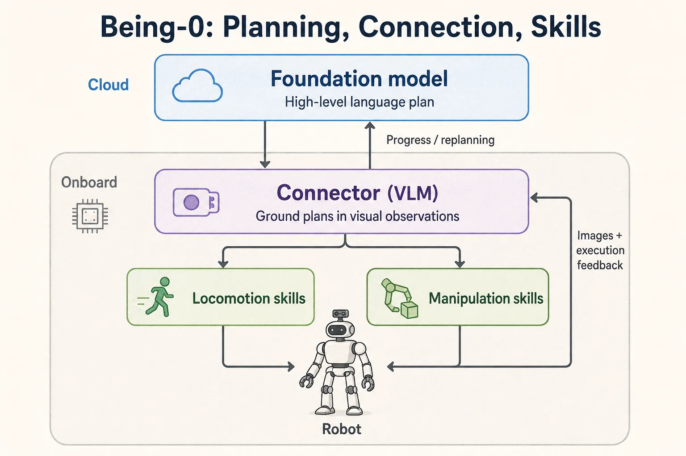

Being-0 讨论如何把高层语言规划与已有运动技能连接起来，让人形机器人完成长时程任务。本文依据 [论文 arXiv:2503.12533v1](https://arxiv.org/html/2503.12533v1)整理；实验数字属于论文报告，不代表在本地完成了复现。

## 1. 研究问题

高层模型能够理解指令和生成计划，低层策略能够完成行走或抓取，但两者直接拼接时，推理延迟、导航落点误差和技能初始状态不匹配会逐步累积。论文的关注点是中间的协调层。

## 2. 三层架构

| 模块 | 职责 | 需要区分的边界 |
| --- | --- | --- |
| Foundation Model | 指令理解、计划、执行结果推理 | 不直接承担高频关节控制 |
| Connector | 把计划和视觉观测转成技能指令 | 需要判断导航与操作能否衔接 |
| 模块化技能库 | 行走、转向、头部动作和操作 | 技能有各自的训练数据与适用条件 |

论文采用云端 FM 与机载模块组合。操作技能通过遥操作数据与模仿学习获得，移动技能通过强化学习训练。Connector 的价值体现在技能选择与衔接，不能简单等同于端到端输出所有关节动作的 VLA。

## 3. 为什么导航终点影响操作

“已经到达桌子附近”不意味着“抓取策略可以成功启动”。机器人还需要合适的距离、朝向与可见范围。

我的理解是，可以把每个技能看作有输入条件的模块：执行前检查目标可见性和姿态范围，执行后检查是否达到下一技能需要的状态。这个解释用于理解系统接口，不是论文额外声明的形式化保证。

主动视觉同样影响下一步决策：相机姿态改变了可见信息，但增加了对头部控制、观测时间戳和反馈判断的要求。

## 4. 论文实验应如何阅读

论文表 1 报告以下长时程任务完成率：

| 任务 | 不使用 Connector | Being-0 |
| --- | --- | --- |
| Fetch-bottle | 0% | 90% |
| Deliver-basket | 0% | 80% |
| Prepare-coffee | 0% | 75% |
| Make-coffee | 90% | 90% |
| Deliver-coffee | 33% | 87% |

这里 Fetch-bottle 是取瓶任务，不能翻译为“抓取杯子”。论文报告的导航效率提升也不应直接填入每一个任务的效率列。任务定义、尝试次数和消融条件应一起对照[原文实验部分](https://arxiv.org/html/2503.12533v1#S5)。

## 5. 复现时关注哪些接口

- 高层指令和技能参数如何表示，目标 ID 与视觉检测结果如何对应。
- 技能开始、结束、失败与超时如何上报，是否允许中断和重试。
- 视觉观测、机器人状态与动作时间戳是否一致。
- 导航到操作的切换是否包含姿态修正和成功判定。
- 云端请求延迟变化时，低层系统如何保持有定义的行为。

这些是由架构推导出的工程检查项，不代表论文已经证明了每一种异常都能恢复。

## 6. 局限与进一步阅读

实验中的模块化设计不等于可直接迁移到任意人形平台。新硬件、相机布局、物体或技能仍可能需要数据、适配和重新验证。也不能据此断言已经支持某个未参与实验的商业机器人。

原始材料：[论文](https://arxiv.org/abs/2503.12533)、[作者项目页](https://beingbeyond.github.io/being-0/)。论文贡献、作者发布状态和个人推测应分别阅读。

## 阅读自测与验收

- 把论文实际报告的任务、成功定义和评估次数逐项对照，区分系统概念图与原始实验结果。
- 单独说明高层模型、Connector 和低层技能的输入输出；不同硬件或任务上的数字不能直接拼成统一成功率。
