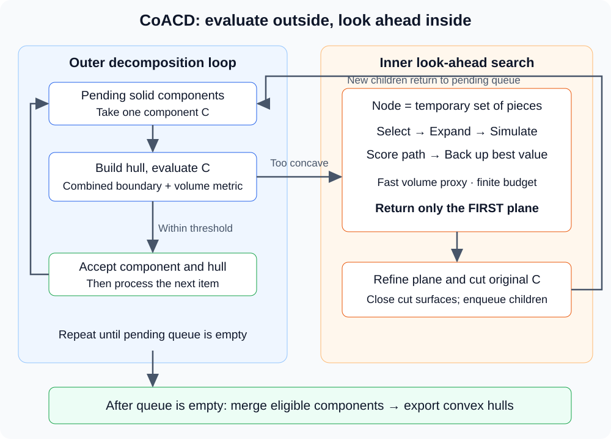

**CoACD 的核心，是让“哪里不能被凸包填掉”影响切割决策，再用多步搜索减少不必要的分块。** 它既要保留碰撞交互所需的空隙，也要控制最终凸组件数量。

本文解读 2022 年论文 [Approximate Convex Decomposition for 3D Meshes with Collision-Aware Concavity and Tree Search](https://arxiv.org/abs/2205.02961)，并结合作者代码解释流程。安装、导出与可视化见[配套工程文章](/posts/coacd/)。文中的手算例用于解释机制，不是实际网格分解结果。

| 想解决的问题 | 阅读入口 |
| --- | --- |
| 创新在哪里，解决什么缺陷 | [三项核心设计](#innovations) |
| 一个组件为什么需要继续切 | [凹度度量](#concavity) |
| 一刀如何得到两个有效实体 | [平面切割](#cutting) |
| 为什么要看未来几刀 | [MCTS 详解](#search) |
| 全部步骤如何衔接 | [总流程](#pipeline)、[完整演练](#walkthrough) |
| 论文与当前代码如何对应 | [实现核对](#implementation) |

## 1. 先分清原组件和最终凸包 {#problem}

用 S 表示输入实体，将它分成若干组件 $C_1,\ldots,C_n$。组件本身可以稍微非凸，最终交给碰撞引擎的是各组件的凸包 $K_i=\operatorname{CH}(C_i)$，组合近似为：

$$
\widehat S=\bigcup_{i=1}^{n}K_i.
$$

凸包包含组件，新增区域 $K_i\setminus C_i$ 就是近似额外占用的空间。比如一个 U 形支架整体取凸包，中间槽会被填入；把它分成底部和两个侧壁后，各自取凸包，就有机会保留槽口。这是几何示例，不意味着 CoACD 对所有 U 形输入都恰好输出三块。

因此有两个相互牵制的目标：近似足够细，组件数又不要过多。只追求“每块严格凸”可能产生大量小块；只追求“块数少”又可能破坏可通行空间。凹度阈值为这种取舍提供停止条件，但不是每一种任务功能的直接判定器。

## 2. 三项核心设计怎样配合 {#innovations}

| 设计 | 改变的环节 | 希望避免的失败 |
| --- | --- | --- |
| 碰撞感知凹度 | 同时考察边界与实体内部的偏差 | 总体看起来接近，却把关键空隙填掉 |
| 直接平面切网格 | 在实体上生成切面和封口 | 分割表示本身引入额外几何误差 |
| 多步树搜索 | 比较后续切割结果，再确定第一刀 | 当前降凹度快，最终却需要更多块 |

这三点对应[论文的方法概览](https://arxiv.org/html/2205.02961#S3)。它们不是三个彼此独立的功能：指标决定什么算“好”，切割操作决定能生成哪些状态，搜索决定有限计算花在哪些切割方案上。

换句话说，搜索再充分，如果评分忽略槽口，仍可能偏好堵住槽口的方案；评分再精细，如果切割后的组件已经失去原始几何细节，也无法靠评分恢复。比较其他方法时，应针对论文当时讨论的具体表示和搜索设置，不把所有 V-HACD 版本或所有体素方法一概归为同一种行为。

## 3. 凹度：理论定义、快速代理和实际估计 {#concavity}

### 3.1 两个方向的距离必须分开理解

Hausdorff 距离回答的是两组几何中最坏的最近距离，而不是平均误差。为解释其含义，先在连续集合上写：

$$
H(A,B)=\max\left\{\sup_{a\in A}\inf_{b\in B}\|a-b\|,
\sup_{b\in B}\inf_{a\in A}\|b-a\|\right\}.
$$

边界项比较组件表面与凸包表面；内部项比较它们占据的空间。对包含关系 $C\subseteq K$，实体到凸包的距离为零，值得关注的是凸包新增空间中的点离原实体有多远。边界却不是简单的包含关系：组件的内壁不一定在凸包表面上。

这解释了两个容易混淆的现象。空腔很大但壳壁很薄时，仅比较表面可能低估填充整个空腔的影响；窄槽很深时，新增体积可能不大，但槽底与凸包封口之间的边界差异很大。两类距离回答不同的几何问题。

用 $H_b$ 和 $H_i$ 表示边界与内部项，论文定义的凹度是 $\max(H_b,H_i)$，实际通过采样近似几何距离。不要把有限点云算出的结果当成连续空间中绝无遗漏的证明。定义见[论文第 4 节](https://arxiv.org/html/2205.02961#S4)。

### 3.2 为什么把体积差换成球半径

内部密集采样较贵。论文采用的体积代理为：

$$
\Delta V=\operatorname{Vol}(K)-\operatorname{Vol}(C),\qquad
R_v=\left(\frac{3\Delta V}{4\pi}\right)^{1/3}.
$$

它把体积转换成长度：如果把新增体积集中成一个球，这个球有多大。这样 $R_v$ 与边界距离具有相同量纲，可以组合；它不表示真实空隙就是球，也不是局部最大间隙的精确测量。

一个自拟量纲检查：若 $\Delta V=4\pi/3$，则 $R_v=1$；模型所有坐标扩大两倍，体积差扩大八倍，半径扩大两倍。这说明阈值必须与模型尺度和归一化约定一起解释。

实际判定使用：

$$
\widetilde C(C)=\max\bigl(H_b(C),kR_v(C)\bigr).
$$

作者实现中，可从 [cost.cpp](https://github.com/SarahWeiii/CoACD/blob/1401ce2a7ae1ed89c65ab958b48d489350c233c7/src/cost.cpp)追踪 `ComputeRv` 与 `ComputeHCost`。前者返回的数值已经乘过 k，即代码中的 `ComputeRv` 对应这里的 $kR_v$，不是未加权的半径；后者再与边界距离取最大值。对照公式时不要重复乘 k。k 改变内部偏差与边界偏差的相对权重，不能当成只影响运行速度的参数。

### 3.3 三种“凹度”不要混用

| 层次 | 作用 | 阅读时的检查点 |
| --- | --- | --- |
| 边界与内部距离的组合 | 解释希望保留的几何性质 | 是连续定义还是采样结果？ |
| $\max(H_b,kR_v)$ | 外层是否继续分解的判定 | 阈值、k、采样精度与单位是什么？ |
| 搜索内部的体积代理 | 低成本比较大量候选路径 | 排名好不等于完整指标已经达标 |

论文给出的理论关系为：

$$
\max(H_b,H_i)\leq\sqrt2\max(H_b,R_v).
$$

它不能直接变成“加权采样指标低于 epsilon，所有实际碰撞误差就低于 epsilon”。例如当 $0<k\leq1$，仅通过代数放缩，原来的右侧至多可进一步放宽为 $\sqrt2\,\max(H_b,kR_v)/k$；这已经不是同一个界，而且采样、预处理和后处理还要另外核对。

## 4. 一刀究竟做了哪些几何工作 {#cutting}

令切割平面为 $P=\{x:n^Tx=b\}$。理想的两个子实体是：

$$
C_L=C\cap\{x:n^Tx\leq b\},\qquad
C_R=C\cap\{x:n^Tx\geq b\}.
$$

但三角网格存储的是边界，程序不能只把顶点按左右分组。一次切割至少要完成这些工作：

1. 对顶点计算平面侧别，整张位于同一侧的三角面直接归入该侧。
2. 对跨平面的边求交点，把相交三角面裁成两侧的多边形，再三角化。结果不一定只是“两张三角形”。
3. 收集切口边界，在截面上做约束 Delaunay 三角剖分，生成两个方向相反的封口面，使两侧继续表示实体。
4. 正确处理封口中的内环和孔洞，避免把本应为空的区域用新三角面填掉。

作者的网格裁剪与截面处理入口见 [clip.cpp](https://github.com/SarahWeiii/CoACD/blob/1401ce2a7ae1ed89c65ab958b48d489350c233c7/src/clip.cpp)。几何实现还要处理贴近平面、退化边、共面面片等情况；这也是有效实体输入很重要的原因。

### 为什么切割树的叶子凸包能分离

这是半空间凸性的直接结果：$C_L$ 全在左半空间，其任意凸组合也在左半空间，所以 $\operatorname{CH}(C_L)$ 不会穿到平面右侧。同理适用于右侧。两者可以共享切面，但内部不交叠。

递归到更深层时，每个叶子仍受祖先切面约束。这个论证针对精确的半空间切割构造；任意合并、外扩、重网格或引擎重新取凸包后，都要重新检查几何关系。不能只因中间阶段用了平面，就宣称所有后处理输出永久无重叠。

## 5. 总流程：两个循环，各负其责 {#pipeline}



外层维护待处理组件；内层为当前组件挑选切割平面。下面是帮助阅读的抽象伪代码，几何操作名不是可直接调用的 Python API：

```text
待处理 = [输入实体]
已接受 = []
while 待处理非空:
    C = 取出一个组件
    K = 凸包(C)
    if 完整近似凹度(C, K) <= 阈值:
        保存 (C, K) 到已接受
    else:
        候选第一刀、后续参考路径 = 多步搜索(C)
        第一刀 = 在局部调整候选第一刀的位置
        左组件、右组件 = 封闭实体切割(C, 第一刀)
        将两个子组件放回待处理
按合并条件减少已接受组件
输出各组件的凸包
```

这里保留原组件 C 与凸包 K 的区别：继续切的是原实体组件，不是已经填平凹部的凸包。若先把 C 丢掉、后面只切 K，原始空隙的信息就丢失了。

作者主循环与合并实现见 [process.cpp](https://github.com/SarahWeiii/CoACD/blob/1401ce2a7ae1ed89c65ab958b48d489350c233c7/src/process.cpp)。实现还包含无可用候选和切割失败分支；实际输出是否达标应重新测量，不能仅凭函数返回成功推断。

## 6. MCTS：搜索的是“未来分块状态” {#search}

### 6.1 状态、动作和预算

树节点是当前组件 C 的一组临时分块，不是一个三角面，也不是单独一个平面。动作选择当前最差分块的一刀；一次有效二分后，状态中的分块数增加一。

轴对齐候选把连续平面空间离散化；迭代次数限制尝试预算，深度限制前瞻步数。它们与最终输出块数不同：深度 3 表示这次搜索往前模拟至多三次切割，不表示整个模型最多只有四块。

相关实现集中在 [mcts.cpp](https://github.com/SarahWeiii/CoACD/blob/1401ce2a7ae1ed89c65ab958b48d489350c233c7/src/mcts.cpp)：`State` 保存分块，`Part` 管理候选，`tree_policy`、`default_policy` 与 `backup` 分别对应选择、模拟和回传。

### 6.2 一次搜索迭代

| 阶段 | 做什么 | 为什么需要 |
| --- | --- | --- |
| Selection | 沿树选择值得继续探索的节点 | 平衡已发现的好路径与尚少尝试的分支 |
| Expansion | 尝试一个未展开的切割动作 | 增加新的后续分块状态 |
| Simulation | 用便宜的默认策略补足前瞻预算 | 让不同展开深度的节点可以比较 |
| Evaluation | 计算沿途最差分块代价 | 同时关注最终结果和改善速度 |
| Backup | 更新经过节点的访问次数与最佳记录 | 后续迭代可利用已经得到的信息 |

默认模拟也不是随意连续切割：每一步先找当前代理代价最大的分块，再尝试少量轴对齐平面，以两个子块中较大的代理代价来比较候选，采用较好的切面后继续。论文算法 2 使用三个轴向的中心切面作快速候选；它们用于低成本前瞻，不等同于树展开时更密的候选集合。

这套设计是离线几何搜索，没有训练策略网络，也没有机器人与环境的在线强化学习交互。Monte Carlo 指搜索中的随机探索，不意味着随机猜一刀后就直接作为输出。

### 6.3 为什么多看两刀可能改变第一刀

用一个自拟的代价记录解释。a_i 表示第 i 刀后所有临时分块中的最大代理代价，两条路径各模拟三刀：

| 路径 | 第一刀后 | 第二刀后 | 第三刀后 | 沿途平均代价 |
| --- | --- | --- | --- | --- |
| A | 0.12 | 0.09 | 0.07 | 0.09333 |
| B | 0.15 | 0.04 | 0.01 | 0.06667 |

只看第一步会选 A；看三步平均则偏向 B。这里 B 的第一刀可能没有立即把凹部消掉，却为下一刀创造了更有效的分割结构。数值没有对应实际网格，只说明评价准则如何改变选择。

用“收益越大越好”的记号，上述路径评分可写作：

$$
q=-\frac1d\sum_{i=1}^{d}a_i.
$$

于是 A 得分约 −0.09333，B 约 −0.06667。源码采用正代价的最小化写法，读代码时要对齐符号；否则很容易把 `min` 误看成实现错误。

### 6.4 探索项和回传值不是一回事

常见的收益形式选择分数为：

$$
Q(v)+c\sqrt{\frac{2\ln N(p)}{N(v)}}.
$$

$N(v)$ 是子节点访问次数，$N(p)$ 是父节点访问次数，c 控制探索。第一项利用已知好结果，第二项给少访问分支机会；未访问动作由展开逻辑处理，不能直接令分母为零。

这里还有一个阅读重点：CoACD 保留的是经过分支发现的最佳路径值，不应不加核对就套成“所有 rollout 得分的平均”。路径内部的平均代价，与节点跨多次访问的最佳记录，是两个不同层次的聚合。

### 6.5 搜索结束后，只提交第一刀

内层找到的多步路径用于评价和局部细化，外层实际采用第一刀生成两个子组件；之后分别重新判定是否达标、是否需要再搜索。因此它不是先一次性规划整棵最终分解树，再不加修改地全部执行。

有限候选、有限深度、随机探索、代理度量都会影响结果。多步搜索能减少短视决策，但不提供任意网格最少凸块数的全局最优证明。

## 7. 细化与合并分别补什么 {#refine-merge}

离散候选可能把切面放在理想位置旁边。论文用三分搜索在局部调整第一刀的偏移，同时固定选中路径的其余切面，再按路径代价比较调整效果；它改善的是切面定位，不是突然搜索任意法向和任意偏移的全部平面。

合并则处理二分过程留下的冗余：若若干候选组件可以组合成仍满足要求的近似组件，就可以减少输出块数。检查的是合并后组件与其新凸包的差异，不是简单拼接两个网格文件。

两者都不能替代主流程。错误的第一刀未必能靠很小的位置调整修复；合并若重新填回重要空隙，就应被误差条件拦住。当前实现的组件数量上限等选项可能允许超阈值合并，应将“达到数量预算”和“满足凹度阈值”分别报告。参数语义参见[作者仓库](https://github.com/SarahWeiii/CoACD)。

## 8. 把流程放回一个带槽支架 {#walkthrough}

以下是自拟的执行日志模板，不声称某个具体模型必然经历这些切面：

1. **检查输入**：支架尺寸与单位明确，三角网格表示封闭实体；标记必须保留的槽宽。
2. **第一次判定**：整体凸包填入槽内，计算边界项、体积代理和组合指标，记录为何超阈值。
3. **建立搜索**：当前状态仅含整个支架，生成候选切面；逐次尝试侧壁附近、底部附近等可用位置。
4. **向前模拟**：比较第一刀后剩余凹部是否容易继续处理，保留更有希望的路径，而非只看第一刀的下降量。
5. **落实第一刀**：细化位置，裁剪跨平面三角面并封口；两侧组件进入外层队列。
6. **分别验收**：接近凸的侧壁可以停止，剩余带凹部的组件继续搜索。并非所有子块必须切到相同深度。
7. **合并与输出**：尝试减少冗余，重新检查槽口；导出每块凸包时保留共同坐标系。
8. **任务验证**：用规定尺寸的探针检查可通行性，并在目标引擎里重新加载确认。

在日志中保留 `组件 ID → 父组件 → 切面 → H_b → kR_v → 是否达标`，就能追踪问题来自误差指标、候选选择、切割还是后处理。只保存最后一张彩色凸块截图，通常无法定位这些原因。

## 9. 对照源码与实验时，优先核对什么 {#implementation}

本文核对的源码快照为 `1401ce2a7ae1ed89c65ab958b48d489350c233c7`。这比仅写 main 更容易追溯，但它仍不是 2022 年论文发布时的历史代码。

| 入口 | 重点检查 |
| --- | --- |
| `cost.cpp` | 体积代理与组合指标的区别，k 如何进入计算 |
| `clip.cpp` | 切割侧别、交点和截面封口 |
| `mcts.cpp` | 状态存储、代理代价、搜索深度、回传符号 |
| `process.cpp` | 外层验收、失败分支、合并与后处理 |

工程参数至少分为四类：误差阈值决定接受标准；距离采样精度影响估计可靠性；搜索参数决定候选探索预算；预处理与导出参数决定实际几何。把这四类参数混成一个“精度开关”，很难解释结果变化。

当前仓库提供真实尺度模式和归一化模式。网格以米为单位时，也必须确认采用哪一种，才能把阈值解释成长度。预处理可能改变原始细节，所以应分别保存原网格、预处理实体与最终凸块。具体调用见[配套工程教程](/posts/coacd/)，模式说明见[官方参数文档](https://github.com/SarahWeiii/CoACD#parameters)。

比较效果时同时报告组件数、误差和时间，说明比较的是相同误差预算还是相同块数预算。更少块不必然更快，也不代表关键孔洞可用；有限采样误差、小尺度封口、引擎再次凸化都可能改变碰撞行为。本文没有重新运行论文基准或编译该源码快照，以上代码核对属于静态阅读。

## 阅读自测与验收

- 能否区分原组件 C 与输出凸包 K，并解释为什么继续切的是组件而不是已凸化的 K？
- 能否说明边界距离、内部距离、体积半径代理各自检测什么，以及树搜索评分为何不能替代外层验收？
- 能否完整复述 MCTS 的状态、动作、模拟、评分与回传，并手算两条三步路径为何改变第一刀选择？
- 能否用半空间凸性解释切割叶子凸包的分离条件，并说明合并和外扩后为何要重新检查？

<details>
<summary>展开核对：关键结论</summary>

- C 保留原始凹部；K 是包含 C 的近似。先丢弃 C 再切 K 会丢失待保留空隙。
- 边界与内部距离补充不同几何信息；体积半径是快速代理，外层组合度量负责是否达标。
- 节点保存临时分块集合，一次动作切最差块；路径平均与节点最佳记录不同。自拟例中 B 的平均代价更小，尽管第一刀较差。
- 半空间包含凸组合，所以其内的组件凸包不穿过分界面；改变分块组合或向外扩张可能使原论证不再适用。

</details>

## 参考资料

- [CoACD 原论文及补充材料](https://arxiv.org/abs/2205.02961)：问题与核心设计。
- [作者实现固定快照](https://github.com/SarahWeiii/CoACD/tree/1401ce2a7ae1ed89c65ab958b48d489350c233c7)：本文代码核对入口。
- [CoACD 工程教程](/posts/coacd/)：安装、逐块导出、可视化与引擎检查。
