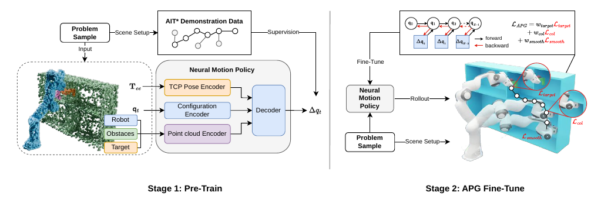

**ELMP 想降低的是神经运动规划器适应新环境时的专家数据成本。** 先用专家轨迹教会网络基本的运动方式，再让网络在可微的几何模型里展开多步运动，用目标误差、碰撞距离和平滑性直接更新参数。新场景仍需要采样规划问题，但不必为每个问题重新求一条专家轨迹。

本文依据用户提供的《ELMP: Efficient Learning for Motion Planning via Analytical Policy Gradients》PDF，作者为 Yixiao Li、Tifanny Portela、Jordis Herrmann、René Zurbrügg 与 Marco Hutter。文件首页标注 `arXiv:2607.00215v1`、30 Jun 2026。下面的页码、表号和数值均以这份 9 页本地版本为准；本文没有运行作者训练或复现其机器人实验。

| 阅读问题 | 对应章节 |
| --- | --- |
| 为什么不能只做行为克隆 | [问题与创新](#contributions) |
| 工具形状如何进入网络 | [输入和网络](#architecture) |
| APG 的梯度究竟从哪里来 | [可微展开](#apg) |
| 碰撞损失怎样产生避障方向 | [损失与几何](#losses) |
| 84.8%、7.8 ms 分别说明什么 | [实验结果](#experiments) |
| 如何开始验证核心计算 | [Python 原子练习](#tutorial) |

## 1. 问题：轨迹模仿之后，怎样适应新的几何环境？ {#contributions}

设机器人要拿着一把扳手穿过架子。只考虑夹爪中心的位置是不够的：夹爪可能经过空隙，扳手另一端却撞上侧壁。规划器必须同时理解当前关节构型、工具形状、场景障碍和目标位姿。

行为克隆（BC）用专家状态与动作配对训练网络。在专家轨迹附近预测准确，不代表闭环执行一直准确：前一步有小偏差，下一步网络就可能看到训练中很少出现的状态；误差逐步积累后，动作又把机器人带得更偏。换成新柜子、新收纳箱或新工具，分布差异还会更大。

ELMP 的贡献可以按三个环节理解：

1. **用 APG 做自监督适应。** 在可微运动学和场景距离模型中计算损失，直接反传到策略，省去适应阶段新增专家轨迹的求解。
2. **显式输入工具几何。** 机器人和工具点云一起参与网络的几何编码，目标端也提供末端与工具的目标几何。
3. **用同一框架修改轨迹偏好。** 在碰撞、目标与平滑目标之外加入路径长度项，便能研究轨迹更短与碰撞率之间的取舍。

PointNet++、行为克隆、SDF 和 BPTT 本身都不是本文新提出的算法。创新集中在这些组件如何服务于工具感知的机械臂规划和低专家数据成本的环境迁移。它仍有 BC 预训练，不能描述为“完全不需要专家数据”。

## 2. 一张图区分预训练与适应 {#overview}



左边学习“专家在这个状态下怎么动”：规划问题送入 AIT*，专家动作监督网络。右边学习“自己生成的运动是否达到目标、避开障碍并保持平滑”：网络连续输出动作，由几何模型评估，再沿展开过程回传梯度。

两阶段优化的都是策略参数。部署时则固定参数，根据当前观测输出下一步关节增量；论文展示的 30 Hz 闭环不意味着每一拍在线重新训练网络。

## 3. 输入、网络与输出：工具点云到底放在哪里？ {#architecture}

论文面向 7 自由度机械臂。一步输入包括当前关节位置 $q_t\in\mathbb R^7$、目标末端位姿和带类别标签的点云 $P_t\in\mathbb R^{N\times4}$。四维指三维坐标加一个语义类别通道，并非 RGBA 颜色。

| 输入 | 论文使用的规模 | 来源和含义 |
| --- | --- | --- |
| 机器人与工具点云 | 2048 点 | 从模型表面采样，再依据当前构型变换 |
| 场景点云 | 4096 点 | 训练来自模拟障碍；部署来自外部深度相机 |
| 目标点云 | 128 点 | 把虚拟末端和工具放在目标位姿，不是整条目标关节轨迹 |
| 当前关节位置 | 7 维 | 本体状态 |
| 目标位姿 | 12 维 | 3 维位置与展平的 3×3 旋转矩阵 |

总点数为 6272。PointNet++ 输出 1024 维几何特征；关节与目标位姿分别经 MLP 得到 64 维特征。拼接后的 1152 维向量经解码器输出 $\Delta q_t\in\mathbb R^7$。

$$
\Delta q_t=\pi_\theta(q_t,P_t,T_{\mathrm{target}}),\qquad q_{t+1}=\operatorname{clamp}(q_t+\Delta q_t).
$$

`clamp` 来自论文算法 1 的限位处理。输出是关节位置增量，不是关节力矩，也没有在这个递推式里求解刚体接触动力学。

内部生成机器人点云的好处是：即使相机看不全机械臂，也可利用编码器和已知模型描述自身几何。但它不能恢复相机没看到的环境障碍，也不能自动校正工具安装外参错误。几何模型、当前构型和相机点云必须位于一致的坐标系中。

## 4. 阶段一：行为克隆为何还要监督正运动学？ {#bc}

论文公式 1 同时监督动作和几何结果：

$$
L_{\mathrm{BC}}=\lambda_{\mathrm{action}}\|\Delta q_{\mathrm{pred}}-\Delta q_{\mathrm{gt}}\|_2^2+\lambda_{\mathrm{fk}}\sum_{i=1}^{M}\|\mathrm{FK}_i(q_{\mathrm{pred}})-\mathrm{FK}_i(q_{\mathrm{gt}})\|_2.
$$

这里第二项按原文写为未平方的二范数；$\mathrm{FK}_i$ 输出第 i 个机器人或工具碰撞球中心。它不仅比较关节角差多少，还比较这些误差把实体几何移到了哪里。

同样大小的关节误差，在不同连杆、不同构型和不同工具长度下，可能产生很不一样的空间位移。FK 项把这种差异纳入训练，但它仍然是在拟合专家结果，不能替代对网络自身多步轨迹的碰撞检查。

论文使用约 60 万条 AIT* 专家轨迹预训练，场景包括 Tabletop、Cubby 和 Dresser。随后才进入不依赖新增专家动作标签的 APG 阶段。

## 5. 阶段二：把运动学展开变成可反传的计算图 {#apg}

一次 APG 更新先抽取初始构型、目标位姿与场景，使用当前策略连续生成 H 个动作，得到 H+1 个构型。本文统一记为 $q_0,\ldots,q_H$，避免把“动作数量”与“状态数量”混淆。

```text
抽样一批初始构型、目标、障碍和工具
从 q0 开始，重复 H 次：
    根据当前 q 生成机器人与工具几何输入
    策略预测关节增量 Δq
    q_next = clamp(q + Δq)
    保存 q_next，保留计算图
计算终点位姿误差
累加整段轨迹的环境碰撞、自碰撞和平滑代价
反向传播，裁剪参数梯度，更新策略参数
重新抽样问题，继续训练
```

关键是“保留计算图”。若每一步把构型转成 NumPy、执行 `detach()`，或通过没有反向接口的碰撞程序取得一个布尔值，后面的损失就无法沿这条路径更新前面的策略参数。

### 梯度不只来自最后一个动作

用 $F_\theta$ 概括含观测更新和限位的单步映射，令 $D_t=\partial q_t/\partial\theta$。链式法则给出：

$$
D_{t+1}=\frac{\partial F_\theta}{\partial q_t}D_t+\frac{\partial F_\theta}{\partial\theta},\qquad D_0=0.
$$

某个早期动作既改变当前构型，也改变未来机器人点云和后续策略输入。因此终点误差可以穿过多步运动，把责任传给较早的决策。常见的长时域梯度消失、爆炸问题也随之出现。

这里的 APG 使用可微模型提供的路径导数。它不同于 PPO/GRPO 中根据采样奖励、优势和概率比构造策略更新：ELMP 不需要用这些概率比估计本文的几何目标梯度，但需要可微的 FK、场景距离和展开过程。所谓“解析”也不意味着所有位置处都存在唯一光滑导数。

## 6. 三类损失如何引导运动？ {#losses}

总损失为：

$$
L_{\mathrm{APG}}=w_{\mathrm{target}}L_{\mathrm{target}}+w_{\mathrm{col}}(L_{\mathrm{env}}+L_{\mathrm{self}})+w_{\mathrm{smooth}}L_{\mathrm{smooth}}.
$$

### 6.1 目标项：位置与姿态必须同时到达

按算法 1，在展开终点计算：

$$
L_{\mathrm{target}}=\|p_H-p_*\|_2^2+\lambda_{\mathrm{rot}}\|R_H-R_*\|_F^2.
$$

后半项是旋转矩阵弦距离。它写起来简单、避免四元数正负号表示同一旋转的二义性，但不应把原文中的“strictly convex”理解为在旋转流形或网络参数上全局严格凸。

**一个直接的数学核对：** 对相对转角 $\alpha$，有 $\|R_H-R_*\|_F^2=8\sin^2(\alpha/2)$，沿该转角的导数为 $4\sin\alpha$。在 180° 时导数同样为零。因此它不能保证处处无梯度消失，更不能保证从任意姿态都收敛到目标。这是对公式的分析，不是作者报告的新实验。

### 6.2 环境碰撞项：把距离梯度传到关节

约定障碍 SDF 在外部为正、内部为负。原文公式 4 对每个时刻和碰撞球中心计算：

$$
L_{\mathrm{env}}=\sum_{t=0}^{H}\sum_{k=1}^{K}\operatorname{ReLU}\bigl(\epsilon_{\mathrm{margin}}-\Phi_{\mathrm{env}}(x_k(q_t))\bigr).
$$

超过安全距离时该项为零；靠近或进入障碍时产生惩罚。在惩罚激活、距离可微的区域，单项对关节的梯度为：

$$
\nabla_q\ell=-J_k(q)^T\nabla_x\Phi_{\mathrm{env}}(x_k(q)),\qquad J_k=\frac{\partial x_k}{\partial q}.
$$

负梯度方向会尝试增大距离。Jacobian 把“球中心应该向哪里移”转成“关节应该怎样变化”；再通过 BPTT 把这个信号传到策略参数。

**实现时必须核对球半径。** 原式写的是中心处环境 SDF，没有显式出现半径。若 $\Phi$ 是点到原始障碍表面的距离，半径为 $r_k$ 的球应使用表面净间隙 $d_k=\Phi(x_k)-r_k$，再惩罚 $\max(0,\epsilon-d_k)$；也可通过障碍膨胀等方式等价处理。仅凭公式不能确定作者是否已把半径吸收到距离接口里，复现时应检查代码，不能把球心未碰撞当成整个球安全。

例如球心离平面 4 cm、半径 2 cm、安全余量 3 cm，球表面净间隙只有 2 cm，惩罚应为 1 cm。若漏减半径，就会错误地判定无需惩罚。

### 6.3 自碰撞和可微场景

自碰撞项使用非相邻连杆之间的球对距离。对两球，净间隙是 $\|x_i-x_j\|-r_i-r_j$。相邻连杆通常存在正常的连接邻接关系，哪些球对排除需要明确规则。

训练场景由盒子、球、圆柱等原语构造；环境 SDF 是各障碍距离的最小值。盒子距离的标准表达式是：

$$
\phi_{\mathrm{box}}(x)=\|\max(|x|-h,0)\|_2+\min\bigl(\max_i(|x_i|-h_i),0\bigr).
$$

这里 x 已变换到盒子局部坐标，h 是半尺寸。`abs`、`min`、`max`、ReLU 和限位 clamp 都可能在切换点不可微，通常由自动微分采用分支导数或次梯度；“可用于反传”不等于处处光滑。限位饱和还可能截断梯度，两个障碍等距处也可能出现梯度分支切换。

### 6.4 平滑项的时间单位

论文用关节增量大小与相邻增量差正则运动。为使索引明确，H 个动作可以写成下面的教学形式：

$$
L_{\mathrm{smooth}}=\frac{\lambda_v}{H}\sum_{t=0}^{H-1}\|\Delta q_t\|^2+\frac{\lambda_a}{H-1}\sum_{t=0}^{H-2}\|\Delta q_{t+1}-\Delta q_t\|^2.
$$

这是对原文公式 5 的索引整理，不声称与未公开实现的归一化完全相同。若按物理速度和加速度解释，还需分别除以 $\Delta t$ 和 $\Delta t^2$。因此改变执行周期后不能直接沿用“平滑权重对应同样物理运动”的结论。软惩罚也不能替代速度、加速度、力矩等硬约束。

## 7. 训练与部署用到的几何不一样 {#deployment}

APG 训练需要解析场景原语及其 SDF。真机推理则使用外部深度点云，不需要在线为每一帧重建同样的解析 SDF。机器人和工具几何仍由模型及关节位置生成，原始深度中的机器人点经滤除后再合并。

论文训练配置为 6 张 RTX 3090；BC 训练 500 epochs、batch size 16；APG 训练 50 epochs、batch size 48、DDP、展开长度 H=69。碰撞安全余量为 3 cm。这些是复现实验配置的线索，不是普通读者运行原子练习的硬件要求。

真机部分使用 Franka Emika Panda 和固定 RealSense：策略闭环 30 Hz，感知更新 10 Hz，并把路径点线性插值后交给位置控制器。因此应分开记录模型前向、点云更新、控制指令发送和驱动执行周期。

训练的干净原语距离与部署的遮挡、深度噪声之间存在差距。点云工具表示改善了模型对已知工具形状的条件化能力，但没有消除环境漏观测。

## 8. 实验结论：哪些数字可以放在一起比较？ {#experiments}

### 8.1 固定测试集：速度优势与成功率取舍

论文在三类场景共 1800 个 held-out 问题上测试。成功需要位置误差在 1 cm 内、姿态误差小于 15°，且机器人和工具均无碰撞。碰撞评估使用独立的网格检查器，而不是直接把训练球体损失当作验收结果。

| 方法 | 平均成功率 | Solution time | 首动作延迟（CS） |
| --- | --- | --- | --- |
| AIT* | 76.7% | 21.5 s | 21.5 s |
| CuRobo | 86.1% | 0.4 s | 0.4 s |
| MπNets | 50.1% | 0.7 s | 10.4 ms |
| ELMP-APG | 84.8% | 0.5 s | 7.8 ms |

来源：原文表 II。7.8 ms 表示新查询到首个动作的时间，不是完整规划问题在 7.8 ms 内解决。ELMP 的平均成功率低于 CuRobo，Cubby 场景也明显较低（72.7% 对 88.0%）；不能概括为“成功率全面超过经典规划器”。

### 8.2 APG 与工具表示分别贡献了什么？

表 I 中，同一 ELMP 架构从 BC 到 APG：环境碰撞率从 31.3% 降到 8.9%，位置精度在 1 cm 内的比例从 70.4% 提高到 89.0%。这些是分项统计，不能把位置达标比例直接当成同时无碰撞的任务成功率。

增加 Cartesian 路径长度惩罚后，平均末端路径从 0.85 m 缩短为 0.63 m，但环境碰撞率从 8.9% 上升至 10.9%。这个对照说明损失函数确实改变了轨迹偏好，也说明“更短”与“更安全”不自动同时改善。

工具表示消融来自另一组标准/困难问题（表 III）：困难问题上的碰撞率由 bounding box 的 30.5% 降到点云表示的 11.5%。不要把这里的 11.5% 与表 I 的 8.9% 当成相同测试集上的两个版本。困难问题的采样允许目标工具几何与障碍有轻微穿入，主要用于检验几何敏感性，不能把全部目标假设为严格无碰撞可达。

### 8.3 迁移节省的是专家数据生成成本

Cabinet 与 Bin 迁移实验中，零样本成功率为 57.3%；APG 微调后约 89.8%；用新专家数据训练的 BC 对照为 85.0%。这些数字属于新环境迁移，不是前面三场景平均 84.8% 的另一种写法。

每个 APG 问题的采样时间报告为 82 ms，AIT* 专家轨迹生成时间为 21.5 s。按原文数字计算，后者约为前者的 262 倍；这不包含网络前向、反向和训练总时间。

还有一个需要保留的口径疑点：原文写生成 20 万问题需要“4.5 CPU-hours (under 3 minutes)”。按 82 ms 逐项计算约为 4.56 小时；小于 3 分钟只能是充分并行后的墙钟时间，不能是同一串行耗时。原文该处未给出足够并行度说明，因此本文不把“3 分钟”宣传为可复现的端到端微调耗时。

### 8.4 真机结果没有消除感知鸿沟

原文表 IV 报告 36 次真机试验：总体成功率 72.2%，碰撞率 25.0%，位置和姿态误差分别为 1.94 cm、8.91°，表注说明这两个误差只在成功执行上平均，成功率和碰撞率则统计全部试验。成功子集的位置误差均值已超过前面仿真的 1 cm 阈值，因此不能默认真机与仿真使用完全相同的成功判据；该处的阈值口径仍需向实现或作者核对。该结果展示了硬件迁移的可行性，但样本规模较小，也明显没有达到无碰撞保证。作者将差距主要归于遮挡与深度噪声；这属于论文解释，本文没有独立故障归因数据。

## 9. Python 原子练习：验证距离梯度与数量口径 {#tutorial}

[下载 elmp_math_checks.py](elmp_math_checks.py)，在 Python 3 标准库环境中运行：

```bash
python3 elmp_math_checks.py
```

一次本地运行的输出如下；有限差分误差的末位可能随平台略有变化：

```text
Collision gradient max error: 7.030e-11
Sphere-aware penalty: 0.010 m; centre-only: 0.000 m
Chordal derivative at 180 degrees: 4.899e-16
200K problems, serial sampling: 4.556 hours
Local mathematical checks passed; no policy was trained.
```

第一行验证解析关节梯度与数值差分一致；第二行展示漏减半径的后果。若断言失败，应先检查距离正负号、单位以及差分位置是否接近不可微点，不要直接放宽误差阈值。

脚本做四件具体的事：

1. 在自拟的平面二连杆模型上计算末端点到圆形障碍的净间隙。
2. 用 $-J^T\nabla\Phi$ 得到碰撞惩罚的关节梯度，再与中心有限差分比较。
3. 检查遗漏碰撞球半径会如何把 1 cm 惩罚错算为零。
4. 验证旋转弦距离在 180° 的导数和 20 万问题的串行生成时间。

它只验证单个末端碰撞球的局部数学关系，没有策略网络、全连杆覆盖、自碰撞、BPTT 或真实传感器，不是 ELMP 复现。把这个基础检查通过后，再换成 URDF 全链 FK、逐步加入工具球和场景原语，能更容易定位距离正负号或坐标系错误。

进一步实现完整训练时，建议先让一条短展开轨迹的损失能够回传到最早动作，再扩展 H；用固定输入检查每个损失的数值和梯度；最后才接入 PointNet++、随机问题采样和批量训练。数据划分要按场景/工具分布隔离，评价时使用独立网格碰撞检查，并单独记录无碰撞、目标达成和平滑性。

## 10. 哪些结论仍需要进一步验证？ {#limits}

- **几何模型的边界：** 球体覆盖与有限采样可能漏掉细长工具或薄障碍；离散时刻无碰撞不等于相邻时刻之间连续无碰撞。
- **优化的边界：** 目标、碰撞与平滑是加权软目标，局部梯度无法保证找到可行通道；BPTT 和 clamp 也可能影响学习。
- **部署的边界：** 点云遮挡、工具安装偏差、控制器跟踪误差都不会因训练损失较低而消失。
- **证据的边界：** 论文未直接比较所有近期神经规划器；训练数据规模、工具范围、时间口径和成功条件不同的结果不能直接排名。

ELMP 的价值在于提供一条可操作的适应路径：用预训练策略作为起点，在可微几何里用目标函数纠偏，再把适应后的网络用于快速闭环动作生成。理解这条路径，需要同时看见它省去了哪些专家计算，以及它额外依赖了哪些几何模型和梯度条件。

## 阅读自测与验收

- 能否说明 BC 预训练与 APG 微调分别需要什么数据，为什么后者不等于完全无专家训练？
- 能否从 SDF 空间梯度推导关节梯度，并解释碰撞球半径、限位和不可微点的影响？
- 能否区分首动作延迟、完整求解时间、CPU 累积时间与并行墙钟时间？
- 运行原子练习，确认有限差分误差，并说明该练习没有覆盖哪些论文模块。

<details>
<summary>展开核对：关键结论</summary>

- BC 需要专家动作，APG 需要问题、可微运动学和可微目标；APG 使用已经预训练的策略。
- 激活的 hinge 梯度通过 Jacobian 转到关节，再经过展开路径传到参数；球心距离必须与球表面净间隙区分。
- 7.8 ms 是首动作延迟，0.5 s 是表 II 的 solution time；82 ms 是问题采样时间，均不是完整训练时间。
- 练习验证单点局部梯度和算术口径，没有训练策略，也不验证连续碰撞安全或真机成功率。

</details>

## 资料与复现范围

- **主要来源：** 用户提供的 `ELMP.pdf`，9 页，首页标识 `arXiv:2607.00215v1`。图 2 与表 I–IV 的解读均来自该版本；原 PDF 未整份转载。
- [来源记录](source-reference.json)：文件 SHA-256、引用位置及原图提取区域，方便以后比对版本。
- [可微运动学教程](/posts/robotics/kinematics/pytorch/)：FK、IK 与坐标系检查。
- [CoACD 论文详解](/posts/thesis/coacd/)：理解几何近似与碰撞行为之间的区别。
