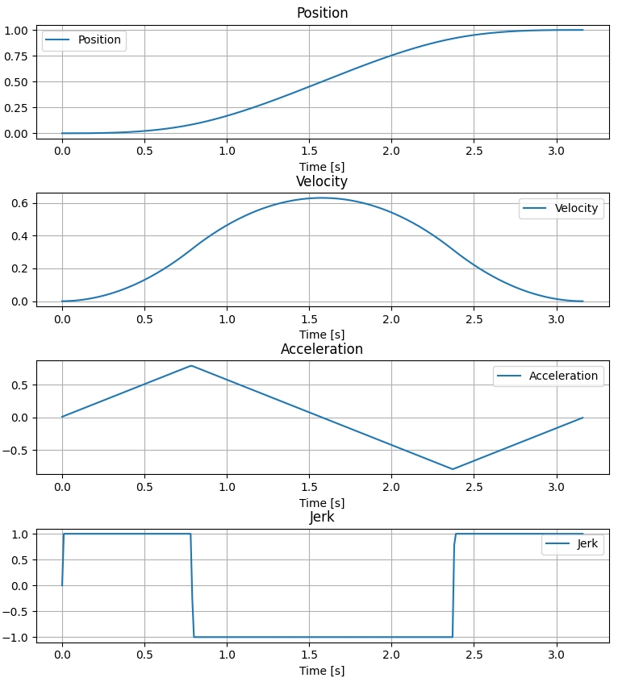
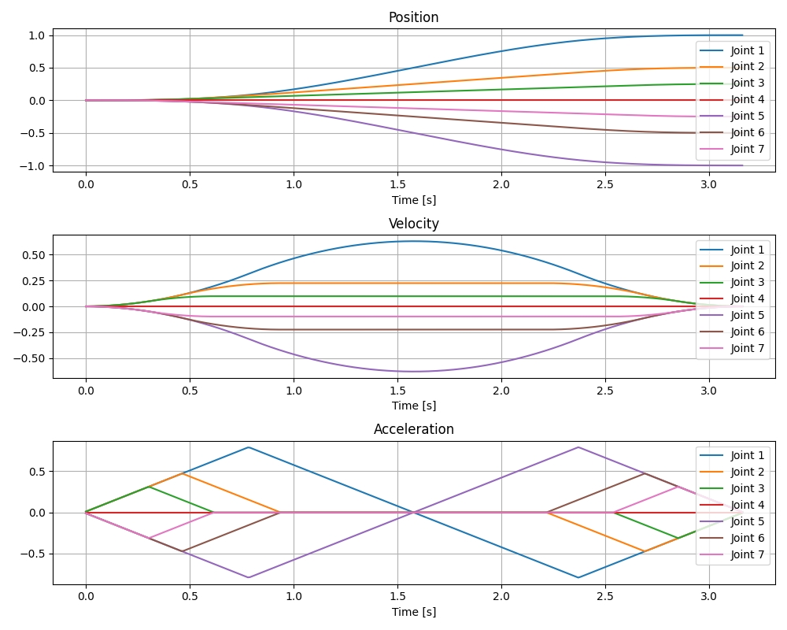

---
title: 'Ruckig: 高效实时运动规划库'
date: 2025-03-15
lastmod: 2025-03-15
draft: false
tags: ["Trajectory"]
categories: ["Trajectory"]
authors: ["chase"]
summary: "Ruckig: 高效实时运动规划库"
showToc: true
TocOpen: true
hidemeta: false
comments: false
---


**Ruckig** 是一种实时轨迹生成器，允许机器人和机器即时响应传感器输入。Ruckig 从任意初始状态开始，计算到目标路径点（包括位置、速度和加速度）的轨迹，并受限于速度、加速度和加加速度约束。除了目标状态外，Ruckig 还允许定义中间位置以进行路径点跟踪。对于状态到状态的运动，Ruckig 保证时间最优解。通过中间路径点，Ruckig 联合计算路径及其时间参数化，与传统方法相比，生成的轨迹显著更快。

- 参考 [Ruckig 的 GitHub 仓库](https://github.com/pantor/ruckig)
## 1. 基本概念

- **自由度 (Degrees of Freedom, DOFs)**：指系统中可以独立运动的维度数量。例如，一个三轴机器人臂有三个自由度。
- **位置 (Position)**：系统在某一时刻的具体位置。
- **速度 (Velocity)**：系统在某一时刻的运动速度。
- **加速度 (Acceleration)**：系统在某一时刻的速度变化率。
- **加加速度 (Jerk)**：系统在某一时刻的加速度变化率。
- **输入参数 (Input Parameters)**：包括当前状态（位置、速度、加速度）、目标状态（位置、速度、加速度）以及最大速度、加速度和加加速度等约束条件。
- **输出参数 (Output Parameters)**：计算得到的新的状态（位置、速度、加速度）。
- **同步模式 (Synchronization)**：确保所有自由度在相同的时间内完成运动。

## 2. 轨迹规划类型
- 状态到状态的轨迹规划：从任意初始状态（包括位置、速度和加速度）到目标状态的轨迹规划，保证时间最优解。
- 路径点跟踪：允许定义中间位置，通过这些路径点进行轨迹规划，联合计算路径及其时间参数化。
- 实时轨迹生成：能够在运行时根据传感器输入即时生成轨迹，适用于需要快速响应的应用场景。

## 3. 安装
```bash
pip install ruckig
```
## 4. 使用示例
### 一自由度的运动规划
```python
import ruckig
import numpy as np
import matplotlib.pyplot as plt

# 维度
DOFs = 1  # 1自由度示例

# 创建 Ruckig 实例
otg = ruckig.Ruckig(DOFs, 0.01)  # 时间步长为 0.01 秒

# 输入和输出参数
input = ruckig.InputParameter(DOFs)
output = ruckig.OutputParameter(DOFs)

# 设置初始状态
input.current_position = [0.0]
input.current_velocity = [0.0]
input.current_acceleration = [0.0]

# 设置目标状态
input.target_position = [1.0]
input.target_velocity = [0.0]
input.target_acceleration = [0.0]

# 设置最大速度、加速度和加加速度
input.max_velocity = [1.0]
input.max_acceleration = [1.0]
input.max_jerk = [1.0]

# 用于存储轨迹数据
positions = []
velocities = []
accelerations = []
jerks = []

# 计算轨迹
while True:
    result = otg.update(input, output)

    if result == ruckig.Result.Finished:
        break

    # 存储当前状态
    positions.append(output.new_position.copy())
    velocities.append(output.new_velocity.copy())
    accelerations.append(output.new_acceleration.copy())

    # 计算并存储加加速度（jerk）
    if len(accelerations) > 1:
        jerk = (accelerations[-1][0] - accelerations[-2][0]) / 0.01
    else:
        jerk = 0.0
    jerks.append(jerk)

    # 更新输入参数
    input.current_position = output.new_position
    input.current_velocity = output.new_velocity
    input.current_acceleration = output.new_acceleration

# 转换为 NumPy 数组
positions = np.array(positions)
velocities = np.array(velocities)
accelerations = np.array(accelerations)
jerks = np.array(jerks)

# 绘制轨迹图
time_steps = np.arange(positions.shape[0]) * 0.01

fig, axs = plt.subplots(4, 1, figsize=(10, 10))

axs[0].plot(time_steps, positions, label='Position')
axs[1].plot(time_steps, velocities, label='Velocity')
axs[2].plot(time_steps, accelerations, label='Acceleration')
axs[3].plot(time_steps, jerks, label='Jerk')

axs[0].set_title('Position')
axs[1].set_title('Velocity')
axs[2].set_title('Acceleration')
axs[3].set_title('Jerk')

for ax in axs:
    ax.set_xlabel('Time [s]')
    ax.legend()
    ax.grid()

plt.tight_layout()
plt.show()
```


### 七自由度的运动规划

```python
import ruckig
import numpy as np
import matplotlib.pyplot as plt

# 维度
DOFs = 7  # 7自由度机械臂

# 创建 Ruckig 实例
otg = ruckig.Ruckig(DOFs, 0.01)  # 时间步长为 0.01 秒

# 输入和输出参数
input = ruckig.InputParameter(DOFs)
output = ruckig.OutputParameter(DOFs)

# 设置初始状态
input.current_position = [0.0, 0.0, 0.0, 0.0, 0.0, 0.0, 0.0]
input.current_velocity = [0.0, 0.0, 0.0, 0.0, 0.0, 0.0, 0.0]
input.current_acceleration = [0.0, 0.0, 0.0, 0.0, 0.0, 0.0, 0.0]

# 设置目标状态（假设已通过逆运动学计算得到）
input.target_position = [1.0, 0.5, 0.25, 0.0, -1.0, -0.5, -0.25]
input.target_velocity = [0.0, 0.0, 0.0, 0.0, 0.0, 0.0, 0.0]
input.target_acceleration = [0.0, 0.0, 0.0, 0.0, 0.0, 0.0, 0.0]

# 设置最大速度、加速度和加加速度
input.max_velocity = [1.0, 1.0, 1.0, 1.0, 1.0, 1.0, 1.0]
input.max_acceleration = [1.0, 1.0, 1.0, 1.0, 1.0, 1.0, 1.0]
input.max_jerk = [1.0, 1.0, 1.0, 1.0, 1.0, 1.0, 1.0]

# 用于存储轨迹数据
positions = []
velocities = []
accelerations = []

# 计算轨迹
while True:
    result = otg.update(input, output)

    if result == ruckig.Result.Finished:
        break

    # 存储当前状态
    positions.append(output.new_position.copy())
    velocities.append(output.new_velocity.copy())
    accelerations.append(output.new_acceleration.copy())

    # 更新输入参数
    input.current_position = output.new_position
    input.current_velocity = output.new_velocity
    input.current_acceleration = output.new_acceleration

# 转换为 NumPy 数组
positions = np.array(positions)
velocities = np.array(velocities)
accelerations = np.array(accelerations)

# 绘制轨迹图
time_steps = np.arange(positions.shape[0]) * 0.01

fig, axs = plt.subplots(3, 1, figsize=(10, 8))

for i in range(DOFs):
    axs[0].plot(time_steps, positions[:, i], label=f'Joint {i+1}')
    axs[1].plot(time_steps, velocities[:, i], label=f'Joint {i+1}')
    axs[2].plot(time_steps, accelerations[:, i], label=f'Joint {i+1}')

axs[0].set_title('Position')
axs[1].set_title('Velocity')
axs[2].set_title('Acceleration')

for ax in axs:
    ax.set_xlabel('Time [s]')
    ax.legend()
    ax.grid()

plt.tight_layout()
plt.show()
```



