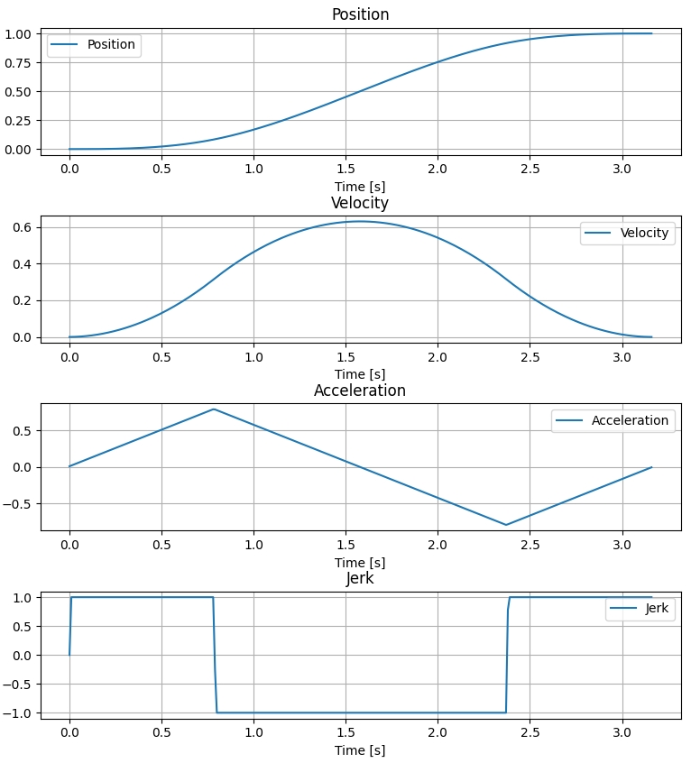
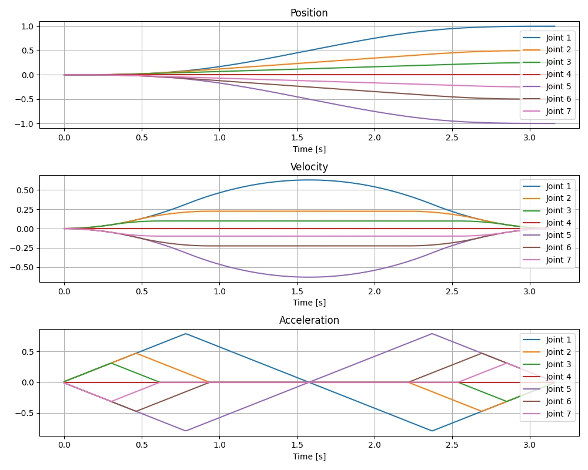

## 先分清输入是什么

Ruckig 从当前与目标的 **位置、速度、加速度** 出发，在速度、加速度和 jerk 限制下生成状态到状态轨迹。它不自动规划避障路径，也不保证末端沿笛卡尔直线运动。已有必须严格跟随的关节路径时，应先阅读 [TOPP-RA 的时间参数化]()。

本文只使用本地状态到状态接口，不设置中间路径点。Community 与 Pro 的中间点、跟踪等功能不同；使用前查看[官方教程的版本与实时性说明](https://docs.ruckig.com/tutorial.html)，不要把可能使用远端服务的功能直接放进控制周期。

## 安装与单位

```bash
python -m pip install ruckig numpy matplotlib
```

旋转关节采用 rad、rad/s、rad/s²、rad/s³，时间采用秒。移动关节应对应使用米。下面的限制只是教学值，不是任何实机的安全配置。

| 输入 | 作用 |
| --- | --- |
| current / target position、velocity、acceleration | 完整边界状态；目标速度不一定为零 |
| max_velocity、max_acceleration、max_jerk | 各轴运动学上限，不包含力矩、碰撞和位置限位 |
| delta_time | `update` 的离散周期，不等于求出的总时长 |
| synchronization | 轴间时间/相位同步策略，不能据此推断末端路径形状 |

## 一个函数验证一轴与七轴

保存为 `check_ruckig.py`。脚本在仿真中传递预测状态，不连接设备；包含精确终点、速度/加速度上限和采样区间平均 jerk 检查。

```python
import numpy as np
import ruckig


def simulate(target, dt=0.01):
    target = np.asarray(target, dtype=float)
    if target.ndim != 1 or target.size == 0 or not np.isfinite(target).all():
        raise ValueError("target must be a nonempty finite vector")
    if not np.isfinite(dt) or dt <= 0:
        raise ValueError("dt must be positive and finite")

    dofs = target.size
    otg = ruckig.Ruckig(dofs, dt)
    inp = ruckig.InputParameter(dofs)
    out = ruckig.OutputParameter(dofs)
    inp.current_position = [0.0] * dofs
    inp.current_velocity = [0.0] * dofs
    inp.current_acceleration = [0.0] * dofs
    inp.target_position = target.tolist()
    inp.target_velocity = [0.0] * dofs
    inp.target_acceleration = [0.0] * dofs
    inp.max_velocity = [1.0] * dofs
    inp.max_acceleration = [1.0] * dofs
    inp.max_jerk = [1.0] * dofs
    otg.validate_input(inp, True, True)

    # 包含 t=0，不能把第一次 update 后的状态标为初始状态。
    times = [0.0]
    positions = [inp.current_position.copy()]
    velocities = [inp.current_velocity.copy()]
    accelerations = [inp.current_acceleration.copy()]
    trajectory = None
    for _ in range(100000):
        result = otg.update(inp, out)
        if result not in (ruckig.Result.Working, ruckig.Result.Finished):
            raise RuntimeError(f"Ruckig failed: {result}")
        if trajectory is None:
            trajectory = out.trajectory
            duration = float(trajectory.duration)
        times.append(float(out.time))
        positions.append(out.new_position.copy())
        velocities.append(out.new_velocity.copy())
        accelerations.append(out.new_acceleration.copy())
        out.pass_to_input(inp)
        if result == ruckig.Result.Finished:
            break
    else:
        raise RuntimeError("Simulation step budget exceeded")

    t = np.asarray(times)
    q, dq, ddq = map(np.asarray, (positions, velocities, accelerations))
    for values in (t, q, dq, ddq):
        assert np.isfinite(values).all()
    np.testing.assert_allclose(q[-1], target, atol=1e-8)
    np.testing.assert_allclose(dq[-1], 0, atol=1e-8)
    np.testing.assert_allclose(ddq[-1], 0, atol=1e-8)
    assert np.max(np.abs(dq)) <= 1.0 + 1e-8
    assert np.max(np.abs(ddq)) <= 1.0 + 1e-8
    average_jerk = np.diff(ddq, axis=0) / np.diff(t)[:, None]
    assert np.max(np.abs(average_jerk)) <= 1.0 + 1e-7

    # Finished 所在的离散 tick 可能超过总时长；另查精确终点。
    q_end, dq_end, ddq_end = trajectory.at_time(duration)
    np.testing.assert_allclose(q_end, target, atol=1e-8)
    np.testing.assert_allclose(dq_end, 0, atol=1e-8)
    np.testing.assert_allclose(ddq_end, 0, atol=1e-8)
    print(f"{dofs} DoF: duration={duration:.6f}s, ticks={len(t)-1}")
    return t, q, dq, ddq, average_jerk


if __name__ == "__main__":
    simulate([1.0])
    simulate([1.0, 0.5, 0.25, 0.0, -1.0, -0.5, -0.25])
```

`validate_input` 检查输入可行性，但调用仍可能抛出异常或返回错误状态。实机需要独立故障处理与停机策略；不能将失败结果继续下发。

## 绘图是观察工具，不替代断言

将以下片段接在同一个脚本末尾，或从 `check_ruckig` 导入 `simulate` 后使用。前面的数值测试本身不需要图形窗口。

```python
import matplotlib.pyplot as plt

t, q, dq, ddq, average_jerk = simulate([1.0])
fig, axes = plt.subplots(4, 1, figsize=(9, 8), sharex=True)
for ax, values, label in zip(
    axes, (q, dq, ddq), ("Position [rad]", "Velocity [rad/s]", "Acceleration [rad/s²]")
):
    ax.plot(t, values)
    ax.set_ylabel(label)
axes[3].step(t[1:], average_jerk, where="pre")
axes[3].set_ylabel("Mean jerk [rad/s³]")
axes[3].set_xlabel("Time [s]")
for ax in axes:
    ax.grid(True)
fig.tight_layout()
plt.show()
```

差分得到的是每个采样区间的 **平均 jerk**，跨过分段切换点时不等于瞬时 jerk；首个区间也应使用初始加速度，而不是人为补零。离散采样不能独立证明连续时间约束成立，应结合求解器保证与边界验证。




以上保留原笔记的绘图作为形状参考；新脚本以打印结果和断言为准，不把历史图片当作本轮测试输出。

## 预测状态与测量状态

`pass_to_input` 适合“下一步确实到达预测状态”的理想仿真。真实系统存在跟踪误差，重规划时应使用经过状态估计和单位转换的真实当前位置、速度与加速度，同时评估噪声、延迟和重新规划频率。不要每个周期盲目将任意噪声测量替换进去，也不要把预测状态等同于传感器反馈。

非零目标速度时，`Finished` 不表示机器人已经静止，越过终点后的状态也不必仍是目标位置。本例使用零目标速度和加速度，因此才断言最后一帧停在目标处。

输入校验、返回状态及 `at_time` 的定义见 [Ruckig 官方教程](https://docs.ruckig.com/tutorial.html)。

## 阅读自测与验收

- 检查每一步返回状态和最终位置、速度、加速度，确认记录到了 Finished 对应的最后一个状态。
- 在轨迹切换时传递真实当前状态，并分别检查速度、加速度和 jerk 上限；平滑插值图像不等于数值约束已通过。
