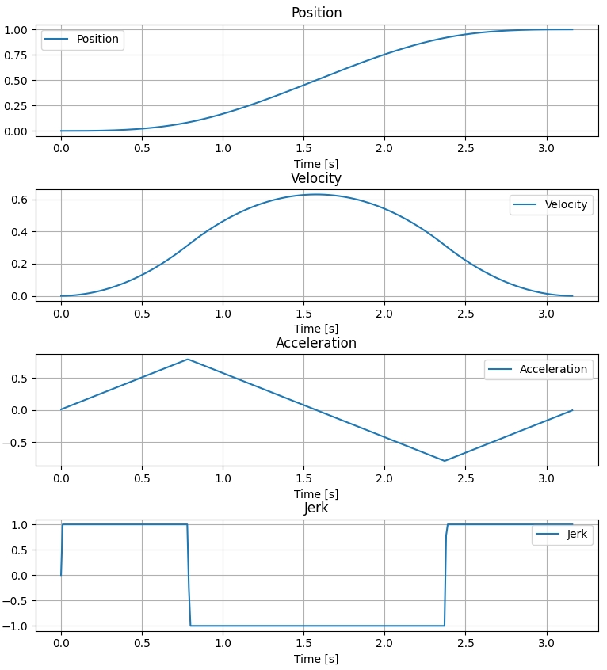
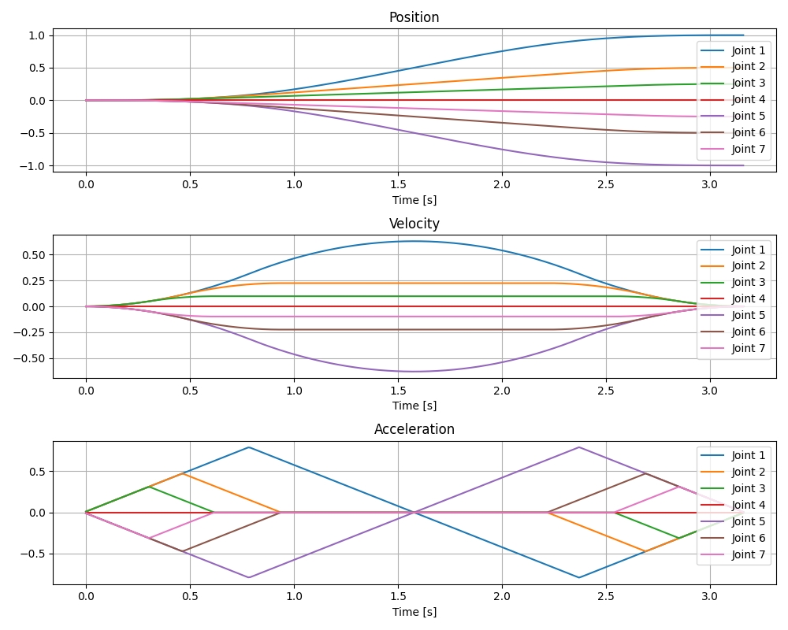

## 先分清输入是什么

Ruckig 从当前与目标的 **位置、速度、加速度** 出发，在速度、加速度和 jerk 限制下生成状态到状态轨迹。它不自动规划避障路径，也不保证末端沿笛卡尔直线运动。已有必须严格跟随的关节路径时，应先阅读 [TOPP-RA 的时间参数化]()。

本文只使用本地状态到状态接口，不设置中间路径点。Community 与 Pro 的中间点、跟踪等功能不同；使用前查看[官方教程的版本与实时性说明](https://docs.ruckig.com/tutorial.html)，不要把可能使用远端服务的功能直接放进控制周期。

## 安装与单位

```bash
python -m pip install "ruckig==0.19.4" numpy matplotlib
```

本文脚本在 Ruckig Community 0.19.4 上验证；官网文档和商业版功能可能对应其他版本，复现时先打印 `ruckig.__version__`。旋转关节采用 rad、rad/s、rad/s²、rad/s³，时间采用秒。移动关节应对应使用米。下面的限制只是教学值，不是任何实机的安全配置。

| 输入 | 作用 |
| --- | --- |
| current / target position、velocity、acceleration | 完整边界状态；目标速度不一定为零 |
| max_velocity、max_acceleration、max_jerk | 各轴运动学上限，不包含力矩、碰撞和位置限位 |
| delta_time | `update` 的离散周期，不等于求出的总时长 |
| synchronization | 轴间时间/相位同步策略，不能据此推断末端路径形状 |

### jerk 限制的是加速度改变有多快

速度是位置的变化率，加速度是速度的变化率，jerk 则是加速度的变化率。以转动关节为例，若一个 10 ms 周期内加速度从 0 变为 1 rad/s²，该区间平均 jerk 为 $1/0.01=100$ rad/s³；加速度本身不大，并不代表加速度变化温和。

若 jerk 上限仅为 10 rad/s³，从 0 提升到 1 rad/s² 至少要 0.1 s。假定这段始终使用正的最大 jerk、初速度为零，则加速度线性上升，速度增加 0.05 rad/s，位置增加约 0.001667 rad。这只是一个加速阶段，还不是满足指定终点的完整轨迹；完整轨迹要继续安排加速、巡航、减速等适用阶段。

因此 `max_jerk` 不是让曲线“看起来圆滑”的绘图选项，而是约束可执行状态随时间变化的方式。单位中的三次方也不能省略：把控制周期从秒误当成毫秒，差分估计会出现数量级错误。

## 一个函数验证一轴与七轴

保存为 `check_ruckig.py`。脚本在仿真中传递预测状态，不连接设备；包含精确终点、速度/加速度上限和采样区间平均 jerk 检查。

```python
import numpy as np
import ruckig


def simulate(target, dt=0.01):
    target = np.asarray(target, dtype=float)
    if target.ndim != 1 or target.size == 0 or not np.isfinite(target).all():
        raise ValueError("target must be a nonempty finite vector")
    if not np.isfinite(dt) or dt <= 0:
        raise ValueError("dt must be positive and finite")

    dofs = target.size
    otg = ruckig.Ruckig(dofs, dt)
    inp = ruckig.InputParameter(dofs)
    out = ruckig.OutputParameter(dofs)
    inp.current_position = [0.0] * dofs
    inp.current_velocity = [0.0] * dofs
    inp.current_acceleration = [0.0] * dofs
    inp.target_position = target.tolist()
    inp.target_velocity = [0.0] * dofs
    inp.target_acceleration = [0.0] * dofs
    inp.max_velocity = [1.0] * dofs
    inp.max_acceleration = [1.0] * dofs
    inp.max_jerk = [1.0] * dofs
    otg.validate_input(inp, True, True)

    # 包含 t=0，不能把第一次 update 后的状态标为初始状态。
    times = [0.0]
    positions = [inp.current_position.copy()]
    velocities = [inp.current_velocity.copy()]
    accelerations = [inp.current_acceleration.copy()]
    trajectory = None
    for _ in range(100000):
        result = otg.update(inp, out)
        if result not in (ruckig.Result.Working, ruckig.Result.Finished):
            raise RuntimeError(f"Ruckig failed: {result}")
        if trajectory is None:
            trajectory = out.trajectory
            duration = float(trajectory.duration)
        times.append(float(out.time))
        positions.append(out.new_position.copy())
        velocities.append(out.new_velocity.copy())
        accelerations.append(out.new_acceleration.copy())
        out.pass_to_input(inp)
        if result == ruckig.Result.Finished:
            break
    else:
        raise RuntimeError("Simulation step budget exceeded")

    t = np.asarray(times)
    q, dq, ddq = map(np.asarray, (positions, velocities, accelerations))
    for values in (t, q, dq, ddq):
        assert np.isfinite(values).all()
    np.testing.assert_allclose(q[-1], target, atol=1e-8)
    np.testing.assert_allclose(dq[-1], 0, atol=1e-8)
    np.testing.assert_allclose(ddq[-1], 0, atol=1e-8)
    assert np.max(np.abs(dq)) <= 1.0 + 1e-8
    assert np.max(np.abs(ddq)) <= 1.0 + 1e-8
    average_jerk = np.diff(ddq, axis=0) / np.diff(t)[:, None]
    assert np.max(np.abs(average_jerk)) <= 1.0 + 1e-7

    # Finished 所在的离散 tick 可能超过总时长；另查精确终点。
    q_end, dq_end, ddq_end = trajectory.at_time(duration)
    np.testing.assert_allclose(q_end, target, atol=1e-8)
    np.testing.assert_allclose(dq_end, 0, atol=1e-8)
    np.testing.assert_allclose(ddq_end, 0, atol=1e-8)
    print(f"{dofs} DoF: duration={duration:.6f}s, ticks={len(t)-1}")
    return t, q, dq, ddq, average_jerk


if __name__ == "__main__":
    simulate([1.0])
    simulate([1.0, 0.5, 0.25, 0.0, -1.0, -0.5, -0.25])
```

`validate_input` 检查输入可行性，但调用仍可能抛出异常或返回错误状态。实机需要独立故障处理与停机策略；不能将失败结果继续下发。

## 绘图是观察工具，不替代断言

将以下片段接在同一个脚本末尾，或从 `check_ruckig` 导入 `simulate` 后使用。前面的数值测试本身不需要图形窗口。

```python
import matplotlib.pyplot as plt

t, q, dq, ddq, average_jerk = simulate([1.0])
fig, axes = plt.subplots(4, 1, figsize=(9, 8), sharex=True)
for ax, values, label in zip(
    axes, (q, dq, ddq), ("Position [rad]", "Velocity [rad/s]", "Acceleration [rad/s²]")
):
    ax.plot(t, values)
    ax.set_ylabel(label)
axes[3].step(t[1:], average_jerk, where="pre")
axes[3].set_ylabel("Mean jerk [rad/s³]")
axes[3].set_xlabel("Time [s]")
for ax in axes:
    ax.grid(True)
fig.tight_layout()
plt.show()
```

差分得到的是每个采样区间的 **平均 jerk**，跨过分段切换点时不等于瞬时 jerk；首个区间也应使用初始加速度，而不是人为补零。离散采样不能独立证明连续时间约束成立，应结合求解器保证与边界验证。




以上保留原笔记的绘图作为形状参考；新脚本以打印结果和断言为准，不把历史图片当作本轮测试输出。

## 预测状态与测量状态

`pass_to_input` 适合“下一步确实到达预测状态”的理想仿真。真实系统存在跟踪误差，重规划时应使用经过状态估计和单位转换的真实当前位置、速度与加速度，同时评估噪声、延迟和重新规划频率。不要每个周期盲目将任意噪声测量替换进去，也不要把预测状态等同于传感器反馈。

非零目标速度时，`Finished` 不表示机器人已经静止，越过终点后的状态也不必仍是目标位置。本例使用零目标速度和加速度，因此才断言最后一帧停在目标处。

输入校验、返回状态及 `at_time` 的定义见 [Ruckig 官方教程](https://docs.ruckig.com/tutorial.html)。

## 当前状态各项未超限，为什么仍然不可行？

只分别判断 $|v|\le v_{\max}$、$|a|\le a_{\max}$ 还不够。假设当前速度朝上限运动、加速度 $a>0$，即使立即施加最大的负 jerk $-j_{\max}$，也需要 $a/j_{\max}$ 秒才能把加速度降到零。这段时间中至少还会增加

$$
\Delta v=\int_0^{a/j_{\max}}(a-j_{\max}t)\,dt
=\frac{a^2}{2j_{\max}}.
$$

因此避免越过速度上限的必要条件是 $v+a^2/(2j_{\max})\le v_{\max}$。例如 $v=0.99$ rad/s、$a=0.5$ rad/s²、$j_{\max}=1$ rad/s³，无法避免的速度峰值为 $1.115$ rad/s，已经超过 1 rad/s 的限制。这里初始速度和初始加速度本身都没有单独超限。

方向同样重要：保持 $v=0.99$，改为 $a=-0.5$ 时，机器人正在减速，不能把这个例子与正加速度混为一谈。随文脚本验证前者被拒绝、后者通过输入检查。`validate_input(inp, True, True)` 的两个布尔量控制当前与目标状态检查；在本例中显式开启两者。接口语义见[官方输入校验说明](https://github.com/pantor/ruckig#input-validation)。

## Time 与 Phase：在哪个空间里“走直线”？

时间同步让各轴按同步时长到达各自边界状态；这不要求各轴的归一化运动进度始终相等。相位同步在条件允许时建立共同进度，得到规划坐标中的直线；本文的规划坐标是**关节角**，经过非线性 FK 后仍可能是弯曲的 TCP 路径。相位同步无法满足边界条件时，还需核对实际采用的同步策略，不能只看设置枚举。

下图使用两个转动关节，目标为 $[1,0.4]$ rad，起止速度与加速度为零，各轴速度、加速度和 jerk 上限都为 1（采用各自的 SI 单位）。TCP 轨迹来自长度为 1 m 和 0.6 m 的二连杆 FK。

<figure class="article-figure">

<figcaption><span class="article-figure__number">图 1</span><span class="article-figure__text">两种设置的时长均约为 3.1748 s。Phase 在关节平面形成直线，但右图 TCP 路径偏离起终点连线；改变时间规律和改变空间路径是两件事。</span></figcaption>
</figure>

在该样本中，Time 的最大 $|q_2-0.4q_1|$ 约为 0.03484 rad，而 Phase 为数值舍入量级。这个反例说明“到达时间相同”不自动推出“中间路径相同”，并不表示每一条 Time 轨迹都会偏离关节直线。官方同步选项可查[输入参数说明](https://github.com/pantor/ruckig#input-parameter)。

## 非零终点速度与 Finished 的时间含义

一轴从静止的 0 rad 运动到 1 rad，指定终点速度 0.3 rad/s、终点加速度零，控制周期为 10 ms。下面是 0.19.4 中同一脚本的一次离线结果：

| 时长设置 | 规划时长 $T$ | 首次返回 Finished 的记录时间 | 此时的位置 |
| --- | ---: | ---: | ---: |
| Continuous | 2.695913 s | 2.700 s | 1.001226 rad |
| Discrete | 2.700000 s | 2.710 s | 1.003000 rad |
{.table-readable}

`trajectory.at_time(T)` 在两种情况下都返回目标状态 $[1,0.3,0]$。离散循环到达 $T+\varepsilon$ 后，零目标加速度下的位置继续按 $1+0.3\varepsilon$ 推进。`Discrete` 约束规划时长为周期的整数倍，但这个版本的累计浮点时间可能在数学上相等的 tick 略小于 $T$，于是下一 tick 才报告 `Finished`；表中的具体 tick 不应当被写成跨版本保证。

因此，“目标状态已到达”“当前循环拿到 Finished”“目标要求静止”是三个不同条件。若要在非零速度的边界衔接下一段，需明确边界时刻与状态传递；若任务要求停止，应把目标速度与加速度设为零，并另外验证执行器反馈。

下载 [ruckig_boundary_checks.py](ruckig_boundary_checks.py)，运行：

```bash
python -B ruckig_boundary_checks.py --output-dir results
```

脚本核对上述可行性反例、精确终点、越过终点后的状态、两种同步方式及二连杆 FK，并输出本图和 `ruckig-boundary-results.json`。这些检查没有使用中间路径点，也没有调用远程规划服务。数值一致性不包含碰撞、驱动力矩或实时截止时间验证。

## 阅读自测与验收

- 检查每一步返回状态和最终位置、速度、加速度，确认记录到了 Finished 对应的最后一个状态。
- 在轨迹切换时传递真实当前状态，并分别检查速度、加速度和 jerk 上限；平滑插值图像不等于数值约束已通过。
