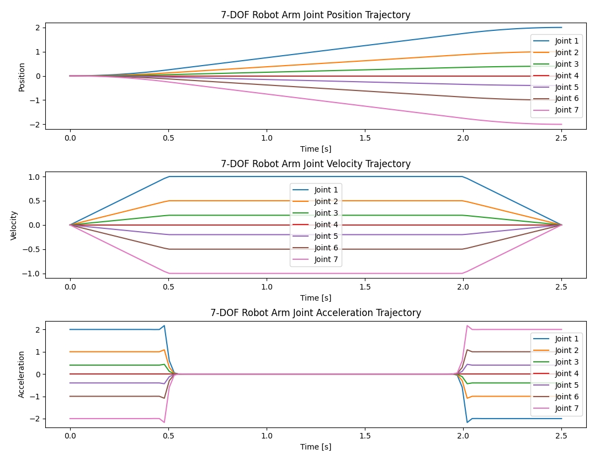

## `toppra` 简介

`toppra` 是一个用于轨迹优化的 Python 库，特别适用于机器人运动规划。它的全称是 "Time-Optimal Path Parameterization for Robotics Applications"。`toppra` 主要用于在给定路径上进行时间最优参数化，同时满足速度和加速度等约束条件。

## 安装

你可以使用 `pip` 安装 `toppra`：

```bash
pip install toppra
```

### 基本使用示例

以下是一个基本的使用示例，展示了如何使用 `toppra` 进行轨迹规划：

```python
import numpy as np
import toppra as ta
import toppra.constraint as constraint
import toppra.algorithm as algo
import matplotlib.pyplot as plt

# 1. 定义路径
way_pts = np.array([
    [0, 0, 0, 0, 0, 0, 0],
    [0.5, 0.25, 0.1, 0, -0.1, -0.25, -0.5],
    [1, 0.5, 0.2, 0, -0.2, -0.5, -1],
    [1.5, 0.75, 0.3, 0, -0.3, -0.75, -1.5],
    [2, 1, 0.4, 0, -0.4, -1, -2]
])

# 2. 创建路径对象
path = ta.SplineInterpolator(np.linspace(0, 1, way_pts.shape[0]), way_pts)

# 3. 定义速度和加速度约束
vlim = np.array([[-1, 1]] * 7)
alim = np.array([[-2, 2]] * 7)

pc_vel = constraint.JointVelocityConstraint(vlim)
pc_acc = constraint.JointAccelerationConstraint(alim)

# 4. 创建规划器
instance = algo.TOPPRA([pc_vel, pc_acc], path, solver_wrapper='seidel')

# 5. 进行规划
jnt_traj = instance.compute_trajectory(0, 0)

# 6. 采样并绘制结果
ts_sample = np.linspace(0, jnt_traj.duration, 100)
qs_sample = jnt_traj(ts_sample)
qds_sample = jnt_traj(ts_sample, 1)  # 速度
qdds_sample = jnt_traj(ts_sample, 2)  # 加速度

# 绘制每个关节的轨迹
plt.figure(figsize=(12, 10))

# 位置
plt.subplot(3, 1, 1)
for i in range(7):
    plt.plot(ts_sample, qs_sample[:, i], label=f'Joint {i+1}')
plt.xlabel('Time [s]')
plt.ylabel('Position')
plt.title('7-DOF Robot Arm Joint Position Trajectory')
plt.legend()

# 速度
plt.subplot(3, 1, 2)
for i in range(7):
    plt.plot(ts_sample, qds_sample[:, i], label=f'Joint {i+1}')
plt.xlabel('Time [s]')
plt.ylabel('Velocity')
plt.title('7-DOF Robot Arm Joint Velocity Trajectory')
plt.legend()

# 加速度
plt.subplot(3, 1, 3)
for i in range(7):
    plt.plot(ts_sample, qdds_sample[:, i], label=f'Joint {i+1}')
plt.xlabel('Time [s]')
plt.ylabel('Acceleration')
plt.title('7-DOF Robot Arm Joint Acceleration Trajectory')
plt.legend()

plt.tight_layout(pad=2.0)
plt.show()
```

### 主要步骤解释

1. **定义路径**：使用关键点定义路径，每个关键点包含7个关节的位置。
2. **创建路径对象**：使用 `SplineInterpolator` 创建路径对象。
3. **定义约束**：定义每个关节的速度和加速度约束。
4. **创建规划器**：使用 `TOPPRA` 创建轨迹规划器实例。
5. **进行规划**：计算轨迹。
6. **采样并绘制结果**：采样轨迹并绘制每个关节的位置、速度和加速度轨迹。



### 参考文档

- [toppra 官方文档](https://toppra.github.io/)
- [toppra GitHub 仓库](https://github.com/hungpham2511/toppra)

