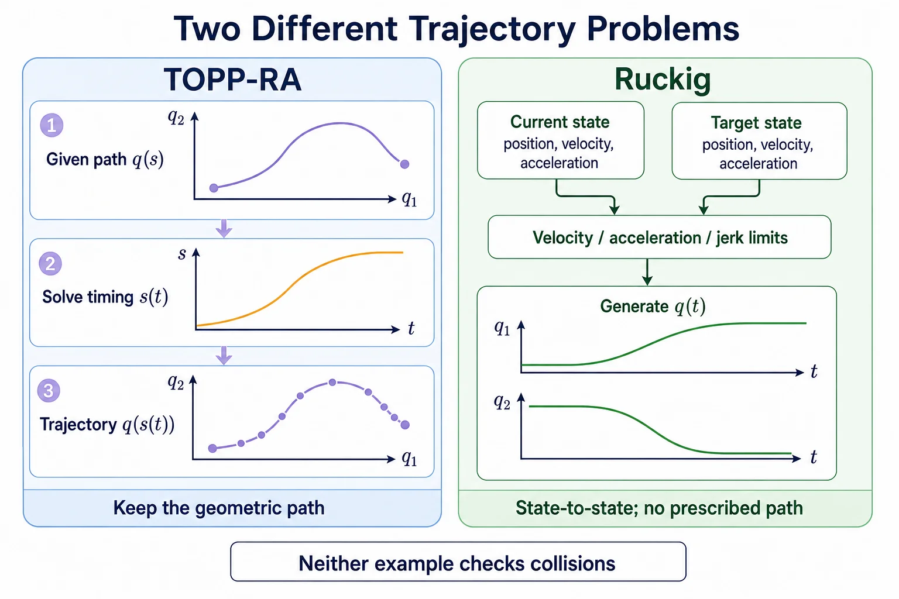
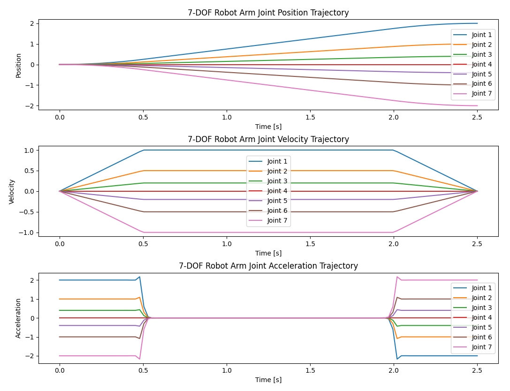

## 时间最优，不是重新搜索路径

TOPP-RA 沿给定几何路径 $q(s)$ 求时间规律 $s(t)$，输出 $q(s(t))$。它不会把有碰撞的路径改成无碰撞路径；本文只建模关节速度和加速度限制。



| 量 | 含义 |
| --- | --- |
| $s$ | 路径参数，本例归一化到 $[0,1]$，不是秒 |
| $q'(s), q''(s)$ | 对路径参数求导 |
| $\dot s,\ddot s$ | 路径参数的时间变化率 |
| $\dot q=q'(s)\dot s$ | 关节速度 |
| $\ddot q=q''(s)\dot s^2+q'(s)\ddot s$ | 关节加速度，包含路径曲率项 |

`compute_trajectory(0, 0)` 的两个零是起止 **路径速度**，不是两组关节位置。

## 安装

```bash
python -m pip install toppra numpy matplotlib
```

## 可运行的七轴例子

保存为 `check_toppra.py`。为了能独立核对答案，这里使用一条关节空间直线路径：最长运动轴位移 2 rad、速度上限 1 rad/s、加速度上限 2 rad/s²。连续理想模型的梯形速度轨迹总时长为 $2/1+1/2=2.5$ s；离散求解应接近这个结果，但不能由此推断任意样条都具有同样时长。

```python
import numpy as np
import toppra as ta
import toppra.algorithm as algo
import toppra.constraint as constraint


def plan_and_check(grid_count=201):
    if not isinstance(grid_count, int) or grid_count < 3:
        raise ValueError("grid_count must be an integer >= 3")
    end = np.array([2.0, 1.0, 0.4, 0.0, -0.4, -1.0, -2.0])
    knots = np.linspace(0, 1, 5)
    waypoints = knots[:, None] * end
    path = ta.SplineInterpolator(knots, waypoints)
    velocity_bounds = np.array([[-1.0, 1.0]] * 7)
    acceleration_bounds = np.array([[-2.0, 2.0]] * 7)
    planner = algo.TOPPRA(
        [constraint.JointVelocityConstraint(velocity_bounds),
         constraint.JointAccelerationConstraint(acceleration_bounds)],
        path,
        gridpoints=np.linspace(0, 1, grid_count),
        solver_wrapper="seidel",
        parametrizer="ParametrizeConstAccel",
    )
    trajectory = planner.compute_trajectory(0, 0)
    if trajectory is None:
        raise RuntimeError("No feasible timing; inspect path and constraints")
    duration = float(trajectory.duration)
    if not np.isfinite(duration) or duration <= 0:
        raise RuntimeError("Invalid trajectory duration")

    # 验证点比求解网格更密；两者密度是不同的参数。
    t = np.linspace(0, duration, 10001)
    q, dq, ddq = (trajectory(t, order) for order in (0, 1, 2))
    for values in (q, dq, ddq):
        assert values.shape == (len(t), 7)
        assert np.isfinite(values).all()
    np.testing.assert_allclose(q[0], 0, atol=1e-7)
    np.testing.assert_allclose(q[-1], end, atol=1e-7)
    np.testing.assert_allclose(dq[[0, -1]], 0, atol=1e-6)
    tolerance = 1e-5
    assert np.all(dq >= velocity_bounds[:, 0] - tolerance)
    assert np.all(dq <= velocity_bounds[:, 1] + tolerance)
    assert np.all(ddq >= acceleration_bounds[:, 0] - tolerance)
    assert np.all(ddq <= acceleration_bounds[:, 1] + tolerance)
    # 直线路径上的每个关节都与第一轴保持固定比例。
    np.testing.assert_allclose(q, q[:, :1] * end[None, :] / end[0], atol=1e-7)
    assert abs(duration - 2.5) < 0.02  # 只针对本例的解析对照
    print(f"grid={grid_count}, duration={duration:.8f}s")
    return t, q, dq, ddq


if __name__ == "__main__":
    plan_and_check(201)
    plan_and_check(401)
```

显式选择 `ParametrizeConstAccel` 是为了通过 $s(t)$ 复合原路径。另一种输出方式会对状态重新拟合样条，不能不加区分地认为输出完全保留原路径；差别见 [TOPP-RA 参数化器说明](https://hungpham2511.github.io/toppra/notes.html)。

## 可选绘图

以下片段与上例放在同一脚本，或者先导入 `plan_and_check`。数值断言可在无窗口环境运行。

```python
import matplotlib.pyplot as plt

t, q, dq, ddq = plan_and_check()
fig, axes = plt.subplots(3, 1, figsize=(10, 8), sharex=True)
for ax, values, label in zip(
    axes, (q, dq, ddq), ("Position [rad]", "Velocity [rad/s]", "Acceleration [rad/s²]")
):
    ax.plot(t, values)
    ax.set_ylabel(label)
    ax.grid(True)
axes[-1].set_xlabel("Time [s]")
fig.tight_layout()
plt.show()
```



保留的图片来自原笔记；新代码会打印两种求解网格下的时长，并通过数值断言验收。

## 失败与边界

- 求解返回空轨迹：先核对起止路径速度与约束是否兼容，不对 `None` 调用采样接口。
- 换成弯曲样条：先检查样条是否越过关节位置限位或障碍物，路点安全不代表路点之间安全。
- 加密后峰值变化明显：检查求解网格、约束离散方法和轨迹输出方式；不能只增加绘图采样点来改善求解精度。
- 要求 jerk、力矩或接触约束：确认是否真正写入模型。本文的加速度允许在分段边界跳变，不是 jerk 有界轨迹。
- 需要在线从新状态重规划：与 [Ruckig]() 的状态到状态问题对照，但两者都不能替代避障与控制器验收。

参考：[TOPP-RA 官方仓库](https://github.com/hungpham2511/toppra)、[运动学约束例子](https://hungpham2511.github.io/toppra/auto_examples/plot_kinematics.html)。

## 阅读自测与验收

- 分别检查几何路径和时间参数化的合法性；沿路径的关节位置约束、碰撞与指定速度/加速度约束不是同一件事。
- 遇到不可行结果时先核对边界速度与约束，不能直接调用空轨迹；需要 jerk 约束时明确算法是否真的建模了它。
