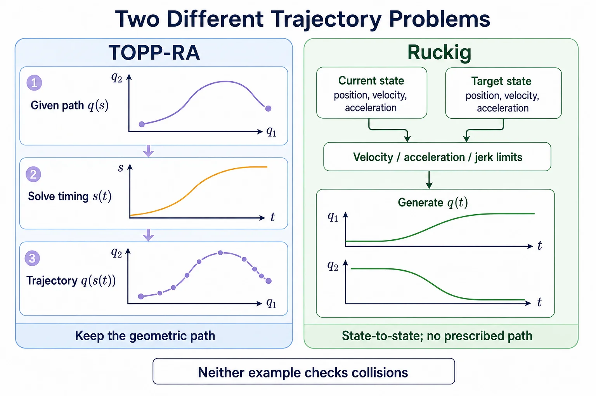
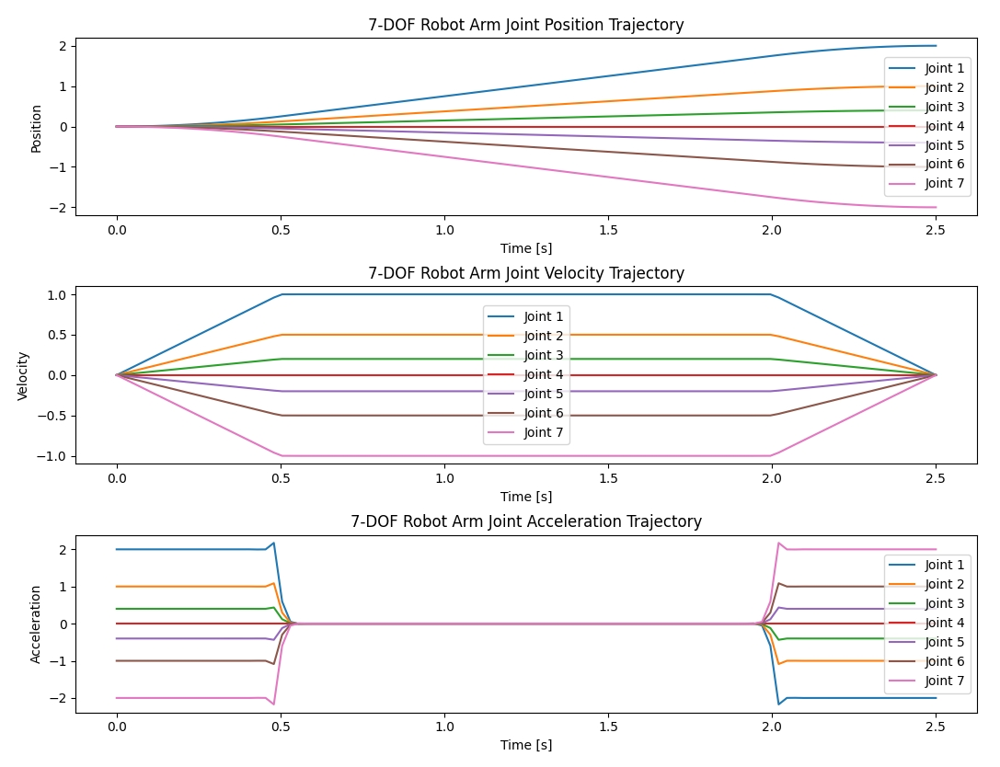

## 时间最优，不是重新搜索路径

TOPP-RA 沿给定几何路径 $q(s)$ 求时间规律 $s(t)$，输出 $q(s(t))$。它不会把有碰撞的路径改成无碰撞路径；本文只建模关节速度和加速度限制。



| 量 | 含义 |
| --- | --- |
| $s$ | 路径参数，本例归一化到 $[0,1]$，不是秒 |
| $q'(s), q''(s)$ | 对路径参数求导 |
| $\dot s,\ddot s$ | 路径参数的时间变化率 |
| $\dot q=q'(s)\dot s$ | 关节速度 |
| $\ddot q=q''(s)\dot s^2+q'(s)\ddot s$ | 关节加速度，包含路径曲率项 |

`compute_trajectory(0, 0)` 的两个零是起止 **路径速度**，不是两组关节位置。

### 一个路径参数，同时驱动多个关节

用简单路径 $q(s)=[s,2s]$ rad、$s\in[0,1]$ 来读上表。$s=0.5$ 表示走到路径中间，即关节位置 $[0.5,1]$ rad；它没有说明用了多久。如果此时 $\dot s=0.3$ s⁻¹，则关节速度为 $[0.3,0.6]$ rad/s。

若两个关节的速度上限都为 0.5 rad/s，第二关节给出更紧的限制：$2\dot s\le0.5$，所以只能让 $\dot s\le0.25$ s⁻¹。TOPP-RA 要在整条路径上协调这类限制，再考虑哪里需要提前减速，才能以指定速度抵达终点。路径已经固定，不同关节不能各自选择一个互不一致的进度。

本例 $q''(s)=0$，因此加速度只剩 $q'(s)\ddot s$。后文的弯曲路径则保留曲率项：即使路径进度速度恒定，机器人关节也可能正在加速。把几何路径、进度和时间分开，才能解释“同一条路，换一种速度走”。

## 安装

```bash
python -m pip install "toppra==0.6.3" numpy matplotlib
```

## 可运行的七轴例子

保存为 `check_toppra.py`。为了能独立核对答案，这里使用一条关节空间直线路径：最长运动轴位移 2 rad、速度上限 1 rad/s、加速度上限 2 rad/s²。连续理想模型的梯形速度轨迹总时长为 $2/1+1/2=2.5$ s；离散求解应接近这个结果，但不能由此推断任意样条都具有同样时长。

```python
import numpy as np
import toppra as ta
import toppra.algorithm as algo
import toppra.constraint as constraint


def plan_and_check(grid_count=201):
    if not isinstance(grid_count, int) or grid_count < 3:
        raise ValueError("grid_count must be an integer >= 3")
    end = np.array([2.0, 1.0, 0.4, 0.0, -0.4, -1.0, -2.0])
    knots = np.linspace(0, 1, 5)
    waypoints = knots[:, None] * end
    path = ta.SplineInterpolator(knots, waypoints)
    velocity_bounds = np.array([[-1.0, 1.0]] * 7)
    acceleration_bounds = np.array([[-2.0, 2.0]] * 7)
    planner = algo.TOPPRA(
        [constraint.JointVelocityConstraint(velocity_bounds),
         constraint.JointAccelerationConstraint(acceleration_bounds)],
        path,
        gridpoints=np.linspace(0, 1, grid_count),
        solver_wrapper="seidel",
        parametrizer="ParametrizeConstAccel",
    )
    trajectory = planner.compute_trajectory(0, 0)
    if trajectory is None:
        raise RuntimeError("No feasible timing; inspect path and constraints")
    duration = float(trajectory.duration)
    if not np.isfinite(duration) or duration <= 0:
        raise RuntimeError("Invalid trajectory duration")

    # 验证点比求解网格更密；两者密度是不同的参数。
    t = np.linspace(0, duration, 10001)
    q, dq, ddq = (trajectory(t, order) for order in (0, 1, 2))
    for values in (q, dq, ddq):
        assert values.shape == (len(t), 7)
        assert np.isfinite(values).all()
    np.testing.assert_allclose(q[0], 0, atol=1e-7)
    np.testing.assert_allclose(q[-1], end, atol=1e-7)
    np.testing.assert_allclose(dq[[0, -1]], 0, atol=1e-6)
    tolerance = 1e-5
    assert np.all(dq >= velocity_bounds[:, 0] - tolerance)
    assert np.all(dq <= velocity_bounds[:, 1] + tolerance)
    assert np.all(ddq >= acceleration_bounds[:, 0] - tolerance)
    assert np.all(ddq <= acceleration_bounds[:, 1] + tolerance)
    # 直线路径上的每个关节都与第一轴保持固定比例。
    np.testing.assert_allclose(q, q[:, :1] * end[None, :] / end[0], atol=1e-7)
    assert abs(duration - 2.5) < 0.02  # 只针对本例的解析对照
    print(f"grid={grid_count}, duration={duration:.8f}s")
    return t, q, dq, ddq


if __name__ == "__main__":
    plan_and_check(201)
    plan_and_check(401)
```

显式选择 `ParametrizeConstAccel` 是为了通过 $s(t)$ 复合原路径。另一种输出方式会对状态重新拟合样条，不能不加区分地认为输出完全保留原路径；差别见 [TOPP-RA 参数化器说明](https://hungpham2511.github.io/toppra/notes.html)。

## 可选绘图

以下片段与上例放在同一脚本，或者先导入 `plan_and_check`。数值断言可在无窗口环境运行。

```python
import matplotlib.pyplot as plt

t, q, dq, ddq = plan_and_check()
fig, axes = plt.subplots(3, 1, figsize=(10, 8), sharex=True)
for ax, values, label in zip(
    axes, (q, dq, ddq), ("Position [rad]", "Velocity [rad/s]", "Acceleration [rad/s²]")
):
    ax.plot(t, values)
    ax.set_ylabel(label)
    ax.grid(True)
axes[-1].set_xlabel("Time [s]")
fig.tight_layout()
plt.show()
```



保留的图片来自原笔记；新代码会打印两种求解网格下的时长，并通过数值断言验收。

## 弯曲路径：求解成功之后，再查网格之间

直线例子的 $q''(s)=0$，无法检验曲率项是否处理正确。换成下面这条二关节路径，单位为 rad，$s\in[0,1]$：

$$
q(s)=\begin{bmatrix}s\\16s^2(1-s)^2\end{bmatrix},\qquad
q'(s)=\begin{bmatrix}1\\32s-96s^2+64s^3\end{bmatrix},\qquad
q''(s)=\begin{bmatrix}0\\32-192s+192s^2\end{bmatrix}.
$$

例如 $s=0.5$ 时，第二关节的 $q'_2(s)=0$，但 $q''_2(s)=-16$。即使路径加速度 $\ddot s=0$，只要 $\dot s\ne0$，第二关节仍有 $\ddot q_2=-16\dot s^2$；把关节加速度只写成 $q'(s)\ddot s$ 就会漏掉它。

[toppra_continuous_check.py](toppra_continuous_check.py) 用 TOPPRA **0.6.3**、`seidel`、显式 `Interpolation` 加速度离散方式及 `ParametrizeConstAccel` 求解；两轴速度上限均为 `1 rad/s`，加速度上限均为 `2 rad/s²`，起止路径速度为零。用同一条路径只改变求解网格，得到：

| 求解网格点数 | 原轨迹时长 / s | 连续速度峰值 / rad/s | 连续加速度峰值 / rad/s² |
| --- | ---: | ---: | ---: |
| 11 | 3.780848 | 1.048640 | 2.069299 |
| 21 | 3.533150 | 1.014062 | 2.019210 |
| 51 | 3.262509 | 1.002574 | 2.002499 |
| 101 | 3.156561 | 1.000784 | 2.000853 |
| 401 | 3.142157 | 1.000054 | 2.000109 |

表中的峰值取两关节绝对值的最大值。11 点时，速度超限约 **4.864%**，加速度超限约 **3.465%**；加密明显减小了本例的违约，但 401 点也不能直接按严格上限判定为零误差。这说明“离散优化求解成功”与“输出轨迹处处满足指定连续上限”需要分别验收。网格与参数化器的职责见 [TOPP-RA 官方说明](https://hungpham2511.github.io/toppra/notes.html)。

<figure class="article-figure">

<figcaption><span class="article-figure__number">图 1</span><span class="article-figure__text">左侧几何路径在所有求解中相同；右侧检查输出轨迹的区间极值。加密的是求解网格，图像采样变密本身不会修改已经得到的时间规律。</span></figcaption>
</figure>

### 为什么这里的检查比“画得足够密”更进一步

在每个输出区间内，路径加速度 $u=\ddot s$ 为常数，令 $x_i=\dot s_i^2$，则：

$$
x(s)=x_i+2u(s-s_i),\qquad
\dot q_j^2=q_j'(s)^2x(s),\qquad
\ddot q_j=q_j''(s)x(s)+q_j'(s)u.
$$

本例的 $q$ 是多项式，所以后两式仍是多项式。脚本求导数的区间内实根，再连同两端点计算速度平方和加速度的极值；分段连接处检查两侧的值。它使用返回的路径速度重新计算 $u$，对应实际的输出参数化器，而不是直接相信离散求解器内部的加速度变量。

另外，脚本在时间域采样 50,001 点，检查位置仍在原路径上、起止速度为零，以及采样峰值没有超过区间极值。这里的多项式求根使用浮点数，并非形式化精度证书；任意样条、动力学约束和复杂路径需要各自适用的验证方式，有限采样仍可能漏峰值。

```bash
python -B toppra_continuous_check.py --output-dir results
```

脚本生成图和 JSON；[本例完整结果](assets/toppra-grid-results.json)同时记录库版本、路径系数、离散方式、原始峰值和下述减速系数。

### 统一减速可以修正什么

若验证后发现轻微速度或加速度超限，可把已有轨迹的时间统一拉长 $\gamma$ 倍：$\tilde q(t)=q(t/\gamma)$。此时速度除以 $\gamma$，加速度除以 $\gamma^2$。对本例的固定上限，至少需要：

$$
\gamma\ge\max\!\left(1,
\max_j\frac{\max_t|\dot q_j|}{v_{j,\max}},
\sqrt{\max_j\frac{\max_t|\ddot q_j|}{a_{j,\max}}}\right).
$$

脚本在这个结果上乘 `1+1e-6` 作为数值余量。11 点轨迹的 $\gamma\approx1.048641$，时长从 `3.780848 s` 变为 `3.964753 s`；401 点轨迹约为 `3.142330 s`。这是一种针对已验证峰值的保守修正，不代表修正后的轨迹仍时间最优，也不代替实际系统的控制余量。

本例的起止速度都是零，所以统一减速保持这些边界。若给定非零起止速度，减速会改变它们；如果约束包括随速度变化的动力学力矩、接触或动态障碍物，也不能直接套用上述速度/加速度缩放结论。原路径的碰撞、位置限位和加速度跳变仍然存在。

## 失败与边界

- 求解返回空轨迹：先核对起止路径速度与约束是否兼容，不对 `None` 调用采样接口。
- 换成弯曲样条：先检查样条是否越过关节位置限位或障碍物，路点安全不代表路点之间安全。
- 加密后峰值变化明显：检查求解网格、约束离散方法和轨迹输出方式；不能只增加绘图采样点来改善求解精度。
- 要求 jerk、力矩或接触约束：确认是否真正写入模型。本文的加速度允许在分段边界跳变，不是 jerk 有界轨迹。
- 需要在线从新状态重规划：与 [Ruckig]() 的状态到状态问题对照，但两者都不能替代避障与控制器验收。

参考：[TOPP-RA 官方仓库](https://github.com/hungpham2511/toppra)、[运动学约束例子](https://hungpham2511.github.io/toppra/auto_examples/plot_kinematics.html)。

## 阅读自测与验收

- 分别检查几何路径和时间参数化的合法性；沿路径的关节位置约束、碰撞与指定速度/加速度约束不是同一件事。
- 遇到不可行结果时先核对边界速度与约束，不能直接调用空轨迹；需要 jerk 约束时明确算法是否真的建模了它。
